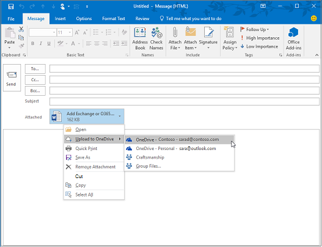

# ID とそれ以降へ - 1 人のアーキテクトの視点

この記事では、Microsoft のプリンシパル テクニカル アーキテクト[である Alex Shteynberg](https://www.linkedin.com/in/alex-shteynberg/) が、Microsoft 365やその他の Microsoft クラウド サービスを採用するエンタープライズ組織のトップ デザイン戦略について説明します。

## 筆者について

私は、ニューヨーク [Microsoft Technology Center](https://www.microsoft.com/mtc?rtc=1) のプリンシパル テクニカル アーキテクトです。 ほとんどの場合、大規模な顧客と複雑な要件を扱います。 私の視点と意見は、これらの相互作用に基づいており、すべての状況に当てはまるわけではありません。 しかし、私の経験では、最も複雑な課題でお客様を支援できる場合は、すべてのお客様を支援できます。

通常、毎年 100 人以上の顧客と連携しています。 すべての組織に固有の特性がありますが、傾向と共通点を確認するのは興味深い点です。 たとえば、1 つの傾向は、多くの顧客にとって業界間の関心です。 結局のところ、銀行の支店は、コーヒー ショップとコミュニティ センターにすることもできます。

私の役割では、お客様が独自の一連のビジネス目標に対処するための最適な技術ソリューションに到達するのを支援することに重点を置いています。 正式には、ID、セキュリティ、プライバシー、コンプライアンスに重点を置きます。 私は、これらが私たちが行うすべてに触れるという事実が大好きです。 ほとんどのプロジェクトに関わる機会が与えられます。 このアクティビティは、私を忙しくし、この役割を楽しんでいます。

私はニューヨーク市に住んでいます (最高の!)、その文化、食べ物、人々の多様性を本当に楽しんでいます (トラフィックではありません)。 私は旅行が好きで、自分の一生の間に世界の大部分を見ることができるときに旅行したいと考えています。 私は現在、野生動物について学ぶアフリカへの旅行を研究しています。

## 原則を導く

- **多くの場合、単純な方が優れています**。テクノロジを使用して (ほぼ) 何でも実行できますが、そうする必要はありません。 特にセキュリティ分野では、多くのお客様がソリューションを過剰に使用しています。 この点を強調するために、Google の Stripe 会議の [このビデオ](https://www.youtube.com/watch?v=SOQgABDSYZE) が好きです。
- **人、プロセス、テクノロジ**: 技術の第一ではなく、プロセスを強化するように [人を設計](https://en.wikipedia.org/wiki/Human-centered_design) します。 "完璧な" ソリューションはありません。 ビジネスごとにさまざまなリスク要因と意思決定のバランスを取る必要があります。 ユーザーが後で回避するアプローチを設計する顧客が多すぎます。
- **最初に '理由' と後で 'how' に焦点を当てる**:100 万の質問を持つ迷惑な 7-yr 古い子供になる。 質問する適切な質問がわからない場合は、正しい回答に到達できません。 多くのお客様は、ビジネス上の問題を定義する代わりに、どのように作業する必要があるかについて前提としています。 実行できるパスは常に複数あります。
- **過去のベスト プラクティスの長い末尾**: ベスト プラクティスが軽い速度で変化していることを認識します。 3 か月以上前に Azure AD を見たことがある場合は、古くなっている可能性があります。 ここでの内容はすべて、公開後に変更される可能性があります。 現在の "最適" オプションは、6 か月後と同じではない可能性があります。

## ベースラインの概念

このセクションはスキップしないでください。 多くの場合、クラウド サービスを長年使用しているお客様でも、これらの記事に戻る必要があります。
言語は正確なツールではありません。 多くの場合、同じ単語を使用して、同じ概念を意味する異なる概念または異なる単語を意味します。 次の図を使用して、いくつかのベースライン用語と "階層モデル" を確立します。
  

 

水泳を学ぶときは、海の真ん中ではなく、プールから始める方が良いでしょう。 この図を使用して技術的に正確にしようとはしていません。 これは、いくつかの基本的な概念について説明するモデルです。

図の説明

- テナント = Azure AD のインスタンス。 これは、階層の "最上位" にあるか、図のレベル 1 にあります。 このレベルは、他のすべてが発生する "[境界](/azure/active-directory/users-groups-roles/licensing-directory-independence)" であると考えることができます ([Azure AD B2B](/azure/active-directory/b2b/what-is-b2b) は別として)。 すべての Microsoft エンタープライズ クラウド サービスは、これらのテナントの 1 つです。 コンシューマー サービスは別です。 "Tenant" は、ドキュメントに、テナント、Azure テナント、WVD テナントなどのOffice 365として表示されます。 多くの場合、これらのバリエーションが顧客に混乱を引き起こすことがわかります。
- 図のレベル 2 のサービス/サブスクリプションは、1 つだけのテナントに属しています。 ほとんどの SaaS サービスは 1:1 であり、移行なしでは移動できません。 Azure は異なり、課金や[サブスクリプション](/azure/active-directory/fundamentals/active-directory-how-subscriptions-associated-directory)を別のテナントに[移動](/azure/cost-management-billing/manage/billing-subscription-transfer)できます。 Azure サブスクリプションを移動する必要があるお客様は多数います。 このシナリオにはさまざまな影響があります。 サブスクリプションの外部に存在するオブジェクトは移動しません。 たとえば、ロールベースのアクセス制御 (Azure RBAC)、Azure AD オブジェクト (グループ、アプリ、ポリシーなど)、一部のサービス (Azure Key Vault、Data Bricks など)。 ビジネス上のニーズを十分に持たないサービスを移行しないでください。 移行に役立つスクリプトの一部は[、GitHubで共有](https://github.com/lwajswaj/azure-tenant-migration)されます。
- 特定のサービスには通常、何らかの "サブレベル" 境界 (レベル 3 (L3) があります。 この境界は、セキュリティ、ポリシー、ガバナンスなどの分離に役立ちます。 残念ながら、私が知っている一様な名前はありません。 L3 の名前の例には、Azure サブスクリプション = [リソース](/azure/azure-resource-manager/management/manage-resources-portal)があります。Dynamics 365 CE = [instance](/dynamics365/admin/new-instance-management);Power BI = [ワークスペース](/power-bi/service-create-the-new-workspaces);Power Apps = [環境](/power-platform/admin/environments-overview);などです。
- レベル 4 は、実際のデータが存在する場所です。 この "データ プレーン" は複雑な記事です。 RBAC に Azure AD を使用しているサービスもあれば、そうでないサービスもあります。 委任に関する記事が表示されたら、これについて少し説明します。

多くのお客様 (および Microsoft 従業員) が混乱している、または質問がある追加の概念には、次の問題が含まれます。

- 誰でも多くのテナントを[無償](https://azure.microsoft.com/pricing/details/active-directory/)で[作成](/azure/active-directory/fundamentals/active-directory-access-create-new-tenant)できます。 その中にプロビジョニングされたサービスは必要ありません。 私は数十を持っています。 各テナント名は、Microsoft の世界中のクラウド サービスで一意です (つまり、同じ名前を持つテナントは 2 つもありません)。 これらはすべて TenantName.onmicrosoft.com 形式です。 テナントを自動的に作成するプロセス ([アンマネージド テナント](/azure/active-directory/users-groups-roles/directory-self-service-signup)) もあります。 たとえば、ユーザーが他のテナントに存在しない電子メール ドメインを使用してエンタープライズ サービスにサインアップした場合に発生する可能性があります。
- マネージド テナントでは、多くの [DNS ドメインを](/azure/active-directory/fundamentals/add-custom-domain) そのテナントに登録できます。 これにより、元のテナント名は変更されません。 現在、テナントの名前を簡単に変更する方法はありません (移行以外)。 テナント名は技術的には重要ではありませんが、一部のユーザーはこれを制限している可能性があります。
- サービスのデプロイをまだ計画していない場合でも、組織のテナント名を予約する必要があります。 それ以外の場合、誰かが自分からそれを受け取ることができ、それを取り戻す簡単なプロセスはありません (DNS 名と同じ問題)。 この方法は、お客様からあまりに頻繁に読み上げられます。 テナント名を指定する必要があるのも、ディベート記事です。
- DNS 名前空間を所有している場合は、これらのすべてをテナントに追加する必要があります。 それ以外の場合は、この名前を持つ [アンマネージド テナント](/azure/active-directory/users-groups-roles/directory-self-service-signup) を作成し、その結果、管理が中断される可能性 [があります](/azure/active-directory/users-groups-roles/domains-admin-takeover)。
- DNS 名前空間 (contoso.com など) は、1 つのテナントにのみ属することができます。 これは、さまざまなシナリオ (たとえば、合併や買収中の電子メール ドメインの共有など) に影響を及ぼします。 DNS サブ (div.contoso.com など) を別のテナントに登録する方法もありますが、これは避ける必要があります。 最上位レベルのドメイン名を登録すると、すべてのサブドメインが同じテナントに属していると見なされます。 マルチテナントシナリオ (以下を参照) では、通常、別のトップレベル ドメイン名 (contoso.ch や ch-contoso.com など) を使用することをお勧めします。
- テナントWho"所有"する必要がありますか? テナントを現在所有しているユーザーがわからないお客様をよく見かけられます。 この知識の欠如は大きな赤いフラグです。 Microsoft サポートにできるだけ早く連絡してください。 問題となるのは、サービス所有者 (多くの場合、Exchange管理者) がテナントを管理するように指定されている場合です。 テナントには、今後必要になる可能性があるすべてのサービスが含まれます。 テナント所有者は、組織内のすべてのクラウド サービスの有効化を決定できるグループである必要があります。 もう 1 つの問題は、テナント所有者グループがすべてのサービスを管理するように求められる場合です。 これは、大規模な組織ではスケーリングされません。
- サブ/スーパー テナントの概念はありません。 何らかの理由で、この誤解は繰り返し続けます。 これは [、Azure AD B2C](/azure/active-directory-b2c/) テナントにも適用されます。 "B2C 環境が XYZ テナント内にある"、"Office 365 テナントに Azure テナントを移動操作方法" という声が何度も聞こえます。
- このドキュメントは、ほとんどのお客様が使用しているため、主に商用の世界規模のクラウドに焦点を当てています。 [ソブリン クラウド](/azure/active-directory/develop/authentication-national-cloud)について知っておくと便利な場合があります。 ソブリン クラウドには、このディスカッションの範囲外であるものについて説明するための追加の影響があります。

## ベースライン ID に関する記事

Microsoft の ID プラットフォーム (Azure Active Directory (Azure AD) に関するドキュメントが数多く用意されています。 始めたばかりの人にとっては、多くの場合、圧倒される感じがします。 そのことについて学んだ後でも、絶え間ないイノベーションと変化に追いつくことは困難な場合があります。 多くの場合、顧客とのやりとりでは、ビジネス目標とこれらに対処するための "Good, Better, Best" アプローチ (およびこれらの記事の人間の "絶壁ノート") の間で"トランスレーター" として働いていることがよくあります。 完璧な答えはほとんどありません。"正しい" 決定は、さまざまなリスク要因のバランスです。 以下は、お客様と話し合う傾向がある一般的な質問と混乱の領域の一部です。

### プロビジョニング

Azure AD では、ID の世界におけるガバナンスの欠如は解決されません。 [ID ガバナンス](/azure/active-directory/governance/identity-governance-overview) は、クラウドの決定に依存しない重要な要素である必要があります。 ガバナンス要件は時間の経過と共に変化します。そのため、ツールではなくプログラムです。

[Azure AD Connect](/azure/active-directory/hybrid/whatis-azure-ad-connect)と[Microsoft Identity Manager](/microsoft-identity-manager/microsoft-identity-manager-2016) (MIM) と他の (サード パーティまたはカスタム) の比較 今も将来も多くの手間を省き、Azure AD Connectを使用してください。 このツールには、顧客の特殊な構成や継続的なイノベーションに対処するためのあらゆる種類のスマートがあります。

より複雑なアーキテクチャに向かう可能性があるいくつかのエッジ ケース:

- これらの間にネットワーク接続のない複数の AD フォレストがあります。 [Cloud Provisioning](/azure/active-directory/cloud-provisioning/what-is-cloud-provisioning) という新しいオプションがあります。
- Active Directory を持っていないか、インストールする必要もありません。 AZURE AD Connectは、[LDAP から同期](/azure/active-directory/hybrid/plan-hybrid-identity-design-considerations-tools-comparison)するように構成できます (パートナーが必要な場合があります)。
- 同じオブジェクトを複数のテナントにプロビジョニングする必要があります。 このシナリオは技術的にはサポートされていませんが、"同じ" の定義に依存します。

既定の同期規則 ([フィルター オブジェクト](/azure/active-directory/hybrid/how-to-connect-sync-configure-filtering)、 [属性の変更](/azure/active-directory/hybrid/reference-connect-sync-attributes-synchronized)、 [代替ログイン ID](/azure/active-directory/hybrid/plan-connect-userprincipalname) など) をカスタマイズする必要がありますか? 避けてください。 ID プラットフォームは、それを使用するサービスと同じくらい価値があります。 あらゆる種類の簡単な構成を行うことができますが、この質問に答えるには、アプリケーションへの影響を確認する必要があります。 メールが有効なオブジェクトをフィルター処理すると、オンライン サービス用の GAL は不完全になります。アプリケーションが特定の属性に依存している場合、これらをフィルター処理すると、予期しない影響が生じます。 ID チームの決定ではありません。

XYZ SaaS では Just-In-Time (JIT) プロビジョニングがサポートされています。同期が必要な理由は何ですか? 上記を参照してください。 多くのアプリケーションでは、機能に "プロファイル" 情報が必要です。 すべてのメールが有効なオブジェクトを使用できない場合は、GAL を使用できません。 Azure AD と統合されたアプリケーションでの [ユーザー プロビジョニング](/azure/active-directory/app-provisioning/user-provisioning) にも同様です。

### 認証

[パスワード ハッシュ同期](/azure/active-directory/hybrid/how-to-connect-password-hash-synchronization) (PHS) と [パススルー認証](/azure/active-directory/hybrid/how-to-connect-pta-how-it-works) (PTA) と [フェデレーション](/azure/active-directory/hybrid/how-to-connect-fed-compatibility)。

通常、フェデレーションに関して熱い [議論](/azure/active-directory/hybrid/choose-ad-authn) が行われます。 通常は単純な方が優れているため、適切な理由がない限り PHS を使用します。 同じテナント内の DNS ドメインごとに異なる認証方法を構成することもできます。

一部のお客様は、主に次の目的でフェデレーション + PHS を有効にします。

- フェデレーション サービスを使用できない場合は、(ディザスター リカバリーのために) [フォールバック](/azure/active-directory/hybrid/plan-migrate-adfs-password-hash-sync) するオプション。
- その他の機能 (例: [Azure AD DS](/azure/active-directory-domain-services/tutorial-configure-password-hash-sync)) とセキュリティ サービス (例: [漏洩した資格情報](/azure/active-directory/reports-monitoring/concept-risk-events#leaked-credentials))
- フェデレーション認証を理解していない Azure のサービスのサポート ([Azure Files](/azure/storage/files/storage-files-active-directory-overview)など)。

多くの場合、お客様がクライアント認証フローを通じて、いくつかの誤解を明らかにしています。 結果は次の図のようになります。これは、そこにアクセスする対話型プロセスほど良くありません。

この種のホワイトボード図面は、認証要求のフロー内でセキュリティ ポリシーが適用される場所を示しています。 この例では、Active Directory フェデレーション サービス (AD FS) を介して適用されたポリシーが最初のサービス要求に適用されますが、後続のサービス要求には適用されません。 この動作は、セキュリティ制御を可能な限りクラウドに移動する少なくとも 1 つの理由です。

覚えている限り、 [シングル サインオン](/azure/active-directory/manage-apps/what-is-single-sign-on) (SSO) の夢を追いかけてきました。 一部の顧客は、"適切な" フェデレーション (STS) プロバイダーを選択することでこれを実現できると考えています。 Azure AD は [、SSO 機能を有効に](/azure/active-directory/manage-apps/plan-sso-deployment) するのに大きく役立ちますが、STS は魔法的な機能を備えていません。 重要なアプリケーションで引き続き使用される "レガシ" 認証方法が多すぎます。 [パートナー ソリューション](/azure/active-directory/saas-apps/tutorial-list)を使用して Azure AD を拡張すると、これらのシナリオの多くに対処できます。 SSO は戦略と体験です。 [アプリケーションの標準](/azure/active-directory/develop/v2-app-types)に移行しないと、そこに到達できません。 この記事に関連するのは、 [パスワードレス](/azure/active-directory/authentication/concept-authentication-passwordless) 認証への道のりであり、魔法の答えも得られません。

多[要素認証](/azure/active-directory/authentication/concept-mfa-howitworks) (MFA) は現在不可欠です ([詳細については、こちら](https://techcommunity.microsoft.com/t5/azure-active-directory-identity/your-pa-word-doesn-t-matter/ba-p/731984))。 [ユーザーの行動分析](/azure/active-directory/authentication/tutorial-risk-based-sspr-mfa)に追加すると、最も一般的なサイバー攻撃を防ぐソリューションが用意されています。 コンシューマー サービスでも、MFA を必要とするように移行しています。 しかし、 [現代の認証](../enterprise/hybrid-modern-auth-overview.md) アプローチに移行したくない多くのお客様とはまだ会っています。 私が聞く最大の議論は、それがユーザーとレガシ アプリケーションに影響を与えるということです。 お客様が変更を[発表](https://techcommunity.microsoft.com/t5/exchange-team-blog/basic-auth-and-exchange-online-february-2020-update/ba-p/1191282)Exchange Online、適切なキックが役立つ場合があります。 この移行のお客様を支援するために、多くの Azure AD [レポート](/azure/active-directory/fundamentals/concept-fundamentals-block-legacy-authentication) を利用できるようになりました。

### Authorization

[Wikipedia](https://en.wikipedia.org/wiki/Authorization) ごとに、"承認する" とは、アクセス ポリシーを定義することです。 多くのユーザーは、オブジェクト (ファイル、サービスなど) へのアクセス制御を定義する機能として見ています。 現在のサイバー脅威の世界では、この概念は、さまざまな脅威ベクトルに対応し、それに対応してアクセス制御を迅速に調整できる動的ポリシーに急速に進化しています。 たとえば、通常とは異なる場所から銀行口座にアクセスすると、追加の確認手順が表示されます。 これに取り組むには、ポリシー自体だけでなく、脅威の検出とシグナルの相関関係の手法のエコシステムも考慮する必要があります。

Azure AD のポリシー エンジンは、 [条件付きアクセス ポリシー](/azure/active-directory/conditional-access/overview)を使用して実装されます。 このシステムは、動的な意思決定を行うために、他のさまざまな脅威検出システムからの情報に依存します。 単純なビューは、次の図のようになります。

これらのシグナルをすべて結合すると、次のような動的ポリシーが可能になります。

- デバイスで脅威が検出された場合、データへのアクセスは、ダウンロードできない限り Web に減らされます。
- 異常に大量のデータをダウンロードする場合、ダウンロードするものはすべて暗号化され、制限されます。
- 非管理対象デバイスからサービスにアクセスすると、機密性の高いデータからブロックされますが、他の場所にコピーすることなく、制限されていないデータにアクセスできます。

この拡張された承認の定義に同意する場合は、追加のソリューションを実装する必要があります。 実装するソリューションは、ポリシーを動的に設定する方法と、優先順位を付ける脅威によって異なります。 このようなシステムの例を次に示します。

- [Azure AD Identity Protection](/azure/active-directory/identity-protection/)
- [Microsoft Defender for Identity](/azure-advanced-threat-protection/)
- [Microsoft Defender for Endpoint](/windows/security/threat-protection/microsoft-defender-atp/microsoft-defender-advanced-threat-protection)
- [Microsoft Defender for Office 365](../security/office-365-security/defender-for-office-365.md)
- [Microsoft Defender for Cloud Apps](/cloud-app-security/) (Defender for Cloud Apps)
- [Microsoft 365 Defender](../security/defender/microsoft-365-defender.md)
- [Microsoft Intune](/mem/intune/)
- [Microsoft Purview Information Protection](../compliance/information-protection.md)
- [Microsoft Sentinel](/azure/sentinel/)

もちろん、Azure AD に加えて、さまざまなサービスとアプリケーションには独自の特定の承認モデルがあります。 これらの一部については、後ほど委任セクションで説明します。

### 監査

Azure AD には、 [詳細な監査機能とレポート機能があります](/azure/active-directory/reports-monitoring/) 。 ただし、通常、これらのレポートは、セキュリティ上の決定に必要な情報の唯一のソースではありません。 これについての詳細については、委任セクションを参照してください。

## Exchangeはありません

焦らないで下さい！ これは、Exchangeが非推奨 (またはSharePointなど) されていることを意味するわけではありません。 これは依然としてコア サービスです。 つまり、テクノロジ プロバイダーは、ユーザー エクスペリエンス (UX) を複数のサービスのコンポーネントに移行しています。 Microsoft 365では、電子メールの添付ファイルが SharePoint Online またはOneDrive for Businessに格納される"[モダン添付](https://support.office.com/article/Attach-files-or-insert-pictures-in-Outlook-email-messages-BDFAFEF5-792A-42B1-9A7B-84512D7DE7FC)ファイル" という簡単な例を示します。

Outlook クライアントを見ると、Exchangeだけでなく、このエクスペリエンスの一部として "接続" されている多くのサービスを確認できます。 これには、Azure AD、Microsoft Search、アプリ、プロファイル、コンプライアンス、Office 365 グループが含まれます。

今後の機能のプレビューについては[、Microsoft 流動フレームワーク](https://techcommunity.microsoft.com/t5/microsoft-365-blog/microsoft-ignite-blog-microsoft-fluid-framework-preview/ba-p/978268)について説明します。 プレビューでは、Outlookで直接Teams会話を読んで返信できます。 実際、[Teams クライアント](https://products.office.com/microsoft-teams/download-app)は、この戦略のより顕著な例の 1 つです。

全体的に見て、Office 365と Microsoft クラウド内の他のサービスの間に明確な線を引くのは難しくなっています。 お客様が 1 つのコンポーネントを使用する場合でも、私たちが行うすべての全体にわたる総イノベーションの恩恵を受けることができるので、お客様にとって大きなメリットであると考えています。 非常にクールで、多くのお客様に大きな影響を与えています。

現在、多くの顧客 IT グループが "製品" を中心に構成されていることがわかります。 特定の製品ごとに専門家が必要であるため、オンプレミスの世界では論理的です。 ただし、これらのサービスがクラウドに移行されたので、Active Directory やExchange データベースを再びデバッグする必要がないことに、私は完全に満足しています。 オートメーション (クラウドの種類) は、特定の反復的な手動ジョブを削除します (工場に何が起こったかを調べています)。 ただし、これらのタスクは、サービス間の相互作用、影響、ビジネス ニーズなどを理解するために、より複雑な要件に置き換えられます。 [学習](/learn/)する必要がある場合は、クラウド変換によって有効になる大きな機会があります。 テクノロジに取り組む前に、IT スキルとチーム構造の変更を管理することについて、お客様とよく話します。

すべてのSharePointファンの方や開発者の方は、「オンラインで XYZ をSharePointするにはどうすればいいですか? ワークフロー[にPower Automate](/power-automate/) (またはFlow) を使用すると、はるかに強力なプラットフォームになります。 [Azure Bot Framework を](/azure/bot-service/)使用して、500 K の項目リストに対してより優れた UX を作成します。 CSOM の代わりに [Microsoft Graph](https://developer.microsoft.com/graph/)の使用を開始します。 [Microsoft Teams](/MicrosoftTeams/Teams-overview)には、SharePointだけでなく、より多くの世界も含まれています。 他にも多くの例を挙げられます。 そこには、膨大ですばらしい宇宙があります。 ドアを開き、 [探索を開始します]()。

もう 1 つの一般的な影響は、コンプライアンス領域にあります。 このサービス間アプローチは、多くのコンプライアンス ポリシーを完全に混乱させるようです。 "電子情報開示システムにすべての電子メール通信を記録する必要があります" という状態の組織を見続けます。 これは、電子メールが単なるメールではなく、他のサービスへのウィンドウである場合、実際には何を意味しますか? Office 365には[コンプライアンス](../compliance/index.yml)に関する包括的なアプローチがありますが、多くの場合、人とプロセスの変更はテクノロジよりもはるかに困難です。

他にも多くの人とプロセスの影響があります。 私の意見では、この要因は重要で議論の少なき領域です。 おそらく、別の記事でさらに詳しく説明します。

## テナント構造オプション

### シングル テナントとマルチテナント

一般に、ほとんどのお客様は、運用テナントを 1 つだけ持つ必要があります。 複数のテナントが困難な ([Bing検索](https://www.bing.com/search?q=office%20365%20multiple%20tenants)を行う) 理由や、この[ホワイト ペーパー](https://aka.ms/multi-tenant-user)を読む理由は多数あります。 同時に、私が仕事をしている多くの企業のお客様には、IT ラーニング、テスト、実験用の別の (小規模な) テナントがあります。 Azure Lighthouse を使用すると、テナント間 [の Azure](https://azure.microsoft.com/services/azure-lighthouse/) アクセスが簡単になります。 Office 365および他の多くの SaaS サービスには、テナント間シナリオに制限があります。 [Azure AD B2B](/azure/active-directory/b2b/what-is-b2b) のシナリオでは、多くのことを考慮する必要があります。

多くのお客様は、M&A の合併後に複数の運用テナントに移行し、統合したいと考えています。 現時点では、これは単純ではなく、Microsoft コンサルティング サービス (MCS) またはパートナーとサード パーティのソフトウェアが必要になります。 今後、マルチテナントのお客様とさまざまなシナリオに対処するためのエンジニアリング作業が継続的に行われます。

一部の顧客は、複数のテナントを使用することを選択します。 これは非常に慎重な決定であり、ほとんどの場合、ビジネス上の理由が推進されるはずです。 いくつかの例には、次の理由があります。

- さまざまなエンティティ間の簡単なコラボレーションが必要ではなく、強力な管理やその他の分離のニーズがある持ち株型の会社構造。
- 取得後、2 つのエンティティを分離するビジネス上の決定が行われます。
- 顧客の運用環境を変更しない顧客の環境のシミュレーション。
- お客様向けのソフトウェアの開発。

このようなマルチテナントシナリオでは、多くの場合、お客様はテナント間で一部の構成を同じにしたり、構成の変更やドリフトを報告したりする必要があります。 これは、多くの場合、手動の変更からコードとしての構成への移行を意味します。 Microsoft Premiere のサポートでは、このパブリック IP に基づいて、次の種類の要件に対するワークショップを提供しています <https://Microsoft365dsc.com>。

### Multi-Geo

[複数地域](../enterprise/microsoft-365-multi-geo.md)にするか、複数地域にしないかの質問です。 Office 365 Multi-Geo を使用すると、データ所在地の要件を満たすために選択した地理的な場所に[、](../enterprise/o365-data-locations.md)保存データをプロビジョニングして保存できます。 この機能には多くの誤解があります。 以下の点にご注意ください:

- パフォーマンス上の利点を提供する必要はありません。 [ネットワーク設計](https://aka.ms/office365networking)が正しくない場合、パフォーマンスが低下する可能性があります。 必ずしもデータに対してではなく、Microsoft ネットワークに "近い" デバイスを取得します。
- [GDPR コンプライアンス](https://www.microsoft.com/trust-center/privacy/gdpr-overview)のソリューションではありません。 GDPR は、データ主権やストレージの場所には焦点を当てません。 その他のコンプライアンス フレームワークがあります。
- 管理の委任 (以下を参照) や [情報バリア](../compliance/information-barriers.md)は解決されません。
- マルチテナントと同じではなく、追加の [ユーザー プロビジョニング](https://github.com/MicrosoftDocs/azure-docs-pr/blob/master/articles/active-directory/hybrid/how-to-connect-sync-feature-preferreddatalocation.md) ワークフローが必要です。
- テナント (Azure AD) を別の地域に [移動](../enterprise/moving-data-to-new-datacenter-geos.md) することはありません。

## 管理の委任

ほとんどの大規模な組織では、職務とロールベースのアクセス制御 (RBAC) の分離が必要です。 事前に申し訳ございません。 このアクティビティは、一部の顧客が望むほど単純ではありません。 顧客、法的、コンプライアンス、その他の要件は異なり、世界中で競合する場合があります。 シンプルさと柔軟性は、多くの場合、互いの反対側にあります。 私を間違えないでください。私たちはこれでより良い仕事をすることができます。 時間の経過と共に大幅な改善が行われました (今後も)。 379230 ドキュメントを読まずに、お客様のビジネス要件に合ったモデルを作成するには、お使いのローカル [の Microsoft Technology Center](https://www.microsoft.com/mtc) にアクセスしてください。 ここでは、この方法の理由ではなく、考えるべきことについて説明します。 次に、計画する 5 つの異なる領域と、遭遇した一般的な質問の一部を示します。

### Azure AD とMicrosoft 365管理センター

[組み込みロール](/azure/active-directory/roles/permissions-reference)のリストが長く増えています。 各ロールは、特定のアクションを実行できるようにグループ化されたロールのアクセス許可の一覧で構成されます。 これらのアクセス許可は、各ロール内の [説明] タブで確認できます。 または、Microsoft 365 管理 センターで、これらのアクセス許可の読み取り可能なバージョンを確認することもできます。 組み込みロールの定義は変更できません。 一般に、これらのロールを 3 つのカテゴリにグループ化します。

- **グローバル管理者**: この "すべての強力な" ロールは、他のシステムと同様 [に高度に保護](../enterprise/protect-your-global-administrator-accounts.md)する必要があります。 一般的な推奨事項には、永続的な割り当てなし、Azure AD Privileged Identity Management (PIM)の使用、強力な認証などがあります。 興味深いことに、このロールでは、既定ですべてにアクセスすることはできません。 通常、コンプライアンス アクセスと Azure アクセスに関する混乱が発生します。これについては、後で説明します。 ただし、このロールは常にテナント内の他のサービスへのアクセスを割り当てることができます。
- **特定のサービス管理者**: 一部のサービス (Exchange、SharePoint、Power BIなど) では、Azure AD から高レベルの管理ロールが使用されます。 この動作はすべてのサービスで一貫しているわけではなく、後で説明するサービス固有のロールが増えています。
- **機能**: 特定の操作 (ゲスト招待者など) に焦点を当てたロールの長い (および増加している) リストがあります。 これらのロールの多くは、顧客のニーズに基づいて定期的に追加されます。

すべてを委任することはできません (ただし、ギャップは減少しています)。つまり、グローバル管理者ロールを使用する必要がある場合があります。 このロールのユーザー メンバーシップの代わりに、コードとしての構成と自動化を考慮する必要があります。

**注**: Microsoft 365 管理センターにはユーザー フレンドリなインターフェイスがありますが、Azure AD 管理者エクスペリエンスと比較して機能のサブセットがあります。 両方のポータルで同じ Azure AD ロールが使用されるため、同じ場所で変更が発生しています。 ヒント: ID 管理に重点を置いた管理 UI を、すべての Azure の煩雑な状態で使用する場合は、 <https://aad.portal.azure.com>.

名前は何ですか? ロールの名前を前提にしないでください。 言語は非常に正確なツールではありません。 目標は、必要なロールを確認する前に委任する必要がある操作を定義することです。 "Security Reader" ロールにユーザーを追加しても、すべてのセキュリティ設定が表示されるわけではありません。

[カスタム ロール](/azure/active-directory/users-groups-roles/roles-custom-overview)を作成する機能は一般的な質問です。 この機能は現在 Azure AD では制限されていますが (以下を参照)、時間の経過と共に機能が増加します。 これらのカスタム ロールは Azure AD の関数に適用できるものであり、階層モデル (上で説明) にまたがっていない可能性があると考えています。 "カスタム" を処理するたびに、"simple is better" というプリンシパルに戻る傾向があります。

もう 1 つの一般的な質問は、ディレクトリのサブセットにロールをスコープする機能です。 1 つの例は、"EU 内のユーザー専用のヘルプデスク管理者" のようなものです。 [管理単位](/azure/active-directory/users-groups-roles/directory-administrative-units) (AU) は、この問題に対処することを目的としています。 上記と同様に、これらのスコープは Azure AD の関数に適用できる範囲と考えています。"ダウン" に及ぶ可能性はありません。 もちろん、特定のロールはスコープ (グローバル管理者、サービス管理者など) には意味がありません。

現在、これらのロールはすべて、直接メンバーシップ (または [Azure AD PIM](/azure/active-directory/privileged-identity-management/) を使用する場合は動的割り当て) が必要です。 つまり、お客様は Azure AD でこれらを直接管理する必要があり、これらのロールはセキュリティ グループ メンバーシップに基づくことはできません。 管理者特権で実行する必要があるため、これらのロールを管理するスクリプトを作成するのは好きではありません。 一般に、ServiceNow などのプロセス システムとの API 統合、または Saviynt などのパートナー ガバナンス ツールの使用をお勧めします。 時間の経過と共に、これに対処するエンジニアリング作業が行われます。

[Azure AD PIM](/azure/active-directory/privileged-identity-management/) について何度か言及しました。 オンプレミス制御に対応するMicrosoft Identity Manager (MIM) [Privileged Access Management](/microsoft-identity-manager/pam/privileged-identity-management-for-active-directory-domain-services) (PAM) ソリューションがあります。 [Privileged Access Workstations](/windows-server/identity/securing-privileged-access/privileged-access-workstations) (PAW) と [Azure AD Identity Governance](/azure/active-directory/governance/identity-governance-overview) を参照することもできます。 さまざまなサード パーティツールもあります。これにより、Just-In-Time、Just-enough、および動的なロールの昇格を有効にすることができます。 この機能は、通常、環境をセキュリティで保護するための大規模なディスカッションの一部です。

場合によっては、外部ユーザーをロールに追加する必要があります (上記のマルチテナント セクションを参照)。 これは正常に動作します。 [Azure AD B2B](/azure/active-directory/b2b/) は、おそらく別の記事で、お客様を案内するもう 1 つの大規模で楽しい記事です。

### Purview コンプライアンス ポータルのMicrosoft 365 DefenderとMicrosoft 365

[Microsoft 365 Defender ポータル](../security/office-365-security/permissions-microsoft-365-security-center.md)の **電子メール & コラボレーション ロール** と、[Microsoft 365 Purview コンプライアンス ポータル](../compliance/microsoft-365-compliance-center-permissions.md)の *_Microsoft Purview ソリューションの役割グループ_* は、Azure AD ロールとは別の "ロール グループ" のコレクションです。 これらのロール グループの一部は Azure AD ロールと同じ名前 (セキュリティ リーダーなど) を持ち、メンバーシップが異なる場合があるため、これはわかりにくい場合があります。 Azure AD ロールの使用が好まれます。 各ロール グループは、1 つ以上の "ロール" で構成され (同じ単語を再利用する意味を参照してください)、Azure AD のメンバー (電子メールが有効なオブジェクト) が含まれています。 また、ロールと同じ名前のロール グループを作成することもできます。ロールが含まれている場合と含まれていない場合があります (この混乱を回避してください)。

ある意味では、これらのアクセス許可は、Exchangeロール グループ モデルの進化です。 ただし、Exchange Onlineには独自の[役割グループ管理](/exchange/permissions-exo)インターフェイスがあります。 Exchange Onlineの一部のロール グループは、Azure AD または Microsoft 365 Defender および Microsoft 365 Purview コンプライアンス ポータルからロックおよび管理されますが、他のロール グループは同じ名前または類似の名前を持ち、Exchange Onlineで管理される場合があります (混乱が増します)。 Exchange管理のスコープが必要な場合を除き、Exchange Online ユーザー インターフェイスを使用しないことをお勧めします。

カスタム ロールを作成することはできません。 ロールは、Microsoft によって作成されたサービスによって定義され、新しいサービスが導入されるにつれて拡大します。 この動作は、Azure AD の [アプリケーションによって定義されるロール](/azure/active-directory/develop/howto-add-app-roles-in-azure-ad-apps) と概念が似ています。 新しいサービスが有効になっている場合、多くの場合、これらのサービスへのアクセスを許可または委任するために新しいロール グループを作成する必要があります (インサイダー [リスク管理](../compliance/insider-risk-management-configure.md)など)。

これらのロール グループには直接メンバーシップも必要であり、Azure AD グループを含めることはできません。 残念ながら、現在、これらのロール グループは Azure AD PIM ではサポートされていません。 Azure AD ロールと同様に、API や Saviynt などのパートナー ガバナンス製品を使用して、これらのロール グループの管理を推奨する傾向があります。

ポータルと Microsoft 365 Purview コンプライアンス ポータルのロールMicrosoft 365 Defender Microsoft 365にまたがっており、これらのロール グループを環境のサブセットにスコープを設定することはできません (Azure AD の管理ユニットを使用する場合と同様)。 多くのお客様は、サブデリゲートの方法を尋ねます。 たとえば、「EU ユーザー専用の DLP ポリシーを作成する」とします。 現在、Microsoft 365 Defenderおよび purview コンプライアンス ポータルMicrosoft 365特定の関数に対する権限がある場合は、テナントでこの関数の対象となるすべてに対する権限が与えられます。 ただし、多くのポリシーには、環境のサブセットをターゲットにする機能があります (たとえば、"これらのユーザーのみがこれらの [ラベル](../compliance/create-sensitivity-labels.md#publish-sensitivity-labels-by-creating-a-label-policy) を使用できるようにする")。 適切なガバナンスとコミュニケーションは、競合を回避するための重要なコンポーネントです。 一部のお客様は、Microsoft 365 Defenderおよび Purview コンプライアンス ポータルでサブ削除に対処するための "コードとしての構成" アプローチを実装することを選択Microsoft 365。 一部の特定のサービスでは、サブ削除がサポートされています (以下を参照)。

### サービス固有

前述のように、多くのお客様は、よりきめ細かな委任モデルを実現することを探しています。 一般的な例: "Division X ユーザーと場所に対してのみ XYZ サービスを管理する" (またはその他のディメンション)。 これを行う機能は各サービスによって異なり、サービスと機能間で一貫性がありません。 さらに、各サービスには個別の一意の RBAC モデルが含まれる場合があります。 これらのモデルをすべて説明する代わりに (永久にかかります)、各サービスに関連するリンクを追加します。 この一覧は完全ではありませんが、作業を開始します。

- **Exchange Online** - (/exchange/permissions-exo/permissions-exo)
- **SharePoint Online** - (/sharepoint/manage-site-collection-administrators)
- **Microsoft Teams** - (/microsoftteams/itadmin-readiness)
- **電子情報開示** - (../compliance/index.yml)
  - **アクセス許可フィルター** - (../compliance/index.yml)
  - **コンプライアンス境界** - (../compliance/set-compliance-boundaries.md)
  - **電子情報開示 (プレミアム)** - (../compliance/overview-ediscovery-20.md)
- **Yammer** - (/yammer/manage-yammer-users/manage-yammer-admins)
- **Multi-geo** - (../enterprise/add-a-sharepoint-geo-admin.md)
- **Dynamics 365** – (/dynamics365/)

  注: このリンクはドキュメントのルートです。 管理者/委任モデルには、さまざまな種類のサービスがあります。

- **Power Platform** - (/power-platform/admin/admin-documentation)
  - **Power Apps** - (/power-platform/admin/wp-security)

    注: 管理者/委任モデルには、さまざまな種類があります。

  - **Power Automate** - (/power-automate/environments-overview-admin)
  - **Power BI** - (/power-bi/service-admin-governance)

    注: データ プラットフォームのセキュリティと委任 (コンポーネントPower BI) は複雑な領域です。

- **MEM/Intune** - (/mem/intune/fundamentals/role-based-access-control)
- **Microsoft Defender for Endpoint** - (/windows/security/threat-protection/microsoft-defender-atp/user-roles)
- **Microsoft 365 Defender** - (../security/defender/m365d-permissions.md)
- **Microsoft Defender for Cloud Apps** - (/cloud-app-security/manage-admins)
- **Stream** - (/stream/assign-administrator-user-role)
- **情報バリア** - (../compliance/information-barriers.md)

### アクティビティ ログ

[統合監査ログ](../compliance/search-the-audit-log-in-security-and-compliance.md)があるOffice 365。 これは非常に [詳細なログ](/office/office-365-management-api/office-365-management-activity-api-schema)ですが、名前を読み取りすぎないでください。 セキュリティとコンプライアンスのニーズに必要なものがすべて含まれていない場合があります。 また、[監査 (プレミアム)](../compliance/advanced-audit.md) に興味を持っているお客様もいます。

他の API からアクセスされるMicrosoft 365 ログの例には、次の機能があります。

- [Azure AD](/azure/azure-monitor/platform/diagnostic-settings) (Office 365に関連しないアクティビティ)
- [Exchange メッセージ追跡](/powershell/module/exchange/get-messagetrace)
- 上記で説明した脅威/UEBA システム (Azure AD Identity Protection、Microsoft Defender for Cloud Apps、Microsoft Defender for Endpointなど)
- [Microsoft Purview Information Protection](../compliance/data-classification-activity-explorer.md)
- [Microsoft Defender for Endpoint](/windows/security/threat-protection/microsoft-defender-atp/api-power-bi)
- [Microsoft Graph](https://graph.microsoft.com)

まず、セキュリティとコンプライアンス プログラムに必要なすべてのログ ソースを特定することが重要です。 また、ログごとに、オンラインリテンション期間の制限が異なっていることにも注意してください。

管理者委任の観点から見ると、ほとんどのMicrosoft 365アクティビティ ログには RBAC モデルが組み込まれていません。 ログを表示するアクセス許可がある場合は、そのログ内のすべてを確認できます。 顧客の要件の一般的な例は、「EU ユーザーのアクティビティにのみクエリを実行できるようにしたい」(またはその他のディメンション) です。 この要件を達成するには、ログを別のサービスに転送する必要があります。 Microsoft クラウドでは、 [Microsoft Sentinel](/azure/sentinel/overview) または [Log Analytics](/azure/azure-monitor/learn/quick-create-workspace) に転送することをお勧めします。

高レベルの図:

上の図は、Event Hub やAzure Storage、または Azure Log Analytics にログを送信するための組み込みの機能を表しています。 すべてのシステムに、このすぐに使用できるシステムがまだ含まれているわけではありません。 ただし、これらのログを同じリポジトリに送信する方法は他にもあります。 たとえば、「[Microsoft Sentinel を使用したTeamsの保護」を参照してください](https://techcommunity.microsoft.com/t5/azure-sentinel/protecting-your-teams-with-azure-sentinel/ba-p/1265761)。

すべてのログを 1 つのストレージの場所に結合すると、相互関連付け、カスタムリテンション期間、RBAC モデルをサポートするために必要なデータの拡張など、利点が追加されます。 このストレージ システムにデータが含まれると、適切な RBAC モデルを使用して、Power BI ダッシュボード (または他の種類の視覚化) を作成できます。

ログを 1 か所のみに送信する必要はありません。 Office 365 [ログとMicrosoft Defender for Cloud Apps](/cloud-app-security/connect-office-365-to-microsoft-cloud-app-security)またはカスタム RBAC モデルを[Power BI](../admin/usage-analytics/usage-analytics.md)に統合することも有益な場合があります。 異なるリポジトリには、さまざまな利点と対象ユーザーがあります。

[Microsoft 365 Defender](../security/defender/microsoft-365-defender.md)というサービスには、セキュリティ、脅威、脆弱性などの非常に豊富な分析システムが組み込まれています。

多くの大規模な顧客は、このログ データをサード パーティのシステム (SIEM など) に転送したいと考えています。 これにはさまざまな方法がありますが、一般的な [Azure Event Hub](/azure/azure-monitor/platform/stream-monitoring-data-event-hubs) と[Graph](/graph/security-integration)は適切な出発点です。

### Azure

多くの場合、Azure AD、Azure、SaaS の間で高い特権ロールを分離する方法があるかどうかを尋ねられます (例: Office 365のグローバル管理者が Azure ではありません)。 いやそうではありません。 完全な管理分離が必要な場合はマルチテナント アーキテクチャが必要ですが、複雑 [さが](https://aka.ms/multi-tenant-user) 大幅に増します (上記を参照)。 これらのサービスはすべて、同じセキュリティ/ID 境界の一部です (上の階層モデルを参照してください)。

同じテナント内のさまざまなサービス間の関係を理解することが重要です。 Azure、Office 365、Power Platform にまたがるビジネス ソリューションを構築している多くのお客様と連携しています (多くの場合、オンプレミスおよびサード パーティのクラウド サービスも含まれます)。 1 つの一般的な例:

1. ドキュメントや画像などのセットで共同作業したい (Office 365)
2. 承認プロセスを通じてそれぞれを送信する (Power Platform)
3. すべてのコンポーネントが承認されたら、これらの項目を統合成果物 (Azure) [Microsoft Graph API](/azure/active-directory/develop/microsoft-graph-intro)に組み立てます。 不可能ではありませんが、 [複数のテナント](/azure/active-directory/develop/single-and-multi-tenant-apps)にまたがるソリューションを設計する方が非常に複雑です。

Azure Role-Based Access Control (RBAC) を使用すると、Azure のきめ細かなアクセス管理が可能になります。 RBAC を使用すると、ジョブの実行に必要な最小限のアクセス許可をユーザーに付与することで、リソースへのアクセスを管理できます。 詳細はこのドキュメントの範囲外ですが、RBAC の詳細については、「[Azure のロールベースのアクセス制御 (RBAC) とは」](/azure/role-based-access-control/overview)を参照してください。 RBAC は重要ですが、Azure のガバナンスに関する考慮事項の一部にすぎません。 [クラウド導入フレームワーク](/azure/cloud-adoption-framework/govern/)は、詳細を学ぶのに最適な出発点です。 友人 [の Andres Ravinet](https://www.linkedin.com/in/andres-ravinet/) が、さまざまなコンポーネントを使ってアプローチを決定する手順を順を追って説明するのが好きです。 さまざまな要素の概要ビュー (実際の顧客モデルに到達するプロセスほど適切ではありません) は次のようになります。

上の図からわかるように、他の多くのサービスは設計の一部 ( [Azure Policyes](/azure/governance/policy/overview)、 [Azure Blueprints](/azure/governance/blueprints/overview)、 [Management Groups](/azure/governance/management-groups/) など) と見なす必要があります。

## 終わりに

簡単な概要として開始され、予想よりも長く終わりました。 組織の委任モデルの作成について詳しく知る準備ができたらと思います。 この会話は、お客様に非常に一般的です。 すべてのユーザーに適したモデルは 1 つもありません。 Microsoft エンジニアリングからいくつかの計画的な改善を待ってから、お客様全体で見られる一般的なパターンを文書化します。 それまでは、Microsoft アカウント チームと協力して、最寄りの [Microsoft テクノロジ センター](https://www.microsoft.com/mtc)への訪問を手配できます。 お会いしましょう。
