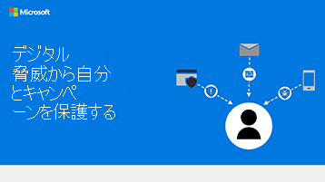

# Microsoft 365ユーザー Microsoft Teamsインフォグラフィックの作成と管理

これらのインフォグラフィックは、ユーザーの作業と共同作業に関するベスト プラクティスをMicrosoft 365。 ユーザーと共有して、ファイルの安全なストレージと共有、共同作業の会議の開催など、セキュリティで保護されたストレージと共有を利用できます。

詳しくは[、トレーニング サイトOfficeインフォ](https://support.microsoft.com/office/great-ways-to-work-with-office-6fe70269-b9a4-4ef0-a96e-7a5858b3bd5a)グラフィックをダウンロード[Microsoft 365してください](https://support.microsoft.com/training)。

## Microsoft 365ヒントのインフォグラフィック

チームがビジネス組織か非営利組織か (政治キャンペーンなど) のメンバー向けセキュリティ ヒントを含むこのインフォグラフィックをダウンロードします。

| アイテム | 説明 |
|:-----|:-----|
|   [PDF としてダウンロードする](https://download.microsoft.com/download/f/c/5/fc58bc0c-773a-4ac8-a232-6f986f61ef58/M365CampaignsWhatCanUsersDoToSecure.pdf) \ [アプリとしてダウンロードPowerPoint](https://download.microsoft.com/download/f/c/5/fc58bc0c-773a-4ac8-a232-6f986f61ef58/M365CampaignsWhatCanUsersDoToSecure.pptx)| 組織の情報をセキュリティで保護するために、これらのベスト プラクティスを共有Microsoft 365。 このインフォグラフィックは、高度なハッカーを対象とするために、政治キャンペーンのスタッフをサポートするために作成されました。 このインフォグラフィックをカスタマイズするには、PowerPointを使用してください。 関連記事: [ユーザーに対する](../business-premium/m365-campaigns-users.md)セキュリティMicrosoft 365影響|

## ビジネス ファイルを、Teams、SharePoint、OneDrive

インフォグラフィックをダウンロードして、ビジネス ファイルを共有する方法の簡単な概要を確認します。
  
| アイテム | 説明 |
|:-----|:-----|
|[![[ビジネス ファイルを共有する] インフォグラフィックのサム イメージ。](../media/solutions-architecture-center/m365-smbscenarios-shareyourfiles-square.png)](https://go.microsoft.com/fwlink/?linkid=2079435)   [PDF としてダウンロードする](https://go.microsoft.com/fwlink/?linkid=2079435) \ [アプリとしてダウンロードPowerPoint](https://go.microsoft.com/fwlink/?linkid=2079438) | ビジネス ファイルを共有して共同作業する場合は、これらのベスト プラクティスを使用して、情報を安全かつ保護することができます。 電子メールまたはメールで共有Teams、ファイルを電子メールとSharePoint保存OneDrive。 関連記事: [ビジネス ファイルの共有の概要](../business-video/overview-file-sharing.md)|

## オンライン会議をMicrosoft Teams

インフォグラフィックをダウンロードして、Microsoft Teams でオンライン会議に参加またはホストする方法の概要を簡単に確認できます。

| アイテム | 説明 |
|:-----|:-----|
|   [PDF としてダウンロードする](https://go.microsoft.com/fwlink/?linkid=2078712) \ [アプリとしてダウンロードPowerPoint](https://go.microsoft.com/fwlink/?linkid=2079515) | オンライン会議をホストまたは参加する方法の概要を簡単にMicrosoft Teams。 

## どこからでも作業を行い、OneDriveとMicrosoft 365

インフォグラフィックをダウンロードして、ファイルを使用してどこからでも作業するためのヒントを取得OneDrive Microsoft 365 Apps。

| アイテム | 説明 |
|:-----|:-----|
|   [PDF としてダウンロードする](https://go.microsoft.com/fwlink/?linkid=2079451) \ [アプリとしてダウンロードPowerPoint](https://go.microsoft.com/fwlink/?linkid=2079455) | モバイル デバイスをセットアップして、モバイル デバイスとモバイル デバイスを使用してどこからでも作業Microsoft 365 Appsを参照OneDrive。 関連記事: [どこからでも作業する](../business-video/work-from-anywhere.md)|

## フォームを使用して顧客にアンケートをMicrosoft 365

インフォグラフィックをダウンロードして、次の方法で Microsoft Forms を使用して顧客 (内部または外部) を調査Microsoft 365。

| アイテム | 説明 |
|:-----|:-----|
|   [PDF としてダウンロードする](https://go.microsoft.com/fwlink/?linkid=2079526) \ [アプリとしてダウンロードPowerPoint](https://go.microsoft.com/fwlink/?linkid=2079446) | Microsoft フォームを使用して、お客様の考え方を確認します。 関連記事: [Microsoft フォームで情報を収集する](https://support.microsoft.com/topic/collect-information-with-microsoft-forms-a55d6e0d-04f6-45b8-b05f-b141b8ecb4d5)|
