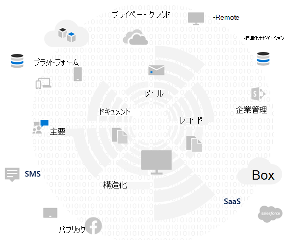
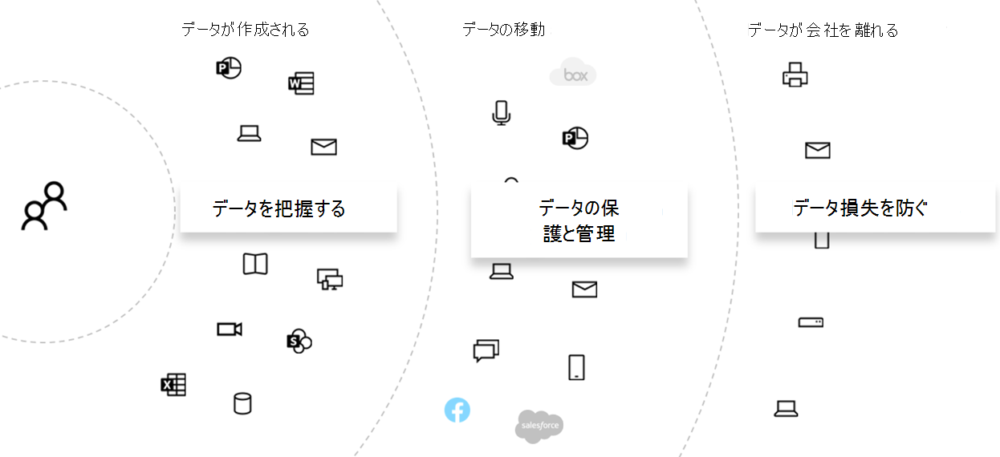

# データプライバシーリスクを評価し、機密アイテムを特定Microsoft 365

Microsoft 365 の機能とサービスで達成可能な機能を含む、関連する改善アクションを実装する前に、組織が対象となるデータプライバシー規制とリスクを評価する重要な第一歩です。

## 潜在的に適用可能なデータプライバシー規制

データ プライバシー規制に関するより広範な規制フレームワークについては [、Microsoft Services](https://servicetrust.microsoft.com/) Trust Portal および一般データ保護規則 [(GDPR)](/compliance/regulatory/gdpr)規制に関する一連の記事、および業界または地域で適用される可能性がある規制に関するその他の資料を参照してください。

### GDPR

データプライバシー規制で最も有名で引用されている GDPR は、欧州連合 (EU) の居住者である特定または特定可能な自然人に関連する個人データの収集、保存、処理、および共有を規制します。

GDPR 第 4 条に従って、

- 「個人データ」とは、特定または特定可能な自然人 ('データ主体') に関連する情報を意味します。識別可能な自然人とは、直接または間接的に、特に、名前、識別番号、場所データ、オンライン識別子などの識別子、またはその自然人の物理的、生理学的、遺伝的、精神的、経済的、文化的、社会的な識別に固有の 1 つ以上の要因を参照して識別できる人物です。

### ISO 27001

ISO 27001 などの他の標準への準拠は、複数のヨーロッパの監督当局によって、人、プロセス、およびテクノロジの範囲にわたる有効な意図の代理として認識されています。 ISO-27001 駆動型保護メカニズムに対する重複と遵守を指定する基準は、特定の状況でプライバシー義務を果たすプロキシと見なされる場合があります。

### その他のデータプライバシーに関する規制

その他の重要なデータプライバシー規制では、個人データの取り扱いに関する要件も指定されています。

米国では、カリフォルニア州消費者保護法 (CCPA)、HIPAA-HITECH (米国の医療プライバシー法)、グラハム リーチ ブライリー法 (GLBA) が含まれます。 追加の州固有の規制もインプレイスまたは開発中です。

世界中で、ドイツの国内 GDPR 実施法 (BDSG)、ブラジルデータ保護法 (LGPD)、その他多くの例が含まれます。

## 技術的な制御Microsoft 365への規制マッピング

データプライバシー関連の規制の多くは、要件が重なっていますので、技術的な管理スキームを開発する前に、対象となる規制を理解する必要があります。

この全体的なソリューションの記事の後で参照するには、次の表に、データプライバシー規制のサンプルからの抜粋を示します。

|規制|記事/セクション|抜粋|適用可能な技術制御カテゴリ|
|---|---|---|---|
|GDPR|記事 5(1)(f)|個人データは、不正または違法な処理に対する保護、偶発的な損失、破壊または損害に対する保護を含む、個人データの適切なセキュリティを確保する方法で、適切な技術的または組織的手段 ('整合性と機密性') を使用して処理されます。|(すべて)   ID   Device   脅威保護   情報を保護する   情報の統制   検出と対応|
||記事 (32)(1)(a)|最新の技術、実装のコスト、処理の性質、範囲、コンテキスト、および目的、および自然人の権利と自由に対する可能性と重大度が異なるリスクを考慮して、管理者とプロセッサは、リスクに適したレベルのセキュリティを確保するための適切な技術的および組織的措置を実施する必要があります。(a) 個人データの仮名化と暗号化を含む。|情報を保護する|
||記事 (13)(2)(a)|"...管理者は、個人データが取得された時点で、(a) 個人データが保存される期間、またはそれができない場合は、その期間を決定するために使用される条件という、公正で透明な処理を確保するために必要な次の情報をデータ主体に提供します。|情報の統制|
||記事 (15)(1)(e)|データ主体は、管理者の確認から、自分に関する個人データが処理されているかどうかを確認する権利を有し、その場合、個人データへのアクセスおよび次の情報:(e) 個人データの削除または消去を要求する権利の存在、またはデータ主体に関する個人データの処理の制限、またはそのような対象に対するオブジェクトに対する個人データの処理の制限処理|検出と対応|
|LGPD|第 46 条|処理エージェントは、個人データを不正アクセスや偶発的または違法な破壊、紛失、改ざん、通信、または不適切または違法な処理から保護できるセキュリティ、技術的、管理的な手段を採用します。|情報を保護する   情報の統制   検出と対応|
||第 48 条|管理者は、データ主体にリスクや関連する損害を与える可能性のあるセキュリティ インシデントが発生した場合、国の機関とデータ主体に通信する必要があります。|検出と対応|
|HIPPA-HITECH|45 CFR 164.312(e)(1)|電子通信ネットワーク経由で送信される電子保護された正常性情報への不正アクセスを防ぐ技術的なセキュリティ対策を実装します。|情報を保護する|
||45 C.F.R. 164.312(e)(2)(ii)|電子的に保護された正常性情報を適切と判断した場合は必ず暗号化するメカニズムを実装します。|情報を保護する|
||45 CFR 164.312(c)(2)|電子的に保護された健康情報が不正な方法で変更または破壊されていないと確認するための電子メカニズムを実装します。|情報の統制|
||45 CFR 164.316(b)(1)(i)|このサブパートでアクション、アクティビティ、または評価を文書化する必要がある場合は、アクション、アクティビティ、または評価の書面による (電子的な) レコードを維持します。|情報の統制|
||45 CFR 164.316(b)(1)(ii)|このセクションの段落 (b)(1) で必要なドキュメントは、作成日から 6 年間、または最後に有効だった日付から、後の方に保持します。|情報の統制|
||45 C.F.R. 164.308(a)(1)(ii)(D)|監査ログ、アクセス レポート、セキュリティ インシデント追跡レポートなど、情報システムアクティビティのレコードを定期的に確認する手順を実装する|検出と対応|
||45 C.F.R. 164.308(a)(6)(ii)|疑わしいまたは既知のセキュリティ インシデントを特定して対応する。対象のエンティティまたはビジネス アソシエイトに知られているセキュリティ インシデントの実用的で有害な影響を軽減する。セキュリティ インシデントとその結果を文書化します。|検出と対応|
||45 C.F.R. 164.312(b)|電子保護された正常性情報を含む、または使用する情報システムのアクティビティを記録および検査するハードウェア、ソフトウェア、および手続き型メカニズムを実装します。|検出と対応|
|CCPA|1798.105(c)|このセクションのサブディビジョン (a) に従って消費者の個人情報を削除する検証可能な要求を消費者から受け取った企業は、そのレコードから消費者の個人情報を削除し、すべてのサービス プロバイダーに対して、消費者の個人情報をレコードから削除する指示を行います。|検出と対応|
||1798.105(d)|(1798.105(c) の例外   企業またはサービス プロバイダーは、次の目的で消費者の個人情報を維持するために企業またはサービス プロバイダーが消費者の個人情報を維持する必要がある場合は、消費者の個人情報の削除要求に従う必要はありません (追加情報については、現在の規制を参照してください)。|検出と対応|
|||||

> [!IMPORTANT]
> これは、網羅的なリストを目的としたものではありません。 引用された [セクションの](../compliance/compliance-manager.md) 一覧に記載されている技術的な管理カテゴリへの適用性の詳細については、コンプライアンス マネージャーまたは法務またはコンプライアンス アドバイザーを参照してください。

## データを知る

対象となる規制に関係なく、組織の内部と外部の異なるユーザー データ型がシステムとやり取りする場合は、組織に適用される業界および政府機関の規制に従って、個人データ保護戦略全体に影響を与える可能性がある重要な要素です。 これには、個人データの保存場所、データの種類、そのデータの量、収集された状況が含まれます。

### データの移植性

データは、処理、絞り込み、その他のバージョンがそこから派生する場合に、時間の間に移動します。 初期スナップショットでは十分ではありません。 データを知るプロセスが進行中である必要があります。 これは、大量の個人データを処理する大規模な組織にとって最大の課題の 1 つを表しています。 「データを知る」問題に対処しない組織は、潜在的に非常に高いリスクと規制機関からの罰金の可能性があります。

### 個人データの場所

データプライバシー規制に対処するために、個人データが現在または将来存在する可能性があるという一般的な概念に頼る必要はありません。 データのプライバシーに関する規制では、組織は個人データが継続的にどこにあるか知っていることを証明する必要があります。 これにより、Microsoft 365 環境を含む個人情報を保存するために、すべてのデータ ソースの初期スナップショットを作成し、継続的な監視と検出のためのメカニズムを確立することが重要になります。

データ プライバシー規制に関連する全体的な準備状況とリスクをまだ評価していない場合は、次の 3 段階のフレームワークを使用して開始してください。

> [!NOTE]
> この記事とそのコンテンツは、法律アドバイザリー サービスの場所を取る目的ではありません。 基本的なガイダンスと、評価の初期段階で役立つ可能性があるツールへのリンクを提供します。

## 手順 1: 組織の個人データシナリオに関する基礎知識を開発する

現在管理している個人データの種類、保存場所、保護コントロールの配置、ライフサイクルの管理方法、アクセス権を持つユーザーに基づいて、データプライバシーリスクへの暴露を測定する必要があります。

開始点として、ユーザー環境に存在する個人データの種類をインベントリすることがMicrosoft 365です。 次のカテゴリを使用します。

- 毎日の業務機能を実行するために必要な従業員データ
- 企業間 (B2B) シナリオのビジネス顧客、パートナー、その他の関係に関する組織のデータ
- 企業が企業間 (B2C) シナリオで管理するオンライン サービスに情報を提供する消費者に関する組織のデータ

組織の一般的な部署のデータの種類の例を次に示します。

データプライバシー規制の対象となる個人データの多くが、通常、データの外部で収集およびMicrosoft 365。 Microsoft 365 内のデータ プライバシーの調査の対象とするには、コンシューマー向け Web またはモバイル アプリケーションからの個人データを、そのようなアプリケーションから Microsoft 365 にエクスポートする必要があります。

Web アプリケーションや CRM システムMicrosoft 365、このソリューションでは対応していないデータ プライバシーの露出は、より制限される場合があります。

また、リスク プロファイルを評価する際には、次の一般的なデータ プライバシー コンプライアンスの課題について考える必要があります。

- **個人データの配布。** 特定の件名に関する情報は、どのように分散していますか? 規制機関に適切なコントロールが設定されているのを確信させるのに十分なほどよく知られていますか? 必要に応じて調査および修復できますか?
- **外への侵入を防ぎます。** 特定の種類またはソースの個人データが侵害されるのを保護する方法と、それが侵害された場合の対応方法
- **保護とリスク。** リスクに対して適切な情報保護メカニズムと、ビジネスの継続性と生産性を維持し、エンドユーザーの介入が必要な場合のエンドユーザーへの影響を最小限に抑える方法 たとえば、手動による分類または暗号化を使用する必要がありますか?
- **個人データの保持。** 有効なビジネス上の理由から、個人データを含む情報を保持する必要がある期間と、ビジネス継続性の保持ニーズとバランスを取った過去のキープ it-forever プラクティスを回避する方法
- **データ主体要求の処理。** データ主体要求 (DSR) と、匿名化、やり直し、削除などの修復アクションを処理するために必要なメカニズムは何ですか?
- **継続的な監視とレポート。** さまざまなデータ型とソースで使用できる、毎日の監視、調査、およびレポートの手法の種類。
- **データ処理の制限。** 組織がプライバシー管理に反映する必要があるこれらの方法で収集または保存される情報に対するデータの使用に制限はありますか? たとえば、営業担当者が個人データを使用しないというコミットメントでは、組織が、その情報を販売組織に関連付けられたシステムに転送または保存したりしないメカニズムを設定する必要がある場合があります。

### 毎日の業務機能を実行するために必要な従業員データ

組織は、従業員契約に同意する内容に応じて、電子 ID と人事の目的で従業員に関するデータを収集する必要があります。 人が会社で働く限り、これは通常問題ではありません。 組織は、悪意のあるアクターが従業員の個人データを流出または漏洩するのを防ぐためのメカニズムを設定する必要がある場合があります。

人が会社を離れる場合、組織には通常、ユーザー アカウントの削除、メールボックスや個人用ドライブの使用停止、人事システムなどにおける従業員の状態の変更のためのプロセス、手順、保持と削除のスケジュールがあります。 訴訟が発生した場合、従業員または法的調査の他の当事者は、組織のシステムに格納されている個人データに関する情報を取得する有効な理由がある可能性があります。 場合によっては、その当事者はそのようなデータの削除または匿名化を要求する場合があります。

このようなニーズに対応するために、組織は、従業員に関する情報の一部がビジネスの継続性にとって合理的に重要であると考えられる可能性があるとして、そのような要求を容易にする必要がある予防、探偵、修復に対応するプロセスと手順を実施する必要があります。 たとえば、個人がファイルを作成した、または関数を実行した情報などです。

> [!NOTE]
> ユーザーの個人データの調査と修復の手法については、Microsoft 365と応答の記事[を参照してください](information-protection-deploy-monitor-respond.md)。 また、組織の内部で個人データを制御し、悪意のあるアクターの状況で組織から離れるのを防ぐために、自動分類と保護スキームを使用することもできます。 詳細については [、保護情報の記事](information-protection-deploy-protect-information.md) を参照してください。

### B2B シナリオのビジネス顧客に関する組織のデータ

B2B 情報の収集は、ビジネスの継続性を目的として顧客名とトランザクションの記録をさまざまなシステムに保持する必要がある一方で、その情報を不注意または悪意のある侵入から保護する必要がある場合があります。 従業員データと同様に、組織は、このようなデータを保護するためにポリシー、手順、および技術的な制御を実施し、定義された保持および削除スケジュールに従ってそれを年齢を変更する必要があります。

通常、外部の顧客、パートナー、および組織がビジネスを行う他のエンティティとの契約には、エンティティが組織との関係を持つ間と後の両方で、保護、保持、削除などのデータの処理に対処する言語が含まれます。

### B2C シナリオで組織が管理するオンライン サービスに情報を提供する消費者に関する組織のデータ

このカテゴリは、顧客データ漏洩の多くのパブリック インスタンスが原因で、ほとんどのユーザーがデータのプライバシーについて考える 1 つです。 これは、プロバイダーとの契約を結んだ第三者などの意図的なものや、悪意のあるアクターによる外用など、意図しない場合があります。 消費者データ保護は、EU などがこれらの規制を制定した主な理由の 1 つです。 GDPR や CCPA のようなデータ プライバシー規制では、以下の計画を立てる必要があります。

- [アクション プラン](/compliance/regulatory/gdpr-action-plan) と [説明責任の準備チェックリスト](/compliance/regulatory/gdpr-arc-Office365)
- [データ保護影響評価](/compliance/regulatory/gdpr-data-protection-impact-assessments)
- [違反通知](/compliance/regulatory/gdpr-breach-Office365)
- [データ サブジェクト要求](/compliance/regulatory/gdpr-dsr-Office365)

組織が直接消費者からのデータ収集をあまり行ってない場合は、このカテゴリの問題が少ない可能性があります。 ただし、コンプライアンスを実現するには、これらの記事で説明されているプロセスを実行する必要がある場合があります。

### 手順 1 の概要

リスクとデータプライバシー規制への露出を理解することが、組織の個人データシナリオに関する基礎知識に基づく重要な第一歩です。

Microsoft 365 環境で消費者からの個人データを持たなかったり、環境の特定の部分に限定されている場合、技術的な制御の必要性が消費者型のデータ露出が存在する前提である場合、その技術的制御は、環境の危険度の高い部分でのみ使用する必要があります。

Microsoft 365 のコンプライアンス マネージャーなど、外部組織や標準コントロール セットの推奨事項は、制御戦略を知らせるのに役立ちますが、実際のリスクエクスポージャーを定量化するために、データ インベントリの認識によって実装の選択を推進する必要があります。

ほとんどの組織では、上記のシナリオの 1 つが影響を受け取る可能性があります。 評価に対する全体的なアプローチの取り組みは重要です。

## 手順 2: データプライバシー規制に準拠するための準備状況を評価する

GDPR に固有の質問ですが、 [無料の Microsoft GDPR](https://www.microsoft.com/cyberassessment/en/gdpr/uso365) 評価ツールで示された質問は、全体的なデータ プライバシーの準備状況を理解する上での良いスタートを提供します。

米国の CCPA やブラジルの LGPD など、他のデータ プライバシー規制の対象となる組織は、GDPR との条項が重複する原因で、このツールの準備状況のインベントリの恩恵を受ける可能性があります。

GDPR 評価は、次のセクションで構成されます。

|Section|説明|
|:-------|:-----|
|ガバナンス|<ol><li>プライバシー ポリシーには、処理されるデータ情報が明示的に示されていますか? </li><li>プライバシー影響評価 (PIA) を定期的に実行していますか? </li><li> ツールを使用して個人情報 (PI) を管理していますか? </li><li> 特定の個人の PI データを使用してビジネスを行う法的権限はありますか? データに対する同意を追跡しますか? </li><li> 監査コントロールを追跡、実装、および管理しますか? データリークを監視しますか? </li></ol>|
|削除と通知|<ol><li>ユーザーのデータにアクセスする方法について明示的に指示しますか? </li><li> オプトアウトの同意を処理するプロセスを文書化していますか? </li><li> データの自動削除プロセスはありますか? </li><li> 顧客と関わりを持つ際に ID を検証するプロセスはありますか? </li></ol>|
|リスク軽減と情報セキュリティ|<ol><li>ツールを使用して非構造化データをスキャンしますか? </li><li>すべてのサーバーは最新の情報であり、ファイアウォールを利用して保護しますか? </li><li>サーバーの定期的なバックアップを実行しますか? </li><li>データ 漏えいを積極的に監視していますか? </li><li>保存中と送信時にデータを暗号化しますか? </li></ol>|
|ポリシー管理|<ol><li>Binding Corporate Rules (BRS) の管理方法 </li><li>データに対する同意を追跡しますか? </li><li> 1 ~ 5 の規模で、5 が完全にカバーされている場合、契約はデータ分類と処理要件をカバーしていますか? </li><li>インシデント対応計画を持ち、定期的にテストしていますか? </li><li>アクセスの管理に使用するポリシー </li></ol>|
|||

## 手順 3: ユーザー環境で発生する機密情報の種類Microsoft 365する

この手順では、特定の規制制御の対象となる特定の機密情報の種類の識別と、特定の環境での機密情報のMicrosoft 365します。

個人を含む環境内のコンテンツを検索すると、コンプライアンス検索、電子情報開示、Advanced eDiscovery、DLP、監査の組み合わせが含まれる、複雑な作業になります。

Microsoft Compliance管理センターの新しいデータ分類ソリューションでは、これは、個人データに関連する機密情報の種類を含む組み込みまたはカスタムの機密情報の種類で動作するコンテンツ エクスプローラー機能ではるかに簡単になりました。

### 機密情報の種類

Microsoft Compliance 管理センターには、100 を超える機密情報の種類が事前に読み込まれ、そのほとんどが個人データの特定と検索に関連しています。 これらの組み込みの機密情報の種類は、正規表現 (regex) または関数によって定義されるパターンに基づいて、クレジット カード番号、銀行口座番号、パスポート番号などの識別と保護に役立ちます。 詳細については、「[機密情報の種類で検索される情報](../compliance/sensitive-information-type-entity-definitions.md)」を参照してください。

組織固有または地域別の種類の機密アイテム (従業員のユーザー設定の形式など) や、組み込みの機密情報の種類でまだカバーされていないその他の個人情報を特定して保護する必要がある場合は、次の方法でカスタム機密情報の種類を作成できます。

- PowerShell
- 完全なデータ一致を持つカスタム ルール (EDM)
- コンプライアンス センターの管理 UI を使用して、コンプライアンス スコアとコンプライアンス マネージャーの使用に関する記事 [で強調表示されている](information-protection-deploy-compliance.md)

また、組み込みの既存の機密情報の種類をカスタマイズできます。

詳細については、次の記事を参照してください。

- [組み込みの機密情報の種類をカスタマイズする](../compliance/customize-a-built-in-sensitive-information-type.md)
- [機密情報の種類に関する詳細情報](../compliance/sensitive-information-type-learn-about.md)
- [セキュリティ/コンプライアンス センターでカスタムの機密情報の種類を作成する](../compliance/create-a-custom-sensitive-information-type.md)
- [セキュリティ/コンプライアンス センター PowerShell でカスタムの機密情報の種類を作成する](../compliance/create-a-custom-sensitive-information-type-in-scc-powershell.md)
- [Exact Data Match に基づく分類で、カスタムの機密情報の種類を作成する](../compliance/create-custom-sensitive-information-types-with-exact-data-match-based-classification.md)

### コンテンツ エクスプローラー

環境内の機密性の高いアイテムの発生を特定するための重要なツールは、コンプライアンス管理センターの新しいコンテンツ Microsoft 365です。 これは、機密情報の種類の発生と結果の表示のために、Microsoft 365 サブスクリプション全体を初期および継続的にスキャンする自動化されたツールです。

新しいコンテンツ エクスプローラー ツールを使用すると、組み込みの機密情報の種類またはカスタムアイテムを使用して、環境内の機密アイテムの場所をすばやく特定できます。 これには、プロセスを確立し、機密性の高いアイテムの存在と場所を定期的に調査する責任が割り当てられている場合があります。

この記事で強調表示されている他の手順と共に、計画された Microsoft 365 構成と監視を通じて保護するための、機密性の高いアイテムの全体的なリスクエクスポージャー、準備、および場所を特定するための開始点を提供します。

### 環境内の個人データを識別するその他の方法

コンテンツ エクスプローラーに加えて、組織はコンテンツ検索機能にアクセスして、高度な検索条件とカスタム フィルターを使用して、環境内の個人データを検索するカスタム検索を作成できます。

個人データの検出のためのコンテンツ検索の使用に関する詳細なガイダンスについては、この記事で [説明します](/compliance/regulatory/gdpr)。 コンテンツ検索などの検出手法は、GDPR および [CCPA の DSR でも説明されています](/compliance/regulatory/gdpr-dsr-Office365#introduction-to-dsrs)。

監視および応答の記事では、Microsoft 365の個人データの調査と修復の手法に関する追加の分析情報[を提供します](information-protection-deploy-monitor-respond.md)。

> [!NOTE]
> オンプレミスに保存されているファイルに含む機密情報の詳細については [、「Azure Information Protection」を参照してください](/azure/information-protection/quickstart-findsensitiveinfo)。
