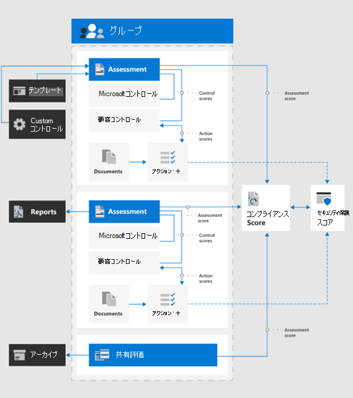
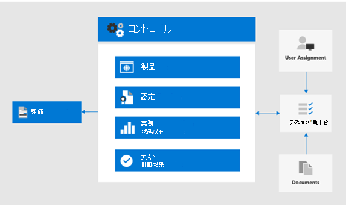

# コンプライアンススコアとコンプライアンスマネージャーを使用して改善アクションを管理するUse Compliance Score and Compliance Manager to manage improvement actions

Microsoft コンプライアンスのスコアとコンプライアンスマネージャーを一緒に使用して、欧州連合の[一般的なデータ保護規則 (GDPR)](../compliance/gdpr.md)、[カリフォルニア消費者保護法 ccpa](../compliance/ccpa-faq.md)、HIPAA (米国医療保険法)、ブラジルのデータ保護法 (LGPD) などのデータプライバシー規制に関連する改善を管理することができます。Microsoft Compliance Score and Compliance Manager can be used together to manage improvements related to data privacy regulations such as the European Union [General Data Protection Regulation (GDPR)](../compliance/gdpr.md), [California Consumer Protection Act CCPA)](../compliance/ccpa-faq.md), HIPAA-HITECH (US health care privacy act), and the Brazil Data Protection Act (LGPD). 

この記事では、データのプライバシー保護のためにこれらのツールを使用するためのガイダンスを示します。This article provides guidance on the use of these tools for data privacy purposes.

>[!Note]
>コンプライアンスマネージャーで提供されるお客様のアクションは推奨事項です。The customer actions provided in Compliance Manager are recommendations. 実装する前に、これらの推奨事項の有効性を規制環境で評価する必要があります。It is up to you to evaluate the effectiveness of these recommendations in your regulatory environments prior to implementation. コンプライアンスマネージャーの推奨事項は、コンプライアンスの保証として解釈されないようにする必要があります。Compliance Manager recommendations should not be interpreted as a guarantee of compliance.
>

## コンプライアンススコアとコンプライアンスマネージャーの計画された更新プログラムPlanned updates for Compliance Score and Compliance Manager

[コンプライアンススコア](../compliance/compliance-score.md)(現時点ではプレビュー中) には、[コンプライアンスマネージャー](../compliance/compliance-manager-overview.md)から規制 (GDPR など) のターゲット評価を追加する必要があります。[Compliance Score](../compliance/compliance-score.md) (currently in preview) requires adding your target assessments for a regulation (such as GDPR) from the [Compliance Manager](../compliance/compliance-manager-overview.md). 今後のリリースでは、コンプライアンスマネージャーの機能の多くが統合コンプライアンススコアに統合され、複数のツールの必要性が減少します。In a future release, much of the functionality in Compliance Manager will be merged into a unified Compliance Score experience, reducing the need for multiple tools.

ご利用のサブスクリプションのツールを次に示します。このツールは、サインインする必要があります。Here are the tools for your subscription, which require you to sign-in:

- [Microsoft コンプライアンス管理センターのコンプライアンススコアCompliance Score in the Microsoft Compliance admin center](https://compliance.microsoft.com/compliancescore)
- [Microsoft サービス信頼ポータルのコンプライアンスマネージャーCompliance Manager in the Microsoft Services Trust Portal](https://servicetrust.microsoft.com/ComplianceManager/V3)

## コンプライアンスマネージャーの概要Getting started with Compliance Manager 

[コンプライアンスマネージャー](../compliance/working-with-compliance-manager.md) (現在はプレビュー段階) は、microsoft クラウドサービスに関連する規制コンプライアンスアクティビティを管理するための、Microsoft Service Trust Portal の無料ワークフローベースのリスク評価ツールです。[Compliance Manager](../compliance/working-with-compliance-manager.md) (currently in preview) is a free workflow-based risk assessment tool in the Microsoft Service Trust Portal for managing regulatory compliance activities related to Microsoft cloud services. Microsoft 365 または Azure Active Directory (Azure AD) サブスクリプションの一部として、コンプライアンスマネージャーは、Microsoft クラウドサービスの共有責任モデル内の法令遵守を管理するのに役に立ちます。As part of your Microsoft 365 or Azure Active Directory (Azure AD) subscription, Compliance Manager helps you manage regulatory compliance within the shared responsibility model for Microsoft cloud services.

コンプライアンスセンターの [**コンプライアンススコア**] ページで、全体的なコンプライアンススコアを表示したり、その他のさまざまな機能を実行したりすることができますが、最初にサービスの信頼ポータルを使用してコンプライアンスマネージャーを使用して、データのプライバシー規制の評価を構成する必要があります。While you can view your overall compliance score and perform a number of other functions in the Compliance center's **Compliance Score** page, you need to use Compliance Manager through the Services Trust Portal to first configure assessments for your data privacy regulations. これらの評価からのデータは、さらに表示とフィルター処理を行うためにコンプライアンススコアに表示されます。Data from these assessments will then show up in Compliance Score for further viewing and filtering. 

コンプライアンスマネージャーインターフェイスを使用すると、1つまたは複数のデータプライバシー関連の規制テンプレートを選択し、それらをグループ化して、そのセットに対して必要な改善アクションを評価および追跡することができます。Using the Compliance Manager interface, you can select one or more data privacy-related regulation templates and group them to assess and track required improvement actions across the set. また、対象のサービスに固有の各規制呼び出しの情報を、Microsoft とカスタマー管理のコントロールで分けて表示することもできます。You can also view information about the controls each regulation calls for specific to the target service, separated by Microsoft vs. customer-managed controls.

ここで選択した評価と改善の状態は、Microsoft コンプライアンスセンターのコンプライアンススコアにも表示されます。これは、コンプライアンスマネージャーでの初期設定の重要性を強調します。Assessments and improvement status selected here also appear in Compliance Score in the Microsoft Compliance Center, which emphasize the importance of your initial setup in Compliance Manager. この図は、これらの関係を示しています。These relationships are shown in this figure.
 

開始する際に役立つ重要な手順を以下に示します。Here are the key steps to help you get started.

### 1. 評価テンプレート1. Assessment templates

コンプライアンスマネージャーからは、最初の手順として、重要なデータプライバシー規制に固有の評価を追加し、定義された「データプライバシー規制」グループに含めることをお勧めします。From the Compliance Manager, the first step is to add assessments specific to the data privacy regulations of interest and include them in a defined "Data Privacy Regulations" group.

[グループ](../compliance/working-with-compliance-manager.md#groups)は、評価を組織化し、同じまたは関連する顧客管理のコントロールを持つ評価間で共通情報とワークフロータスクを共有できるようにするコンテナーです。[Groups](../compliance/working-with-compliance-manager.md#groups) are containers that allow you to organize Assessments and share common information and workflow tasks between Assessments that have the same or related customer-managed controls. 同じグループ内の2つの異なる評価がカスタマー管理コントロールを共有する場合、コントロールの実装の詳細、テスト、および状態の完了は、グループ内の他の評価の同じコントロールに自動的に同期されます。When two different Assessments in the same group share customer-managed control, the completion of implementation details, testing, and status for the control automatically synchronize to the same control in any other Assessment in the Group. これにより、グループ全体の各コントロールに割り当てられたアクションアイテムが統一され、作業の重複が減少します。This unifies the assigned Action Items for each control across the group and reduces duplicating work. 

グループを使用して整理することもできます。You can also choose to use groups to organize. コンプライアンス作業を整理するのに役立つ、年、地域、コンプライアンス標準、またはその他のグループによる評価。Assessments by year, area, compliance standard, or other groupings to help organize your compliance work.

### 2. アクションアイテム2. Action items

評価が追加されると、各グループまたは個々の規則に固有のアクションアイテムを表示できるようになります。Once the assessments have been added, you can view Action Items specific to each group or individual regulation:

- **改善アクションリスト。****Improvement action list.** [アクションアイテム] リストに移動して、グループに含まれるすべての規制に関連付けられている改善アクションを表示します。Navigate to the Action Items list and view the improvement actions associated across the regulations included in the group. 多くのアクションは、1つのリストアイテムが複数の規制を表すことができるように、さまざまな規則に及びます。Many actions span regulations so a single list item may represent multiple regulations. 
 
- **改善アクションフィルター。****Improvement action filtering.** 多くのデータプライバシーに関する規制や規制のグループでは、改善アクションの一覧が非常に大きくなる可能性があるので、[フィルター] ドロップダウンを使用してリストにフィルターを適用することを検討してください。For many data privacy regulations and groups of regulations, the list of improvement actions can be quite large, so consider filtering the list using the filter drop down. たとえば、"テクニカルコントロール" を選択すると、多くのアクションは、コンプライアンスマネージャーにも記載されているビジネスのさまざまな側面における管理操作に関連しているため、組織内で技術実装があるものだけに限定されます。For example, if you select "technical controls", the list will be reduced to just those which have a technical implementation in the organization, as many of the actions are related to administrative operations in various aspects of the business which are also documented in Compliance Manager. この記事では、技術的な制御について説明するので、このフィルター方法をお勧めします。In this article, we will focus on technical controls, so this filtering approach is recommended.
 
- **詳細については、「」を参照してください。****Additional information and review.** アクションごとに、リンクをクリックして**詳細**を確認できます。これにより、推奨されるアクティビティの詳細がわかります **。または、次**の操作を実行するためのフォームが開きます。For each action, you can click on the link to **Read More**, which tells you more about the recommended activity, or **Review**, which opens a form allowing you to do the following:
 
   - 組織内のユーザーにアクションを割り当てて管理するAssign the action to a someone in your organization to manage
   - アクションのアドレス指定に関連するドキュメントを管理するManage documents related to addressing the action
   - アイテムの状態を指定するSpecify status for the item
   - 実装とテストの日付を指定するSpecify implementation and test dates
   - 件名アクションの追加情報、実装メモ、およびテスト計画メモを記録するRecord additional information, implementation notes, and test plan notes for the subject action
  
- **適用できないアイテムがスコープ外です。****Non-applicable items as out-of-scope.** [アクションアイテム] ボックスの一覧に含まれる改善アクションは、計画した実装には適用されない場合があります。Some improvement actions included in the Action Items list might not apply to your planned implementation. コンプライアンスマネージャーの範囲外であることを指定し、その操作とその証拠を、コンプライアンススコアの値の計算から削除することができます。You can specify that they are out of scope in Compliance Manager and remove the action and its evidence from the calculation of the compliance score value. 

たとえば、組織で Microsoft のマネージキーを使用することを選択した場合、顧客キーを使用することをお勧めしますが、展開には適用されません。For example, if your organization has elected to use Microsoft Managed Key", a recommendation to Use Customer Key is not applicable to your deployment. この場合、組織では、該当する規制テンプレートの**制御アクション**の**範囲内ではない**とマークされます。In this case, your organization would mark it as **Not in scope** in the **Control Actions** for the applicable regulatory template.
 
### 3. コントロール情報3. Controls info

評価固有のビューの場合は、各評価グループの [[コントロール] 情報](../compliance/compliance-manager-overview.md#controls)を表示します。For an assessment-specific view, view the [Controls Info](../compliance/compliance-manager-overview.md#controls) for each assessment group. これにより、評価固有のビューが提供されます。これは、技術統制固有のビューを提供する [アクションアイテム] リストとは異なります。This provides an assessment-specific view, which is difference than the Action Items list, which provides a technical control-specific view.
 

[ **Controls Info** ] リストに移動して、対象とする規制のスコープ内サービスの一覧を表示します。Navigate to the **Controls Info** list and view the list of in-scope services for the regulation in question. 
 
規制固有の制御のグループ化各サービス領域のコントロール領域で提供されるアクションを一覧表示します。Regulation-specific control groupings list the actions provided by control area for each service area. 一連のアクションについては、コンプライアンスマネージャーによって処理に関する詳細情報が提供されます。また、制御方法を選択する際に組織を支援するためのレビューオプションを提案または提供することもあります。For each set of actions, the Compliance Manager provides more information on the action and may suggest or provide review options to assist the organization in choosing a control approach.
 
このインターフェイスには、技術的なアクションに固有の詳細、およびそのコントロールに関連するアクションの状態と、アクションに関連する規制に関する補足コンテキストを表示する機能が用意されています。Note that this interface provides the capability to view details specific to the technical action, together with the status of actions related to the control, and supplemental context about the regulations to which the action is related.

### 4. テンプレートのダウンロード4. Template download

スプレッドシートベースの規制分析に精通している場合は、テンプレートリストを使用して、それぞれの評価のテンプレートをダウンロードする方法があります。For those more familiar with spreadsheet-based regulatory analysis, another approach is to download the template for each respective assessment using the Templates listing. ダウンロードされたテンプレートには、規制に加えて、各テンプレートの技術管理情報が一覧表示されるため、特定の役割を使用して移動/フィルター処理を行ったり、ビジネス固有のビューを生成したりする方が簡単な場合があります。The downloaded templates list both the regulatory as well as technical control information for each template and may be easier for certain roles to navigate/filter and to generate business-specific views.
 
[**テンプレートの追加**] を使用して、既存のテンプレートに基づいて組織用にカスタマイズした新しいテンプレートを追加することもできます。You can also add a new template customized for your organization based on an existing template, using **Add Template**. そのためには、選択したテンプレート (HIPAA/ヒット回数など)) をダウンロードし、目的に合わせて変更してから、コンプライアンスマネージャーツールにアップロードし直す必要があります。これで、コンプライアンスマネージャーとコンプライアンススコアツールの全体の一部として、他のテンプレートや評価に似た評価と評価を実行できるようになります。This requires that you download a template of choice (such as HIPAA/HITECH)), then modify it for your purposes and upload back into the Compliance Manager tool, where it will now drive assessments and scoring similar to other templates and assessments as part of the overall Compliance Manager and Compliance Score toolset.
 
>[!Tip]
>多数の規制または重複した改善アクションを処理する場合は、それぞれのテンプレートをダウンロードして、データセットを結合したり、組織に適用されない改善アクションやコントロールの種類を削除したり、再アップロードしたりすることを検討してください。if dealing with a large number of regulations or overlapping improvement actions, consider downloading each respective template and combining the data sets, removing improvement actions or control types that do not apply to your organization, and re-uploading. これは、[すべてのコントロール情報] セクションに移動し、それぞれをスコープ外としてマークするよりも簡単な場合があります。This may be easier than navigating every control info section and marking each as out of scope.
>

## コンプライアンス スコアCompliance Score

コンプライアンスマネージャーで評価およびレビューの仕様が実行されると、[コンプライアンススコア](../compliance/working-with-compliance-score.md)ツールに移動し、スコアとスライスを確認して、コントロールエリアによるデータのダイスを追加できるようになります。Once the assessments and review specifications are performed in Compliance Manager, you can now go to the [Compliance Score](../compliance/working-with-compliance-score.md) tool and review the score and slice and dice the data further, including by control area.

Microsoft 365 コンプライアンス管理センターのコンプライアンススコアツールは、コンプライアンスマネージャーおよびさまざまな Microsoft 365 サービスから取得したコンプライアンスデータを確認およびフィルター処理するためのいくつかのアプローチを提供します。The Compliance Score tool in the Microsoft 365 Compliance admin center provides several approaches to review and filter compliance data obtained from Compliance Manager and various Microsoft 365 services. このツールは、さまざまな構成設定が実装されている場合に自動的に更新され、多くの改善アクションが両方のスコアで表示されるように、通知を Microsoft のセキュリティで保護されたスコアと共有します。This tool is automatically updated when various configuration settings are implemented and shares signals with the Microsoft Secure Score so that many improvement actions will show up in both scores. 
 
コンプライアンススコアは次の機能を提供します。The Compliance Score provides:

- Microsoft とお客様が管理する統制によって分類された、収集されたスコアA collected score, broken down by Microsoft and customer-managed controls
- 改善アクションと完了状態のロールアップA rollup of improvement actions and completion status
- スコアに影響を与える Microsoft 365 ソリューションの一覧A listing of Microsoft 365 solutions impacting your score

### コンプライアンススコアを計算する方法How the compliance score gets calculated

つまり、microsoft の[コンプライアンススコア計算の記事](../compliance/compliance-score-methodology.md)で詳しく説明されているように、microsoft とお客様が管理する統制の組み合わせに基づいてスコアが計算されます。In short, the score is calculated based on a combination of Microsoft and customer-managed control implementations, as explained in more detail in the [Microsoft Compliance Score calculation article](../compliance/compliance-score-methodology.md).

コントロールには、必須か任意かを基準にしたスコア値、および予防的、検出、または是正のいずれであるかに基づいて、スコア値が割り当てられます。Controls are assigned a score value based on whether they're mandatory or discretionary, and whether they're preventative, detective, or corrective. これらは、他のコントロールに関連して実装されていないリスクをまとめたものです。These collectively represent the risk of not implementing it relative to other controls.

「Microsoft コンプライアンススコアの計算」の記事に記載されているように、予防的制御は検出と修正されたものよりも高いスコアを取得し、固定のコントロールは任意のスコアより高いスコアを取得します。As presented in the Microsoft Compliance Score calculation article, preventative controls get a higher score than detective and corrective ones, and mandatory controls get a higher score than discretionary ones.
 
コンプライアンススコア管理 UI では、これらのパラメーターは表示されません。また、これらのパラメーターを使用してフィルター処理することもできないことに注意してください。Note that the Compliance Score admin UI does not list these parameters, nor does it provide the ability to filter by them. ただし、関連付けられているテンプレートをコンプライアンスマネージャーツールからダウンロードした場合は、その結果として得られるデータセットには、ほとんどの規制に関するこれらのパラメーターが表示されます。However, if you download the associated template from the Compliance Manager tool, the resulting data set does list these parameters for most regulations.

テクニカルコントロールの場合、関連付けられている機能がアクティブ化されると、コンプライアンススコアは向上アクションのスコアを自動的に更新します。For technical controls, Compliance Score will automatically update the improvement action score once the related feature is activated. その他の技術以外の操作、 &mdash; またはドキュメントに関連付けられている操作は、 &mdash; サービス信頼ポータルのコンプライアンスマネージャーツールで手動で記録する必要があります。Other, non-technical control actions&mdash;such as those that are operational or related to documentation&mdash;need to be recorded manually in the Compliance Manager tool on the Services Trust Portal. 

また、データプライバシー規制へのコンプライアンス以外の理由で保持ラベルを使用するなど、他の目的のために特定の改善アクションを実装することもあります。このような機能は、 &mdash; &mdash; 他の目的で使用されている場合でも、意図的な法令遵守アクションの一部ではありません。You many also be implementing certain improvement actions for other purposes&mdash;for example using retention labels for reasons other than data privacy regulation compliance&mdash;so you would get credit for using such a feature even if it is being used for other purposes, and not part of a deliberate compliance action.

コンプライアンススコアは、幅広い規模で改善を追跡するための相対的な指標として考慮する必要があります。Your Compliance Score should be considered a relative measure to track improvement on a broad scale. 完全なスコアを追求する必要はありません。You should not pursue a perfect score. 

### 追加のガイダンスAdditional guidance

コンプライアンススコアとコンプライアンスマネージャーを使用してデータプライバシー規制へのコンプライアンスを実現するための、いくつかの重要なヒントを紹介します。Here are a few important tips for the use of Compliance Score and Compliance Manager for you to achieve data privacy regulation compliance:

- 各データプライバシー規制には、技術統制、ドキュメント仕様、運用、プロセス、およびレポートの要件の組み合わせがあります。Each data privacy regulation has a combination of technical controls, documentation specifications, and operational, process, and reporting requirements. これらのすべてが向上アクションに表示されます。All of these show up in the improvement actions. 

- この記事では、コンプライアンスマネージャーおよびコンプライアンススコアでデータのプライバシーを保護するために指定されている技術コントロールのサブセットに焦点を当てます。This article focuses on a subset of the technical controls specified for data privacy in Compliance Manager and Compliance Score. 非技術的な管理コントロールの詳細については、コンプライアンスマネージャーツールと[ドキュメント](../compliance/working-with-compliance-score.md)を参照してください。Refer to the Compliance Manager tool and [documentation](../compliance/working-with-compliance-score.md) for more information on non-technical administrative controls.

- 改善アクションの表示を関心のある領域に絞り込むには、コンプライアンススコア管理の [**ソリューション**] タブで、アクションの種類によってフィルター処理できます。To focus the view of improvement actions to your area of interest, you can filter by action type in the **Solutions** tab in the Compliance Score admin.

- コンプライアンススコアで特定された改善アクションの相対的な重要性と優先度は、組織が管理する必要があると判断した、より広範なリスクレビューの一環として考慮する必要があります。The relative importance and priority of improvement actions identified in Compliance Score should be considered as part of a broader risk review along with the data privacy risk you've determined your organization needs to manage. 

- グローバルな組織の場合、複数のデータプライバシーに関する規制テンプレートを評価としてコンプライアンスマネージャーに追加すると、各改善アクションのフィールドリストに適用されている各機能が統合されます。If you are a global organization and you add multiple data privacy regulation templates into Compliance Manager as Assessments, Compliance Score will combine each applicable one in a field listing for each improvement action.
 
- 複数の規制要件に対する改善アクションの集約がある場合でも、GDPR、LGPD、CCPA、および HIPAA ヒットの規則の評価テンプレートが選択されている場合、400の向上アクションのほとんどがコンプライアンススコアに表示されます。Even with improvement action aggregation across multiple regulatory requirements, if the regulation assessment templates for GDPR, LGPD, CCPA, and HIPAA-HITECH are selected, for example, almost 400 improvement actions will be listed in Compliance Score. この長いリストをより適切に処理するには、向上アクションフィルターを使用して、結果セットをより扱いやすいリストに絞り込みます。To better tackle this long list, use the improvement action filter to reduce the result set to a more manageable list.

- [カテゴリ] フィルターは、この総合的なソリューション内の記事を追跡、禁止、保護、保持、および調査する論理グループによって改善アクションをフィルター処理する手段を提供します。The Categories filter provides a means to filter improvement actions by logical grouping, which the Track, Prevent, Protect, Retain, and Investigate articles in this overall solution align to. 

- 向上アクションに記載されているコントロールの中には、特定の規制に関する記事に直接関連しているものがありますが、他のコントロールは規制の精神により間接的に関連付けられている可能性があります。Some of the controls listed in the improvement actions may be considered more directly tied to a specific regulatory article, while other controls may be more indirectly associated with the spirit of a regulation and are many times just things you should consider doing anyway.

