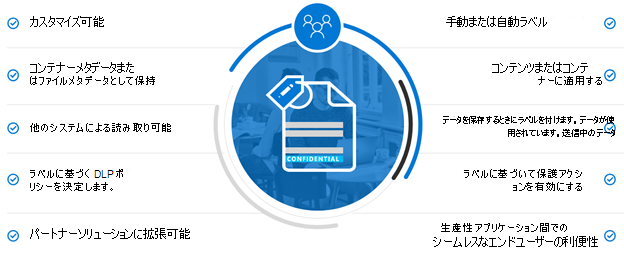
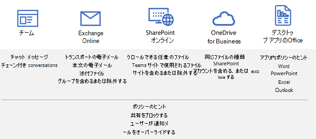
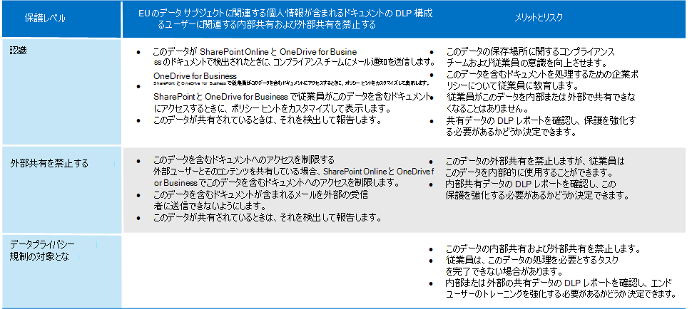

# データプライバシー規制の対象となる情報を保護する

データプライバシーコンプライアンスのニーズと規制に対処するために、サブスクリプションにはさまざまな情報保護制御を使用できます。 これには、一般データ保護規則 (GDPR)、HIPAA-HITECH (米国医療プライバシー法)、カリフォルニア消費者保護法 (CCPA)、ブラジルデータ保護法 (LGPD) が含まれます。

これらのコントロールは、次のソリューション領域内に存在します。

- 秘密度ラベル
- Microsoft Purview データ損失防止 (DLP)
- Microsoft Purview のメッセージの暗号化
- Teams とサイトのアクセス制御

> [!NOTE]
> このソリューションでは、データ プライバシー規制の対象となる情報を保護するためのセキュリティ機能とコンプライアンス機能について説明します。 Microsoft 365 のセキュリティ機能の完全な一覧については、 [Microsoft 365 のセキュリティ ドキュメントを参照してください](../security/index.yml)。 Microsoft 365 のコンプライアンス機能の完全な一覧については、 [Microsoft Purview のドキュメントを参照してください](../compliance/index.yml)。

## 情報保護の制御に影響を与えるデータ プライバシー規制

情報保護制御に関連する可能性のあるデータ プライバシー規制のサンプル リストを次に示します。

- GDPR Article 5(1)(f))
- GDPR 記事 (32)(1)(a)
- LGPD 記事 46
- HIPAA-HITECH (45 CFR 164.312(e)(1))
- HIPAA-HITECH (45 C.F.R. 164.312(e)(2)(ii))

上記の各情報の詳細については [、データプライバシーリスクの評価と機密アイテムの特定](information-protection-deploy-assess.md) に関する記事を参照してください。

情報保護に関するデータ プライバシー規制では、次の方法をお勧めします。

- 損失または不正アクセス、使用、送信に対する保護。
- リスクベースの保護メカニズムの適用。
- 必要に応じて暗号化を使用します。

組織では、他のコンプライアンス ニーズやビジネス上の理由など、他の目的で Microsoft 365 コンテンツを保護することもできます。 データプライバシーに関する情報保護スキームの確立は、全体的な情報保護計画、実装、および管理の一環として行う必要があります。

Microsoft 365 の情報保護スキームの使用を開始するために、次のセクションには、Microsoft 365 の関連機能と改善アクションの短い一覧が含まれています。 この一覧には、データ プライバシー規制に適用できる機能と改善アクションが含まれています。 ただし、古いテクノロジを大きく置き換える新しい機能がある場合、この一覧には古いテクノロジは含まれません。 たとえば、SharePoint と OneDrive の Information Rights Management (IRM) は一覧には含まれませんが、秘密度ラベルが含まれています。

## Microsoft 365 での情報保護の管理

Microsoft [情報保護ソリューション](../compliance/information-protection.md) には、Microsoft 365、Microsoft Azure、および Microsoft Windows のさまざまな統合機能が含まれています。 Microsoft 365 では、情報保護ソリューションには次のものが含まれます。

- [機密情報の種類](../compliance/sensitive-information-type-entity-definitions.md) ([データプライバシー リスクの評価と機密アイテムの特定に関する記事](information-protection-deploy-assess.md)で説明されています)
- [機密ラベル](../compliance/sensitivity-labels.md)
  - サービス/コンテナー レベル
  - クライアント側/コンテンツ レベル
  - SharePoint と OneDrive の保存データの自動設定
- データ損失防止 (DLP)
- [エンドポイントのデータ損失防止](../compliance/endpoint-dlp-learn-about.md)
- [Office 365 メッセージ暗号化の新機能 (OME)](../compliance/ome.md) と OME [Advanced Message Encryption](../compliance/ome-advanced-message-encryption.md)

さらに、サイトレベルとライブラリ レベルの保護は、保護スキームに含める重要なメカニズムです。

Microsoft 365 以外のその他の情報保護機能については、次を参照してください。

- [Microsoft Defender for Cloud Apps](/cloud-app-security/)
- [Azure Information Protection](/azure/information-protection/what-is-information-protection)
- [Microsoft エンドポイント マネージャー](https://www.microsoft.com/microsoft-365/microsoft-endpoint-manager)
- [Windows 情報保護](/windows/security/information-protection/windows-information-protection/protect-enterprise-data-using-wip)

## 秘密度ラベル

Microsoft Purview 情報保護の秘密度ラベルを使用すると、ユーザーの生産性や共同作業の能力を妨げることなく、組織のデータを分類して保護できます。

> [!div class="mx-imgBorder"]
> 

### 秘密度ラベルの前提条件

次に示す秘密度ラベルベースの機能を実装する前に、これらのアクティビティを完了します。

1. 次の内容を理解します。
   - **ビジネス要件。** 企業で秘密度ラベルを適用するビジネス上の理由を確立します。 たとえば、情報保護に関するデータ プライバシー要件などです。
   - **秘密度ラベル機能。** 秘密度ラベル付けは複雑になる可能性があるため、開始する前に [機密ラベルのドキュメント](../compliance/sensitivity-labels.md) を必ず読んでください。
   - **覚えておく必要がある重要な点** 秘密度ラベルはMicrosoft Purview コンプライアンス ポータルで管理されますが、ターゲット設定オプションとアプリケーション オプションは大きく異なります。
      - コンテナー レベルには、サイト、グループ、Teams の秘密度ラベルがあります (設定はコンテナー内のコンテンツには適用されません)。 これらは、サイト、グループ、またはチームがプロビジョニングされたときに適用するユーザーとグループに公開されます。
      - アクティブなコンテンツには秘密度ラベルがあります。 これらは、手動で適用するか、次の場合に自動的に適用されるユーザーまたはグループにも公開されます。
        - ファイルは、ユーザーのデスクトップまたは SharePoint サイトに開いたり編集したり保存したりできます。
        - 電子メールが下書きされて送信されます。
      - Exchange 経由で転送中のメールに加えて、SharePoint と OneDrive の保存中のファイルに対する自動アプリケーションの秘密度ラベルがあります。 これらはすべてのサイトまたは特定のサイトを対象とし、これらの環境の保存ファイルに自動的に適用されます。

2. 過去または代替の方法で現在の秘密度ラベル付けを合理化する

   - Azure Information Protection

      現在の秘密度ラベル付けスキームは、既存の [Azure Information Protection](../compliance/sensitivity-labels.md#sensitivity-labels-and-azure-information-protection)ラベル付け実装と調整する必要がある場合があります。
   - 青梅

      電子メール保護に最新の秘密度ラベル付けを使用する予定で、OME などの既存の電子メール暗号化方法を使用する予定がある場合は、共存できますが、どちらかを適用する必要があるシナリオを理解する必要があります。 最新の秘密度ラベルの種類の保護と OME ベースの保護を比較する表を含む、[メッセージ暗号化の新機能 (OME) のOffice 365](#office-365-message-encryption-ome-new-capabilities)を参照してください。

3. より広範な情報保護スキームへの統合を計画します。 OME との共存に加えて、秘密度ラベルは、Microsoft Purview データ損失防止 (DLP) やMicrosoft Defender for Cloud Appsなどの機能と共に使用できます。 データプライバシーに関連する情報保護の目標を達成するには、「 [Microsoft Purview で](../compliance/information-protection.md) データを保護する」を参照してください。

4. 秘密度ラベルの分類と制御スキームを開発します。 [データ分類と機密ラベル分類に](https://aka.ms/dataclassificationwhitepaper)関するページを参照してください。

### 一般的なガイダンス

1. **スキーマ定義。** 技術的な機能を使用してラベルと保護を適用する前に、組織全体で作業して分類スキーマを定義します。 分類スキーマが既にある可能性があるため、個人データを簡単に追加できます。
2. **はじめ。** まず、実装するラベルの数と名前を決定します。 使用するテクノロジとラベルの適用方法を気にすることなく、このアクティビティを実行します。 オンプレミスや他のクラウド サービスに存在するデータを含め、組織全体でこのスキーマをユニバーサルに適用します。
3. **その他の推奨事項** ポリシー、ラベル、および条件を設計して実装する場合は、次の推奨事項に従う必要があります。

   - **既存の分類スキーマ (存在する場合) を使用します。** 多くの組織は既に何らかの形式でデータ分類を使用しています。 既存のラベル スキーマを慎重に評価し、可能であればそのまま使用します。 エンド ユーザーが認識できる使い慣れたラベルを使用すると、導入が促進されます。
   - **小さく開始します。** 作成できるラベルの数に制限は事実上ありません。 ただし、多数のラベルとサブラベルを使用すると、導入が遅くなる可能性があります。
   - **シナリオとユース ケースを使用します。** 組織内の一般的なユース ケースを特定し、対象となるデータ プライバシー規制から派生したシナリオを使用します。 想定されたラベルと分類の構成が実際に機能するかどうかを確認します。
   - **新しいラベルに対するすべての要求に質問します。** すべてのシナリオやユース ケースでは、実際に新しいラベルが必要ですか、または既に持っているものを使用できますか? ラベルの数を最小限に抑えておくことで、導入が向上します。
   - **キー部門にはサブラベルを使用します。** 一部の部署には、特定のラベルを必要とする特定のニーズがあります。 これらのラベルを既存のラベルのサブラベルとして定義し、グローバルではなくユーザー グループに割り当てられたスコープ 付きポリシーの使用を検討します。
   - **スコープ付きポリシーを検討してください。** ユーザーのサブセットを対象とするポリシーでは、ラベルのオーバーロードが防止されます。 スコープポリシーを使用すると、その特定の部署で働く従業員だけにロールまたは部署固有のラベルまたはサブラベルを割り当てることができます。
   - **わかりやすいラベル名を使用します。** ラベル名として専門用語、標準語、頭字語を使用しないようにしてください。 エンド ユーザーに共感する名前を使用して、導入を改善してみてください。 PII、PCI、HIPAA、LBI、MBI、HBI などのラベルを使用する代わりに、Non-Business、Public、General、Confidential、Highly Confidential などの名前を検討してください。

### サイト、グループ、およびチームの秘密度ラベルを作成して展開する

<a href="https://go.microsoft.com/fwlink/p/?linkid=2077149" target="_blank">Microsoft Purview コンプライアンス ポータル</a>で[秘密度ラベル](../compliance/sensitivity-labels-teams-groups-sites.md)を作成するときに、次のコンテナーに適用できるようになりました。

- Microsoft Teams サイト
- Microsoft 365 グループ (以前はOffice 365 グループ)
- SharePoint サイト

これらのコンテナーのコンテンツを保護するには、次のラベル設定を使用します。

- Microsoft 365 グループ接続 Teams サイトのプライバシー (パブリックまたはプライベート)
- 外部ユーザーのアクセス
- 非管理対象デバイスからのアクセス

データのプライバシーを保護するために、機密個人データを含むコンテンツの格納に使用されるコンテナーの外部共有を防止するには、データを含むファイルをプライベートとしてマークし、マネージド デバイスを必要とします。

### コンテンツの秘密度ラベルを作成して展開する

ファイルに適用される秘密度ラベルを使用すると、コンテンツを暗号化したり、コンテンツに透かしを付け、Outlook やOffice on the webなどの Office アプリケーション コンテンツの他のコントロールを定義したりできます。

機密ラベルを使用して組織のデータの保護を開始する準備ができたら、

1. **ラベルを作成する。** コンテンツのさまざまなレベルに対する組織の分類方法に従って、秘密度ラベルを作成して名前を付けます。 分類分類の開発の詳細については、 [データ分類と機密ラベル分類に関するホワイト ペーパー](https://aka.ms/dataclassificationwhitepaper)を参照してください。
2. **各ラベルの機能を定義する。** 各ラベルに関連付ける必要がある保護設定を構成します。 たとえば、ヘッダーまたはフッターのみを適用する ("全般" ラベルなど) 低い秘密度コンテンツが必要な場合もあれば、機密性の高いコンテンツ ("Confidential" ラベルなど) には透かしがあり、暗号化が有効になっている必要があります。
3. **ラベルを発行する。** 秘密度ラベルの構成が完了したら、ラベル ポリシーを使用してラベルを公開します。 ラベルを使用する必要があるユーザーとグループおよび使用するポリシー設定を決定します。 1 つのラベルを再利用できます。 1 回定義した後、異なるユーザーに割り当てられた複数のラベル ポリシーに含めることができます。

<a href="https://go.microsoft.com/fwlink/p/?linkid=2077149" target="_blank">Microsoft Purview コンプライアンス ポータル</a>から秘密度ラベルを公開すると、ユーザーが作成または編集するときにコンテンツを分類および保護するための [Office アプリ](../compliance/sensitivity-labels-office-apps.md)に表示されます。

データプライバシーの場合は、機密個人情報を含む電子メールやコンテンツに、暗号化やその他のルールを含む秘密度ラベルを手動で適用します。

> [!NOTE]
> 暗号化が有効になっている秘密度ラベルが電子メールに適用されている場合、OME と重複する機能がいくつかあります。 [セキュリティで保護されたメール シナリオと OME ラベルと秘密度ラベルの比較](#secure-email-scenarios-comparison-with-ome-and-sensitivity-labels)に関する説明を参照してください。

### ユーザーがドキュメントを編集したり、電子メールを作成したりする場合のクライアント側の自動ラベル付け

秘密度ラベルを作成すると、指定した条件と一致する場合に、メールを含むコンテンツ [にそのラベルを自動的に割り当てることができます](../compliance/apply-sensitivity-label-automatically.md) 。

機密ラベルを自動的にコンテンツに適用する機能が重要である理由は次のとおりです。

- ユーザーのトレーニングは、一部の分類方法をいつ使用するかについてのみ必要。
- ユーザーへの依存は、一部のコンテンツを正しく分類するためにのみ必要。
- ユーザーはポリシーについて把握する必要がなくなり、自分たちの仕事に集中できます。

自動ラベル付けでは、ラベルをユーザーに推奨するだけでなく、ラベルを自動的に適用することもできます。 ただし、どちらの場合も、ユーザーはラベルを承諾または拒否するかどうかを決定し、コンテンツの正しいラベル付けを行います。

このクライアント側のラベル付けでは、ドキュメントを保存する前であってもラベルを適用できるため、ドキュメントの遅延が最小限に抑えられます。 ただし、すべてのクライアント アプリが自動ラベル付けをサポートしているわけではありません。 この機能は、Azure Information Protection統合ラベル付けクライアントと[一部のバージョンの Office アプリ](../compliance/sensitivity-labels-office-apps.md#support-for-sensitivity-label-capabilities-in-apps)によってサポートされています。

構成手順については、「 [Office アプリの自動ラベル付けを構成する方法](../compliance/sensitivity-labels-office-apps.md#support-for-sensitivity-label-capabilities-in-apps)」を参照してください。

データプライバシーの場合は、機密情報を含むコンテンツに秘密度ラベルを自動適用します。

### コンテンツが既に保存されている場合のサービス側の自動ラベル付け

この方法は、機密ラベルを使用した自動分類と呼ばれます。 また、保存データ (SharePoint と OneDrive のドキュメントの場合) と転送中のデータ (Exchange によって送受信される電子メールの場合) の自動ラベル付けと呼ばれることもあります。 Exchange の場合、保存時のメールボックスには電子メールは含まれません。

このラベル付けは、ユーザー アプリケーションではなくサービス自体によって適用されるため、ユーザーが持つアプリとバージョンについて心配する必要はありません。 その結果、この機能は、組織全体ですぐに使用できるようになります。また、規模に応じたラベル付けに適しています。 自動ラベル付けポリシーでは、ユーザーがラベル付けプロセスを操作しないので、推奨されるラベル付けをサポートしていません。 代わりに、管理者は、実際にラベルを適用する前に、コンテンツの正しいラベル付けを行うために、シミュレーション モードでポリシーを実行します。

構成手順については、「 [SharePoint、OneDrive、Exchange の自動ラベル付けポリシーを構成する方法」を](../compliance/apply-sensitivity-label-automatically.md#how-to-configure-auto-labeling-policies-for-sharepoint-onedrive-and-exchange)参照してください。

懸念されるサイト内のデータプライバシーについては、機密個人情報を含むコンテンツの自動暗号化のために秘密度ラベルをプッシュします。

## データ損失防止

Microsoft 365 の [データ損失防止 (DLP)](../compliance/dlp-learn-about-dlp.md) を使用して、個人情報を含むデータの共有など、リスクの高い、不注意、または不適切な共有を検出、警告、ブロックすることができます。

DLP を使用すると、次のことが可能になります。

- 危険な共有アクティビティを特定して監視します。
- 適切な意思決定を行うために、コンテキスト内のガイダンスを使用してユーザーを教育します。
- 生産性を低下させることなく、コンテンツに対してデータ使用ポリシーを適用します。
- 分類とラベル付けと統合して、データが共有されたときにデータを検出して保護します。

### DLP でサポートされているワークロード

<a href="https://go.microsoft.com/fwlink/p/?linkid=2077149" target="_blank">Microsoft Purview コンプライアンス ポータル</a>の DLP ポリシーを使用すると、Exchange Online、SharePoint、OneDrive、Microsoft Teams など、Microsoft 365 のさまざまな場所で機密アイテムを識別、監視、および自動的に保護できます。

たとえば、任意の OneDrive サイトに格納されているクレジット カード番号を含む任意のドキュメントを識別したり、特定のユーザーの OneDrive サイトのみを監視したりできます。

また、ローカルにインストールされているバージョンの Excel、PowerPoint、Word で機密アイテムを監視および保護することもできます。これには、機密アイテムを識別し、DLP ポリシーを適用する機能が含まれます。 DLP は、ユーザーがこれらの Office アプリからコンテンツを共有するときに継続的な監視を提供します。

> [!div class="mx-imgBorder"]
> 

この図は、個人データを保護する DLP の例を示しています。

> [!div class="mx-imgBorder"]
> 

DLP は、正常性レコードを含むドキュメントまたは電子メールを識別するために使用され、そのドキュメントへのアクセスを自動的にブロックするか、電子メールの送信をブロックします。 DLP は、ポリシー ヒントを使用して受信者に通知し、エンド ユーザーと管理者にアラートを送信します。

### DLP の計画

次の目的で DLP ポリシーを計画します。

- ビジネス要件。

- データプライバシーリスクの評価と機密アイテムの特定に関する記事で説明されている組織 [のリスクベースの評価](information-protection-deploy-assess.md)。

- その他の情報保護とガバナンス メカニズムは、データプライバシーの実施または計画中です。

- データ [プライバシーリスクの評価と機密アイテム](information-protection-deploy-assess.md)の特定に関する記事で説明されているように、評価作業に基づいて個人データに対して識別した機密情報の種類。 DLP ポリシー条件は、機密情報の種類と保持ラベルの両方に基づく場合があります。

- DLP 条件を指定する必要がある保持ラベル。 詳細については、 [組織のデータ プライバシー規制の対象となる管理情報](information-protection-deploy-govern.md) に関する記事を参照してください。

- 継続的な DLP ポリシー管理。 組織内の誰かが、機密情報の種類、保持ラベル、規制、コンプライアンス ポリシーの変更に対するポリシーを運用および調整する必要があります。

秘密度ラベルは DLP ポリシーの条件では使用できませんが、機密情報の種類に基づいて自動適用できる秘密度ラベルだけで、アクセスを防止する特定の保護シナリオを実現できる場合があります。 堅牢な秘密度ラベルが設定されている場合は、DLP を使用して保護を強化する必要があるかどうかを検討してください。

  - DLP は、ファイルの共有を防ぐことができます。 秘密度ラベルは、アクセスを妨げるだけです。

  - DLP には、ルール、条件、およびアクションの観点から、よりきめ細かなレベルの制御があります。

  - DLP ポリシーは、Teams チャットおよびチャネル メッセージに適用できます。 機密ラベルは、ドキュメントと電子メールにのみ適用できます。

### DLP ポリシー

DLP ポリシーはMicrosoft Purview コンプライアンス ポータルで構成され、保護のレベル、ポリシーが探している機密情報の種類、およびターゲット ワークロードを指定します。 その基本的なコンポーネントは、保護とデータの種類を識別することで構成されます。

> [!div class="mx-imgBorder"]
> 

GDPR を認識するための DLP ポリシーの例を次に示します。

DLP ポリシーの作成と適用の詳細については、 [この記事](../compliance/create-test-tune-dlp-policy.md) を参照してください。

### データプライバシーの保護レベル

次の表に、DLP を使用して保護を強化する 3 つの構成を示します。

最初の構成である Awareness は、データ プライバシー規制のコンプライアンス ニーズに対処するための保護の開始点と最小レベルとして使用できます。

> [!NOTE]
> 保護レベルが上がるにつれて、ユーザーが情報を共有してアクセスする機能が低下し、生産性や毎日のタスクを完了する能力に影響を与える可能性があります。

従業員が保護レベルを上げるときに、より安全な環境で生産性を維持できるように、時間をかけて新しいセキュリティ ポリシーと手順についてトレーニングし、教育します。

### DLP で秘密度ラベルを使用する例

秘密度ラベルは DLP と連携して、厳しく規制された環境でデータのプライバシーを提供できます。 統合デプロイの主な手順を次に示します。

1. データプライバシーに関する規制やその他のビジネス要件が文書化されています。
2. ターゲット データ ソース、種類、所有権は、データ プライバシーに関する懸念事項に関連して特徴付けられます。
3. 要件に対処し、データプライバシー ホットスポットを保護および管理するための全体的な戦略が確立されています。
4. データプライバシー管理戦略に対処するための段階的なアクション プランが実施されます。

これらの要素が決定されたら、機密情報の種類、機密ラベル付けの分類、DLP ポリシーをまとめて使用できます。 この図は例を示しています。

> [!div class="mx-imgBorder"]
> 

[このイメージのより大きなバージョンを表示する](https://github.com/MicrosoftDocs/microsoft-365-docs/raw/public/microsoft-365/media/information-protection-deploy-protect-information/information-protection-deploy-protect-information-sensitivity-lables-dlp.png)

図に示すように、DLP ラベルと秘密度ラベルを組み合わせて使用するデータ保護シナリオをいくつか次に示します。

| シナリオ | プロセス |
|:-------|:-----|
| A | <ol><li>コンテンツの秘密度ラベルは、管理者によってユーザーとグループに公開され、手動または自動でコンテンツと電子メールに適用されます。 </li><li>ユーザー A は、暗号化またはその他の設定が適用されたコンテンツを操作するときに、ラベルを手動または自動的に適用します。 </li><li>ユーザー A は、保護された電子メールまたはファイルをゲスト ユーザーであるユーザー B に送信します。 </li></ol> |
| B | 管理者がユーザー A に発行した DLP ポリシーは、ユーザー A が電子メールやファイルをユーザー B に送信できないようにブロックします。 |
| C |  "所有者はゲストを招待できません" 設定の秘密度ラベルは、Teams チームまたは SharePoint サイトをプロビジョニングするユーザー A に公開されます。 サイトの別のユーザーは、ユーザー B とのファイルの共有を選択的に試みますが、DLP によってブロックされます。 |
| D | サイト コンテンツへの自動アプリケーションの秘密度ラベルは、1 つ以上のサイトに公開され、別の保護層が提供され、その結果、保護されたサイトになります。 |
|||

## Office 365 メッセージ暗号化 (OME) の新機能

多くの場合、ユーザーは電子メールを使用して、患者の健康情報や顧客や従業員の情報などの機密アイテムを交換します。 メール メッセージの暗号化を使用すると、意図した受信者のみがメッセージの内容を表示できるようになります。

[OME](../compliance/ome.md) を使用すると、組織内外のユーザー間で暗号化されたメッセージを送受信できます。 OME は、Outlook.com、Yahoo!、Gmail、およびその他の電子メール サービスと連携します。 OME を使用すると、目的の受信者のみがメッセージ コンテンツを表示できるようになります。

データのプライバシーを保護するには、機密アイテムを含む内部メッセージを保護するために OME を使用します。 Office 365 Message Encryption は、Azure Information Protection の一部である Microsoft Azure Rights Management (Azure RMS) 上に構築されたオンライン サービスです。 このサービスには、メールをセキュリティで保護するための暗号化、ID、および認証ポリシーが含まれています。 メッセージを暗号化するには、アクセス許可管理のテンプレートである転送不可オプションおよび暗号化のみオプションを使用します。

この保護を適用するメール フロー ルールを定義することもできます。 たとえば、特定の受信者宛てのすべてのメッセージの暗号化を必要とするルールや、件名行に特定のキーワード単語を含むルールを作成し、受信者がメッセージの内容をコピーまたは印刷できないことを指定することもできます。

さらに、OME [Advanced Message Encryption](../compliance/ome-advanced-message-encryption.md) を使用すると、外部受信者と暗号化された電子メールへのアクセスをより柔軟に制御する必要があるコンプライアンス義務を満たすことができます。 Microsoft 365 の OME Advanced Message Encryption を使用すると、機密情報の種類を検出する自動ポリシーを使用して、組織外で共有される機密メールを制御できます。

データのプライバシーを保護するために、外部パーティと電子メールを共有する必要がある場合は、有効期限を指定してメッセージを取り消すことができます。 外部受信者に送信されたメッセージの有効期限を取り消して設定できるのは、この日付だけです。

### セキュリティで保護された電子メール シナリオと OME ラベルと秘密度ラベルの比較

暗号化を使用して電子メールに適用される OME ラベルと秘密度ラベルには重複があるため、次の表に示すように、どちらのシナリオに適用されるかを理解することが重要です。

| シナリオ | 機密ラベル | 青梅 |
|:-------|:-----|:-------|
| 内部 + パートナー   内部ユーザーと信頼できるパートナーの間で安全に通信し、共同作業する | 推奨 – 完全にカスタマイズされた分類と保護を持つラベル | はい - 暗号化のみ、または分類なしで保護を転送しない |
| 外部関係者   外部またはコンシューマーのユーザーと安全に通信し、共同作業する | はい – ラベルに受信者を事前に定義する | 推奨 – 受信者に基づく Just-In-Time 保護 |
| 内部 + パートナー(有効期限/失効あり)   内部ユーザーと、有効期限と失効がある信頼されたパートナーを使用して、メールとコンテンツのアクセスを制御する | 推奨 - アクセス期間を使用して完全にカスタマイズされた保護、ユーザーは手動でファイルを追跡および取り消すことができます | いいえ – 内部メールの失効または有効期限なし |
| 有効期限/失効の外部関係者   有効期限と失効を含む外部/コンシューマー ユーザーによるメールとコンテンツのアクセスを制御する | はい - ユーザーは手動でファイルを追跡できます | 推奨 (E5) – 管理者はセキュリティ & コンプライアンス センターからメールを取り消すことができます |
| 自動ラベル付け   組織は、特定の機密コンテンツや特定の受信者を含むメール/添付ファイルを自動的に保護したいと考えています | 推奨 (E5) - Exchange および Outlook クライアントでの自動ラベル付け、メール フロー ルールと DLP ポリシーの強化 | はい - 暗号化のみまたは転送しない保護を使用したメール フロー ルールと DLP ポリシー |
||||

また、これら 2 つの方法では、エンド ユーザーエクスペリエンスと管理者エクスペリエンスに違いがあります。

## 機密性の高いデータを保護する Teams

Teams でデータプライバシー規制の対象となる個人データを保存する予定の組織については、「 [セキュリティ分離を使用してチームを構成](secure-teams-security-isolation.md)する」を参照してください。詳細なガイダンスと構成手順を次に示します。

- ID と デバイス アクセス
- プライベート チームの作成
- 基になるチーム サイトのアクセス許可のロックダウン
- 暗号化を使用したグループベースの秘密度ラベル
