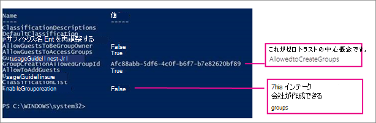

# <a name="manage-who-can-create-microsoft-365-groups"></a>Microsoft 365 グループを作成できるユーザーを管理する

既定では、すべてのユーザーが Microsoft 365 グループを作成できます。 これは、ユーザーが IT の支援を必要とせずにコラボレーションを開始できるため、推奨されるアプローチです。

ビジネスでグループを作成できるユーザーを制限する必要がある場合は、Microsoft 365 グループの作成を特定の Microsoft 365 グループまたはセキュリティ グループのメンバーに制限できます。

ユーザーがビジネス標準に準拠していないチームまたはグループを作成することを懸念している場合は、ユーザーにトレーニング コースを完了するように要求してから、許可されたユーザーのグループに追加することを検討してください。

グループを作成できるユーザーを制限すると、次のようなアクセスをグループに依存するすべてのサービスに影響します。

- Outlook
- SharePoint
- Yammer
- Microsoft Teams
- Microsoft Stream
- Planner
- Power BI (クラシック)
- Web 用 Project / ロードマップ

この記事の手順を実行しても、特定の役割のメンバーがグループを作成できなくなることはありません。 Microsoft 365 グローバル管理者は、Microsoft 365 管理センター、Planner、Exchange、SharePoint を使用してグループを作成できますが、Teams などの他の場所を使用することはできません。 他のロールは、次に示す限られた手段でMicrosoft 365 グループを作成できます。

- Exchange 管理者: Exchange 管理センター、Azure AD
- パートナー レベル 1 のサポート: Microsoft 365 管理センター、Exchange 管理センター、Azure AD
- パートナー レベル 2 のサポート: Microsoft 365 管理センター、Exchange 管理センター、Azure AD
- ディレクトリ製作者: Azure AD
- SharePoint 管理者: SharePoint 管理センター、Azure AD
- Teams サービス管理者: Teams 管理センター、Azure AD
- ユーザー管理者: Microsoft 365 管理センター、Azure AD

これらの役割のいずれかのメンバーである場合は、制限付きユーザーに対して Microsoft 365 グループを作成し、ユーザーをグループの所有者として割り当てることができます。

## <a name="licensing-requirements"></a>ライセンスの要件

グループを作成するユーザーを管理するには、次のユーザーに Azure AD Premium ライセンスまたは Azure AD Basic EDU ライセンスが割り当てられている必要があります。

- これらのグループ作成の設定を管理している管理者
- グループの作成が許可されているグループのメンバー

> [!NOTE]
> Azure ライセンスを割り当てる方法の詳細については、「[Azure Active Directory ポータルでライセンスを割り当てる、または削除する](/azure/active-directory/fundamentals/license-users-groups)」を参照してください。

以下のユーザーは Azure AD Premium ライセンスまたは Azure AD Basic EDU のライセンスが割り当てられている必要はありません。

- Microsoft 365 グループのメンバーであり、他のグループを作成できないユーザー。

## <a name="step-1-create-a-group-for-users-who-need-to-create-microsoft-365-groups"></a>手順 1: Microsoft 365 グループを作成する必要があるユーザーのグループを作成する

組織内の 1 つのグループのみを使用して、Microsoft 365 グループを作成できるユーザーを制御できます。 ただし、このグループのメンバーとして、他のグループをネストすることができます。

上記の役割の管理者は、このグループのメンバーである必要はなく、グループを作成することができます。

1. 管理センターで、[[グループ] ページ](https://admin.microsoft.com/adminportal/home#/groups)に移動します。

2. [**グループの追加**] をクリックします。

3. 目的のグループの種類を選びます。 グループの名前は覚えておいてください。 後で必要になります。

4. グループの設定を完了し、グループをメンバー (所有者ではなく) として作成できるようにするユーザーや他のグループを追加します。

詳細については、「[Microsoft 365 管理センターでのセキュリティ グループの作成、編集、または削除](../admin/email/create-edit-or-delete-a-security-group.md)」を参照してください。

## <a name="step-2-run-powershell-commands"></a>手順 2: PowerShell コマンドを実行する

グループレベルのゲスト アクセス設定を変更するには、[Graph 用 Azure Active Directory PowerShell (AzureAD)](/powershell/azure/active-directory/install-adv2) (モジュール名 **AzureADPreview**) のプレビュー バージョンを使用する必要があります。

- 以前に Azure AD PowerShell モジュールのいかなるバージョンもインストールしたことがない場合には、「[Azure AD モジュールのインストール](/powershell/azure/active-directory/install-adv2?preserve-view=true&view=azureadps-2.0-preview)」を参照し、指示に従ってパブリック プレビュー リリースをインストールしてください。

- Azure AD PowerShell モジュール (AzureAD) の 2.0 一般提供バージョンをインストールしている場合には、PowerShell セッションで `Uninstall-Module AzureAD` を実行してアンインストールし、`Install-Module AzureADPreview` を実行してプレビュー バージョンをインストールする必要があります。

- プレビュー バージョンを既にインストールしている場合には、`Update-Module AzureADPreview`を実行しそれがこのモジュールの最新バージョンであることを確認します。

下のスクリプトを、Notepad などのテキスト エディターまたは [Windows PowerShell ISE](/powershell/scripting/components/ise/introducing-the-windows-powershell-ise) にコピーます。

*\<GroupName\>* を、作成したグループの名前に置き換えます。次に例を示します。

`$GroupName = "Group Creators"`

GroupCreators.ps1 としてファイルを保存します。

PowerShell ウィンドウで、ファイルを保存した場所に移動 します ("CD \<FileLocation\>" と入力)。

次のように入力してスクリプトを実行します。

`.\GroupCreators.ps1`

サインインを求められたら、[管理者アカウントでサインイン](../enterprise/connect-to-microsoft-365-powershell.md#step-2-connect-to-azure-ad-for-your-microsoft-365-subscription)します。

```PowerShell
$GroupName = "<GroupName>"
$AllowGroupCreation = $False

Connect-AzureAD

$settingsObjectID = (Get-AzureADDirectorySetting | Where-object -Property Displayname -Value "Group.Unified" -EQ).id
if(!$settingsObjectID)
{
    $template = Get-AzureADDirectorySettingTemplate | Where-object {$_.displayname -eq "group.unified"}
    $settingsCopy = $template.CreateDirectorySetting()
    New-AzureADDirectorySetting -DirectorySetting $settingsCopy
    $settingsObjectID = (Get-AzureADDirectorySetting | Where-object -Property Displayname -Value "Group.Unified" -EQ).id
}

$settingsCopy = Get-AzureADDirectorySetting -Id $settingsObjectID
$settingsCopy["EnableGroupCreation"] = $AllowGroupCreation

if($GroupName)
{
  $settingsCopy["GroupCreationAllowedGroupId"] = (Get-AzureADGroup -SearchString $GroupName).objectid
} else {
$settingsCopy["GroupCreationAllowedGroupId"] = $GroupName
}
Set-AzureADDirectorySetting -Id $settingsObjectID -DirectorySetting $settingsCopy

(Get-AzureADDirectorySetting -Id $settingsObjectID).Values
```

スクリプトの最後の行に、更新された設定が表示されます。



将来、使用するグループを変更する場合は、新しいグループの名前でスクリプトを再実行できます。

グループ作成の制限をオフにして、もう一度すべてのユーザーがグループを作成できるようにするには、$GroupName を "" に、$AllowGroupCreation を "True" に設定して、スクリプトを再実行します。

## <a name="step-3-verify-that-it-works"></a>手順 3: 動作することを確認する

変更が有効になるまでに 30 分以上かかる場合があります。 新しい設定を確認するには、次の操作を行います。

1. グループを作成できないユーザーのアカウントで Microsoft 365 にサインインします。つまり、作成したグループのメンバーまたは管理者ではないユーザーのアカウントを使用します。

2. [**Planner**] タイルを選択します。

3. Planner では、左側のナビゲーションで **[新しいプラン]** を選択してプランを作成します。

4. プランとグループの作成が無効になっていることを示すメッセージが表示されます。

グループのメンバーと同じ手順をもう一度試してください。

> [!NOTE]
> グループのメンバーがグループを作成できない場合は、そのグループが [OWA メールボックス ポリシー](/powershell/module/exchange/set-owamailboxpolicy)によってブロックされていないことを確認します。

## <a name="related-topics"></a>関連項目

[おすすめのコラボレーション ガバナンス計画](collaboration-governance-overview.md#collaboration-governance-planning-recommendations)

[コラボレーション ガバナンス計画を作成する](collaboration-governance-first.md)

[Office 365 PowerShell の概要](../enterprise/getting-started-with-microsoft-365-powershell.md)

[セルフサービス グループ管理に必要な Azure Active Directory の設定](/azure/active-directory/users-groups-roles/groups-self-service-management)

[ExecutionPolicy の設定](/powershell/module/microsoft.powershell.security/set-executionpolicy)

[グループ設定を構成するための Azure Active Directory コマンドレット](/azure/active-directory/users-groups-roles/groups-settings-cmdlets)
