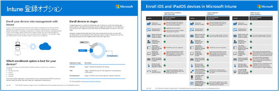

# 手順 2。 デバイスを Intune に登録する

エンドポイントを保護する方法はいくつかあります。この用語は、デバイス、アプリ、ユーザー ID などの結合されたエンティティを指すためによく使用されます。 セキュリティ ポリシーは、アプリだけでなくデバイス自体にも一貫して確実に適用する必要があります。 デバイスを Intune に登録し、Azure Active Directory などのクラウド ID プロバイダーに登録することは素晴らしいスタートです。

デバイスが個人所有の BYOD デバイスでも、企業所有の完全に管理されたデバイスでも、組織のリソースにアクセスするエンドポイントを可視化し、正常で準拠したデバイスのみを許可するようにすることをお勧めします。 これには、エンドポイントで実行されるモバイル アプリとデスクトップ アプリの正常性と信頼性が含まれます。 これらのアプリが正常で準拠していること、および悪意のある意図や偶発的な手段によって企業データがコンシューマー アプリやサービスに漏洩するのを防ぐ必要があります。

デバイス登録プロセスは、ユーザー、デバイス、および Microsoft Intune サービス間の関係を確立します。 Microsoft Intune をスタンドアロン サービスとして使用すると、単一の Web ベースの管理コンソールを使用して、Windows PC、macOS、および最も一般的なモバイル デバイス プラットフォームを管理できます。

この記事では、デバイスを Intune に登録する方法を推奨しています。これらのメソッドと各メソッドの展開方法の詳細については、「[展開ガイダンス: Microsoft Intune にデバイスを登録する](/mem/intune/fundamentals/deployment-guide-enrollment)」を参照してください。

この記事のガイダンスは、この図に示す各プラットフォームの登録オプションと共に使用してください。 

   [PDF](https://download.microsoft.com/download/e/6/2/e6233fdd-a956-4f77-93a5-1aa254ee2917/msft-intune-enrollment-options.pdf) | [Visio](https://download.microsoft.com/download/e/6/2/e6233fdd-a956-4f77-93a5-1aa254ee2917/msft-intune-enrollment-options.vsdx)   更新日: 2022 年 6 月

## Windows の登録
Windows 10 および Windows 11 デバイスを登録するためのいくつかのオプションがあります。 最も一般的な方法には、次の 2 つがあります。

- Azure Active Directory (Azure AD) 参加 - デバイスを Azure Active Directory に参加させ、ユーザーが Azure AD 資格情報を使用して Windows にサインインできるようにします。 自動登録が有効になっている場合、デバイスは自動的に Intune に登録されます。 自動登録の利点は、ユーザーの単一ステップ プロセスです。 それ以外の場合、MDM の登録のみで個別に登録し、資格情報を再入力する必要があります。 ユーザーは、[設定] からまたは最初の Windows OOBE 時に、この方法で登録します。 このデバイスは、Intune で企業所有のデバイスとしてマークされています。
- Autopilot - Azure AD 参加を自動化し、企業所有の新しいデバイスをIntuneに登録します。 この方法により、すぐに使用できるエクスペリエンスが簡素化され、カスタム オペレーティング システム イメージをデバイスに適用する必要がなくなります。 管理者が Intune を使用して Autopilot デバイスを管理する場合、管理者は登録後にポリシー、プロファイル、アプリなどを管理できます。 Autopilot 展開には、自己展開モード (キオスク、デジタル サイネージ、または共有デバイス用)、ユーザー駆動モード (従来のユーザー用)、事前プロビジョニングされた展開用の Windows Autopilot の 4 つのタイプがあり、パートナーまたは IT スタッフは事前プロビジョニングできます。 Windows 10 または Windows 11 を実行している PC で完全に構成され、ビジネスに対応できるようになります。既存のデバイスの自動操縦により、最新バージョンの Windows を既存のデバイスに簡単に展開できます。

BYOD Windows デバイスの登録などの追加オプションについては、「[Windows デバイス向け Intune 登録メソッド](/mem/intune/fundamentals/deployment-guide-enrollment-windows)」を参照してください。

## iOS および iPadOS の登録

ユーザー所有 (BYOD) デバイスの場合、次のいずれかの方法を使用して、ユーザーが個人用デバイスを Intune に登録できるようにすることができます。
- デバイスの登録は、一般的な BYOD 登録と考えられます。 これにより、管理者は幅広い管理オプションを使用できるようになります。
- ユーザー登録は、管理者にデバイス管理オプションのサブセットを提供する、より合理化された登録プロセスです。この機能は現在プレビューの段階です。

ユーザー用にデバイスを購入する組織の場合、Intune は次の iOS / iPadOS 会社所有のデバイス登録方法をサポートしています。
- Apple の自動デバイス登録 (ADE)
- Apple School Manager
- Apple Configurator セットアップ アシスタントでの登録
- Apple Configurator の直接登録

詳細については「[iOS/iPadOS デバイスを Intune に登録する](/mem/intune/fundamentals/deployment-guide-enrollment-ios-ipados)」を参照してください。

## Android の登録 

Android の登録には、デバイスの種類、サポートする登録の種類、使用している Android のバージョン、さらにはメーカー (特に、Samsung) などに応じていくつかのオプションがあります。ほとんどの組織は、特に BYOD シナリオで、エンド ユーザーに Android Work プロファイルを使用しています。 

Android Work Profile を使用すると、エンドユーザーの情報は、データコンテナーと、仕事用と個人用の別々のアプリで明確に分離されます。 これは、ユーザーが自分のデータのプライバシーと企業データのセキュリティを維持しながら、デバイスを登録するための理想的な方法です。 

ただし、組織が Android デバイスを提供している場合は、完全に管理された (User Affinity) または専用 (ユーザー アフィニティなし) デバイスと呼ばれるデバイスを使用することもできます。

Android の登録と自動化された Android の登録の詳細については、「[Android デバイスの登録](/mem/intune/fundamentals/deployment-guide-enrollment-android)」を参照してください。

## macOS の登録

macOS への登録は、多くの IT 組織にとって難しい問題になる可能性があります。 ユーザーの大多数が Mac ユーザーでない限り、これらのタイプのデバイスを大幅に管理していない可能性があります。 macOS ユーザーの数が少ない場合は、Intune のみの登録をお勧めします。 macOS ユーザーが多数いる場合は、Intune + Jamf 登録をお勧めします。  
- Intune のみ登録 — これは macOS デバイスの基本的な管理用です。 他のほとんどのユーザー ベースの登録オプションと同様に、手動プロセスが必要になります。 ただし、Mac デバイスの数が少ない場合は、それらの少数のユーザー専用に自動化されたインフラストラクチャ全体をセットアップするよりも簡単な場合があります。 Intune のみの登録では、証明書、パスワード構成、アプリケーションなどを展開できます。 また、コンプライアンス ポリシーを構成し、条件付きアクセスを啓蒙するだけでなく、暗号化とデバイス ワイプを実施する機能も提供できます。 
- Intune と Jamf の登録 — Mac 管理の最も深いサポートを探している人のために、Jamf + Intune for Conditional Access を使用して、Jamf の広範な Mac 管理機能と Intune コンプライアンスを組み合わせて条件付きアクセスを有効にする優れたソリューションを提供します。 このシナリオでは、セキュリティを強化するためにJamfからこれらの信号を取得できる一方で、Jamf を使用してデバイスを完全に管理しています。

macOS登録の詳細については、「[Intune での macOS デバイスの登録の設定](/mem/intune/fundamentals/deployment-guide-enrollment-macos)」を参照してください。

## 次の手順

「[3. Intune を使用するデバイスのコンプライアンス ポリシーを設定する](manage-devices-with-intune-compliance-policies.md)」に進みます。

