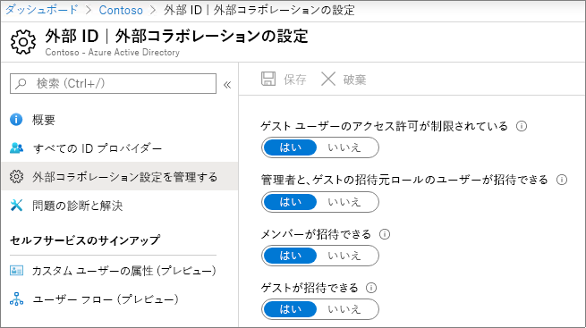
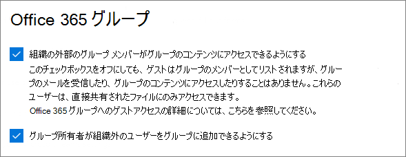
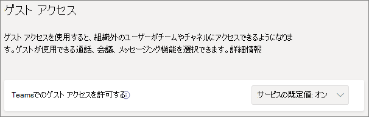
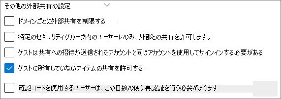
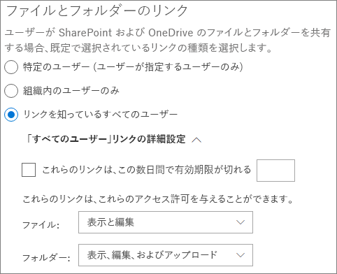
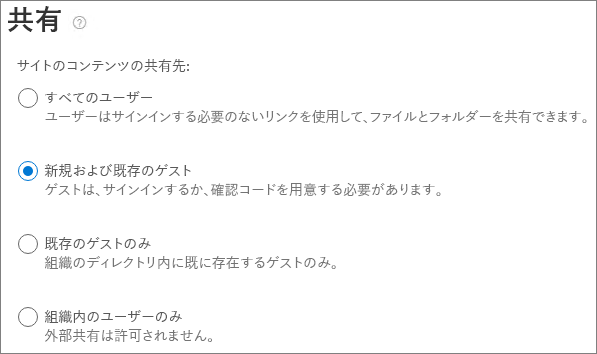
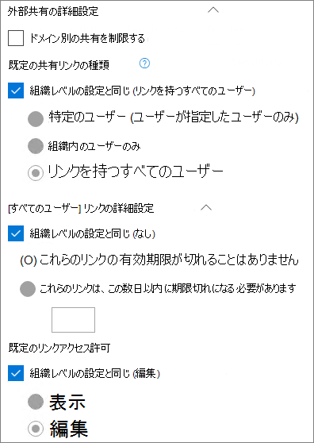

# Microsoft 365 ゲストの共有設定のリファレンスMicrosoft 365 guest sharing settings reference

この記事では、Microsoft 365 のワークロードについて、Teams、Microsoft 365 グループ、SharePoint、OneDrive の組織外のユーザーとの共有に影響を与える可能性のあるさまざまな設定について説明します。This article provides a reference for the various settings that can affect sharing with people outside your organization for the Microsoft 365 workloads: Teams, Microsoft 365 Groups, SharePoint, and OneDrive. これらの設定は、Azure Active Directory、Microsoft 365、Teams、および SharePoint 管理センターにあります。These settings are located in the Azure Active Directory, Microsoft 365, Teams, and SharePoint admin centers.

## Azure Active DirectoryAzure Active Directory

**管理者ロール:** グローバル管理者**Admin role:** Global administrator

Azure Active Directory は、Microsoft 365 により使用されるディレクトリ サービスです。Azure Active Directory is the directory service used by Microsoft 365. Azure Active Directory の組織の関係設定は、Teams、Microsoft 365 グループ、SharePoint、OneDrive での共有に直接影響します。The Azure Active Directory Organizational relationships settings directly affect sharing in Teams, Microsoft 365 Groups, SharePoint, and OneDrive.

> [!NOTE]
> これらの設定は、[SharePoint および OneDrive の Azure AD B2B との統合](/sharepoint/sharepoint-azureb2b-integration-preview)が構成された場合にのみ、SharePoint に反映されます。These settings only affect SharePoint when [SharePoint and OneDrive integration with Azure AD B2B](/sharepoint/sharepoint-azureb2b-integration-preview) has been configured. 次の表では、この設定が構成されていることを前提としています。The table below assumes that this has been configured.

### 外部コラボレーションの設定External collaboration settings

**ナビゲーション:** [[Azure Active Directory 管理センター]](https://aad.portal.azure.com) > [Azure Active Directory] > [外部 ID] > [外部コラボレーションの設定]**Navigation:** [Azure Active Directory admin center](https://aad.portal.azure.com) > Azure Active Directory > External Identities > External collaboration settings

| 設定Setting | 既定値Default | 説明Description |
|:-----|:-----|:-----|
|ゲスト ユーザー アクセスGuest user access|ゲスト ユーザーは、ディレクトリ オブジェクトのプロパティとメンバーシップへのアクセスが制限されていますGuest users have limited access to properties and memberships of directory objects|[ゲストが Azure Active Directory で持つアクセス許可](/azure/active-directory/fundamentals/users-default-permissions)を決定します。Determines the [permissions that guests have in Azure Active Directory](/azure/active-directory/fundamentals/users-default-permissions).|
|ゲスト招待設定Guest invite settings|組織内のあらゆるユーザーが、ゲストや管理者以外のユーザーを含むゲスト ユーザーを招待できますAnyone in the organization can invite guest users including guests and non-admins|ゲスト、メンバー、および管理者がゲストを組織に招待できるかどうかを決定します。Determines whether guests, members, and admins can invite guests to the organization. 
 この設定は、Teams や SharePoint などの Microsoft 365 共有エクスペリエンスに影響します。This setting affects  Microsoft 365 sharing experiences such as Teams and SharePoint.|
|ユーザー フロー経由でゲストのセルフ サービスのサインアップを有効にするEnable guest self-service sign up via user flows|いいえNo|作成したアプリに誰かがサインアップして新しいゲスト アカウントを作成できるようにするユーザー フローを作成できるかどうかを決定します。Determines if you can create user flows that allow someone to sign up for an app that you created and create a new guest account.|
|共同作業における制限事項Collaboration restrictions|招待を任意のドメインに送信することを許可するAllow invitations to be sent to any domain|この設定では、共有するドメインの許可またはブロックのリストを指定できます。This setting allows you to specify a list of allowed or blocked domains for sharing. 許可されたドメインを指定すると、共有の招待をそのドメインにのみ送信できます。When allowed domains are specified, then sharing invitations can only be sent to those domains. 拒否されたドメインを指定すると、共有の招待はそのドメインに送信できません。When denied domains are specified, then sharing invitations cannot be sent to those domains. 
 この設定は、Teams や SharePoint などの Microsoft 365 共有エクスペリエンスに影響します。This setting affects  Microsoft 365 sharing experiences such as Teams and SharePoint. SharePoint と Teams でドメインのフィルタリングを使用して、より詳細にドメインを許可したりブロックしたりできます。You can allow or block domains at a more granular level by using domain filtering in SharePoint or Teams.|

これらの設定は、ユーザーがディレクトリに招待される方法に影響します。These settings affect how users are invited to the directory. ディレクトリにすでに存在しているゲストとの共有には影響しません。They do not affect sharing with guests who are already in the directory.

## Microsoft 365Microsoft 365

**管理者ロール:** グローバル管理者**Admin role:** Global administrator

Microsoft 365 管理センターには、共有および Microsoft 365 グループ用の組織レベル設定があります。The Microsoft 365 admin center has organization-level settings for sharing and for Microsoft 365 Groups.

### 共有Sharing

**ナビゲーション:** [Microsoft 365 管理センター](https://admin.microsoft.com) > [設定] > [組織の設定] > [セキュリティとプライバシー] タブ > [共有]**Navigation:** [Microsoft 365 admin center](https://admin.microsoft.com) > Settings > Org Settings > Security & privacy tab > Sharing

| 設定Setting | 既定値Default | 説明Description |
|:-----|:-----|:-----|
|ユーザーが組織に新しいゲストを追加できるようにするLet users add new guests to the organization|オンOn|**[はい]** に設定すると、Azure AD メンバーは Azure AD を使用してゲストを招待できます。**[いいえ]** に設定すると招待できません。When set to **Yes**, Azure AD members can invite guests via Azure AD; when set to **No**, they cannot. **[はい]** に設定すると、Microsoft 365 グループのメンバーは所有者の承認を受けているゲストを招待できます。**[いいえ]** に設定すると、Microsoft 365 グループのメンバーは所有者の承認を受けているゲストを招待できますが、所有者が承認するにはグローバル管理者でなければなりません。When set to **Yes**, Microsoft 365 Group members can invite guests with owner approval; when set to **No**, Microsoft 365 Group members can invite guests with owner approval but owners must be global administrators to approve. 
 **[メンバーが招待できる]** は、(ゲストではなく) Azure AD のメンバーを参照し、Microsoft 365 のサイトまたはグループ メンバーを参照しない点に注意してください。Note that **Members can invite** refers to members in Azure AD (as opposed to guests) and not to site or group members in  Microsoft 365. 
 これは、Azure Active Directory の組織の関係設定で **[メンバーが招待できる]** 設定と同じです。This is identical to the **Members can invite** setting in Azure Active Directory Organizational relationships settings.|

### Microsoft 365 グループMicrosoft 365 Groups

**ナビゲーション:**[Microsoft 365 管理センター](https://admin.microsoft.com) > [設定] > [設定] > [Microsoft 365 グループ]**Navigation:** [Microsoft 365 admin center](https://admin.microsoft.com) > Settings > Settings > Microsoft 365 Groups

| 設定Setting | 既定値Default | 説明Description |
|:-----|:-----|:-----|
|組織の外部のグループ メンバーがグループのコンテンツにアクセスできるようにするLet group members outside your organization access group content|オンOn|**[オン]** に設定すると、ゲストはグループのコンテンツにアクセスできます。**[オフ]** に設定するとアクセスできません。When set to **On**, guests can access groups content; when set to **Off**, they can't. この設定は、ゲストが Microsoft 365 グループまたは Teams と連携している場合に **[オン]** にしてください。This setting should be **On** for any scenario where guests are interacting with Microsoft 365 Groups or Teams.|
|グループ所有者が組織外のユーザーをグループに追加できるようにするLet group owners add people outside your organization to groups|オンOn|**[オン]** の場合、Microsoft 365 グループ または Teams の所有者は新しいゲストをグループに招待できます。When **On**, Owners of Microsoft 365 Groups or Teams can invite new guests to the group. **[オフ]** の場合、所有者はディレクトリ内にすでに存在しているゲストのみを招待できます。When **Off**, owners can only invite guests who are already in the directory.|

これらを、組織レベルで設定できます。These settings are at the organization level. PowerShell を使用し、グループ レベルでこれらの設定を変更する方法の詳細については、「[特定のグループに対する設定を作成する](/azure/active-directory/users-groups-roles/groups-settings-cmdlets#create-settings-for-a-specific-group)」を参照してください。See [Create settings for a specific group](/azure/active-directory/users-groups-roles/groups-settings-cmdlets#create-settings-for-a-specific-group) for information about how to change these settings at the group level by using PowerShell.

## TeamsTeams

Teams のマスター ゲスト アクセスのスイッチである **[Teams でのゲスト アクセスを許可する]** を **[オン]** にして、他のゲスト設定を選択できるようにする必要があります。The Teams master guest access switch, **Allow guest access in Teams**, must be **On** for the other guest settings to be available.

**管理者ロール:** Teams サービス管理者**Admin role:** Teams service administrator

### ゲスト アクセスGuest access

**ナビゲーション:** [[Teams 管理センター]](https://admin.teams.microsoft.com) > [組織全体の設定] > [ゲスト アクセス]**Navigation:** [Teams admin center](https://admin.teams.microsoft.com) > Org-wide settings > Guest access

| 設定Setting | 既定値Default | 説明Description |
|:-----|:-----|:-----|
|Teams でのゲスト アクセスを許可するAllow guest access in Teams|オフOff|Teams 全体でゲスト アクセスをオンまたはオフにします。Turns guest access on or off for Teams overall. この設定は、一度変更し反映されるのに 24 時間かかることがあります。This setting can take 24 hours to take effect once changed.|

### ゲスト通話Guest calling

**ナビゲーション:** [[Teams 管理センター]](https://admin.teams.microsoft.com) > [組織全体の設定] > [ゲスト アクセス]**Navigation:** [Teams admin center](https://admin.teams.microsoft.com) > Org-wide settings > Guest access

| 設定Setting | 既定値Default | 説明Description |
|:-----|:-----|:-----|
|プライベート通話をするMake private calls|オンOn|**[オン]** の場合、ゲストは Teams でピアツーピアの通話を行うことができます。**[オフ]** の場合は通話できません。When **On**, guests can make peer-to-peer calls in Teams; when **Off**, they can't.|

### ゲスト会議Guest meeting

**ナビゲーション:** [[Teams 管理センター]](https://admin.teams.microsoft.com) > [組織全体の設定] > [ゲスト アクセス]**Navigation:** [Teams admin center](https://admin.teams.microsoft.com) > Org-wide settings > Guest access

| 設定Setting | 既定値Default | 説明Description |
|:-----|:-----|:-----|
|IP のビデオを許可するAllow IP video|オンOn|**[オン]** の場合、ゲストは通話と会議でビデオを使用できます。**[オフ]** の場合は使用できません。When **On**, guests can use video in their calls and meetings; when **Off**, they can't.|
|画面共有モードScreen sharing mode|画面全体Entire screen|**[無効]** にすると、ゲストは Teams で画面を共有できません。When **Disabled**, guests can't share their screens in Teams. **[1 つのアプリケーション]** に設定すると、ゲストは画面上でアプリケーションを 1 つのみ共有できます。When set to **Single application**, guests can only share a single application on their screen. **[画面全体]** に設定すると、ゲストはアプリケーションまたは画面全体を共有するよう選択できます。When set to **Entire screen**, guests can choose to share an application or their entire screen.|
|[会議の開始] を許可するAllow Meet Now|オンOn|**[オン]** の場合、ゲストは Teams で [会議の開始] 機能を使用できます。**[オフ]** の場合は使用できません。When **On**, guests can use the Meet Now feature in Teams; when **Off**, they can't.|

### ゲスト メッセージングGuest messaging

**ナビゲーション:** [[Teams 管理センター]](https://admin.teams.microsoft.com) > [組織全体の設定] > [ゲスト アクセス]**Navigation:** [Teams admin center](https://admin.teams.microsoft.com) > Org-wide settings > Guest access

| 設定Setting | 既定値Default | 説明Description |
|:-----|:-----|:-----|
|送信済みメッセージを編集するEdit sent messages|オンOn|**[オン]** の場合、ゲストは以前に送信したメッセージを編集できます。**[オフ]** の場合は編集できません。When **On**, guests can edit messages they previously sent; when **Off**, they can't.|
|送信済みメッセージを削除するDelete sent messages|オンOn|**[オン]** の場合、ゲストは以前に送信したメッセージを削除できます。**[オフ]** の場合は削除できません。When **On**, guests can delete messages they previously sent; when **Off**, they can't.|
|チャットChat|オンOn|**[オン]** の場合、ゲストは Teams でチャット機能を使用できます。**[オフ]** の場合は使用できません。When **On**, guests can use chat in Teams; when **Off**, they can't.|
|会話で Giphy を使用するUse Giphys in conversations|オンOn|**[オン]** の場合、ゲストは会話で Giphy を使用できます。**[オフ]** の場合は使用できません。When **On**, guests can use Giphys in conversations; when **Off**, they can't.|
|Giphy コンテンツの評価Giphy content rating|中Moderate|**[すべてのコンテンツを許可]** に設定すると、ゲストはコンテンツ評価に関係なく、すべての Giphy をチャットに挿入できるようになります。When set to **Allow all content**, guests will can insert all Giphys in chats, regardless of the content rating. **[中]** に設定すると、ゲストは Giphy をチャットに挿入できますが、成人向けコンテンツの挿入についてはある程度制限されます。When set to **Moderate** guests can insert Giphys in chats, but will be moderately restricted from adult content. **[高]** に設定すると、ゲストは Giphy をチャットに挿入できますが、成人向けコンテンツの挿入については制限されます。When set to **Strict** guests can insert Giphys in chats, but will be restricted from inserting adult content.|
|会話でミームを使用するUse Memes in conversations|オンOn|**[オン]** の場合、ゲストは会話でミームを使用できます。**[オフ]** の場合は使用できません。When **On**, guests can use memes in conversations; when **Off**, they can't.|
|会話でステッカーを使用するUser stickers in conversations|オンOn|**[オン]** の場合、ゲストは会話でステッカーを使用できます。**[オフ]** の場合は使用できません。When **On**, guests can use stickers in conversations; when **Off**, they can't.|
|イマーシブ リーダーがメッセージを表示するのを許可するAllow immersive reader for viewing messages|オンOn|**[オン]** の場合、ゲストはイマーシブ リーダーでメッセージを表示できます。**[オフ]** の場合は表示できません。When **On**, guests can view messages in Immersive Reader; when **Off**, they can't.|

## SharePoint と OneDrive (組織レベル)SharePoint and OneDrive (organization-level)

**管理者ロール:** SharePoint 管理者**Admin role:** SharePoint administrator

これらの設定は組織のすべてのサイトに影響します。These settings affect all of the sites in the organization. Microsoft 365 グループや Teams には直接影響しませんが、これらの設定を Microsoft 365 グループ と Teams の設定に合わせて、ユーザー エクスペリエンスの問題を回避することをお勧めします。They do not affect Microsoft 365 Groups or Teams directly, however we recommend that you align these settings with the settings for Microsoft 365 Groups and Teams to avoid user experience issues. (たとえば、ゲスト共有が SharePoint ではなく Teams で許可されている場合、Teams ファイルは SharePoint に保存されているため、Teams のゲストは [ファイル] タブにアクセスできません)。(For example, if guest sharing is allowed in Teams but not SharePoint, then guests in Teams will not have access to the Files tab because Teams files are stored in SharePoint.)

### SharePoint と OneDrive の共有設定SharePoint and OneDrive sharing settings

OneDrive はSharePoint のサイトの階層であるため、組織レベルの共有設定は、他の SharePoint サイトに影響するように OneDrive に直接影響します。Because OneDrive is a hierarchy of sites within SharePoint, the organization-level sharing settings directly affect OneDrive just as they do other SharePoint sites.

**ナビゲーション:** [SharePoint 管理センター] > [共有]**Navigation:** SharePoint admin center > Sharing

| 設定Setting | 既定値Default | 説明Description |
|:-----|:-----|:-----|
|SharePointSharePoint|すべてのユーザーAnyone|SharePoint サイトで許可されている制限が最も少ない共有アクセス許可を指定します。Specifies the most permissive sharing permissions allowed for SharePoint sites.|
|OneDriveOneDrive|すべてのユーザーAnyone|OneDrive サイトで許可されている制限が最も少ない共有アクセス許可を指定します。Specifies the most permissive sharing permissions allowed for OneDrive sites. この設定は SharePoint の設定よりも制限を少なくすることはできません。This setting cannot be more permissive than the SharePoint setting.|

### SharePoint と OneDrive の詳細な共有設定SharePoint and OneDrive advanced sharing settings

**ナビゲーション:** [SharePoint 管理センター] > [共有]**Navigation:** SharePoint admin center > Sharing

| 設定Setting | 既定値Default | 説明Description |
|:-----|:-----|:-----|
|ドメインごとに外部共有を制限するLimit external sharing by domain|オフOff|この設定では、共有するドメインの許可またはブロックのリストを指定できます。This setting allows you to specify a list of allowed or blocked domains for sharing. 許可されたドメインを指定すると、共有の招待をそのドメインにのみ送信できます。When allowed domains are specified, then sharing invitations can only be sent to those domains. 拒否されたドメインを指定すると、共有の招待はそのドメインに送信できません。When denied domains are specified, then sharing invitations cannot be sent to those domains. 
 この設定は、組織内のすべての SharePoint サイトと OneDrive サイトに影響します。This setting affects all SharePoint and OneDrive sites in the organization.|
|特定のセキュリティ グループ内のユーザーにのみ、外部との共有を許可するAllow only users in specific security groups to share externally|オフOff|SharePoint と OneDrive のゲストと共有できるユーザーを制限する場合は、指定したセキュリティ グループ内のユーザーへの共有を制限することで行うことができます。If you want to limit who can share with guests in SharePoint and OneDrive, you can do so by limiting sharing to people in specified security groups. これらの設定は、Microsoft 365 グループまたは Teams による共有には影響しません。These settings do not affect sharing via Microsoft 365 Groups or Teams. グループまたはチーム経由で招待されたゲストも、関連サイトにアクセスできます。ただし、ドキュメントとフォルダーの共有は、指定したセキュリティ グループのユーザーのみが行うことができます。Guests invited via a group or team would also have access to the associated site, though document and folder sharing could only be done by people in the specified security groups. 
 指定したグループごとに、[すべてのユーザー] リンクと共有できるユーザーを選択できます。For each specified group, you can choose which of those users can share with Anyone links.|
|ゲストは共有への招待が送信されたアカウントと同じアカウントを使用してサインインする必要があるGuests must sign in using the same account to which sharing invitations are sent|オフOff|招待の送信先とは別のメールアドレスを使用して、ゲストがサイト共有の招待を交換しないようにします。Prevents guests from redeeming site sharing invitations using a different email address than the invitation was sent to. 
 [SharePoint および OneDrive の Azure AD B2B (プレビュー) との統合](/sharepoint/sharepoint-azureb2b-integration-preview)では、招待の送信先のメールアドレスに基づいてすべてのゲストがディレクトリに追加されるため、この設定は使用されません。[SharePoint and OneDrive integration with Azure AD B2B (Preview)](/sharepoint/sharepoint-azureb2b-integration-preview) does not use this setting because all guests are added to the directory based on the email address that the invitation was sent to. 代わりのメールアドレスは、サイトにアクセスする際に使用できません。Alternate email addresses cannot be used to access the site.|
|ゲストに所有していないアイテムの共有を許可するAllow guests to share items they don't own|オンOn|**[オン]** の場合、ゲストは他のユーザーやゲストと自分が所有していないアイテムを共有できます。**[オフ]** の場合は共有できません。When **On**, guests can share items that they don't own with other users or guests; when **Off** they cannot. ゲストは常にフル コントロールのあるアイテムを共有できます。Guests can always share items for which they have full control.|
|認証コードを使用するユーザーに、再認証を要求するまでの日数People who use a verification code must reauthenticate after this many days|オフOff|この設定により、ワンタイム パスコードで認証するユーザーが特定の日数後に再認証する必要があることを要求できます。This setting allows you to require that users authenticating with a one-time passcode need to reauthenticate after a certain number of days.|

### SharePoint と OneDrive のファイルとフォルダーのリンク設定SharePoint and OneDrive file and folder link settings

SharePoint と OneDrive でファイルとフォルダーを共有すると、共有の受信者はファイルまたはフォルダーに直接アクセスできるようになるのではなく、ファイルまたはフォルダーへのアクセス許可のリンクが送信されます。When files and folders are shared in SharePoint and OneDrive, sharing recipients are sent a link with permissions to the file or folder rather than being granted direct access to the file or folder themselves. リンクにはいくつかの種類があり、ユーザーがファイルまたはフォルダーを共有するときに表示される既定のリンクの種類を選択できます。Several types of links are available, and you can choose the default link type presented to users when they share a file or folder. また、*すべてのユーザー* のリンクのアクセス許可と有効期限のオプションを設定することもできます。You can also set permissions and expiration options for *Anyone* links.

**ナビゲーション:** [SharePoint 管理センター] > [共有]**Navigation:** SharePoint admin center > Sharing

| 設定Setting | 既定値Default | 説明Description |
|:-----|:-----|:-----|
|ファイルとフォルダーのリンクFile and folder links|リンクを知っているすべてのユーザーAnyone with the link|ユーザーがファイルまたはフォルダーを共有するときに、既定で表示される共有リンクを指定します。Specifies which sharing link is shown by default when a user shares a file or folder. ユーザーは必要に応じて、共有する前にオプションを変更できます。Users can change the option before sharing if they want. 既定値が **[リンクを知っているすべてのユーザー]** に設定されており、*[すべてのユーザー]* の共有が特定のサイトで許可されていない場合は、**組織内のユーザーのみ** がそのサイトの既定値として表示されます。If the default is set to **Anyone with the link** and *Anyone* sharing is not allowed for a given site, then **Only people in your organization** will be shown as the default for that site.|
|これらのリンクは指定された日数以内に有効期限が切れるThese links must expire within this many days|オフ (有効期限なし)Off (no expiration)|*[すべてのユーザー]* のリンクが作成されてから期限切れになるまでの日数を指定します。Specifies the number of days after an *Anyone* link is created that it expires. 期限切れのリンクは更新できません。Expired links cannot be renewed. 期限が切れた後も共有を続ける必要がある場合は、新しいリンクを作成します。Create a new link if you need to continue sharing past the expiration.|
|ファイルのアクセス許可File permissions|表示と編集View and edit|ユーザーが *[すべてのユーザー]* のリンクを作成するときに使用できるファイルのアクセス許可のレベルを指定します。Specifies the file permission levels available to users when creating an *Anyone* link. **[表示]** が選択されている場合、ユーザーは、表示のアクセス許可のある *[すべてのユーザー]* ファイルのリンクのみを作成できます。If **View** is selected, then users can only create *Anyone* file links with view permissions. **[表示と編集]** が選択されている場合、ユーザーはリンクを作成するときに、[表示] と [表示と編集] のアクセス許可の中から選択できます。If **View, and edit** is selected, then users can choose between view and view and edit permissions when they create the link.|
|フォルダーのアクセス許可Folder permissions|表示、編集、およびアップロードView, edit, and upload|ユーザーが *[すべてのユーザー]* のリンクを作成するときに使用できるフォルダーのアクセス許可のレベルを指定します。Specifies the folder permission levels available to users when creating an *Anyone* link. **[表示]** が選択されている場合、ユーザーは、表示のアクセス許可のある *[すべてのユーザー]* フォルダーのリンクのみを作成できます。If **View** is selected, then users can only create *Anyone* folder links with view permissions. **[表示、編集、およびアップロード]** が選択されている場合、ユーザーはリンクを作成するときに、[表示] と [表示、編集、およびアップロード] のアクセス許可の中から選択できます。If **View, edit, and upload** is selected, then users can choose between view and view, edit, and upload permissions when they creat the link.|

## SharePoint (サイト レベル)SharePoint (site level)

**管理者ロール:** SharePoint 管理者**Admin role:** SharePoint administrator

これらの設定は SharePoint における組織全体の設定の対象になるため、組織レベルの設定が変更された場合は、サイトで有効な共有設定が変更される可能性があります。Because these settings are subject to the organization-wide settings for SharePoint, the effective sharing setting for the site may change if the organization-level setting changes. ここで設定を選択し、組織レベルがより制限の多い値に設定された場合、このサイトはその制限の多い値で動作します。If you choose a setting here and the organization-level is later set to a more restrictive value, then this site will operate at that more restrictive value. たとえば、**[すべてのユーザー]** を選択した後に、組織レベルの設定を **[新規および既存のゲスト]** に設定した場合、このサイトでは新規および既存のゲストのみが許可されます。For example, if you choose **Anyone** and the organization-level setting is later set to **New and existing guests**, then this site will only allow new and existing guests. 組織レベルの設定を **[すべてのユーザー]** に戻すと、このサイトでは *[すべてのユーザー]* のリンクが再度許可されます。If the organization-level setting is then set back to **Anyone**, this site would again allow *Anyone* links.

### サイトの共有Site sharing

SharePoint の各サイトにゲストの共有のアクセス許可を設定できます。You can set guest sharing permissions for each site in SharePoint. この設定は、サイトの共有と、ファイルとフォルダーの共有の両方に適用されますThis setting applies to both site sharing and file and folder sharing. (*[すべてのユーザー]* の共有はサイトの共有には利用できません)。(*Anyone* sharing is not available for site sharing. **[すべてのユーザー]** を選択した場合、ユーザーは *[すべてのユーザー]* のリンクを使用してファイルとフォルダーを、新規および既存のゲストとはサイト自体を共有できます)。If you choose **Anyone**, users will be able to share files and folders by using *Anyone* links, and the site itself with new and existing guests.)

サイトに機密ラベルが適用されている場合、そのラベルが外部共有設定を制御する場合があります。If the site has a sensitivity label applied, that label may control the external sharing settings. 詳細については、「[機密ラベルを使用して、Microsoft Teams、Office 365 グループ、SharePoint サイトのコンテンツを保護する](../compliance/sensitivity-labels-teams-groups-sites.md)」 をご覧ください。For more information, see [Use sensitivity labels to protect content in Microsoft Teams, Microsoft 365 groups, and SharePoint sites](../compliance/sensitivity-labels-teams-groups-sites.md).

**ナビゲーション:** SharePoint 管理センター > [アクティブなサイト] > サイトを選択 > [ポリシー] タブ > [外部共有の編集]**Navigation:** SharePoint admin center > Active sites > select the site > Policies tab > Edit External sharing

| 設定Setting | 既定値Default | 説明Description |
|:-----|:-----|:-----|
|サイトのコンテンツの共有先Site content can be shared with|サイトの種類によって異なります (次の表を参照してください)Varies by site type (see the table below)|このサイトに許可されている外部共有の種類を示します。Indicates the type of external sharing allowed for this site. ここで使用できるオプションは、SharePoint における組織レベルの共有設定の対象です。Options available here are subject to the organization-level sharing settings for SharePoint.|

### サイトのファイルとフォルダーのリンク設定Site file and folder link settings

リンクの種類とアクセス許可の既定値と、各サイトの [*すべてのユーザー*] リンクの有効期限を設定できます。You can set defaults for link type and permissions, and expiration settings for *Anyone* links for each site. サイト レベルで設定した場合、これらの設定は組織レベルの設定に優先します。When set at the site level, these settings override the organization-level settings. [*すべてのユーザー*] リンクが組織レベルで無効に設定されている場合、[*すべてのユーザー*] はサイト レベルで使用可能なリンクの種類として含まれません。Note that if *Anyone* links are disabled at the organization level, *Anyone* will not be an available link type at the site level.

**ナビゲーション:** SharePoint 管理センター > [アクティブなサイト] > サイトを選択 > [ポリシー] タブ > [外部共有の編集]**Navigation:** SharePoint admin center > Active sites > select the site > Policies tab > Edit External sharing

| 設定Setting | 既定値Default | 説明Description |
|:-----|:-----|:-----|
|ドメイン共有を制限するLimit sharing by domain|オフOff|この設定では、共有するドメインの許可またはブロックのリストを指定できます。This setting allows you to specify a list of allowed or blocked domains for sharing. 許可されたドメインを指定すると、共有の招待をそのドメインにのみ送信できます。When allowed domains are specified, then sharing invitations can only be sent to those domains. 拒否されたドメインを指定すると、共有の招待はそのドメインに送信できません。When denied domains are specified, then sharing invitations cannot be sent to those domains. 
 この設定は、組織レベルまたは Azure AD レベルで設定されているドメインの制限を上書きするためには使用できません。This setting cannot be used to override domain restrictions set at the organization or Azure AD level.|
|既定の共有リンクの種類Default sharing link type|組織レベルの設定と同じSame as organization-level setting|この設定は、このサイトでユーザーに表示される既定の共有リンクを指定するために使用できます。This setting allows you to specify the default sharing link presented to users in this site. [*組織レベルの設定と同じ*] オプションは、組織とサイトの共有設定の組み合わせによって定義されます。The *Same as organization-level setting* option is defined by a combination of organization and site sharing settings.|
|[すべてのユーザー] リンクの詳細設定Advanced settings for Anyone links|組織レベルの設定と同じSame as organization-level setting|このサイトのファイル用に [*すべてのユーザー*] のリンクが作成されてから期限切れになるまでの日数を指定します。Specifies the number of days after an *Anyone* link is created for a file in this site that it expires. 期限切れのリンクは更新できません。Expired links cannot be renewed. 期限が切れた後も共有を続ける必要がある場合は、新しいリンクを作成します。Create a new link if you need to continue sharing past the expiration.|
|既定のリンクのアクセス許可Default link permission|組織レベルの設定と同じSame as organization-level setting|この設定は、このサイトのファイル用に作成された共有リンクの既定のアクセス許可 ([閲覧] または [編集]) を指定するために使用できます。This setting allows you to specify the default permission (View or Edit) for sharing links created for files in this site.|

### 既定のサイト共有設定Default site sharing settings

次の表は、各サイトの種類の既定の共有設定を示しています。The table below shows the default sharing setting for each site type.

| サイトの種類Site type | 既定の共有設定Default sharing setting |
|:-----|:-----|
|クラシックClassic|**組織内のユーザーのみ****Only people in your organization**|
|OneDriveOneDrive|**すべてのユーザー****Anyone**|
|グループに接続されたサイト (チームを含む)Group-connected sites (including Teams)|Microsoft 365 グループの設定の、**[グループ所有者が組織外のユーザーをグループに追加できるようにする]** が **[オン]** の場合、**[新規および既存のゲスト]** になり、オフの場合は **[既存のゲストのみ]** になります。**New and existing guests** if the Microsoft 365 Groups setting **Let group owners add people outside the organization to groups** is **On**; otherwise **Existing guests only**|
|コミュニケーションCommunication|**組織内のユーザーのみ****Only people in your organization**|
|グループのないモダン サイト (#STS3 TeamSite)Modern sites with no group (#STS3 TeamSite)|**組織内のユーザーのみ****Only people in your organization**|

> [!NOTE]
> ルート通信サイト (tenant-name.sharepoint.com) には、**すべてのユーザー** の既定の共有設定があります。The root communication site (tenant-name.sharepoint.com) has a default sharing setting of **Anyone**.

## 関連項目See also

[SharePoint と OneDrive の外部共有の概要SharePoint and OneDrive external sharing overview](/sharepoint/external-sharing-overview)

[Microsoft Teams でのゲスト アクセスGuest access in Microsoft Teams](/MicrosoftTeams/guest-access)

[Microsoft 365 グループへのゲストの追加Adding guests to Microsoft 365 Groups](https://support.office.com/article/bfc7a840-868f-4fd6-a390-f347bf51aff6)
