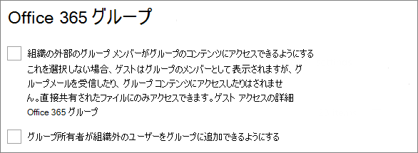
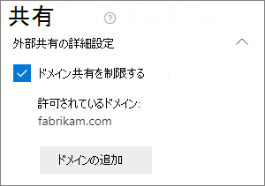
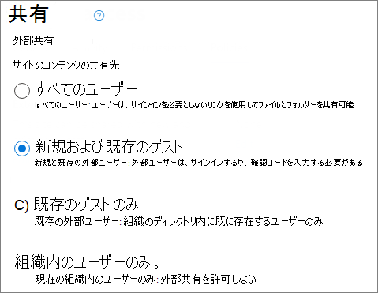

# <a name="limit-sharing-in-microsoft-365"></a>Microsoft 365 の共有を制限する

内部共有を完全に無効にすることや、サイトから [共有] ボタンを削除することはできませんが、組織のニーズを満たすように Microsoft 365 の共有を制限する方法は多数あります。

次の表に、ファイルの共有方法を示します。 詳細については、「**共有方法**」列のリンクをクリックしてください。

|共有方法|説明|制限のオプション|
|:-------------|:----------|:-------------|
|[Microsoft 365 グループまたはチーム](#microsoft-365-group-or-team)|Microsoft Teams チームまたは Microsoft 365 グループへのアクセスを許可されているユーザーは、関連付けられた SharePoint サイトのファイルに対する編集アクセス許可を持ちます。|グループまたはチームがプライベートの場合は、チームに参加するための共有の招待は承認を得るために所有者に回送されます。 管理者は、ゲスト アクセスを無効にするか、秘密度ラベルを使用して、組織の部外者からのアクセスを禁止することができます。|
|[SharePoint サイト](#sharepoint-site)|ユーザーには SharePoint サイトに対する所有者、メンバー、または閲覧者のアクセス権を付与できます。ユーザーは、サイト内のファイルに対して、そのレベルに応じたアクセス権を持ちます。|サイトのアクセス許可は、サイトの所有者のみがサイトの共有を可能にするように制限できます。 管理者は、サイトを読み取り専用に設定するか、アクセスを完全にブロックすることができます。|
|[特定のユーザーとの共有](#sharing-with-specific-people)|サイトのメンバーと編集アクセス許可を持つユーザーは、*特定のユーザー* リンクを使用することで、ファイルおよびフォルダーへの直接のアクセス許可を付与することや共有することができます。|サイトのアクセス許可は、サイトの所有者のみがファイルおよびフォルダーの共有を可能にするように制限できます。 この場合、サイトのメンバーによる直接アクセス権および *特定のユーザー* リンクの共有は、承認を得るためにサイト所有者に回送されます。|
|[SharePoint と OneDrive のゲスト共有](#sharepoint-guest-sharing)|SharePoint サイトの所有者とメンバー、および OneDrive の所有者は、組織外のユーザーとファイルおよびフォルダーを共有できます。|ゲスト共有は組織全体または個別のサイトごとに無効化できます。|
|[*組織内のユーザー* 共有リンク](#people-in-your-organization-sharing-links)|SharePoint サイトの所有者とメンバーは、*組織内のユーザー* リンクを使用することでファイルを共有できます。このリンクは、組織内のすべてのユーザーに対して機能します。|*組織内のユーザー* リンクは、サイト レベルで無効化できます。|
|[サイト、グループ、チームを作成する](#create-sites-groups-and-teams)|既定では、ユーザーはコンテンツを共有できる新しいサイト、グループ、およびチームを作成できます。|管理者は、サイト、グループ、およびチームを作成できるユーザーを制限できます。|
|[電子メール](#email)|ファイルにアクセスできるユーザーは、そのファイルを電子メールで別のユーザーに送信できます。|管理者は、秘密度ラベルを使用してファイルを暗号化することで、許可されていないユーザーとのファイルの共有を防止できます。|
|[ダウンロードまたはファイルのコピー](#download-or-file-copy)|ファイルにアクセスできるユーザーは、ファイルをダウンロードまたはコピーして Microsoft 365 の適用範囲外のユーザーと共有できます。|管理者は、秘密度ラベルを使用してファイルを暗号化することで、許可されていないユーザーとのファイルの共有を防止できます。|

ユーザーが共有コンテンツにアクセスする条件を制限することもできます。 詳細については、この記事で後述する [条件付きアクセス](#conditional-access) を参照してください。

組織内の共有は、この記事で説明する管理者コントロールを使用して制限できますが、安全な共有環境を作成するために Microsoft 365 で使用可能なセキュリティとコンプライアンスの機能を使用することを検討するようお勧めします。詳細については、「[Microsoft 365 による SharePoint のファイルの共同作業](/sharepoint/deploy-file-collaboration)」および「[セキュリティの分離を使用してチームを構成する](secure-teams-security-isolation.md)」を参照してください。

組織内で使用されている共有方法を理解するには、[ファイルとフォルダーの共有に関するレポートを実行](/sharepoint/sharing-reports)してください。

## <a name="microsoft-365-group-or-team"></a>Microsoft 365 グループまたはチーム

Microsoft 365 グループまたは Microsoft Teams チームで共有を制限する場合は、グループまたはチームをプライベートにすることが重要です。 組織内のユーザーは、パブリック グループまたはチームにいつでも参加できます。 グループまたはチームをプライベートにしていないと、チームの共有またはそのファイルの組織内での共有を制限する方法がなくなります。

### <a name="guest-sharing"></a>ゲスト共有

Teams のゲスト アクセスを禁止する場合は、Teams 管理センターでゲスト共有をオフにします。

Teams のゲスト共有をオフにするには
1. Teams 管理センターで、**[組織全体の設定]** > <a href="https://go.microsoft.com/fwlink/p/?linkid=2173122" target="_blank">**[ゲスト アクセス]** タブ</a>を展開します。
2. **[Teams のゲスト アクセスを許可する]** をオフにします。
3. **[保存]** をクリックします。

Microsoft 365 グループのゲスト アクセスを禁止する場合は、Microsoft 365 管理センターでグループのゲスト アクセス設定をオフにします。

Microsoft 365 グループのゲスト共有をオフにするには
1. Microsoft 365 管理センターで、**[設定]** > **[組織の設定]** > <a href="https://go.microsoft.com/fwlink/p/?linkid=2053743" target="_blank">**[サービス]** タブ</a>をクリックします。
2. **[Microsoft 365 グループ]** をクリックします。
3. チェックボックスの **[組織外のグループ メンバーがグループ コンテンツにアクセスできるようにします]** と **[グループの所有者が組織外のユーザーをグループに追加できるようにします]** をオフにします。
4. **[変更の保存]** をクリックします。

    

> [!NOTE]
> 特定のグループまたはチームのゲスト共有を禁止する場合には、[Microsoft PowerShell](per-group-guest-access.md) または [秘密度ラベル](../compliance/sensitivity-labels-teams-groups-sites.md) を使用します。

特定のドメインのユーザーに対するゲスト共有は、Azure Active Directory でドメインを許可またはブロックすることで制限できます。 [SharePoint および OneDrive の Azure AD B2B との統合](/sharepoint/sharepoint-azureb2b-integration-preview)を有効にしている場合、この制限は SharePoint のゲスト共有にも影響します。

特定のドメインからの共有招待状のみを許可するには
1. Azure Active Directory の [概要] ページで、**[組織の関係]** をクリックします。
2. **[設定]** をクリックします。
3. **[コラボレーションの制限]** の下側にある **[指定したドメインのへの招待を拒否します]** または **[指定したドメインに対してのみ招待を許可します]** を選択して、その設定に使用するドメインを入力します。
4. **[保存]** をクリックします。

    ![Azure Active Directory の [コラボレーションの制限] 設定のスクリーンショット。](../media/azure-ad-allow-only-specified-domains.png)

## <a name="sharepoint-site"></a>SharePoint サイト

SharePoint サイトの共有は、サイト所有者のみに制限できます。 これにより、サイト メンバーはサイトの共有ができなくなります。 サイトが Microsoft 365 グループに接続されていると、グループ メンバーは別のユーザーをグループに招待でき、そのように招待したユーザーはサイトにアクセスできるようになる点に注意してください。

サイト共有を所有者に制限するには
1. サイトにある歯車アイコンをクリックして、**[サイトの権限]** をクリックします。
2. **[共有の設定]** の下側にある **[共有設定を変更します]** をクリックします。
3. **[サイトの所有者とメンバー、および編集アクセス許可を持つユーザーは、ファイルとフォルダーを共有できますが、サイトの所有者のみがサイトを共有できます]** を選択します。
4. **[保存]** をクリックします。

    ![SharePoint サイトの [共有アクセス許可] 設定のスナップショット。](../media/sharepoint-site-sharing-permissions-level-two.png)

サイトのメンバー以外のユーザーによるアクセスの要求は、アクセス要求をオフにすることで禁止できます。

アクセス要求をオフにするには
1. サイトにある歯車アイコンをクリックして、**[サイトの権限]** をクリックします。
2. **[共有の設定]** の下側にある **[共有設定を変更します]** をクリックします。
3. **[アクセス要求の許可]** をオフにして、**[保存]** をクリックします。

サイトの共有は、そのサイトに対してドメインを許可またはブロックすることで特定のドメインに制限できます。

ドメイン単位でサイトの共有を制限するには
1. SharePoint 管理センターで、**[サイト]** の下側にある **[アクティブなサイト]** をクリックします。
2. 構成するサイトをクリックします。
3. **[ポリシー]** タブで、**[外部共有]** の下側にある **[編集]** をクリックします。
4. **[外部共有の詳細設定]** の下側にある **[ドメインで外部共有を制限する]** を選択します。
5. 許可またはブロックするドメインを追加して、**[保存]** をクリックします。
6. **[保存]** をクリックします。

    

### <a name="block-access-to-a-site"></a>サイトへのアクセスの禁止

サイトのロック状態を変更することで、サイトへのアクセスをブロックしたり、サイトを読み取り専用にすることができます。詳細については、「[サイトのロックとロック解除](/sharepoint/manage-lock-status)」を参照してください。

### <a name="permissions-inheritance"></a>アクセス許可の継承

推奨されていませんが、 [SharePoint アクセス許可の継承](/sharepoint/what-is-permissions-inheritance) を使用して、サイトやサブサイトのアクセス レベルをカスタマイズすることができます。

## <a name="sharing-with-specific-people"></a>特定のユーザーとの共有

サイトまたはそのコンテンツの共有を制限する場合は、サイト所有者のみがファイル、フォルダー、およびサイトを共有できるようにサイトを構成します。 このように構成すると、サイト メンバーが *特定のユーザー* リンクを使用してファイルやフォルダーを共有しようとしたときに、その操作は承認を得るためにサイト所有者に回送されます。

サイト、ファイル、およびフォルダーの共有を所有者に制限するには
1. サイトにある歯車アイコンをクリックして、**[サイトの権限]** をクリックします。
2. **[共有の設定]** の下側にある **[共有設定を変更します]** をクリックします。
3. **[サイト所有者のみが、ファイル、フォルダー、サイトを共有できます]** を選択します。
4. **[保存]** をクリックします。

    

## <a name="sharepoint-guest-sharing"></a>SharePoint ゲスト共有

SharePoint または OneDrive のファイルおよびフォルダーの組織外のユーザーとの共有を禁止する場合は、組織全体または個別サイトのゲスト共有をオフにします。

組織の SharePoint ゲスト共有をオフにするには
1. SharePoint 管理センターで、**[ポリシー]** の下側にある **[共有]** をクリックします。
2. **[外部共有]** で、SharePoint のスライダーを **[自分の組織内のユーザーのみ]** に下げます。
3. **[保存]** をクリックします。

    


サイトのゲスト共有をオフにするには
1. SharePoint 管理センターで、**[サイト]** の下側にある **[アクティブなサイト]** をクリックします。
2. 構成するサイトをクリックします。
3. **[ポリシー]** タブで、**[外部共有]** の下側にある **[編集]** をクリックします。
4. **[外部共有]** で、**[組織内のユーザーのみ]** を選択して **[保存]** をクリックします。

    ![[組織内のユーザーのみ] に設定された SharePoint サイトレベルの共有設定のスクリーンショット。](../media/sharepoint-site-external-sharing-settings-off.png)

Microsoft 365 管理センターでユーザーをクリックし、**[OneDrive]** タブで **[外部共有を管理する]** を選択すると、個々の OneDrive のゲスト共有をオフにできます。

組織外のユーザーとの共有を許可するときに、すべてのユーザーが認証されているようにするには、組織全体または個別サイトの *すべてのユーザー* (匿名の共有) リンクを無効にします。

組織レベルで *すべてのユーザー* リンクをオフにするには
1. SharePoint 管理センターで、**[ポリシー]** の下側にある **[共有]** をクリックします。
2. **[外部共有]** で、SharePoint のスライダーを **[新規および既存のゲスト]** に下げます。
3. **[保存]** をクリックします。

    

サイトの *すべてのユーザー* リンクをオフにするには
1. SharePoint 管理センターで、**[サイト]** の下側にある **[アクティブなサイト]** をクリックします。
2. 構成するサイトをクリックします。
3. **[ポリシー]** タブで、**[外部共有]** の下側にある **[編集]** をクリックします。
4. **[外部共有]** で、**[新規および既存のゲスト]** を選択して **[保存]** をクリックします。

    

## <a name="people-in-your-organization-sharing-links"></a>*組織内のユーザー* 共有リンク

既定では、サイトのメンバーは組織外のユーザーとファイルおよびフォルダーを共有するために、*組織内のユーザー* リンクを使用できます。*組織内ユーザー* リンクを無効にするには、PowerShell を使用します。

```powershell
Set-SPOSite -Identity <site> -DisableCompanyWideSharingLinks Disabled
```

例:

```powershell
Set-SPOSite -Identity https://contoso.sharepoint.com -DisableCompanyWideSharingLinks Disabled
```

## <a name="create-sites-groups-and-teams"></a>サイト、グループ、チームを作成する

既定では、ユーザーは新しいサイト、グループ、およびチームを作成して、そこからコンテンツを共有できるようにすることができます （共有設定によって異なります）。 サイト、グループ、およびチームを作成できるユーザーを制限できます。 次の参考資料を参照してください:

- [SharePoint のサイト作成を管理する](/sharepoint/manage-site-creation)
- [Microsoft 365 グループを作成できるユーザーを管理する](./manage-creation-of-groups.md)

> [!NOTE]
> グループの作成を制限すると、チームの作成が制限されます。

## <a name="email"></a>メール

電子メールの不要な共有は、暗号化を使用することで防止できます。 これにより、電子メールの転送や許可されていないユーザーとの共有を防止できます。 電子メールの暗号化は、秘密度ラベルを使用することで有効にできます。 詳細については、「[機密ラベルの暗号化を使用してコンテンツへのアクセスを制限する](../compliance/encryption-sensitivity-labels.md)」を参照してください。

## <a name="download-or-file-copy"></a>ダウンロードまたはファイルのコピー

Microsoft 365 のファイルとフォルダーにアクセスできるユーザーは、ファイルをダウンロードして外部メディアにコピーできます。 不要なファイル共有のリスクを軽減するために、機密度ラベルを使用して内容を暗号化してください。

## <a name="conditional-access"></a>条件付きアクセス

Azure Active Directory の条件付きアクセスは、ネットワークの場所、デバイスの正常性、サインイン リスク、およびその他の要因に基づいて、ユーザーとの共有を制限または防止するオプションを提供します。「[条件付きアクセスとは](/azure/active-directory/conditional-access/overview)」を参照してください。

SharePoint は、非管理対象デバイスとネットワークの場所の両方に対して、Azure AD の条件付きアクセスとの直接統合を提供します。詳細については、次の参考資料を参照してください。

- [非管理対象デバイスからのアクセスを制御する](/sharepoint/control-access-from-unmanaged-devices)
- [ネットワークの場所に基づいて SharePoint と OneDrive のデータへのアクセスを制御する](/sharepoint/control-access-based-on-network-location)

## <a name="see-also"></a>関連項目

[Microsoft 365 ゲストの共有設定のリファレンス](microsoft-365-guest-settings.md)
