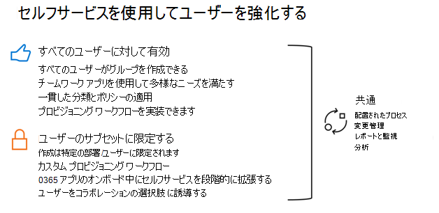

# グループとグループの組織とライフサイクルのガバナンスMicrosoft 365計画Microsoft Teams

Microsoft 365グループには、組織が必要とするガバナンス機能を実装するための豊富なツールセットがあります。 

次のセクションでは、機能について説明し、ベスト プラクティスを推奨し、ガバナンスの要件とそれらを満たす方法を決定するための適切な質問をするためのガイダンスを提供します。

## グループを作成できるユーザー Microsoft 365する

グループは、エンド ユーザーが複数のエンド ポイント (Outlook、SharePoint、Teamsなど) から作成できます。

グループの所有者に権限を与え、ユーザーが作業を簡単に行えるのを助けるために、セルフサービスを強くお勧めします。 グループとチームの作成を制限すると、サービスが機能するために多Microsoft 365グループを作成する必要が生じ、ユーザーの生産性が低下する可能性があります。

グループの作成には、次のガバナンス オプションを検討してください。

- グループのスプロールを制限するには、グループ有効期限ポリシーを [使用](microsoft-365-groups-expiration-policy.md) して、使用されていないグループを自動的に削除します。
- グループの作成を、すべての正社員など、動的メンバーシップを持つセキュリティ グループのメンバーに制限します。
- グループの作成をセキュリティ グループに制限し、ユーザーがセキュリティ グループのメンバーになるために組織のグループ使用ポリシーのトレーニングを完了する必要があります。

グループを作成できるユーザーを制限する場合は、「グループを作成できるユーザー Microsoft 365を管理する」を参照してください。

## グループの削除、復元、およびアーカイブ

ユーザー グループMicrosoft 365削除された場合、既定では 30 日間保持されます。 グループを引き続き復元できるため、この 30 日の期間は "論理的な削除" と呼ばれます。 30 日後、グループおよび関連付けられているコンテンツは完全に削除され、復元することはできません。

チャット、ファイル、またはメールを保持するための保持ポリシーが設定されている場合、それらのアイテムはグループが削除された後も保持されます。 詳細については [、「アイテム保持ポリシーについて」](../compliance/retention.md) を参照してください。

グループを削除するが、1 つ以上のグループに接続されたサービスからコンテンツを保持する場合は、「グループ[、](end-life-cycle-groups-teams-sites-yammer.md)チーム、およびグループのアーカイブ」を参照Yammerを参照してください。

## グループの名前付けポリシー

グループの名前付けポリシーは、次の 2 つの方法でグループを管理するのに役立ちます。

- プレフィックス/サフィックスの名前付けポリシーを使用して、グループ名とその関連付けられた電子メール アドレスの先頭または末尾に固定文字列または Azure AD 属性を適用できます。 これにより、部署名や地域をグループ名に含めることが可能です。
- ブロックされた単語ポリシーは、役員の名前など、特定の単語がグループ名で使用されない可能性があります。

名前付けポリシーは、グループに接続されたサービスからグループが作成される場合に適用されます。

グループに名前付けポリシーを使用する場合は、「グループ[の名前付けMicrosoft 365」を参照してください](groups-naming-policy.md)。

## グループの有効期限ポリシー

有効期限を指定すると、その期間の終わりに達し、更新されないグループは削除されます。 有効期限は、グループが作成された日、または最後に更新された日付から始まります。

グループの有効期限を設定したら、次の条件を実行します。
- グループの所有者は、有効期限が近付く間にグループを更新する通知を受け取る。
- アクティブ なグループは自動的に更新されます。
- 更新されていないグループは削除されます。
- 削除されたグループは、グループの所有者または管理者が 30 日以内に復元できます。

有効期限ポリシーは、使用されなくなったグループを確実に削除することで、グループのスプロールを制限する優れた方法です。 グループ有効期限ポリシーを作成する場合は、「グループ有効期限ポリシー Microsoft 365[を参照してください](microsoft-365-groups-expiration-policy.md)。

## 関連項目

[コラボレーション ガバナンス計画のステップ バイ ステップ](collaboration-governance-overview.md#collaboration-governance-planning-step-by-step)

[コラボレーション ガバナンス 計画の作成](collaboration-governance-first.md)

[元従業員を削除し、データをセキュリティで保護する](/microsoft-365/admin/add-users/remove-former-employee)
