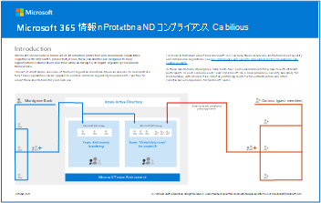
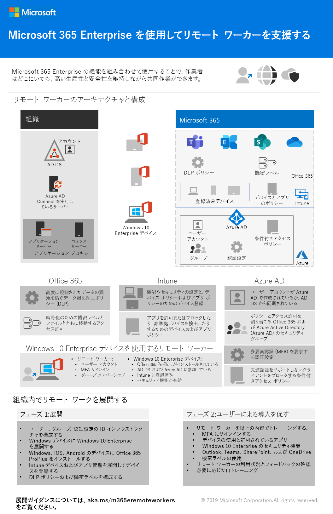

# Microsoft 365 の生産性図

エンタープライズ Microsoft 365 シリーズでは、特に、アーキテクチャ図などのテクノロジ間で機能が交差する場合に、Microsoft 365機能を実装するためのガイダンスTeams提供されます。

## IT アーキテクト向け Microsoft 365 の Microsoft Teams と関連生産性サービス
Microsoft Teamsをリードする Microsoft 365 での生産性サービスの論理的なアーキテクチャ。

| アイテム | 説明 |
|:-----|:-----|
|   [PDF](https://github.com/MicrosoftDocs/microsoft-365-docs/raw/public/microsoft-365/downloads/msft-m365-teams-logical-architecture.pdf) \| [Visio](https://github.com/MicrosoftDocs/microsoft-365-docs/raw/public/microsoft-365/downloads/msft-m365-teams-logical-architecture.vsdx)   2021 年 1 月更新   |マイクロソフトは、連携してデータ ガバナンス、セキュリティ、およびコンプライアンス機能を備えたコラボレーション エクスペリエンスを提供する、一連の生産性サービスを提供しています。    この一連の図は、Microsoft Teams をはじめとする、エンタープライ ズアーキテクト向けの生産性サービスの論理アーキテクチャを概説したものです。|

## IT アーキテクト向け Microsoft 365 のグループ
この図には、IT アーキテクト向け情報がMicrosoft 365されています。 組織内のグループとチームをMicrosoft 365管理する方法については、「Microsoft 365 との安全なコラボレーションをセットアップする」および[「](/microsoft-365/solutions/setup-secure-collaboration-with-teams)コラボレーション ガバナンスとは」を[参照してください](/microsoft-365/solutions/collaboration-governance-overview)。

| アイテム | 説明 |
|:-----|:-----|
|   [PDF](https://github.com/MicrosoftDocs/microsoft-365-docs/raw/public/microsoft-365/downloads/msft-m365-groups.pdf) \| [Visio](https://github.com/MicrosoftDocs/OfficeDocs-Enterprise/raw/live/Enterprise/downloads/msft-m365-groups.vsdx)   2020 年 5 月更新|これらの図は、さまざまな種類のグループがどのように作成および管理されているか、そしていくつかのガバナンスの推奨事項を詳述しています。|

## Microsoft 365 に移行する

Microsoft では、移行中のコンテンツのセキュリティの保護と確保に重点を置いて、オンプレミスのネットワーク ファイル共有と SharePoint Server サイトを Microsoft 365 に移行するためのツールを提供しています。 この一連の図は、SharePoint、Teams、OneDrive にコンテンツを移動するために使用できるさまざまな方法と、プロセスを通じてデータがどのように流れるのかを示しています。

| アイテム | 説明 |
|:-----|:-----|
|[![モデルポスター: [モデル] にMicrosoft 365。](../media/solutions-architecture-center/msft-migration-thumb.png)](https://download.microsoft.com/download/0/5/b/05b7fb7c-1557-4ebb-9036-c5fc3a4cd94c/Migration-posters-mm-spmt.pdf) 
 [PDF](https://download.microsoft.com/download/0/5/b/05b7fb7c-1557-4ebb-9036-c5fc3a4cd94c/m365-migration-posters-mm-spmt.pdf)\|[Visio](https://download.microsoft.com/download/0/5/b/05b7fb7c-1557-4ebb-9036-c5fc3a4cd94c/m-365-migration-posters-mm-spmt.vsdx) 
 2021 年 3 月更新 |含まれる内容: <ul><li> ファイル共有の移行</li><li>SharePoint サーバーの移行</li></ul> 
 詳細については、「コンテンツを[移行する」を参照Microsoft 365。](/sharepointmigration/migrate-to-sharepoint-online)|

## Microsoft 365保護とコンプライアンス機能

Microsoft 365情報保護とコンプライアンス機能の幅広いセットが含まれています。 Microsoft の生産性向上ツールと共に、これらの機能は、厳しい規制コンプライアンス フレームワークを遵守しながら、組織がリアルタイムで共同作業を行うのを支援するように設計されています。

この一連の図では、最も規制の厳しい業界の 1 つである金融サービスを使用して、一般的な規制要件に対応するためにこれらの機能を適用する方法を示します。 これらのイラストを自分の用途に合わせて自由にアレンジしてください。

| アイテム | 説明 |
|:-----|:-----|
|   英語: [PDF としてダウンロードする](https://download.microsoft.com/download/3/a/6/3a6ab1a3-feb0-4ee2-8e77-62415a772e53/m365-compliance-illustrations.pdf)  \| [Visio としてダウンロードする](https://download.microsoft.com/download/3/a/6/3a6ab1a3-feb0-4ee2-8e77-62415a772e53/m365-compliance-illustrations.vsdx)   日本語: [PDF としてダウンロードする](https://download.microsoft.com/download/6/f/1/6f1a7d0e-dd8e-442e-b073-8e94327ae4f8/m365-compliance-illustrations.pdf)  \| [Visio としてダウンロードする](https://download.microsoft.com/download/6/f/1/6f1a7d0e-dd8e-442e-b073-8e94327ae4f8/m365-compliance-illustrations.vsdx)   更新日: 2020 年 11 月|含まれる内容: <ul><li>  Microsoft の情報保護およびデータ損失防止</li><li>アイテム保持ポリシーと保持ラベル </li><li>情報バリア</li><li>コミュニケーション コンプライアンス</li><li>インサイダー リスク</li><li>サードパーティのデータの取り込み</li>|

## 多地域組織向けのセキュリティと情報保護
1 つのテナントを使用する複数地域組織のセキュリティとMicrosoft 365保護

| アイテム | 説明 |
|:-----|:-----|
|   [PDF](https://github.com/MicrosoftDocs/microsoft-365-docs/raw/public/microsoft-365/downloads/msft-security-info-protect-multi-region.pdf) \| [Visio](https://github.com/MicrosoftDocs/microsoft-365-docs/raw/public/microsoft-365/downloads/msft-security-info-protect-multi-region.vsdx) 更新日: 2020 年 3 月 |グローバル組織で単一の Microsoft 365 テナントを使用することは、さまざまな理由で最適な選択肢と経験です。 ただし、多くのアーキテクトは、さまざまな地域でセキュリティおよび情報保護の目標を達成する方法に取り組んでいます。 このトピックでは、推奨事項について説明します。 |

## Microsoft Defender for Endpoint 展開戦略

環境に応じて、一部のツールは特定のアーキテクチャに適しています。

| アイテム | 説明 |
|:-----|:-----|
|  [PDF](https://github.com/MicrosoftDocs/microsoft-365-docs/raw/public/microsoft-365/security/defender-endpoint/downloads/mdatp-deployment-strategy.pdf)  \| [Visio](https://github.com/MicrosoftDocs/microsoft-365-docs/raw/public/microsoft-365/security/defender-endpoint/downloads/mdatp-deployment-strategy.vsdx)  更新日: 2020 年 2 月 | アーキテクチャ教材は、次のアーキテクチャの展開を計画するのに役立ちます。 <ul><li> クラウド-ネイティブ </li><li> 共同管理 </li><li> オンプレミス</li><li>評価とローカル オンボード</li>

## ユーザーの ID とデバイス保護Microsoft 365

Azure AD アプリケーション プロキシで公開された、Microsoft 365、その他の SaaS サービス、およびオンプレミス アプリケーションにアクセスする ID とデバイスを保護するための推奨機能。

| アイテム | 説明 |
|:-----|:-----|
|    [PDF として表示する](../downloads/MSFT_cloud_architecture_identity&device_protection.pdf) \|[PDF としてダウンロードする](https://github.com/MicrosoftDocs/microsoft-365-docs/raw/public/microsoft-365/downloads/MSFT_cloud_architecture_identity&device_protection.pdf) \|[アプリとしてダウンロードVisio](https://github.com/MicrosoftDocs/microsoft-365-docs/raw/public/microsoft-365/downloads/MSFT_cloud_architecture_identity&device_protection.vsdx)     2020 年 9 月更新|データ、ID、デバイス全体で一貫したレベルの保護を使用することが重要です。 このモデルは、ID とデバイスを保護する機能の詳細と比較できる機能を示します。    |

## Advanced eDiscoveryのアーキテクチャMicrosoft 365

Advanced eDiscovery環境内を含む、エンドツーエンドのワークフローとMicrosoft 365フローを提供します。

| アイテム | 説明 |
|:-----|:-----|
|   [画像として表示する](../media/solutions-architecture-center/m365-advanced-ediscovery-architecture.png) \|[PDF としてダウンロードする](https://download.microsoft.com/download/d/1/c/d1ce536d-9bcf-4d31-b75b-fcf0dc560665/m365-advanced-ediscovery-architecture.pdf) \|[アプリとしてダウンロードVisio](https://download.microsoft.com/download/d/1/c/d1ce536d-9bcf-4d31-b75b-fcf0dc560665/m365-advanced-ediscovery-architecture.vsdx)     更新日: 2020 年 10 月|含まれる内容: <ul><li>  単一の環境でのエンドツーエンドのワークフロー</li><li>複数地域環境でのエンド Microsoft 365ワークフロー </li><li>EDRM ワークフローをサポートするエンドツーエンドのデータ フロー</li> |

## Microsoft テレフォニー ソリューション

Microsoft では、Microsoft クラウド内の Teams の使用を開始する際に使用できるいくつかのオプションをサポートしています。このポスターは、どの Microsoft テレフォニー ソリューション (クラウド内の電話システムまたはオンプレミスのエンタープライズ ボイス) が組織のユーザーに適しているかを判断し、組織を公衆交換電話網 (PSTN) に接続する方法を決定するのに役立ちます。

| アイテム | 説明 |
|:-----|:-----|
|   [PDF](https://download.microsoft.com/download/4/3/5/435cd4e9-ca56-4fd1-acb6-d1fda7952320/microsoft-voice-solutions.pdf) \| [Visio](https://download.microsoft.com/download/7/5/c/75c13012-e20c-48bd-a6dd-ea49d1a3420d/microsoft-voice-solutions.vsdx)  2021 年 3 月更新 | 詳細については、「Plan [your your Teams 音声ソリューション」を参照してください](/microsoftteams/cloud-voice-landing-page)。|

## ハイブリッド ワーク用のインフラストラクチャを設定する

ユーザー Microsoft 365その他の Microsoft クラウド テクノロジを使用すると、従業員に、組織のオンプレミスおよびクラウドベースの情報、ツール、およびリソースへの安全なアクセスを提供できます。

  
[PDF](https://download.microsoft.com/download/9/b/b/9bb5fa79-74e9-497b-87c5-4021e53d9fc2/hybrid-worker-infrastructure.pdf)  | [PowerPoint](https://download.microsoft.com/download/9/b/b/9bb5fa79-74e9-497b-87c5-4021e53d9fc2/hybrid-worker-infrastructure.pptx)  
2021 年 6 月更新

詳細については、このポスターの記事「ハイブリッド作業のためのインフラストラクチャのセットアップ」を参照[Microsoft 365。](empower-people-to-work-remotely.md)

## Microsoft Teams分離を使用する方法

Microsoft 365を使用すると、Microsoft Teams でプライベート チームを構成し、SharePoint サイトのセキュリティ設定と一意の秘密度ラベルを使用してファイルを暗号化し、チーム メンバーだけが暗号化を解除できます。

  
[PDF](https://github.com/MicrosoftDocs/microsoft-365-docs/raw/public/microsoft-365/downloads/team-security-isolation-poster.pdf)  | [PowerPoint](https://download.microsoft.com/download/8/0/5/8057fc16-c044-40b6-a652-7ed555ba2895/team-security-isolation-poster.pptx)  
2020 年 8 月更新

詳細については、このポスターの記事「セキュリティ分離を使用して [チームを構成する」を参照してください](secure-teams-security-isolation.md)。

## 関連項目

[SharePoint、Exchange、Skype for Business、Lync のアーキテクチャ モデル](../enterprise/architectural-models-for-sharepoint-exchange-skype-for-business-and-lync.md)

[クラウド導入のテスト ラボ ガイド (TLG)](../enterprise/cloud-adoption-test-lab-guides-tlgs.md)
