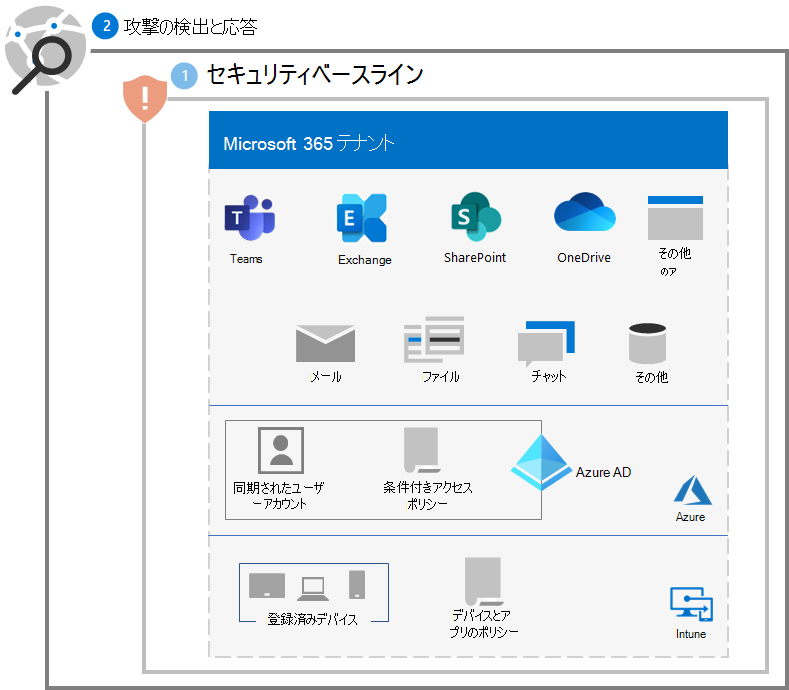
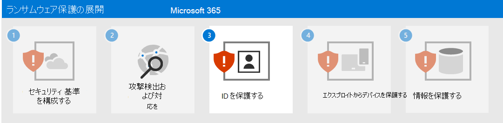

# 手順 2. 攻撃検出および対応を展開する

Microsoft 365 テナントでのランサムウェア攻撃の検出と対応のために強く推奨される最初の手順として、Microsoft 365 Defender の機能を評価するための[試用環境を設定](/microsoft-365/security/defender/eval-overview)します。

詳細については、これらのリソースを参照してください。

| 機能 | 説明 | どこから始めるか | 検知と対応に活用する方法 |
|:-------|:-----|:-------|:-------|
| [Microsoft 365 Defender](/microsoft-365/security/defender) | シグナルを統合し、機能を単一のソリューションに調整する。    セキュリティ担当者が脅威シグナルを結合し、脅威の範囲と影響を完全に特定できるようにします。    攻撃を防止または停止し、影響を受けるメールボックス、エンドポイント、およびユーザー ID を自己回復するためのアクションを自動化します。 | [はじめに](/microsoft-365/security/defender/get-started) | [インシデント対応](/microsoft-365/security/defender/incidents-overview) |
| [Microsoft Defender for Identity](/defender-for-identity/what-is) |  クラウドベースのセキュリティ インターフェイスを使用して、組織に向けられた高度な脅威、侵害された ID、悪意のあるインサイダー アクションを識別、検出、調査するには、オンプレミスの Active Directory Domain Services (AD DS) シグナルを使用します。 | [概要](/defender-for-identity/what-is) | [Microsoft Defender for Identity ポータルとの連携](/defender-for-identity/workspace-portal) |
| [Microsoft Defender for Office 365](/microsoft-365/security/office-365-security) | メール メッセージ、リンク (URL)、共同作業ツールによってもたらされる悪意のある脅威から組織を保護します。    マルウェア、フィッシング、スプーフィング、その他の攻撃の種類に対する保護。 | [概要](/microsoft-365/security/office-365-security/overview) | [脅威の捜索](/microsoft-365/security/office-365-security/threat-hunting-in-threat-explorer) |
| [Microsoft Defender for Endpoint](/microsoft-365/security/defender-endpoint) | エンドポイント (デバイス) 全体の高度な脅威の検出と対応を可能にします。 | [概要](/microsoft-365/security/defender-endpoint/microsoft-defender-endpoint)  | [エンドポイントでの検出と対応](/microsoft-365/security/defender-endpoint/overview-endpoint-detection-response) |
| [Azure Active Directory (Azure AD) Identity Protection](/azure/active-directory/identity-protection/) | ID ベースのリスクの検出と修復と、それらのリスクの調査を自動化します。 | [概要](/azure/active-directory/identity-protection/overview-identity-protection) | [調査リスク](/azure/active-directory/identity-protection/howto-identity-protection-investigate-risk) |
| [Microsoft Defender for Cloud Apps](/cloud-app-security) | Microsoft とサードパーティのすべてのクラウド サービスを対象に、検出、調査、ガバナンスを行うクラウド アクセス セキュリティ ブローカー。 | [概要](/cloud-app-security/what-is-cloud-app-security) | [調査](/cloud-app-security/investigate) |

>[!Note]
>これらのサービスはすべて、Microsoft 365 E5 セキュリティ アドオンMicrosoft 365 E5 または Microsoft 365 E3 を必要とします。
>

これらのサービスを使用して、ランサムウェア攻撃者からの次の一般的な脅威を検出して対応します。

- 資格情報の盗用

   - Azure AD Identity Protection
   - Defender for Identity
   - Defender for Office 365

- デバイス侵害

   - Defender for Endpoint
   - Defender for Office 365

- 特権のエスカレーション

   - Azure AD Identity Protection
   - Defender for Cloud Apps

- 悪意のあるアプリの振る舞い

   - Defender for Cloud Apps

- データ放出、削除、またはアップロード

   - Defender for Office 365
   - Microsoft Defender for Cloud Apps の [異常検出ポリシー](/cloud-app-security/anomaly-detection-policy#ransomware-activity)

次のサービスではMicrosoft 365 Defender とそのポータル (https://security.microsoft.com) を一般的な脅威の収集と分析ポイントとして使用します。

- Defender for Identity
- Defender for Office 365
- Defender for Endpoint
- Defender for Cloud Apps

Microsoft 365 Defender は、脅威のシグナルをアラートにまとめ、接続されたアラートをインシデントにまとめることで、セキュリティ アナリストがランサムウェア攻撃のフェーズをより迅速に検出し、調査して修復できるようにします。

## 結果の構成

手順 1 と 2 のテナントのランサムウェア保護を次に示します。

## 次の手順

[手順 3](ransomware-protection-microsoft-365-identities.md) に進み、Microsoft 365 テナントで ID を保護します。
