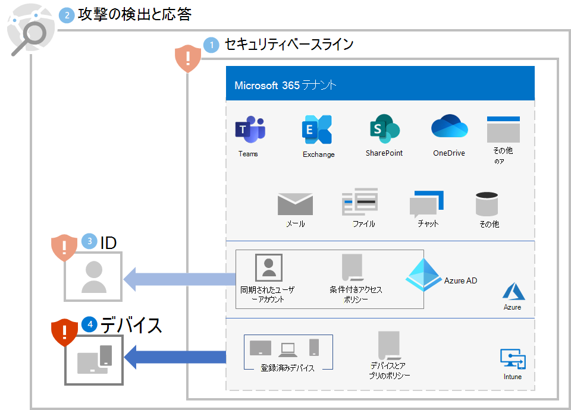
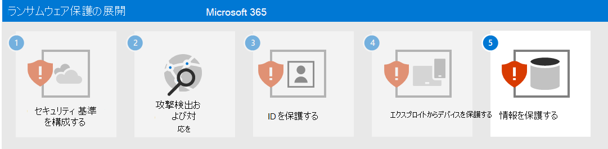

# 手順 4. デバイスの保護

ランサムウェア攻撃の最初のアクセス部分からデバイスを保護するために

- [Intune](/mem/intune/fundamentals/what-is-intune)を、デバイスのモバイル デバイス管理 (MDM) およびモバイル アプリケーション管理 (MAM) プロバイダーとして展開し、組織所有のデバイスを登録します。
- ユーザー アカウントの資格情報とデバイスの正常性とコンプライアンスの要件を検証するために[共通 ID およびデバイス アクセス ポリシー](/microsoft-365/security/office-365-security/identity-access-policies)を実装します。
- Microsoft Defender for Endpoint と Microsoft 365 Defender で [ネットワーク保護](/microsoft-365/security/defender-endpoint/network-protection) を有効にします。
- Microsoft Defender SmartScreen の[サイトとダウンロードのチェック](/windows/security/threat-protection/microsoft-defender-smartscreen/microsoft-defender-smartscreen-available-settings) と [アプリとファイルのチェック](/windows/security/threat-protection/microsoft-defender-smartscreen/microsoft-defender-smartscreen-available-settings)を設定して、ブロックまたは警告します。
- ダウンロードしたファイルと添付ファイルの[Microsoft Defender ウイルス対策スキャン](/microsoft-365/security/defender-endpoint/configure-advanced-scan-types-microsoft-defender-antivirus)を有効にします。
- **リモート デスクトップのセキュリティ レベル** を、Microsoft Defender for Endpoint と Microsoft 365 Defender で **TLS** に設定します。

## Windows 10 デバイス

Windows 10 デバイスからの攻撃の横移動部分から保護するためには:

- [Microsoft Defender ファイアウォールを有効にします](https://support.microsoft.com/windows/turn-microsoft-defender-firewall-on-or-off-ec0844f7-aebd-0583-67fe-601ecf5d774f)。
- [Microsoft Defender ウイルス対策の定義を更新します](/en-us/microsoft-365/security/defender-endpoint/manage-updates-baselines-microsoft-defender-antivirus)。

攻撃の影響を軽減するには:

- ランサムウェアに対する[高度な保護](/Microsoft-365/security/defender-endpoint/attack-surface-reduction#use-advanced-protection-against-ransomware)を使用します。

セキュリティ防御を回避する攻撃者から保護するには:

- Microsoft Defender ウイルス対策で[クラウドによる保護](/microsoft-365/security/defender-endpoint/enable-cloud-protection-microsoft-defender-antivirus)をオンのままにします。
- Microsoft Defender ウイルス対策 [リアルタイム動作監視](/microsoft-365/security/defender-endpoint/configure-real-time-protection-microsoft-defender-antivirus)をオンのままにします。
- [リアルタイム保護](/microsoft-365/security/defender-endpoint/configure-real-time-protection-microsoft-defender-antivirus)を有効にします。
- [Microsoft Defender for Endpoint で改ざん防止](/microsoft-365/security/defender-endpoint/prevent-changes-to-security-settings-with-tamper-protection)を有効にして、セキュリティ設定に対する悪意のある変更を防ぎます。

攻撃の一環としてコードを実行する攻撃者から保護するには:

- [Microsoft Defender ウイルス対策](/mem/intune/user-help/turn-on-defender-windows)をオンにします。
- [Office マクロからの Win32 API 呼び出しをブロックします](/microsoft-365/security/defender-endpoint/attack-surface-reduction-rules#block-win32-api-calls-from-office-macros)。
- [このプロセス](https://www.microsoft.com/microsoft-365/blog/2010/02/16/migrating-excel-4-macros-to-vba/)を使用して、Excel 4.0 マクロを必要とするすべてのレガシ ブックを、更新された VBA マクロ形式へ移行します。
- [署名されていないマクロの使用を無効にします](https://support.microsoft.com/topic/enable-or-disable-macros-in-office-files-12b036fd-d140-4e74-b45e-16fed1a7e5c6)。 ビジネス ニーズを持つすべての内部マクロが署名されていることを確認し、[信頼できる場所](/deployoffice/security/designate-trusted-locations-for-files-in-office)を活用して、不明なマクロが環境内で実行されないようにします。
- [マルウェア対策スキャン インターフェイス](https://www.microsoft.com/security/blog/2021/03/03/xlm-amsi-new-runtime-defense-against-excel-4-0-macro-malware/) (AMSI) によるランタイム マクロ スキャンがオンになっていることを確認して、悪意のある XLM マクロまたは VBA マクロを停止します。 この機能 (既定で有効) は、**マクロのランタイム スキャン スコープ** のグループ ポリシー設定が **[すべてのファイルに対して有効にする]** または **[低信頼ファイルに対して有効にする]** に設定されている場合は、オンになっています。 最新のグループ ポリシー テンプレート ファイルを取得します。

## ユーザーへの影響と変更管理

これらの保護を実装するときは、次の変更管理を実行します。

- [一般的な ID とデバイスのアクセス ポリシー](/microsoft-365/security/office-365-security/identity-access-policies)は、非準拠デバイスを持つユーザーへのアクセスを拒否できます。
- ファイルをダウンロードしようとすると、ダウンロード前にユーザーに警告が表示されたり、ブロックされたりする可能性があります。
- 一部の Office、Excel 4.0、XLM、または VBA マクロは実行されなくなる可能性があります。

## 最終的な構成

手順 1 から 4 のテナントのランサムウェア防止を次に示します。

## 次の手順

[手順 5](ransomware-protection-microsoft-365-information.md) に進み、Microsoft 365 テナントで 情報を保護します。 
