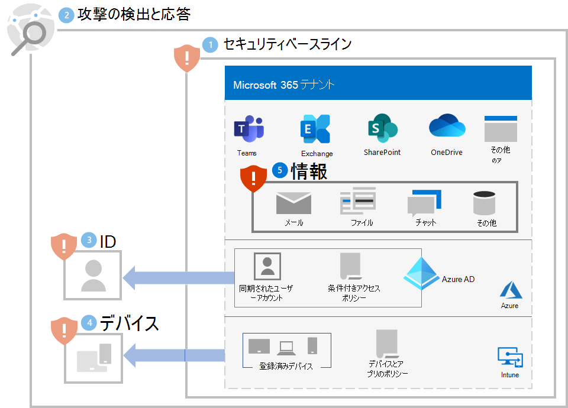

# 手順 5. 情報を保護する

ランサムウェアの攻撃者は、ファイル、データベース、およびその他の種類のサーバーにあるオンプレミス データも確認するため、そのデータを保護する最善の方法の 1 つは、データを Microsoft 365 テナントに移行することです。 そうすると、[バージョン管理、ごみ箱、アイテム保管ライブラリ](ransomware-protection-microsoft-365.md#ransomware-mitigation-and-recovery-capabilities-provided-with-microsoft-365)などの組み込みの軽減策および回復機能によって保護できます。

Microsoft 365 テナントの機密情報をさらに保護するには:

- 機密情報を見つけます。
- 厳密なアクセス許可を実装し、幅広いアクセスを排除します (書き込み、編集、および削除できるユーザーが多すぎるなど)。
- 機密情報を保護します。

>[!Note]
>Microsoft 365 テナントでの情報保護の詳細な展開ガイダンスについては、「[データ プライバシー規制のための情報保護の展開](information-protection-deploy.md)」を参照してください。 データ プライバシー規制を対象としていますが、ガイダンスの多くはランサムウェア防止にも適用されます。
>

## 機密情報を見つける

最初のタスクは、テナント内の機密情報の[種類と場所を特定する](/microsoft-365/compliance/information-protection#know-your-data)ことです。これには、次の種類が含まれます。

- 機密
- 所有権または知的財産
- 個人を特定する情報の保護を指定する地域規制 (PII)
- IT 復旧計画

機密情報の種類ごとに、次の情報を確認します。

- 組織への情報の使用
- 身代金のために保持された場合の金銭的価値の相対的な尺度 (高、中、低など)
- OneDrive や SharePoint フォルダーなどの現在の位置、または Microsoft Teams チームなどのコラボレーションの場
- 現在のアクセス許可は、次の要素で構成されます。

   - アクセス権を持つユーザー アカウント

   - アクセス権を持つ各アカウントに許可されるアクション

## 機密情報を含む場所に対する厳密なアクセス許可の実装

Microsoft 365 テナント内での厳密なアクセス許可の使用は、位置とコミュニケーションの場に対する最小特権の原則です。Microsoft 365 では、通常、OneDrive フォルダー、SharePoint サイトとフォルダー、およびチームです。 

幅広いアクセス権を持つファイル ストレージの場所やチーム (組織内の全員の既定値など) を作成する方が簡単ですが、機密情報の場合、許可されるユーザー アカウントと許可されるアクションは、コラボレーションとビジネスの要件を満たすために必要な最小のセットに制限する必要があります。

ランサムウェア攻撃者がテナントに侵入すると、管理者ロール アカウントや機密情報にアクセスできるユーザー アカウントなど、テナント全体でより広い範囲のアクセス許可を持つユーザー アカウントの資格情報を侵害することにより、特権をエスカレートしようとします。 

この典型的な攻撃者の行動に基づいて、攻撃者には 2 つの難易度があります。

- **低:** テナント全体への広範なアクセスのため、攻撃者はアクセス許可の低いアカウントを使用して機密情報を発見する可能性があります。
- **より高い** 攻撃者はアクセス許可が低いアカウントを使用できず、厳密なアクセス許可のために機密情報を検出できません。機密情報を含む場所へのアクセス権を持つアカウントの資格情報を特定して侵害することで、アクセス許可をエスカレートする必要がありますが、その後は限られた一連のアクションしか実行できない可能性があります。

機密情報については、できるだけ難易度を高くする必要があります。

次の手順で、テナントに厳密なアクセス許可を確保できます。

1. [機密情報を見つける](#locate-your-sensitive-information)ための取り組みから、機密情報の場所のアクセス許可を確認します。 
2. コラボレーションとビジネスの要件を満たしながら機密情報に厳格なアクセス許可を実装し、影響を受けるユーザーに通知します。
3. ユーザーの変更管理を実行して、機密情報の将来の場所が作成され、厳格なアクセス許可で維持されるようにします。
4. 機密情報の場所を監査および監視して、広範なアクセス許可が付与されていないことを確認します。

詳細については、「[Microsoft 365 と Microsoft Teams を使用してセキュリティで保護されたコラボレーションを設定する](setup-secure-collaboration-with-teams.md)」を参照してください。 機密情報に対する厳格なアクセス許可を持つコミュニケーションおよびコラボレーションの場の例は、[セキュリティ分離を備えたチーム](/microsoft-365/solutions/secure-teams-security-isolation)です。

## 機密情報を保護する

ランサムウェアの攻撃者がアクセスした場合に機密情報を保護するには:

- [制御されたフォルダー アクセス](/windows/security/threat-protection/microsoft-defender-atp/controlled-folders)を使用して、許可されていないアプリケーションが制御されたフォルダー内のデータを変更することをより困難にします。

- [Microsoft Information Protection](/microsoft-365/compliance/information-protection) と秘密度ラベルを使用して、機密情報に適用します。 秘密度ラベルは、定義されたユーザー アカウントと許可されたアクションを使用して、追加の暗号化とアクセス許可を構成できます。 テナントから流出したこの種類の秘密度ラベルでラベル付けされたファイルは、ラベルで定義されたユーザー アカウントでのみ使用できます。

- Microsoft 365 [データ損失防止 (DLP)](/microsoft-365/compliance/dlp-learn-about-dlp) を使用して、秘密度ラベルに基づく個人情報または機密情報を含むデータの危険な、不注意な、または不適切な共有を内部および外部で検出、警告、およびブロックします。

- [Microsoft Cloud App Security](/cloud-app-security/what-is-cloud-app-security) を使用して、ファイルなどの機密情報のダウンロードをブロックします。 [Cloud App Security の異常検出ポリシー](/cloud-app-security/anomaly-detection-policy#ransomware-activity)を使用して、高率のファイル アップロードまたはファイル削除アクティビティを検出することもできます。

## ユーザーへの影響と変更管理

広範なアクセス許可に対する管理上の変更により、ユーザーがアクセスを拒否されたり、一部のアクションを実行できなくなったりする可能性があります。

さらに、Microsoft 365 テナントの機密情報を保護するために、ユーザーを次のようにトレーニングします。

- 厳格なアクセス許可 (アクセス用のユーザー アカウントの最小セットとそれぞれに許可されるアクションの最小セット) を使用して、コミュニケーションとコラボレーションの場を作成します。 
- 機密情報に適切な秘密度ラベルを適用します。
- 制御されたフォルダー アクセスを使用します。

## 結果の構成

手順 1 - 5 のテナントのランサムウェア防止を次に示します。

## その他のランサムウェア リソース

Microsoft の主な情報:

- [ランサムウェアの脅威の増大](https://blogs.microsoft.com/on-the-issues/2021/07/20/the-growing-threat-of-ransomware/)、2021 年 7月 20 日付け Microsoft On the Issues のブログ投稿
- [人が操作するランサムウェア](/security/compass/human-operated-ransomware)
- [ランサムウェアや強要から迅速に保護する](/security/compass/protect-against-ransomware)
- [2021 Microsoft Digital Defense Report](https://www.microsoft.com/security/business/microsoft-digital-defense-report) (10- 19 ページを参照ください)
- [ランサムウェア: Microsoft 365 Defender ポータルの脅威分析ノードの蔓延する継続的な脅威](https://security.microsoft.com/threatanalytics3/05658b6c-dc62-496d-ad3c-c6a795a33c27/overview)に関するレポート (これらの「ライセンス要件」 を参照ください)

Microsoft 365:

- [Azure と Microsoft 365 を使用してランサムウェアの回復性を最大化する](https://azure.microsoft.com/resources/maximize-ransomware-resiliency-with-azure-and-microsoft-365/)
- [ランサムウェア攻撃から回復する](/microsoft-365/security/office-365-security/recover-from-ransomware)
- [マルウェアと ランサムウェアからの保護](/compliance/assurance/assurance-malware-and-ransomware-protection)
- [ランサムウェアから Windows 10 PC を保護する](https://support.microsoft.com//windows/protect-your-pc-from-ransomware-08ed68a7-939f-726c-7e84-a72ba92c01c3)
- [SharePoint Online でのランサムウェアの処理](/sharepoint/troubleshoot/security/handling-ransomware-in-sharepoint-online)
- [Microsoft 365 Defender](https://security.microsoft.com/threatanalytics3?page_size=30&filters=tags%3DRansomware&ordering=-lastUpdatedOn&fields=displayName,alertsCount,impactedEntities,reportType,createdOn,lastUpdatedOn,tags,flag)ポータルでのランサムウェアの脅威分析レポート

Microsoft 365 Defender:

- [高度な検索でランサムウェアを検索する](/microsoft-365/security/defender/advanced-hunting-find-ransomware)

Microsoft Azure

- [ランサムウェア攻撃に対する Azure 防御](https://azure.microsoft.com/resources/azure-defenses-for-ransomware-attack/)
- [Azure と Microsoft 365 を使用してランサムウェアの回復性を最大化する](https://azure.microsoft.com/resources/maximize-ransomware-resiliency-with-azure-and-microsoft-365/)
- [ランサムウェアから保護するためのバックアップと復元の計画](/security/compass/backup-plan-to-protect-against-ransomware)
- [Microsoft Azure バックアップを使用してランサムウェアから保護する](https://www.youtube.com/watch?v=VhLOr2_1MCg) (26 分のビデオ)
- [体系的な ID 侵害からの回復](/azure/security/fundamentals/recover-from-identity-compromise)
- [Azure Sentinel での高度な多段階攻撃検出](/azure/sentinel/fusion#ransomware)
- [Azure Sentinel でのランサムウェアのフュージョン検出](https://techcommunity.microsoft.com/t5/azure-sentinel/what-s-new-fusion-detection-for-ransomware/ba-p/2621373)

Microsoft Cloud App Security:

-  [Cloud App Security で異常検出ポリシーを作成する](/cloud-app-security/anomaly-detection-policy)

Microsoft Security チームのブログ投稿:

- [ランサムウェアを防止して回復するための 3 つの手順 (2021 年 9 月)](https://www.microsoft.com/security/blog/2021/09/07/3-steps-to-prevent-and-recover-from-ransomware/)
- [サイバーセキュリティ リスクを理解することで回復力を高める パート 4—現在の脅威をナビゲートする(2021 年 5 月)](https://www.microsoft.com/security/blog/2021/05/26/becoming-resilient-by-understanding-cybersecurity-risks-part-4-navigating-current-threats/)

  「**ランサムウェア**」セクションを参照 してください。

- [人が操作するランサムウェア攻撃: 予防可能な災害 (2020 年 3 月)](https://www.microsoft.com/security/blog/2020/03/05/human-operated-ransomware-attacks-a-preventable-disaster/)

  実際の攻撃の攻撃チェーン分析が含まれます。

- [ランサムウェアの応答 - 支払うべきか、支払わざるべきか? (2019 年 12 月)](https://www.microsoft.com/security/blog/2019/12/16/ransomware-response-to-pay-or-not-to-pay/)
- [Norsk Hydro のランサムウェア攻撃に対する透明性のある対応 (2019 年 12 月)](https://www.microsoft.com/security/blog/2019/12/17/norsk-hydro-ransomware-attack-transparency/)

