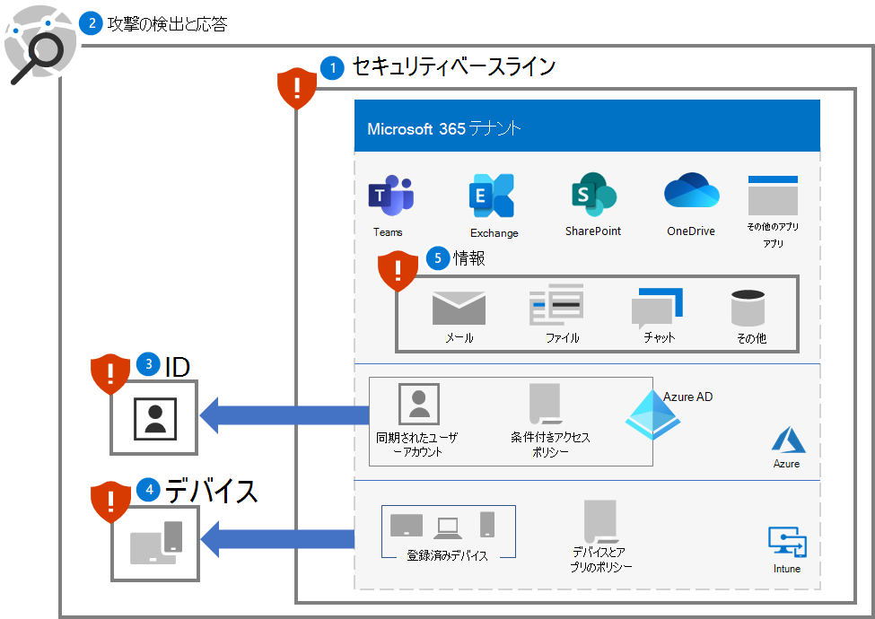
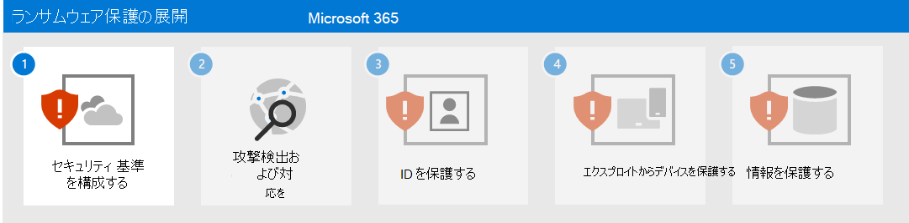

# Microsoft 365 テナントにランサムウェア保護を展開する

ランサムウェアは、ファイルやフォルダーを破棄または暗号化する一種の強要攻撃であり、重要なデータへのアクセスを妨げます。 一般に、コモディティ ランサムウェアは、デバイスに感染するウイルスのように広がり、マルウェアの修復のみを必要とします。 人が操作するランサムウェアは、組織のオンプレミスまたはクラウド IT インフラストラクチャに侵入し、自分たちの権限を昇格し、ランサムウェアを重要なデータに展開するサイバー犯罪者による積極的な攻撃の結果です。

攻撃が完了すると、攻撃者は、削除されたファイルの返却、暗号化されたファイルの暗号化解除キー、またはダーク Web またはパブリック インターネットに機密データを解放しないという約束と引き換えに、被害者に金銭を要求します。 また、人が操作するランサムウェアを使用して、産業生産に必要なコンピューターやプロセスなどの重要なコンピューターやプロセスをシャットダウンしたり、身代金を支払って損害を修正したり、組織が自身の損害を修復したりするまで、通常の業務を停止することができます。

人が操作するランサムウェア攻撃は、すべてのサイズの企業にとって壊滅的であり、クリーンアップが困難であり、将来の攻撃から保護するために完全に敵対的な立ち退きを必要とします。 コモディティ ランサムウェアとは異なり、人が操作するランサムウェアは、最初の身代金要求後も企業の業務を脅かし続ける可能性があります。

>[!Note]
>Microsoft 365 テナントに対するランサムウェア攻撃の前提は、攻撃者がテナントに対して有効なユーザー アカウント資格情報を持ち、ユーザー アカウントに対して許可されているすべてのファイルとリソースにアクセスできると想定していることです。 有効なユーザー アカウント資格情報を持たない攻撃者は、Microsoft 365 の既定の暗号化と強化された暗号化によって暗号化され保存されたデータを解読する必要があります。 詳細については、「[暗号化とキー管理の概要](/compliance/assurance/assurance-encryption)」を参照してください。 
>

Microsoft 製品全体のランサムウェア保護の詳細については、次の 「[追加のランサムウェアリソース](#additional-ransomware-resources)」 を参照してください。

## クラウドのセキュリティはパートナーシップ

Microsoft クラウド サービスのセキュリティは、お客様と Microsoft のパートナーシップです。

- Microsoft クラウド サービスは信頼とセキュリティの基盤の上に構築されます。 Microsoft が提供するセキュリティ制御と機能は、お客様のデータとアプリケーションの保護に役立ちます。
- お客様はご自分のデータと ID を所有しており、それらとオンプレミス リソースのセキュリティ、およびご自分が制御しているクラウド コンポーネントのセキュリティを保護する責任を担っています。

これらの機能と責任を組み合わせることで、ランサムウェア攻撃に対する最高の保護を提供できます。

## Microsoft 365 が提供するランサムウェアの軽減と回復機能、

Microsoft 365 テナントに侵入したランサムウェア攻撃者は、次の方法で企業から身代金を受け取る可能性があります。

- ファイルまたはメールの削除
- 存在するファイルの暗号化
- テナント外でのファイルのコピー (データの外部流出)

ただし、Microsoft 365 オンライン サービスには、ランサムウェア攻撃から顧客データを保護するための多くの組み込みの機能とコントロールがあります。 次のセクションでは、概要を説明します。 Microsoft が顧客データを保護する方法の詳細については、「[Microsoft 365 のマルウェアとランサムウェアからの保護](/compliance/assurance/assurance-malware-and-ransomware-protection)」を参照してください。

>[!Note]
>Microsoft 365 テナントに対するランサムウェア攻撃の前提は、攻撃者がテナントに対して有効なユーザー アカウント資格情報を持ち、ユーザー アカウントに対して許可されているすべてのファイルとリソースにアクセスできると想定していることです。 有効なユーザー アカウント資格情報を持たない攻撃者は、Microsoft 365 の既定の暗号化と強化された暗号化によって暗号化され保存されたデータを解読する必要があります。 詳細については、「[暗号化とキー管理の概要](/compliance/assurance/assurance-encryption)」を参照してください。 
>

### ファイルまたはメールの削除

次の SharePoint および OneDrive for Business のファイルは、次の方法で保護されます。

- バージョン管理 

   Microsoft 365 は、既定で最低でも 500 以上のバージョンのファイルを保持し、それ以上のファイルを保持するように構成できます。 

   セキュリティとヘルプデスク スタッフの負担を最小限に抑えるために、[以前のバージョンのファイルを復元する](https://support.microsoft.com/office/restore-a-previous-version-of-an-item-or-file-in-sharepoint-f66dbda0-81f4-4d1e-b08c-793265c58934)方法についてユーザーにトレーニングします。

- ごみ箱

   ランサムウェアがファイルの新しい暗号化されたコピーを作成し、古いファイルを削除する場合、顧客は 93 日間の間にファイルをごみ箱から復元することが可能です。 93 日以降の場合でも、Microsoft がデータを回復できる 14 日間の猶予があります。 
  
   セキュリティとヘルプデスク スタッフの負担を最小限に抑えるために、[ごみ箱からファイルを復元する](https://support.microsoft.com/office/restore-deleted-items-from-the-site-collection-recycle-bin-5fa924ee-16d7-487b-9a0a-021b9062d14b)方法についてユーザーにトレーニングします。

- [ファイルの復元](https://support.microsoft.com/office/restore-your-onedrive-fa231298-759d-41cf-bcd0-25ac53eb8a15)

   管理者とエンド ユーザーが過去 30 日間の任意の時点からファイルを復元できる SharePoint および OneDrive の完全なセルフサービス回復ソリューション。

   セキュリティと IT ヘルプデスク スタッフの負担を最小限に抑えるために、[ファイルの復元](https://support.microsoft.com/office/restore-your-onedrive-fa231298-759d-41cf-bcd0-25ac53eb8a15)の方法についてユーザーにトレーニングします。

OneDrive のファイルと SharePoint のファイルについては、大量攻撃に遭った場合、Microsoft は最大 14 日前までの時点にロールバックできます。

電子メールは次の方法で保護されています。

- [単一アイテムの回復](/exchange/recipients-in-exchange-online/manage-user-mailboxes/enable-or-disable-single-item-recovery) とメールボックスの保持。不注意または悪意のある早期削除時にメールボックス内のアイテムを回復できます。 既定では、14 日以内に削除されたメール メッセージをロールバックできます。最大 30 日間は構成可能です。

- [保持ポリシー](/exchange/security-and-compliance/messaging-records-management/retention-tags-and-policies) を使用すると、構成済みの保持期間の間、変更できないメールのコピーを保持できます。

### 存在するファイルの暗号化

前に説明したように、次の SharePoint とOneDrive for Business のファイルは、悪意のある暗号化から保護されています。

- バージョン管理
- ごみ箱
- アイテム保管ライブラリ

詳細については、「[Microsoft 365 でのデータ破損の処理](/compliance/assurance/assurance-dealing-with-data-corruption)」を参照してください。

### テナント外でのファイルのコピー 

次の方法で、ランサムウェア攻撃者がテナント外でファイルをコピーするのを防ぐことが可能です。

- [Microsoft Purview データ損失防止 (DLP)](/microsoft-365/compliance/dlp-learn-about-dlp) ポリシー

    データの危険な共有、偶発的な共有、不適切な共有を検出し、警告し、ブロックします。

    - そのデータには、地域のプライバシー規制を遵守するための個人識別情報 (PII) などの個人情報が含まれます。

    - 秘密度ラベルに基づく組織の機密情報。

- [Microsoft Defender for Cloud Apps](/cloud-app-security/what-is-cloud-app-security)

    ファイルなどの機密情報のダウンロードをブロックします。 

    また、[Defender for Cloud Apps Conditional Access App Control](/cloud-app-security/tutorial-dlp#how-to-discover-and-protect-sensitive-information-in-your-organization) を使用して、ユーザーとアプリケーション間の情報のフローをリアルタイムで監視することもできます。

## このソリューションの機能

このソリューションでは、Microsoft 365 の保護と軽減機能、構成、および継続的な操作を展開して、ランサムウェア攻撃者が Microsoft 365 テナント内の重要なデータを使用し、身代金要求に対して組織を保持する能力を最小限に抑える手順を実行します。

このソリューションの手順は次のとおりです。

1. [セキュリティ 基準を構成する](ransomware-protection-microsoft-365-security-baselines.md)
2. [攻撃の検出と応答を展開する](ransomware-protection-microsoft-365-attack-detection-response.md)
3. [ID の保護](ransomware-protection-microsoft-365-identities.md)
4. [デバイスを保護する](ransomware-protection-microsoft-365-devices.md)
5. [情報の保護](ransomware-protection-microsoft-365-information.md)

Microsoft 365 テナント用にデプロイされたソリューションの 5 つの手順を次に示します。

このソリューションでは、[ゼロ トラスト](/security/zero-trust/)の原則を使用します。 

- **明示的に確認する:** 使用可能なすべてのデータ ポイントに基づいて、常に認証と承認を行います。
- **最低限の特権アクセスを使用する:** Just-In-Time および Just-Enough-Access (JIT/JEA)、リスクベースのアダプティブ ポリシー、データ保護を使用してユーザー アクセスを制限します。
- **違反を想定する:** 影響範囲とセグメント アクセスを最小限に抑えます。 エンドツーエンドの暗号化を確認し、分析を使用して可視性を高め、脅威検出を推進し、防御を強化します。

組織のファイアウォールの背後にあるすべてを信頼する従来のイントラネット アクセスとは異なり、ゼロ トラストは、組織のファイアウォールの背後またはインターネット上の各サインインとアクセスを、管理されていないネットワークからのもののように処理します。ゼロ トラストでは、ネットワーク、インフラストラクチャ、ID、エンドポイント、アプリ、データを保護する必要があります。

## Microsoft 365 の機能と機能

ランサムウェア攻撃から Microsoft 365 テナントを保護するには、このソリューションの手順用の Microsoft 365 の能力と機能を使用します。

### 1. セキュリティ基準

| 機能 | 説明 | 役立ちます... | ライセンス |
|:-------|:-----|:-------|:-------|
| Microsoft セキュア スコア |  Microsoft 365 テナントのセキュリティの姿勢を測定します。 | セキュリティ構成を評価し、改善点を提案します。 | Microsoft 365 E3 または Microsoft 365 E5 |
| 攻撃面の減少ルール | さまざまな構成設定を使用して、サイバー攻撃に対する組織の脆弱性を軽減します。 | 疑わしいアクティビティと脆弱なコンテンツをブロックします。 | Microsoft 365 E3 または Microsoft 365 E5 |
| Exchange のメール設定 |  メール ベースの攻撃に対する組織の脆弱性を軽減するサービスを有効にします。 | フィッシングなどのメール ベースの攻撃を通じてテナントへの初期アクセスを防止します。  | Microsoft 365 E3 または Microsoft 365 E5 |
| Microsoft Windows、Microsoft Edge、およびMicrosoft 365 Apps for Enterprise の設定 | 広く知られ、証明済の業界標準のセキュリティ構成を提供します。 | Windows、Edge、Microsoft 365 Apps for Enterprise による攻撃を防ぎます。 | Microsoft 365 E3 または Microsoft 365 E5 |
|

### 2. 検出と応答

| 機能 | 説明 | 検出と応答に役立ちます... | ライセンス |
|:-------|:-----|:-------|:-------|
| Microsoft 365 Defender | シグナルを統合し、機能を単一のソリューションに調整します。    セキュリティ担当者が脅威シグナルを結合し、脅威の範囲と影響を完全に特定できるようにします。    攻撃を防止または停止し、影響を受けるメールボックス、エンドポイント、およびユーザー ID を自己回復するためのアクションを自動化します。 | インシデント。これは、攻撃を構成するアラートとデータを組み合わせたものです。 | Microsoft 365 E5 セキュリティ アドオン付きのMicrosoft 365 E5 または Microsoft 365 E3 |
| Microsoft Defender for Identity |  クラウドベースのセキュリティ インターフェイスを使用して、組織に向けられた高度な脅威、侵害された ID、悪意のあるインサイダー アクションを識別、検出、調査するには、オンプレミスの Active Directory Domain Services (AD DS) シグナルを使用します。 | AD DS アカウントの資格情報の侵害。 | Microsoft 365 E5 セキュリティ アドオン付きのMicrosoft 365 E5 または Microsoft 365 E3 |
| Microsoft Defender for Office 365 | メール メッセージ、リンク (URL)、共同作業ツールによってもたらされる悪意のある脅威から組織を保護します。    マルウェア、フィッシング、スプーフィング、その他の攻撃の種類に対する保護。 | フィッシング攻撃。 | Microsoft 365 E5 セキュリティ アドオン付きのMicrosoft 365 E5 または Microsoft 365 E3 |
| Microsoft Defender for Endpoint | エンドポイント (デバイス) 全体の高度な脅威の検出と対応を可能にします。 | マルウェアのインストールとデバイスの侵害。 | Microsoft 365 E5 セキュリティ アドオン付きのMicrosoft 365 E5 または Microsoft 365 E3 |
| Azure Active Directory(Azure AD) ID 保護 | ID ベースのリスクの検出と修復と、それらのリスクの調査を自動化します。 | Azure AD アカウントと特権のエスカレーションに対する資格情報の侵害。 | Microsoft 365 E5 セキュリティ アドオン付きのMicrosoft 365 E5 または Microsoft 365 E3 |
| Defender for Cloud Apps | Microsoft とサードパーティのすべてのクラウド サービスを対象に、検出、調査、ガバナンスを行うクラウド アクセス セキュリティ ブローカー。 | 横方向の動きとデータ流出。 | Microsoft 365 E5 セキュリティ アドオン付きのMicrosoft 365 E5 または Microsoft 365 E3 |
|

### 3. ID

| 機能 | 説明 | 予防に役立ちます... | ライセンス |
|:-------|:-----|:-------|:-------|
|Azure AD パスワード保護 | 共通のリストとカスタム エントリからのパスワードをブロックします。 | クラウドまたはオンプレミスのユーザー アカウントのパスワードの決定。 |Microsoft 365 E3 または Microsoft 365 E5|
|条件付きアクセスが適用されている MFA | 条件付きアクセス ポリシーを使用したサインインのプロパティに基づいて MFA を要求します。 | 資格情報の侵害とアクセス。 | Microsoft 365 E3 または Microsoft 365 E5|
|リスクベースの条件付きアクセスが適用されている MFA | Azure AD Identity Protection を使用したユーザー サインインのリスクに基づいて MFA を要求します。 |資格情報の侵害とアクセス。 | Microsoft 365 E5 セキュリティ アドオン付きのMicrosoft 365 E5 または Microsoft 365 E3|
|

### 4. デバイス

デバイスとアプリの管理

| 機能 | 説明 | 予防に役立ちます... | ライセンス |
|:-------|:-----|:-------|:-------|
| Microsoft Intune | デバイスと、デバイス上で実行されるアプリケーションを管理します。  | デバイスまたはアプリの侵害とアクセス。 | Microsoft 365 E3 または E5 |
|  |  |  |  |

Windows 11 または 10 デバイス用:

| 機能 | 説明 | 役立ちます... | ライセンス |
|:-------|:-----|:-------|:-------|
| Microsoft Defender ファイアウォール | ホスト ベースのファイアウォールを提供します。  | 受信、未承諾のネットワーク トラフィックからの攻撃を防ぎます。 | Microsoft 365 E3 または Microsoft 365 E5 |
| Microsoft Defender ウイルス対策 | 機械学習、ビッグ データ分析、詳細な脅威耐性調査、Microsoft クラウド インフラストラクチャを使用したデバイス (エンドポイント) のマルウェア対策保護を提供します。 | マルウェアのインストールと実行を防止します。 | Microsoft 365 E3 または Microsoft 365 E5 |
| Microsoft Defender SmartScreen | フィッシングやマルウェアの Web サイトやアプリケーション、悪意のある可能性のあるファイルのダウンロードから保護します。 | サイト、ダウンロード、アプリ、ファイルを確認するときにブロックまたは警告を表示します。 | Microsoft 365 E3 または Microsoft 365 E5 |
| Microsoft Defender for Endpoint | デバイス (エンドポイント) 間の高度な脅威を防止、検出、調査、および対応するのに役立ちます。 | ネットワーク改ざんから保護します。 | Microsoft 365 E5 セキュリティ アドオン付きのMicrosoft 365 E5 または Microsoft 365 E3 |
|  |  |  |  |

### 5. 情報

| 機能 | 説明 | 役立ちます... | ライセンス |
|:-------|:-----|:-------|:-------|
| コントロールされたフォルダー アクセス | 既知の信頼できるアプリの一覧に対してアプリをチェックしてデータを保護します。 | ファイルがランサムウェアによって変更または暗号化されないようにします。 | Microsoft 365 E3 または Microsoft 365 E5 |
| Microsoft Purview Information Protection | 身代金要求の対象となっている情報に対して、秘密度ラベルの適用が可能 | 流出した情報の使用を防ぎます。 | Microsoft 365 E3 または Microsoft 365 E5 |
| データ損失防止 (DLP) | 機密データを保護し、ユーザーによる不適切な共有を防止することでリスクを軽減します。 | データ流出を防止する | Microsoft 365 E3 または Microsoft 365 E5 |
| Defender for Cloud Apps | 検出、調査、ガバナンスのためのクラウド アクセス セキュリティ ブローカー。 | 横方向の動きを検出し、データ流出を防ぎます。 | Microsoft 365 E5 セキュリティ アドオン付きのMicrosoft 365 E5 または Microsoft 365 E3 |
|

## ユーザーへの影響と変更管理

追加のセキュリティ機能を展開し、Microsoft 365 テナントの要件とセキュリティ ポリシーを実装すると、ユーザーに影響を与える可能性があります。 

たとえば、組織内のすべてのユーザーのチームをより簡単に作成するのではなく、ユーザー アカウントの一覧をメンバーとして使用して、特定の用途に対して新しいチームを作成する必要がある新しいセキュリティ ポリシーを適用できます。 これにより、ランサムウェア攻撃者が攻撃者の侵害されたユーザー アカウントで利用できないチームを探索し、その後の攻撃でそのチームのリソースをターゲットにすることを予防する助けとなります。

この基礎ソリューションは、必要な変更管理を実行するために、新しい構成や推奨されるセキュリティ ポリシーがユーザーに影響を与える可能性がある場合を識別します。

## 次の手順

次の手順を使用して、Microsoft 365 テナントの包括的な保護を展開します。

1. [セキュリティ 基準を構成する](ransomware-protection-microsoft-365-security-baselines.md)
2. [攻撃の検出と応答を展開する](ransomware-protection-microsoft-365-attack-detection-response.md)
3. [ID の保護](ransomware-protection-microsoft-365-identities.md)
4. [デバイスを保護する](ransomware-protection-microsoft-365-devices.md)
5. [情報の保護](ransomware-protection-microsoft-365-information.md)

## その他のランサムウェア リソース

Microsoft の主な情報:

- [ランサムウェアの脅威の増大](https://blogs.microsoft.com/on-the-issues/2021/07/20/the-growing-threat-of-ransomware/)、2021 年 7月 20 日付け Microsoft On the Issues のブログ投稿
- [人が操作するランサムウェア](/security/compass/human-operated-ransomware)
- [ランサムウェアや強要から迅速に保護する](/security/compass/protect-against-ransomware)
- [2021 Microsoft Digital Defense Report](https://www.microsoft.com/security/business/microsoft-digital-defense-report) (10- 19 ページを参照ください)
- [ランサムウェア: Microsoft 365 Defender ポータルの脅威分析ノードの蔓延する継続的な脅威](https://security.microsoft.com/threatanalytics3/05658b6c-dc62-496d-ad3c-c6a795a33c27/overview)に関するレポート (これらの「ライセンス要件」 を参照ください)
- Microsoft 検出対応チーム (DART) ランサムウェアの[アプローチとベスト プラクティス](/security/compass/incident-response-playbook-dart-ransomware-approach)および[ケース スタディ](/security/compass/dart-ransomware-case-study)

Microsoft 365:

- [Azure と Microsoft 365 を使用してランサムウェアの回復性を最大化する](https://azure.microsoft.com/resources/maximize-ransomware-resiliency-with-azure-and-microsoft-365/)
- [ランサムウェア攻撃から回復する](/microsoft-365/security/office-365-security/recover-from-ransomware)
- [マルウェアと ランサムウェアからの保護](/compliance/assurance/assurance-malware-and-ransomware-protection)
- [ランサムウェアから Windows 10 PC を保護する](https://support.microsoft.com//windows/protect-your-pc-from-ransomware-08ed68a7-939f-726c-7e84-a72ba92c01c3)
- [SharePoint Online でのランサムウェアの処理](/sharepoint/troubleshoot/security/handling-ransomware-in-sharepoint-online)
- [Microsoft 365 Defender](https://security.microsoft.com/threatanalytics3?page_size=30&filters=tags%3DRansomware&ordering=-lastUpdatedOn&fields=displayName,alertsCount,impactedEntities,reportType,createdOn,lastUpdatedOn,tags,flag)ポータルでのランサムウェアの脅威分析レポート

Microsoft 365 Defender:

- [高度な検索でランサムウェアを検索する](/microsoft-365/security/defender/advanced-hunting-find-ransomware)

Microsoft Azure

- [ランサムウェア攻撃に対する Azure 防御](https://azure.microsoft.com/resources/azure-defenses-for-ransomware-attack/)
- [Azure と Microsoft 365 を使用してランサムウェアの回復性を最大化する](https://azure.microsoft.com/resources/maximize-ransomware-resiliency-with-azure-and-microsoft-365/)
- [ランサムウェアから保護するためのバックアップと復元の計画](/security/compass/backup-plan-to-protect-against-ransomware)
- [Microsoft Azure バックアップを使用してランサムウェアから保護する](https://www.youtube.com/watch?v=VhLOr2_1MCg) (26 分のビデオ)
- [体系的な ID 侵害からの回復](/azure/security/fundamentals/recover-from-identity-compromise)
- [Microsoft Sentinel での高度な多段階攻撃検出](/azure/sentinel/fusion#ransomware)
- [Microsoft Sentinel でのランサムウェアのフュージョン検出](https://techcommunity.microsoft.com/t5/azure-sentinel/what-s-new-fusion-detection-for-ransomware/ba-p/2621373)

Microsoft Defender for Cloud Apps

-  [Defender for Cloud Apps で異常検出ポリシーを作成する](/cloud-app-security/anomaly-detection-policy)

Microsoft Security チームのブログ投稿:

- [ランサムウェアを防止して回復するための 3 つの手順 (2021 年 9 月)](https://www.microsoft.com/security/blog/2021/09/07/3-steps-to-prevent-and-recover-from-ransomware/)
- [人が操作するランサムウェアの対策ガイド: パート 1 (2021 年 9 月)](https://www.microsoft.com/security/blog/2021/09/20/a-guide-to-combatting-human-operated-ransomware-part-1/)

  Microsoft の検出対応チーム (DART) がランサムウェア インシデント調査を実施する方法に関する重要な手順。

- [人が操作するランサムウェアの対策ガイド: パート 2 (2021 年 9 月)](https://www.microsoft.com/security/blog/2021/09/27/a-guide-to-combatting-human-operated-ransomware-part-2/)

  推奨事項とベスト プラクティス。

- [サイバーセキュリティ リスクを理解することで回復力を高める パート 4—現在の脅威をナビゲートする(2021 年 5 月)](https://www.microsoft.com/security/blog/2021/05/26/becoming-resilient-by-understanding-cybersecurity-risks-part-4-navigating-current-threats/)

  「**ランサムウェア**」セクションを参照 してください。

- [人が操作するランサムウェア攻撃: 予防可能な災害 (2020 年 3 月)](https://www.microsoft.com/security/blog/2020/03/05/human-operated-ransomware-attacks-a-preventable-disaster/)

  実際の攻撃の攻撃チェーン分析が含まれます。

- [ランサムウェアの応答 - 支払うべきか、支払わざるべきか? (2019 年 12 月)](https://www.microsoft.com/security/blog/2019/12/16/ransomware-response-to-pay-or-not-to-pay/)
- [Norsk Hydro のランサムウェア攻撃に対する透明性のある対応 (2019 年 12 月)](https://www.microsoft.com/security/blog/2019/12/17/norsk-hydro-ransomware-attack-transparency/)
