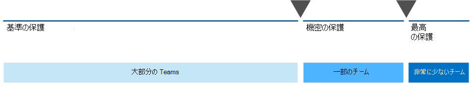

# ユーザーとユーザーとの安全なMicrosoft 365をMicrosoft Teams

適切なユーザーと簡単に情報を共有できる一方で、過剰共有を防ぐことが、組織の成功の鍵となります。 これには、機密性の高いデータを、アクセス権を持つ必要があるユーザーと安全に共有できる機能が含まれます。 プロジェクトによっては、機密データを組織外のユーザーと共有する場合があります。

このコラボレーション ソリューション のガイダンスには、次の 2 つのコンポーネントが含まれています。

- プロジェクトMicrosoft Teams適切なレベルの保護を備え、プロジェクトを展開する
- プロジェクトごとに適切なセキュリティ設定を使用して外部共有を構成する

多目的で使いやすいコンテンツ コラボレーション ツールが利用できない場合、ユーザーはドキュメントに電子メールを送信して共同作業を行う場合が多い。 これは、時間の多いエラーが発生しやすい共同作業方法であり、情報の不適切な共有のリスクを高める可能性があります。 共有情報が難しすぎると、IT によって管理されていないコンシューマー製品の使用に戻る可能性があります。 これにより、さらに大きなリスクが生じ得る可能性があります。

> [!VIDEO https://www.microsoft.com/videoplayer/embed/RWxMmL?autoplay=false]

このMicrosoft 365、次に役立つTeams構成を使用して展開できます。

- 知的財産を保護する
- 簡単なコラボレーションを有効にする
- ユーザーの満足度を高め、シャドウ IT のリスクを軽減するセキュリティと使いやすさのバランスを取る

ほとんどの組織は、さまざまな情報を持ち、情報が不適切に共有されている場合は、さまざまな程度の感度とさまざまな程度のビジネス上の影響を与えます。 特定の情報の感度に応じて、次の情報との共有を許可できます。

- 誰でも (認証されていない)
- 組織内のユーザー
- 組織内の特定のユーザー
- 組織内外の特定のユーザー

マーケティング パンフレットなどの情報は、組織外で広く共有することを目的とします。 カフェテリア メニューなどの情報は、外部共有を意味するのではなく、外部で共有されている場合はビジネスに影響を及ぼす可能性はありません。 これらの種類の情報は、保護をほとんどまたは全く必要とします。

開発中の同じマーケティング パンフレットは、組織内でのみ共有できます。 この場合、ユーザーの既定の共有設定Teams十分な場合があります。

開発中の新しい製品に関する情報は、組織内でも機密性が高いと見なされる場合があります。 この場合、保護の程度が高い方が適切な場合があります。 たとえば、この情報へのアクセスを特定のチームのメンバーに制限できます。 プロジェクトによっては、ベンダーやパートナー組織など、組織外のユーザーと共同作業する必要がある場合があります。

組織の成功に不可欠な情報、または厳しいセキュリティ要件やコンプライアンス要件を持つ情報には、さらに高いレベルの保護が必要になる場合があります。

上記のすべてのシナリオでは、Microsoft Teamsのチームを使用して、情報を保存、共有、および共同作業できます。

セキュリティで保護されたコラボレーションを構成するには、これらの機能Microsoft 365機能を使用します。

|製品またはコンポーネント|機能|ライセンス|
|---|---|---|
|Microsoft Defender for Office 365|セーフSPO、OneDriveおよびTeams。セーフドキュメント。セーフサイトのリンクTeams|Microsoft 365E1、E3、E5|
|SharePoint|サイトとファイルの共有ポリシー、サイト共有のアクセス許可、リンクの共有、要求へのアクセス、サイトのゲスト共有設定|Microsoft 365E1、E3、E5|
|Microsoft Teams|ゲスト アクセス、プライベート チーム、プライベート チャネル|Microsoft 365E1、E3、E5|
|Microsoft 365 コンプライアンス|秘密度ラベル|Microsoft 365 E3、E5|

## 共同作業ガバナンス

Microsoft 365ソリューションを管理するための多くのオプションが提供されています。 この展開コンテンツをコラボレーション ガバナンス コンテンツと共に使用して、組織に最適なコラボレーション ソリューションを作成することをお勧めします。

### すべてのTeamsに対するデータの使用

異なる感度で情報へのアクセスを管理するために、3 つの異なる層の保護を開発[Teams。](configure-teams-three-tiers-protection.md) これらの層は、ニーズやビジネスに合わせてカスタマイズできます。

次の表に示すように、これらの層 *(ベースライン*、機密性の高い、機密性の高い) は、過剰な情報漏洩や潜在的な情報漏洩を防ぐのに役立つ保護を徐々に強化します。

|-|ベースライン層|機密性の高い層|機密性の高い層|
|---|---|---|---|
|パブリック チームまたはプライベート チーム|[Either/リンク/埋め込み]|Kirkland|Kirkland|
|認証されていない共有|Blocked|Blocked|Blocked|
|ファイル共有|可|可|共有できるのはチームの所有者のみです。|
|チーム メンバーシップ|誰でもパブリック チームに参加できます。 プライベート チームに参加するには、チーム所有者の承認が必要です。|参加するにはチーム所有者の承認が必要です。|参加するにはチーム所有者の承認が必要です。|
|ドキュメントの暗号化|||感度ラベルと一緒に使用できます|
|ゲスト共有|可|許可またはブロック可能|許可またはブロック可能|
|非管理対象デバイス|制限なし|Web 専用アクセス|Blocked|

これらの層を構成するには、次の手順を実行します。

- ゲスト アクセスとプライベート チャネルTeamsの設定を構成する
- 内部およびゲスト共有、アクセス要求、および共有リンクSharePointチームの関連付けられたサイトの設定を構成する
- 機密性の *高い* 機密性 *の高* い層の場合、チームを分類し、管理されていないデバイスからのゲスト共有とアクセスを制御する機密ラベルを構成する
- 機密性の *高い層* の場合は、適用するドキュメントを暗号化する機密ラベルを構成する

ベースライン層から開始し、必要に応じて機密性の高い機密性の高い層を使用して組織の情報を保護するチームを追加します。 開始するには、次のリソースを参照してください。

- [ベースライン保護を使用してチームを構成する](configure-teams-baseline-protection.md)
- [機密データに対する保護機能を使用してチームを構成する](configure-teams-sensitive-protection.md)
- [機密データに対する保護機能を使用してチームを構成する](configure-teams-highly-sensitive-protection.md)

組織内でも共有を保護する必要がある機密性の高いプロジェクトがある場合は、独自の機密ラベルを使用してファイルを暗号化するチームを構成して、チーム メンバーだけが読み取りを行うことができます。 詳細については [、「セキュリティ分離を使用してチームを構成する」](secure-teams-security-isolation.md) を参照してください。

### 組織外のユーザーとの共有

組織外のユーザー [と任意の感度の情報を共有する必要がある場合があります](collaborate-with-people-outside-your-organization.md)。 これは、単一のドキュメントを 1 人のユーザーと共有する場合から、大規模なパートナー組織や世界中のフリーランサーと主要なプロジェクトで共同作業を行う場合などです。 このMicrosoft 365、この範囲の外部共有は、機密情報を保護するための適切な保護手段を使用して簡単に行うことができます。

これらのリソースは、組織外のユーザーと共同作業するための環境のセットアップを開始するのに役立ちます。

- [フォルダーの個々のファイルを](collaborate-on-documents.md) 共有するドキュメントで共同作業を行います。
- [サイトで共同作業を行](collaborate-in-site.md)い、サイト内のゲストとSharePointします。
- [チーム内のゲストと](collaborate-as-team.md) 共同作業を行うチームとして共同作業を行います。

共有される情報の感度に応じて、セーフガードを追加して、過剰共有を防ぐのに役立ちます。 これらのリソースは、組織に必要な保護をセットアップするのに役立ちます。

- [認証されていないユーザーとファイルおよびフォルダーを共有するためのベスト プラクティス](best-practices-anonymous-sharing.md)
- [組織外のユーザーと共有する場合、ファイルが偶発的に公開されることを制限する](share-limit-accidental-exposure.md)
- [セキュリティで保護されたゲスト共有環境を作成する](create-secure-guest-sharing-environment.md)

パートナー組織を持つ主要なプロジェクトがある場合は、Azure Entitlement Management を使用して、プロジェクトに設定したチーム内のその組織のゲストを管理できます。 詳細については、「[Create a B2B extranet with managed guests (管理されたゲストで B2B エクストラネットを作成する)](b2b-extranet.md)」を参照してください。

## 管理者向けトレーニング

Microsoft Learn のこれらのトレーニング モジュールを使用すると、コラボレーション、ガバナンス、および ID 機能を、TeamsおよびSharePoint。

### Teams

|トレーニング:|Microsoft Teams を使用してチームの共同作業を管理する|
|---|---|
||「Microsoft Teams を使用してチームの共同作業を管理する」では、Microsoft 365 でのチームの共同作業の中央のハブである Microsoft Teams の機能について説明します。 Teams を使用して、Office 365 アプリケーションの充実した機能を最大限に活用しながらオンプレミスとオフプレミスの両方で、デスクトップからタブレット、携帯電話までさまざまなデバイス上で組織内のチームワークとコミュニケーションを円滑に進める方法を習得できます。 Teams が、共同作業のための包括的で柔軟な環境をさまざまなアプリケーションやデバイスで提供する方法について説明します。 このラーニングパスはMicrosoft 365 認定: Teams 管理者 の認定の準備を行うことができます。
2 時間 17 分 - ラーニング パス - 5 モジュール|

> [!div class="nextstepaction"]
> [スタート>](/learn/modules/m365-teams-collab-prepare-deployment/introduction/)

### SharePoint

|トレーニング:|Microsoft 365 で SharePoint を使用して共同作業する|
|---|---|
||「Microsoft SharePoint で共有コンテンツを管理する」では、SharePoint の特徴と機能および Microsoft 365 と連携する仕組みについて紹介します。 ハブ サイトなど、さまざまな種類の SharePoint サイトだけでなく、情報保護、レポート、監視についても説明します。 さらに、SharePoint のファイルとフォルダーの共有を使用してコラボレーションを最適化する方法、外部でファイルを共有する方法、SharePoint 管理センターで SharePoint サイトを管理する方法も説明します。 このラーニングパスはMicrosoft 365 認定: チームワーク管理者の関連付け の認定の準備を行うことができます。
1 時間 14 分 - ラーニング パス - 4 モジュール|

> [!div class="nextstepaction"]
> [スタート>](/learn/modules/m365-teams-sharepoint-plan-sharepoint/introduction/)

### 情報保護

|トレーニング:|Microsoft 365 で企業情報を保護する|
|---|---|
||組織の情報を保護することは、かつてないほど困難になっています。 「Microsoft 365 で社内の情報を保護する」のラーニング パスでは、機密情報を不用意な共有や誤用から保護する方法、データを検出して分類する方法、秘密度ラベルを使用して保護する方法、損失から保護するために機密情報を監視および分析する方法について説明します。 この学習パスは、セキュリティ管理者の認定:セキュリティ管理者アソシエMicrosoft 365 Microsoft 365認定: Enterpriseエキスパート認定の準備に役立ちます。
1 時間 - ラーニング パス - 5 モジュール|

> [!div class="nextstepaction"]
> [スタート>](/learn/modules/m365-security-info-overview/introduction/)

### ID とアクセス

|トレーニング:|Azure Active Directory で ID とアクセスを保護する|
|---|---|
||ID とアクセスのラーニングパスは、最新の ID およびアクセステクノロジ、認証を強化するためのツール、組織内での ID 保護のガイダンスについて説明しています。 Microsoft ID およびアクセステクノロジを使用すると、組織のIDをオンプレミスでもクラウドでも保護し、ユーザーがどこからでも安全に作業できるようになります。 このラーニングパスはMicrosoft 365 認定: セキュリティ管理者 と Microsoft 365 認定: エンタープライズ管理エキスパート の認定のための準備を行うことが出来ます。
2 時間 52 分 - ラーニング パス - 6 モジュール|

> [!div class="nextstepaction"]
> [スタート>](/learn/modules/m365-identity-overview/introduction/)

## エンド ユーザー向けのトレーニング

これらのトレーニング モジュールは、ユーザーがグループ、Teams、およびグループを使用して、SharePointの共同作業に役立Microsoft 365。

|Teams|SharePoint|
|---|---|
| **[チームのセットアップとカスタマイズ](https://support.microsoft.com/office/702a2977-e662-4038-bef5-bdf8ee47b17b)**| **[共有と同期](https://support.microsoft.com/office/98cb2ff2-c27e-42ea-b055-c2d895f8a5de)**|
| **[アップロードファイルの検索](https://support.microsoft.com/office/57b669db-678e-424e-b0a0-15d19215cb12)**||
| **[チームとチャネルでの共同作業](https://support.microsoft.com/office/c3d63c10-77d5-4204-a566-53ddcf723b46)**||

## 図

これらの図は、グループとチームが Microsoft 365 の他のサービスとやり取りする方法と、組織内でこれらのサービスを管理するのに役立つガバナンスおよびコンプライアンス機能を理解するのに役立ちます。

### IT アーキテクト向け Microsoft 365 のグループ

IT アーキテクトが Microsoft 365 のグループについて知っておくべきこと

|**アイテム**|**説明**|
|---|---|
|   [PDF](https://github.com/MicrosoftDocs/microsoft-365-docs/raw/public/microsoft-365/downloads/msft-m365-groups.pdf) \|[Visio](https://github.com/MicrosoftDocs/OfficeDocs-Enterprise/raw/live/Enterprise/downloads/msft-m365-groups.vsdx)   更新日: 2019 年 6 月|これらの図は、さまざまな種類のグループがどのように作成および管理されているか、そしていくつかのガバナンスの推奨事項を詳述しています。|

### IT アーキテクト向け Microsoft 365 の Microsoft Teams と関連生産性サービス

Microsoft Teamsをリードする Microsoft 365 での生産性サービスの論理的なアーキテクチャ。

|**アイテム**|**説明**|
|---|---|
|   [PDF](https://github.com/MicrosoftDocs/microsoft-365-docs/raw/public/microsoft-365/downloads/msft-m365-teams-logical-architecture.pdf) \|[Visio](https://github.com/MicrosoftDocs/OfficeDocs-Enterprise/raw/live/Enterprise/downloads/msft-m365-teams-logical-architecture.vsdx)   更新日: 2019 年 4 月|マイクロソフトは、連携してデータ ガバナンス、セキュリティ、およびコンプライアンス機能を備えたコラボレーション エクスペリエンスを提供する、一連の生産性サービスを提供しています。 
この一連の図は、Microsoft Teams をはじめとする、エンタープライ ズアーキテクト向けの生産性サービスの論理アーキテクチャを概説したものです。|

## セキュリティで保護されたコラボレーション ソリューションを展開する

このソリューションを展開する準備ができたら、次の手順に進みます。

1. 3[つの異なる層の保護を構成Teams。](configure-teams-three-tiers-protection.md)
2. 組織外のユーザーと任意の感度の情報を [共有する設定を構成します](collaborate-with-people-outside-your-organization.md)。

## 関連項目

[Microsoft 365 のセキュリティに関するドキュメント](../security/index.yml)

[Microsoft 365 コンプライアンスのドキュメント](../compliance/index.yml)

[Microsoft Teams にようこそ](/MicrosoftTeams/Teams-overview)
