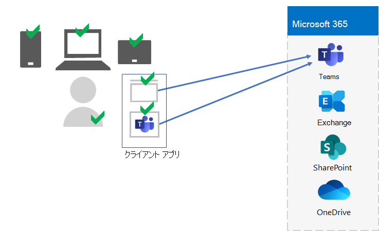

# 手順 5.  エンタープライズ テナント用のデバイスMicrosoft 365管理

Microsoft 365には、モバイル デバイス管理 (MDM) とモバイル アプリケーション管理 (MAM) を使用して、デバイスを管理し、組織内のそれらのデバイスでアプリを使用するための機能が含まれています。 iOS、Android、macOS、および Windowsデバイスを管理して、データを含む組織のリソースへのアクセスを保護できます。 たとえば、組織外のユーザーに電子メールが送信されるのを防ぐか、組織のデータを作業者の個人デバイス上の個人データから分離できます。

ユーザー、デバイスの検証と管理、およびローカルおよびクラウドの生産性アプリの使用例を次に示Microsoft Teams。

組織のリソースの保護と保護を支援するために、Microsoft 365デバイスとアプリへのアクセスを管理するための機能が含まれています。 デバイス管理には、次の 2 つのオプションがあります。

- Microsoft Intune、企業向け包括的なデバイスおよびアプリ管理ソリューションです。
- Basic Mobility and Security ( Basic Mobility and Security) は、組織内のデバイスを管理するためのすべてのMicrosoft 365に含まれる Intune サービスのサブセットです。 詳細については、「基本モビリティと [セキュリティの機能」を参照してください](../admin/basic-mobility-security/capabilities.md)。

E5 または Microsoft 365 E3がある場合は、Intune を使用する必要があります。

## Microsoft Intune

MDM または[MAM Microsoft Intune](/mem/intune/fundamentals/planning-guide)を使用して組織へのアクセスを管理するには、次の情報を使用します。 MDM とは、ユーザーが Intune でデバイスを "登録" する場合です。 デバイスが登録された後、デバイスは管理対象デバイスであり、組織のポリシー、ルール、および設定を受け取る可能性があります。 たとえば、特定のアプリのインストール、パスワード ポリシーの作成、VPN 接続のインストールなどです。

自分の個人用デバイスを持つユーザーは、自分のデバイスを登録したり、Intune と組織のポリシーで管理したりしたくない場合があります。 ただし、組織のリソースとデータを保護する必要があります。 このシナリオでは、MAM を使用してアプリを保護できます。 たとえば、ユーザーがデバイス上のユーザーにアクセスするときに PIN を入力する必要がある MAM SharePoint使用できます。

また、個人用デバイスと組織が所有するデバイスを管理する方法も決定します。 デバイスの使い方に応じて、デバイスの扱い方を変えてほしい場合があります。

## ID とデバイスのアクセス構成

Microsoft は、安全で生産性の高い従業員を確保するために [、ID](../security/office-365-security/microsoft-365-policies-configurations.md) とデバイス アクセスのための一連の構成を提供します。 これらの構成には、次の使用が含まれます。

- Azure AD 条件付きアクセス ポリシー
- Microsoft Intuneコンプライアンスポリシーとアプリ保護ポリシー
- Azure AD Id Protection ユーザー リスク ポリシー
- クラウド アプリの追加ポリシー

ユーザー、デバイス、およびローカルおよびクラウドの生産性アプリ (Microsoft Teams など) の使用を検証および制限するこれらの設定とポリシーのアプリケーションの例を次に示します。

デバイス アクセスとアプリ管理の場合は、次の記事の構成を使用します。

- [前提条件](../security/office-365-security/identity-access-prerequisites.md)
- [共通 ID とデバイスのアクセス ポリシー](../security/office-365-security/identity-access-policies.md)

## 手順 5 の結果

Microsoft 365 テナントのデバイスとアプリの管理では、Intune の設定とポリシーを決定して、ユーザー、デバイス、ローカルおよびクラウドの生産性アプリの使用を検証および制限します。

新しい要素が強調表示された Intune デバイスとアプリ管理を備えたテナントの例を次に示します。

この図では、テナントには次の機能があります。

- Intune に登録されている組織所有のデバイス。
- 登録されたデバイスと個人用デバイスの Intune デバイスポリシーとアプリ ポリシー。

## デバイスとアプリ管理の継続的なメンテナンス

継続的に、次の必要が生じ得る場合があります。 

- デバイスの登録を管理します。
- 追加のアプリ、デバイス、セキュリティ要件の設定とポリシーを変更します。