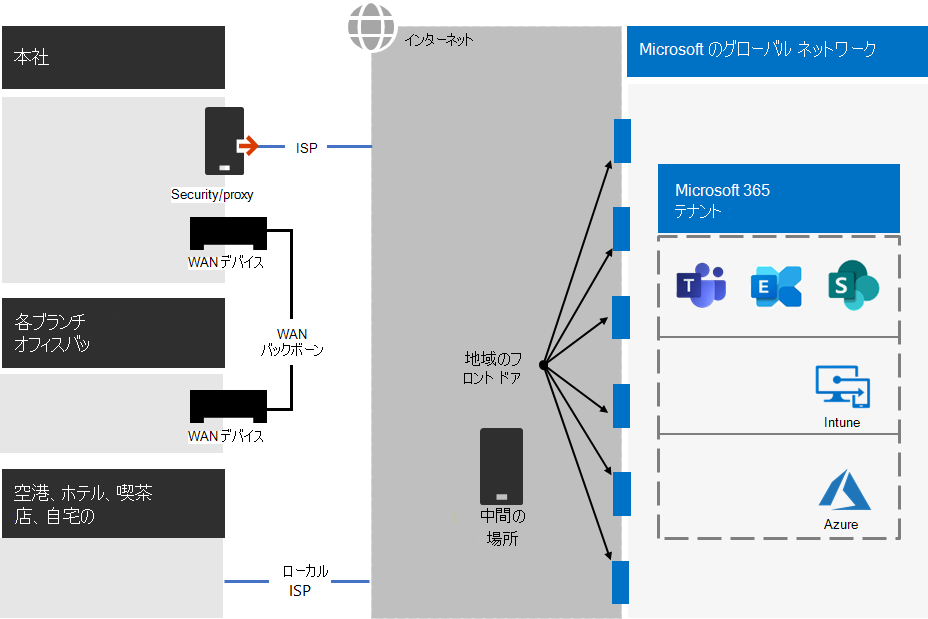
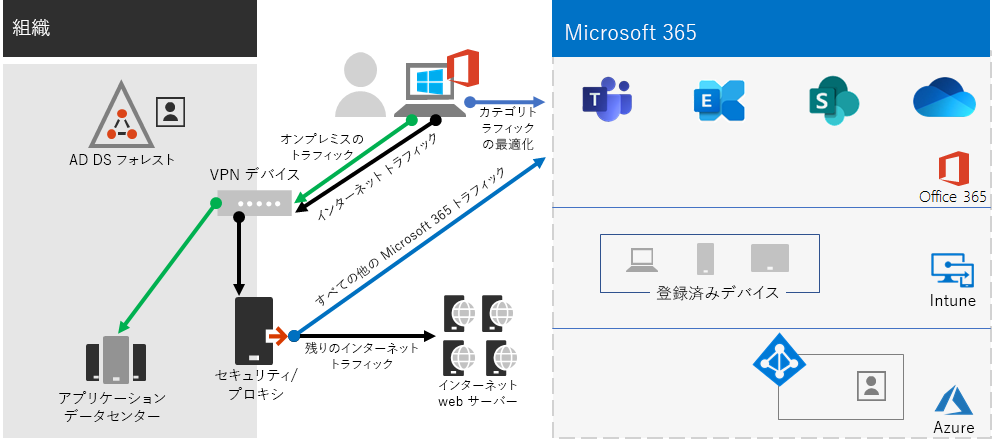

# 手順 2。 エンタープライズ テナント向けMicrosoft 365最適なネットワーク

Microsoft 365には、Teams や Exchange Online、Microsoft Intune などのクラウド生産性アプリと、Microsoft Azure の多くの ID およびセキュリティ サービスが含まれます。 これらのクラウドベースのサービスはすべて、オンプレミス ネットワークまたはインターネット上の任意の場所にあるクライアント デバイスからの接続のセキュリティ、パフォーマンス、および信頼性に依存します。 

テナントのネットワーク アクセスを最適化するには、次の作業を行う必要があります。

- オンプレミスユーザーと Microsoft グローバル ネットワークに最も近い場所との間のパスを最適化します。
- リモート アクセス VPN ソリューションを使用しているリモート ユーザーの Microsoft Global Network へのアクセスを最適化します。
- [ネットワーク] インサイトを使用して、オフィスの場所のネットワーク境界を設計します。
- サイトでホストされている特定のアセットへのアクセスSharePoint、Office 365 CDN。
- エンドポイントの一覧を使用して信頼Microsoft 365の処理をバイパスし、変更が加わるとリストの更新を自動化するプロキシおよびネットワーク エッジ デバイスを構成します。

## Enterprise作業員

エンタープライズ ネットワークの場合は、クライアントと最も近いエンドポイント間で最もパフォーマンスの高いネットワーク アクセスを有効にすることで、エンド ユーザー エクスペリエンスMicrosoft 365があります。 エンド ユーザー エクスペリエンスの品質は、ユーザーが使用しているアプリケーションのパフォーマンスと応答性に直接関係します。 たとえば、Microsoft Teams通話、会議、共有画面のコラボレーションがグリッチフリーになじむ低遅延に依存している場合です。

ネットワーク設計の主な目標は、クライアント デバイスから Microsoft Global Network への往復時間 (RTT) を短縮し、Microsoft のすべてのデータセンターを低遅延で相互接続する Microsoft のパブリック ネットワーク バックボーンである、フロント ドアと呼ばれる高可用性クラウド アプリケーション エントリ ポイントを世界中に広げ、待機時間を最小限に抑える必要があります。

従来のエンタープライズ ネットワークの例を次に示します。

この図では、ブランチ オフィスは、ワイド エリア ネットワーク (WAN) デバイスと WAN バックボーンを介して中央オフィスに接続します。 インターネット アクセスは、中央オフィスのネットワーク エッジとインターネット サービス プロバイダー (ISP) のセキュリティまたはプロキシ デバイスを介して行います。 インターネット上では、Microsoft Global Network は世界中の地域で一連のフロント ドアを持っています。 組織は、トラフィックの追加のパケット処理とセキュリティのために中間の場所を使用できます。 組織の組織のMicrosoft 365は、Microsoft グローバル ネットワーク内に位置します。

クラウド サービスのこの構成のMicrosoft 365は次のとおりです。

- ブランチ オフィスのユーザーの場合、トラフィックはローカル以外のフロント ドアに送信され、待機時間が増加します。
- 中間の場所にトラフィックを送信すると、信頼できるトラフィックで重複するパケット処理を実行するネットワーク ヘアピンが作成され、待機時間が長くなる。
- ネットワーク エッジ デバイスは、信頼できるトラフィックで不要で重複したパケット処理を実行し、待機時間を長くします。

ネットワークのMicrosoft 365最適化は複雑である必要はありません。 次の主要な原則に従って、可能な限り最高のパフォーマンスを得る方法があります。

- Microsoft クラウド Microsoft 365宛ての信頼できるトラフィックであるネットワーク トラフィックを特定します。
- ユーザーがネットワークに接続するMicrosoft 365場所からインターネットへのネットワーク トラフィックのローカル ブランチ出力を許可Microsoft 365。
- ネットワーク ヘアピンを使用しないようにします。
- プロキシMicrosoft 365パケット検査デバイスをバイパスするトラフィックを許可します。

これらの原則を実装する場合は、エンタープライズ ネットワークの最適化を行い、Microsoft 365。

この図では、ブランチ オフィスはソフトウェア定義の WAN デバイス (SDWAN) デバイスを介して独自のインターネット接続を持ち、信頼できる Microsoft 365 トラフィックを地域で最も近いフロント ドアに送信します。 中央オフィスでは、信頼できるMicrosoft 365はセキュリティまたはプロキシ デバイスをバイパスし、中間デバイスは使用されなくなりました。

最適化された構成が従来のエンタープライズ ネットワークの待機時間の問題を解決する方法を次に示します。

- 信頼Microsoft 365トラフィックは WAN バックボーンをスキップし、すべてのオフィスのローカル フロント ドアに送信され、待機時間が短縮されます。
- 重複するパケット処理を実行するネットワーク ヘアピンは、信頼できるトラフィックMicrosoft 365に対してスキップされ、待機時間が短縮されます。
- 不要で重複するパケット処理を実行するネットワーク エッジ デバイスは、信頼できるトラフィックMicrosoft 365にスキップされ、待機時間が短縮されます。

詳細については、「ネットワーク接続の[概要Microsoft 365を参照してください](../enterprise/microsoft-365-networking-overview.md)。

## リモート ワーカー

リモート ワーカーが従来の VPN クライアントを使用して組織ネットワークへのリモート アクセスを取得している場合は、VPN クライアントがスプリット トンネリング サポートを備えていることを確認してください。 スプリット トンネリングを使用しない場合、すべてのリモート作業トラフィックは VPN 接続を介して送信され、そこで組織のエッジ デバイスに転送されて処理され、インターネット上で送信される必要があります。 次に例を示します。

この図では、Microsoft 365トラフィックは組織を通じて間接的なルートを取る必要があります。これは、VPN クライアントの物理的な場所から遠く離れた Microsoft Global Network フロント ドアに転送される可能性があります。 この間接パスにより、ネットワーク トラフィックが遅延し、全体的なパフォーマンスを低下させます。 

スプリッ トトンネリングを使用すると、VPN クライアントを構成して、特定の種類のトラフィックが VPN 接続を介して、組織ネットワークに送信されることを除外できます。

Microsoft 365 クラウドリソースへのアクセスを最適化するには、VPN 接続を介して、**最適化** カテゴリの Microsoft 365 エンドポイントへのトラフィックを除外するようにスプリット トンネリング VPN クライアントを構成します。 詳細については、「ネットワーク エンドポイント カテゴリ[Office 365、](../enterprise/microsoft-365-network-connectivity-principles.md#new-office-365-endpoint-categories)スプリットトンネリング用のオプティマイズ カテゴリ エンドポイントの一覧」を参照してください。

クラウド アプリへのトラフィックの大部分が VPN 接続をバイパスするスプリット トンネリングMicrosoft 365トラフィック フローを次に示します。

この図では、VPN クライアントは、インターネットを通Microsoft 365、Microsoft グローバル ネットワークに最も近いフロント ドアに対して、重要なクラウド サービス トラフィックを送信および受信します。

詳細とガイダンスについては、「[VPN スプリット トンネリングを使用してリモート ユーザーの Office 365 の接続を最適化する](../enterprise/microsoft-365-vpn-split-tunnel.md)」をご覧ください。

## ネットワーク インサイトの使用 (プレビュー)

ネットワークインサイトは、オフィスの場所のネットワーク境界を設計するのに役立つ、Microsoft 365テナントから収集されるパフォーマンス指標です。 各分析情報は、オンプレミスユーザーがテナントにアクセスしている地理的な場所ごとに、指定された問題のパフォーマンス特性に関するライブの詳細を提供します。

テナントには、次の 2 つのテナント レベルのネットワーク分析情報が表示されます。

- [Exchangeの問題の影響を受け、サンプリングされた接続を確認する](../enterprise/office-365-network-mac-perf-insights.md#exchange-sampled-connections-impacted-by-connectivity-issues)
- [SharePointの問題の影響を受け、サンプルされた接続を確認する](../enterprise/office-365-network-mac-perf-insights.md#sharepoint-sampled-connections-impacted-by-connectivity-issues)

次に、各オフィスの場所に関する特定のネットワーク インサイトを示します。

- [バックホールされたネットワーク出力](../enterprise/office-365-network-mac-perf-insights.md#backhauled-network-egress)
- [近くの顧客に対して検出されるパフォーマンスの向上](../enterprise/office-365-network-mac-perf-insights.md#better-performance-detected-for-customers-near-you)
- [サービス フロント ドアの最適Exchange Online使用](../enterprise/office-365-network-mac-perf-insights.md#use-of-a-non-optimal-exchange-online-service-front-door)
- [オンライン サービス フロント ドアSharePoint最適でないサービスの使用](../enterprise/office-365-network-mac-perf-insights.md#use-of-a-non-optimal-sharepoint-online-service-front-door)
- [フロント ドアからのダウンロードSharePoint速度が低い](../enterprise/office-365-network-mac-perf-insights.md#low-download-speed-from-sharepoint-front-door)
- [中国ユーザーの最適なネットワーク出力](../enterprise/office-365-network-mac-perf-insights.md#china-user-optimal-network-egress)

> [!IMPORTANT]
> ネットワーク 分析情報、パフォーマンスに関する推奨事項、および評価は、Microsoft 365 管理現在プレビュー状態です。 この機能は、Microsoft 365プログラムに登録されているテナントでのみ使用できます。

詳細については、「ネットワーク ネットワーク[Microsoft 365」をインサイト。](../enterprise/office-365-network-mac-perf-insights.md)

## SharePointを使用してパフォーマンスをOffice 365 CDN

クラウドベースのContent Delivery Network (CDN) を使用すると、読み込み時間を短縮し、帯域幅を節約し、応答性を向上できます。 このCDNを要求するブラウザーに近いグラフィック ファイルやビデオ ファイルなどの静的アセットをキャッシュすることでパフォーマンスが向上し、ダウンロードの高速化と待機時間の短縮に役立ちます。 Microsoft 365 E3 および E5 の SharePoint に含まれる組み込みの Office 365 Content Delivery Network (CDN) を使用して、静的アセットをホストして、SharePoint ページのパフォーマンスを向上させることができます。

Office 365 CDN は静的資産を複数の場所 _(元の場所)_ でホストできる複数の CDN で構成されているため、静的資産をグローバルな高速ネットワークから提供することができます。 ホストするコンテンツの種類に応じて、Office 365 CDN、プライベートオリジン、または両方を追加できます。  

展開および構成すると、Office 365 CDNはパブリックおよびプライベートのオリジンからアセットをアップロードし、インターネット上にあるユーザーに高速にアクセスできます。

詳細については、「オンラインと一[緒にOffice 365 CDNをSharePointする」を参照してください](../enterprise/use-microsoft-365-cdn-with-spo.md)。

## エンドポイントの自動一覧

オンプレミスのクライアント、エッジ デバイス、およびクラウドベースのパケット分析サービスに信頼済み Microsoft 365 トラフィックの処理をスキップするには、Microsoft 365 サービスに対応する一連のエンドポイント (IP アドレス範囲と DNS 名) を使用して構成する必要があります。 これらのエンドポイントは、ファイアウォールや他のエッジ セキュリティ デバイス、クライアント コンピューターがプロキシをバイパスする PAC ファイル、ブランチ オフィスの SD-WAN デバイスで手動で構成できます。 ただし、エンドポイントは時間の間に変化し、これらの場所でエンドポイント リストを継続的に手動でメンテナンスする必要があります。

クライアント PAC ファイルおよびネットワーク デバイス内の Microsoft 365 エンドポイントの一覧と変更管理を自動化するには、Office 365 IP アドレスと[URL REST ベースの Web](../enterprise/microsoft-365-ip-web-service.md)サービスを使用します。 このサービスを使用すると、ネットワーク トラフィックのMicrosoft 365識別と区別が容易になり、最新の変更を評価、構成、および最新の状態に変えやすくなります。

PowerShell、Python、または他の言語を使用して、時間の間にエンドポイントに対する変更を決定し、PAC ファイルとエッジ ネットワーク デバイスを構成できます。

基本的なプロセスは次の手順です。

1. IP アドレスOffice 365 URL Web サービスと構成メカニズムを使用して、PAC ファイルとネットワーク デバイスを現在の一連のエンドポイントで構成Microsoft 365します。
2. 毎日定期的に実行して、エンドポイントの変更を確認するか、通知方法を使用します。
3. 変更が検出された場合は、クライアント コンピューターの PAC ファイルを再生成して再配布し、ネットワーク デバイスに変更を加えます。

詳細については、「IP[アドレスOffice 365 URL Web サービス」を参照してください](../enterprise/microsoft-365-ip-web-service.md)。

## 手順 2 の結果

最適なネットワークMicrosoft 365テナントの場合、次の条件を決定しました。

- すべてのブランチ オフィスにインターネット接続を追加し、ネットワーク ヘアピンを排除して、オンプレミス ユーザーのネットワーク パフォーマンスを最適化する方法。
- 継続的な更新プログラム (エンタープライズ ネットワークに最適) を含む、クライアント ベースの PAC ファイルとネットワーク デバイスとサービスに対して、信頼できるエンドポイントの自動登録を実装する方法。
- リモート ワーカーからオンプレミス リソースへのアクセスをサポートする方法。
- ネットワーク サーバーを使用するインサイト
- アプリケーションを展開するOffice 365 CDN。

最適なネットワークを持つエンタープライズ組織とそのテナントの例を次に示します。

[このイメージのより大きなバージョンを表示する](https://github.com/MicrosoftDocs/microsoft-365-docs/raw/public/microsoft-365/media/tenant-management-overview/tenant-management-tenant-build-step2.png)

この図では、このエンタープライズ組織のテナントには次の機能があります。

- 信頼できるネットワーク トラフィックをローカル フロント ドアに転送する SDWAN デバイスをMicrosoft 365ブランチ オフィスのローカル インターネット アクセス。
- ネットワーク ヘアピンはありません。
- 信頼できるトラフィックをローカルのフロント ドアに転送するMicrosoft 365プロキシ エッジ デバイス。

## 最適なネットワークのための継続的なメンテナンス

継続的に、次の必要が生じ得る場合があります。

- エンドポイントの変更のためにエッジ デバイスと展開された PAC ファイルを更新するか、自動化されたプロセスが正しく動作するか確認します。
- アセットを管理するには、Office 365 CDN。
- エンドポイントの変更については、VPN クライアントの分割トンネリング構成を更新します。

## 次の手順

ID を [続行して](tenant-management-identity.md) 、オンプレミスのアカウントとグループを同期し、セキュリティで保護されたユーザー サインインを適用します。
