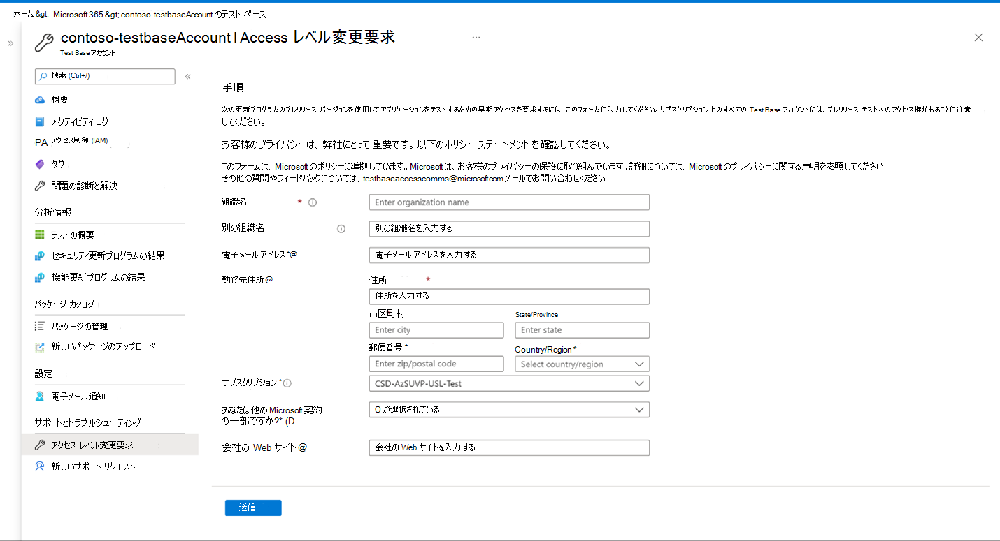

# アクセス レベルを変更する要求 

現在、プレリリースWindows更新コンテンツへのアクセスを利用できるようになりました。 プレリリース更新プログラムへのアクセス要求が承認されると、アップロードされたパッケージは、オンボード中に選択された OS バージョンのプレリリース Windows更新プログラムに対して自動的にテストされるようにスケジュールされます。 

アクセスを要求するには、左側のナビゲーション バーで [アクセス レベル変更要求] オプションを選択し、組織のすべての詳細を入力して要求を送信します。 要求が承認されると、登録された電子メール アドレスに通知されます。 承認されると、新しいプレリリース ビルドが使用可能になると、選択したバージョンの新しい更新プログラムに対してパッケージが自動的にテストされます。 

> [!div class="mx-imgBorder"]
> 
