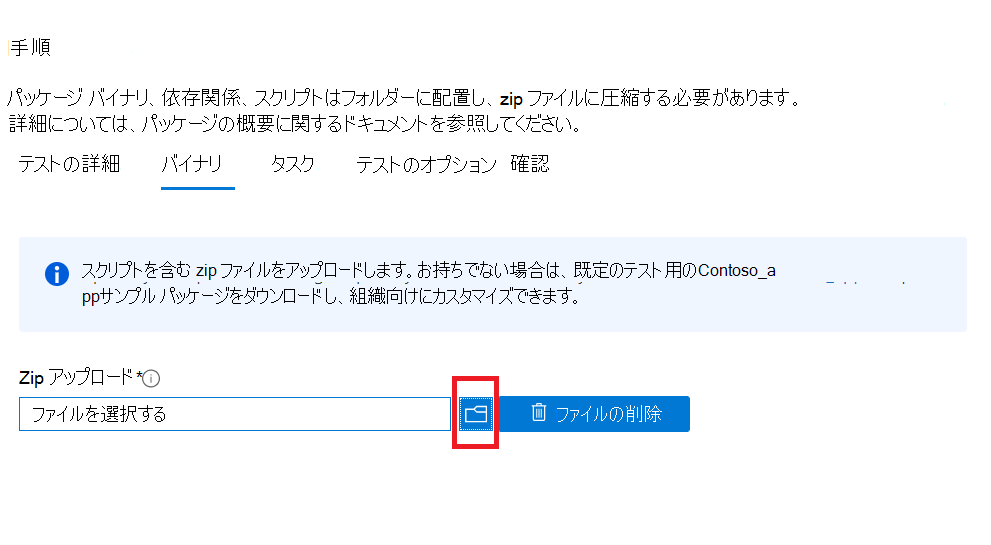

# <a name="step-3-upload-your-binaries-dependencies-and-scripts"></a>手順 3: アップロード、依存関係、およびスクリプトを削除する

このタブでは、テスト スイートの実行に使用するバイナリ、依存関係、スクリプトを含む単一の zip パッケージをアップロードします。

## <a name="upload-package-zip-file"></a>アップロード zip ファイル



  - アップロードされた依存関係には、テスト フレームワーク、スクリプト エンジン、またはアプリケーションまたはテスト ケースを実行するためにアクセスされるデータが含まれます。 たとえば、ブラウザー ベースのテストの実行に役立つ Selenium インストーラーと Webdriver インストーラーをアップロードできます。
  - スクリプトアクティビティがモジュール形式で保持されるのがベスト プラクティスです。 
    - スクリプト ```Install``` はインストール操作のみを実行します。
    - スクリプト ```Launch``` はアプリケーションのみを起動します。
    - スクリプト ```Close``` はアプリケーションのみを閉じます。
    - オプションの ```Uninstall``` スクリプトは、アプリケーションのみをアンインストールします。

**現在、ポータルは PowerShell スクリプトのみをサポートしています。**


## <a name="next-steps"></a>次の手順 

次の記事に進み、「手順 4: テスト タスクを設定 **する」に進みます**。
> [!div class="nextstepaction"]
> [戻ってください](uploadApplication.md)
> [!div class="nextstepaction"]
> [次の手順](testtask.md)

