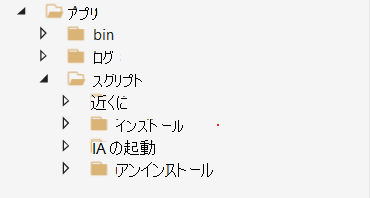
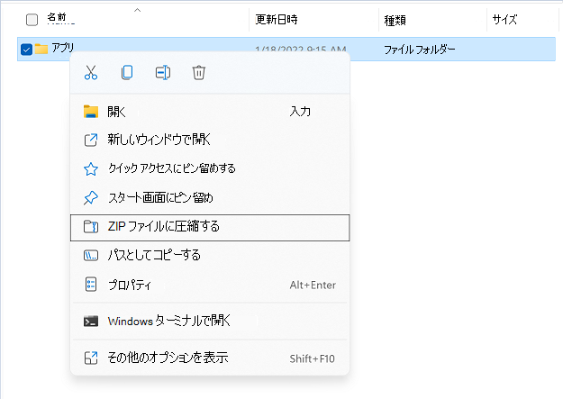

# <a name="build-a-package"></a>パッケージをビルドする

パッケージは、アプリケーション バイナリスクリプトとテスト スクリプトを含む.zip ファイルです。これは、Test Base を使用するための前提条件です。 このクイック スタートでは、最初のパッケージをビルドし、アプリケーションで既定のテストを実行できます。

- ***Out-Of-Box (OOB)** テストでは、アプリケーションのインストール、起動、閉じ、アンインストールが実行されます。インストール後、1 回のアンインストールが実行される前に、起動終了ルーチンが 30 回繰り返されます。OOB テストでは、パッケージで標準化されたテレメトリを提供し、Windows ビルド間で比較できます。*

必要に応じて、 [サンプル パッケージ](https://aka.ms/testbase-sample-package) をダウンロードして参照して始めることができます。

## <a name="create-a-folder-structure"></a>フォルダー構造を作成する

ローカル コンピューターで、次のようにフォルダー構造を作成します。



これらのフォルダーが使用されます。

- **App\bin**: アプリケーションと依存関係バイナリを保存します。
- **App\scripts**: スクリプトを保存して、アプリケーションのインストール、起動、閉じ、アンインストールを行います。
- **アプリ\ログ**: スクリプトはログをこのフォルダーに出力する必要があります。その後、テストの完了後にログをダウンロードして分析できます。

## <a name="copy-binary-files"></a>バイナリ ファイルをコピーする

アプリケーションのインストール ファイルを **App\bin** にコピーします。 アプリケーションに依存関係がある場合は、最初にインストールする必要があります。 また、依存関係インストール ファイルを **App\bin** にコピーします。


## <a name="add-powershell-scripts"></a>PowerShell スクリプトを追加する

OOB テストを実行するには、アプリケーションのインストール、起動、閉じ、アンインストールを行う PowerShell スクリプトを追加する必要があります。

> [!NOTE]
> *OOB テストでは、インストール、起動、および終了スクリプトが必要ですが、アンインストール スクリプトは省略可能です*。

スクリプトは、次のようにフォルダーに追加する必要があります。


スクリプトには通常、次の動作が含まれます。

- **コマンドを実行して、アプリケーションをインストール/起動/閉じる/アンインストールします**。 たとえば、アプリケーションが MSI ファイルの場合は、 [msiexec](/windows-server/administration/windows-commands/msiexec) を実行してインストールします。
- **インストール/起動/終了/アンインストール操作の結果を確認** し、結果が予想される場合は 0 の終了コードを返します。 テスト ベースは、0 以外の終了コードを返す場合、スクリプトの実行を失敗としてマークします。
- **十分なログを保存** し、今後使用できるように適切なログを保存します。

次の例を参照してください。 ファイルにコピーし、それに応じて変更を加えるだけです。

**インストール スクリプトの例 (App\scripts\install\job.ps1)**:

```powershell
        push-location $PSScriptRoot
        $exit_code = 0
        $script_name = $myinvocation.mycommand.name
        $log_dir = "$PSScriptRoot\..\..\logs"
        $log_file = "$log_dir\$script_name.log"

        if(-not (test-path -path $log_dir )) {
            new-item -itemtype directory -path $log_dir
        }

        Function log {
           Param ([string]$log_string)
           write-host $log_string
           add-content $log_file -value $log_string
        }

        log("Installing TestBaseM365 Digital Clock")
        push-location "..\..\bin"
        if ([Environment]::Is64BitProcess) {
            $installer_name = "TestBaseM365DigitalClock.msi"
        }
        else {
            $installer_name = "TestBaseM365DigitalClock.msi"
        }
        $arguments = "/i "+$installer_name+" /quiet /L*v "+"$log_dir"+"\atp-client-installation.log"

        $installer = Start-Process msiexec.exe $arguments -wait -passthru
        pop-location

        if ($installer.exitcode -eq 0) {
            log("Installation succesful as $($installer.exitcode)")
        }
        else {
            log("Error: Installation failed as $($installer.exitcode)")
            $exit_code = $installer.exitcode
        }

        log("Installation script finished as $exit_code")
        pop-location
        exit $exit_code
```

**起動スクリプトの例 (App\scripts\launch\job.ps1)**:

```powershell
        push-location $PSScriptRoot
        $exit_code = 0
        $script_name = $myinvocation.mycommand.name
        $log_dir = "$PSScriptRoot\..\..\logs"
        $log_file = "$log_dir\$script_name.log"

        if(-not (test-path -path $log_dir )) {
            new-item -itemtype directory -path $log_dir
        }

        Function log {
           Param ([string]$log_string)
           write-host $log_string
           add-content $log_file -value $log_string
        }

        log("Launch TestBaseM365 Digital Clock")

        $PROCESS_NAME = "DigitalClock"
        $exePath = "C:\Program Files\Test Base M365\DigitalClock\DigitalClock.exe"

        Start-Process -FilePath $exePath

         if (Get-Process -Name $PROCESS_NAME) {
                log("Launch successfully $PROCESS_NAME...")
                $exit_code = 0
         }
         else {
            log("Not launched $PROCESS_NAME...")
            $exit_code = 1
         }

        log("Launch script finished as $exit_code")
        pop-location
        exit $exit_code
```

## <a name="compress-to-zip-file"></a>zip ファイルに圧縮する

スクリプトとバイナリが準備されたら、フォルダーを zip ファイルに圧縮します。 [アプリ] フォルダーを右クリックし、[ **ZIP ファイルに圧縮**] を選択します。



## <a name="verify-your-package-locally-optional"></a>パッケージをローカルで確認する (省略可能)

zip パッケージをビルドした後、それを Test Base アカウントにアップロードできます。

ただし、アップロードする前にスクリプトが正しく動作するように、テストをローカルで実行することをお勧めします。 ローカル テストでは、問題をすばやく特定し、アップロード プロセスを高速化できます。 ローカルで確認するには、次の手順に従います。

1. VM を準備する (仮想マシン)

   現在、テストごとにクリーンなWindows環境が必要であるため、このローカル テストには仮想マシンを使用することをお勧めします。 Azure 上にWindows VM を簡単に作成できます ([クイック スタート: 仮想マシンWindows](/azure/virtual-machines/windows/quick-create-portal))、テストに適したWindows バージョン (イメージ) (*Windows 10 Pro、バージョン 21H2* など) を選択できます。<br>

2. パッケージを VM にコピーする

   パッケージ ファイルを VM にコピーするには、さまざまな方法があります。 Azure VM を使用している場合は、次の方法を選択できます。

     - リモート デスクトップ接続でファイルを直接コピーします。
     - Azure ファイル共有を使用する ([クイック スタート: Azure ファイルの作成と管理](/azure/storage/files/storage-files-quick-create-use-windows))

   このテストの特定のフォルダーを作成し、このフォルダーの下にパッケージ ファイルをコピーできます。 たとえば、 *C:\TestBase* です。

3. パッケージをテストする

   Windows PowerShellを開き、パッケージを含むディレクトリに切り替えます。たとえば、`cd C:\TestBase`パッケージでテストの実行を開始します。

   1. パッケージ ファイルを抽出します。

      ```powershell
      Expand-Archive -LiteralPath C:\TestBase\App.zip -DestinationPath C:\TestBase
      ```

   2. インストール スクリプトを実行します。

      ```powershell
      C:\TestBase\App\scripts\install\job.ps1
      ```

   3. 必要に応じて VM を再起動します。

   4. 起動スクリプトを実行します。

      ```powershell
      C:\TestBase\App\scripts\install\job.ps1
      ```

   5. close スクリプトを実行します。

      ```powershell
      C:\TestBase\App\scripts\close\job.ps1
      ```

   6. アンインストール スクリプトを実行します (存在する場合)。

      ```powershell
      C:\TestBase\App\scripts\uninstall\job.ps1
      ```

各手順の後に、スクリプトに問題があるかどうかを確認できます。 すべてのスクリプトが想定どおりに実行される場合は、パッケージを Test Base アカウントにアップロードする準備が整います。

## <a name="next-steps"></a>次の手順

[パッケージをアップロードする](uploadApplication.md)
