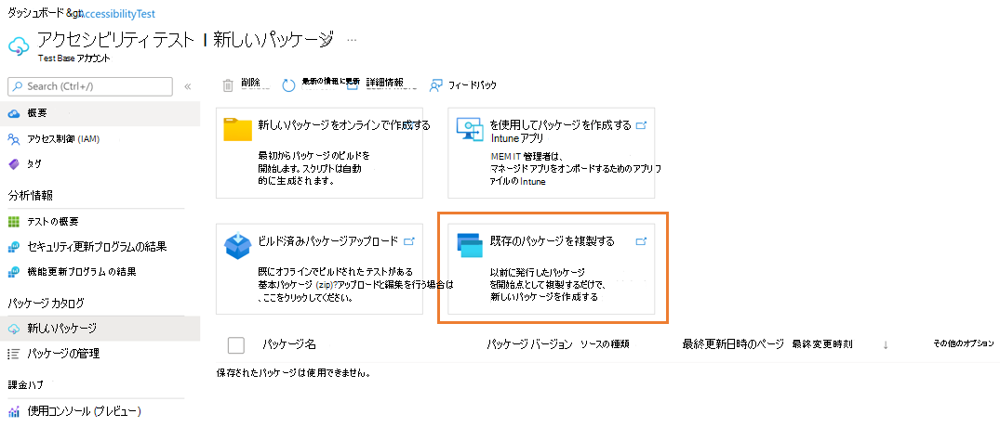
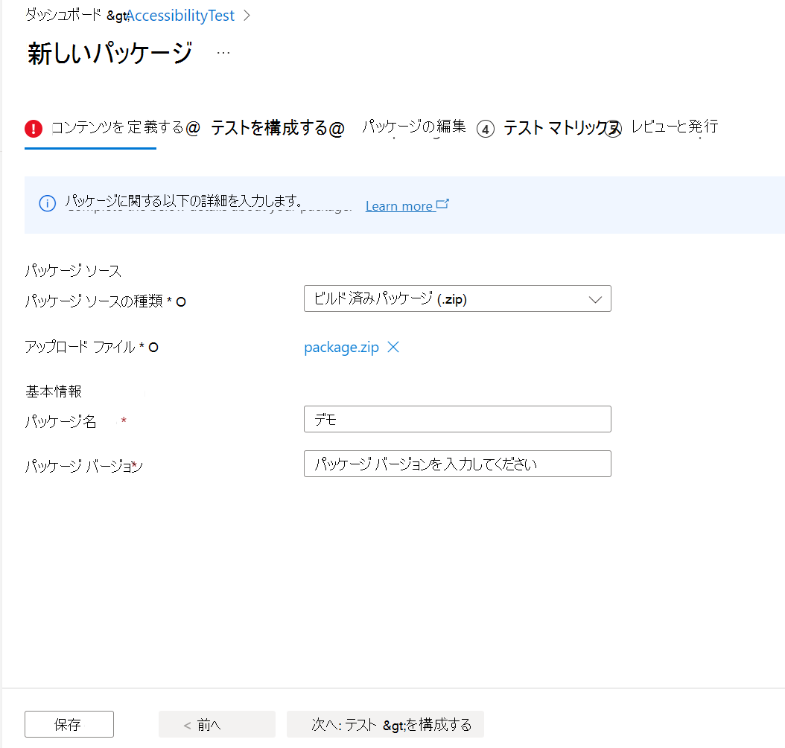

# 既存のパッケージを複製する

このセクションでは、以前に発行したパッケージを開始点として複製して、新しいパッケージを作成する方法について説明します。 テスト ベース ポータルには、複製パッケージ体験を開始するための複数の入り口があります。

> [!IMPORTANT]
> パッケージの複製関数を使用するには、テスト ベースに少なくとも 1 つの正常にアップロードされたパッケージが必要です。 

## [新しいパッケージ] ページから開始する

> [!div class="mx-imgBorder"]
> 

1. [ **新しいパッケージ** ] ページで、[ **既存のパッケージの複製**] を選択できます。 次に、既存のパッケージの一覧から 1 つのパッケージを選択し、[ **複製] を** クリックします。 

   > [!div class="mx-imgBorder"]
   > [を複製する ](Media/clonepackage02_clone_package.png#lightbox)

2. すべての情報と構成が複製したパッケージと同じように事前に設定された新しいパッケージ作成手順に移動します。 変更する必要がある情報は、[**基本情報**] セクションの **[パッケージ のバージョン**] だけです。 

   > [!NOTE]
   > パッケージ名とバージョンの組み合わせは、Test Base アカウント内で一意である必要があります。 

   > [!div class="mx-imgBorder"]
   > 

3. 次のことが可能です。

   - 複製パッケージから複製するすべての事前設定済みパッケージ設定情報をプレビューします。 
   - 手順 1 から手順 4 に変更を加えます (詳細な手順については、「ビルド済みの zip パッケージのアップロード」を参照)。 
   - を確認し、テスト ベースに発行します。 

## [パッケージの管理] ページから開始する

[ **パッケージの管理** ] ページで、[クイック アクション] 列の下にある **[複製** ] アイコンを選択して、パッケージを複製できます。 

> [!div class="mx-imgBorder"]
> [![[パッケージの管理] ページ](Media/clonepackage04_manage_packages.png) ](Media/clonepackage04_manage_packages.png#lightbox)

または、[パッケージの **管理**] ページで選択した特定のパッケージの [**パッケージの概要**] ページに移動し、トップ アクション メニューの [パッケージの **複製**] アイコンを選択することもできます。

> [!div class="mx-imgBorder"]
> [から複製する ](Media/clonepackage05_overview.png#lightbox)

