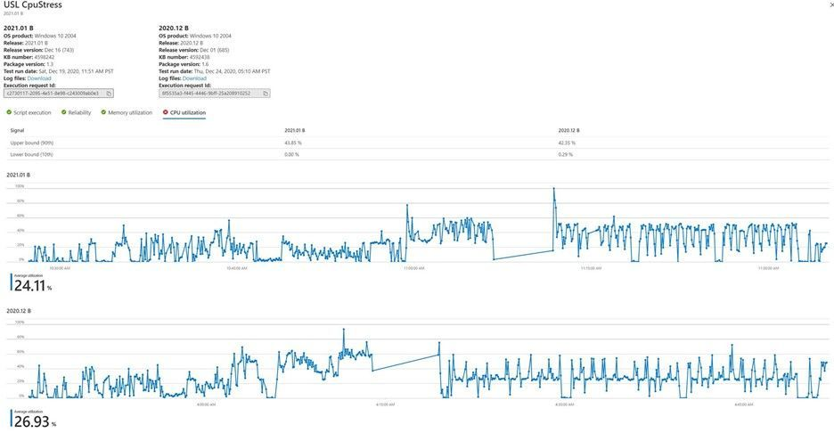

# インテリジェント CPU 回帰分析

CPU 使用率は、アプリケーションがオペレーティング システム更新プログラムの影響を受けるかどうかを示します。 

Test Base for Microsoft 365 は、今後の Windows オペレーティング システム (OS) 更新プログラムの異なるバージョンでアプリケーションが実行されている場合に発生する CPU パフォーマンスの回帰に関する分析情報をソフトウェア開発者に提供します。 

これらの CPU 回帰により、開発者は OS 更新プログラムを広く展開する前にアプリケーションの問題 (および潜在的な障害) を検出して解決し、エンド ユーザーの悪いエクスペリエンスを防ぐことが可能になります。

### CPU 回帰分析のしくみ ###

Test Base ユーザーは、アプリケーションのバイナリ (単一の .zip ファイル内) を関連付けられたテスト スクリプトと共にアップロードし、Azure のテスト ベース ポータルでアプリケーションをテストする Windows OS バージョンを選択できます。 

次に、テスト ベース サービスはテスト スクリプトを実行し **、CPU 回帰分析を実行します**。 

サービスは、ターゲット OS のプレリリース バージョンの更新プログラム上のアプリケーションの CPU 使用率が、リリースされたバージョンの OS の CPU 使用率と一緒にあるか確認します。 

OS の 2 つのバージョンで実行されているプロセスは、OS のバージョンが異なって完全に一致する場合と一致しない場合があります。ただし、Test Base によって実行される分析では、今後の OS 更新プログラムによってアプリケーションの CPU 使用率が影響を受け、具体的には以前のテスト実行からどのプロセスが後退したのかを確認できます。

以下のスナップショットでは、同じアプリケーションの CPU 使用率を比較する 2 つの OS リリースがあります。 
-   [CPU 使用率] タブには、それぞれ 90 パーセントと 10 パーセントの両方のリリースの使用率の上限と下限が表示されます。 
-   グラフは、平均使用率と共に CPU 使用率の時系列を示しています。 

お客様は、この機能を使用して、アプリケーションの CPU 使用率が OS 更新プログラムの影響を受けるかどうかを判断し、具体的には以前の実行からどのプロセスが後退したのか判断できます。

### 関連するプロセスの識別 ###

ここでは、アプリケーション内の回帰プロセスを識別する方法について説明します。 

パフォーマンス回帰を分析するには、テストの実行中に仮想マシンで実行されるプロセスごとに、さまざまな種類のパフォーマンス カウンターを追跡する必要があります。 

このような分析は、特定のアプリケーションの多くのプロセスに対して多くの変数をキャプチャします。 一部のプロセスが実行またはアプリケーションに関連付けられている場合ではありません。 この課題を回避するために、確率と情報理論を使用した相互情報ランク付けアルゴリズムを適用して、特定のアプリケーションに最も関連性の高いプロセスを特定します。 

アプリケーションは 1 種類の個別ランダム変数と見なされ、プロセスは別の種類の個別ランダム変数と見なされます。 2 つのランダム変数の関連付けは、関連性の条件付き確率を使用して測定されます。 

次に、各アプリケーションの関連性の順序でプロセスが表示されます。 また、CPU 回帰分析に関連するプロセスと共に、既定で監視できるプロセスのサブセットをお気に入りに設定できます。 回帰が検出されると、パフォーマンス アナライザー ツールキットWindowsダウンロードし、CPU パフォーマンス回帰の理由を分析できます。 

パフォーマンス Windowsは、イベント トレース ログ (ETL) を入力として受け取り、これらの .etl ファイルは、ポータルでテスト実行のためにダウンロード可能なログ ファイルで使用できます。 CPU パフォーマンスのデバッグの詳細については、「パフォーマンス アナライザー」のドキュメントWindows参照してください。

