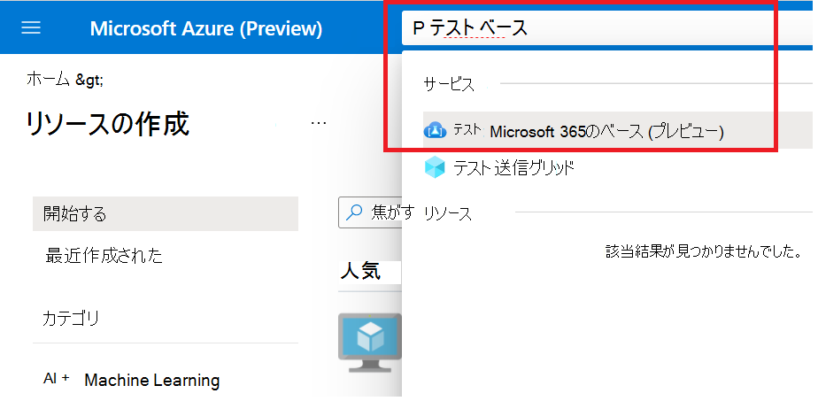
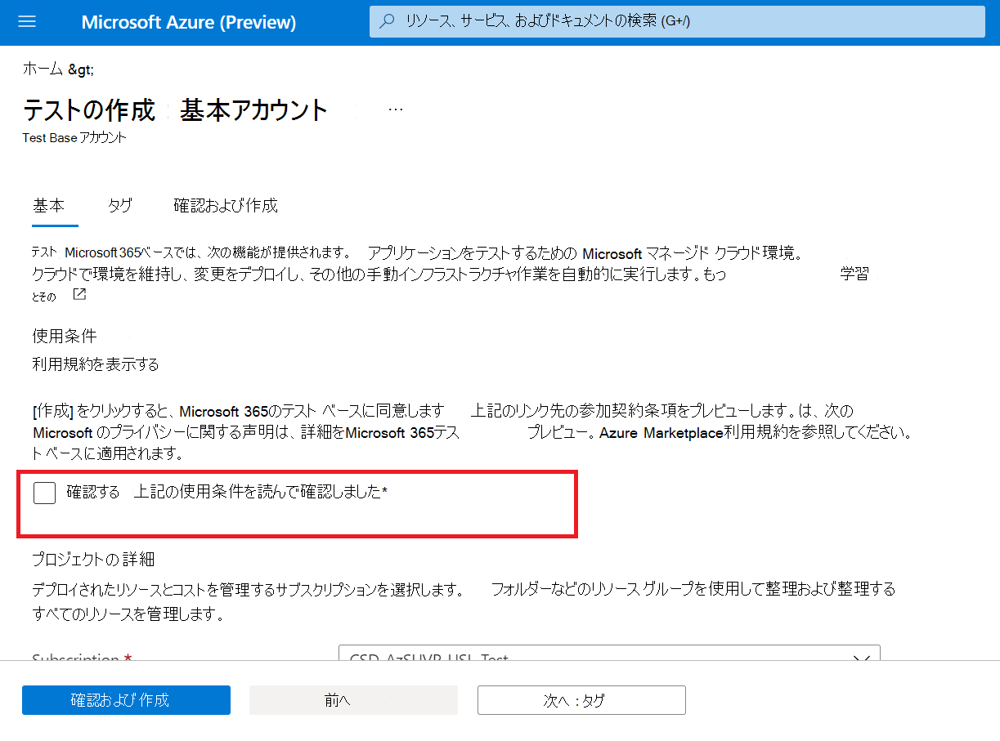

# <a name="step-1-create-a-test-base-account"></a>手順 1: テストベース アカウントを作成する

Azure サブスクリプションをお持ちでない場合は、開始する前に [無料アカウント](https://azure.microsoft.com/en-us/free/) を作成してください。

## <a name="enter-details-for-test-base-account"></a>テストベース アカウントの詳細を入力する
 
1. Azure portal **で 'Test Base'** を検索します。



2. [ **追加] をクリックして** テストベース アカウントを作成します。

![[追加] をクリックしてアカウントを作成する](Media/CreateTestAccount2.png)

3.  チェック ボックスをオン ```Terms of Use``` にして、満足度を確認します ```Terms of Use``` 。



4.  次の要件に従って、正しい情報を入力します。 
    -   サブスクリプション: リソース グループ
    -   インスタンスの詳細: 名前。

**現在、テスト ベースは標準価格レベルのみをサポートしています。**


5.  最後に、[オン] ```Review + Create``` をクリックして、新しく作成したアカウントを検証して有効にします。

## <a name="next-steps"></a>次の手順

次の記事に進み、「手順 2: パッケージをアップロードする **方法」を参照してください。**
> [!div class="nextstepaction"]
> [次の手順](uploadApplication.md)

<!---
Add button for next page
-->
