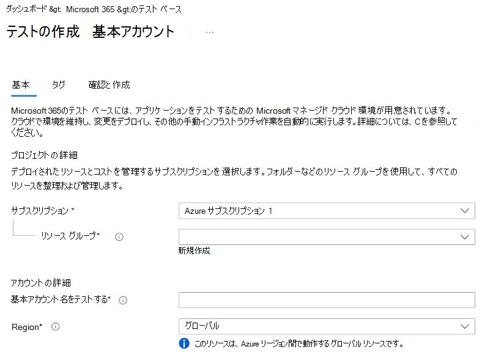
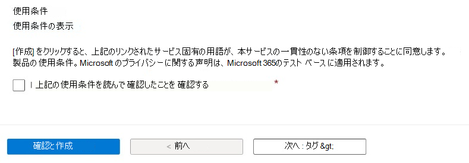
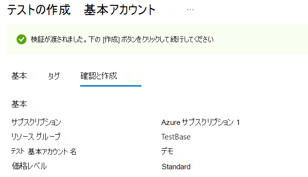
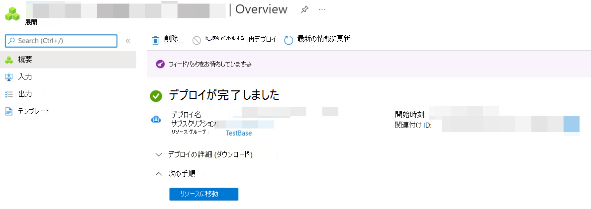

# テスト ベース アカウントの作成

**Test Base** アカウントを作成するには、次の手順に従います。 

> [!IMPORTANT]
> **Test Base** アカウントに登録するには、サブスクリプションが必要です。 Azure サブスクリプションをお持ちでない場合は、[Azure ホーム](https://ms.portal.azure.com/#home) ページの **サブスクリプション** を参照して、サブスクリプションを作成する方法について説明します。 

## Test Base アカウントを作成するには
 
1. [Azure portal](https://ms.portal.azure.com/#home)のホーム ページで、Azure Marketplace の **Microsoft 365 のテスト ベース** を検索して、**Test Base** アカウントを作成するためのコントロールを表示します。 

   > [!div class="mx-imgBorder"]
   > [の検索 ](Media/creatingaccount01-search.png#lightbox)

2. **Microsoft 365 のテスト ベース** ページのコントロール フィールドで、次のように **[作成**] ボタンを選択して、[**テスト ベース アカウントの作成**] ページを開きます。 

   > [!div class="mx-imgBorder"]
   > [![[テスト ベース] ページ](Media/creatingaccount02-testbase.png) ](Media/creatingaccount02-testbase.png#lightbox)

3. [ **テスト ベース アカウントの作成** ] ページで、[ **テスト ベース** アカウントの作成] ページの次の必須入力フィールドに情報を追加します。 

   - **[サブスクリプション]** - ドロップダウン リストから、Azure サブスクリプション ID を見つけて選択します。 
   - **[リソース グループ**] - [新規作成 **] を選択** し、表示される [ **名前** 入力] ボックスに選択した名前を指定して、新しいリソース グループを作成します。 完了したら **、[OK] を選択します** 。 **リソース グループ** が既にある場合は、ドロップダウン リストでその名前を見つけて選択します。 
   - **[アカウント****の詳細**] で、次の図に示すように、入力テキスト フィールドに入力して **、Test Base** アカウントの選択した名前を指定します。 

   > [!NOTE]
   > すべての必須フィールド (*)に入力を指定する必要があります。 

   > [!div class="mx-imgBorder"]
   > 

   > [!NOTE]
   > 2022 年 4 月の時点で、 **Test Base** は **Standard** 価格レベルのみをサポートしています。 **価格レベル** は、Azure サブスクリプションに対して課金されるリソースと時間単位のサービス コストを決定します。 

   > [!div class="mx-imgBorder"]
   > 

4. **利用規約** をお読みください。 使用条件が許容される場合は、チェック ボックスをオンにして、使用条件を読んで同意したことを確認します。 

   > [!div class="mx-imgBorder"]
   > 

5. [ **テスト ベース アカウントの作成** ] ページの下部にある [ **確認と作成** ] を選択して、指定した入力データを検証します。 

   検証プロセスが成功した場合は、[ **テスト ベース アカウントの作成** ] ページで入力データの構成を確認できます。 

   > [!div class="mx-imgBorder"]
   > 

6. 前の [**テスト ベース アカウントの作成**] ページの下部のセクターに表示されている [**作成**] ボタンを選択します。 

   > [!div class="mx-imgBorder"]
   > ![[作成] ボタン](Media/creatingaccount07-create.png)

7. ユーザー **の [デプロイ]** ページで、[ **リソースに移動** ] を選択して新しい **テスト ベース** アカウントの概要ページを開き、 **テスト ベース** の探索、構成、および体験を開始します。 

   > [!div class="mx-imgBorder"]
   > 

