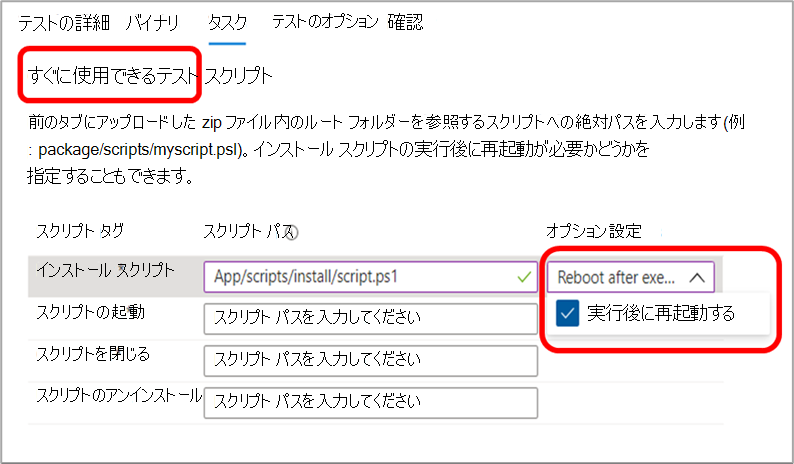
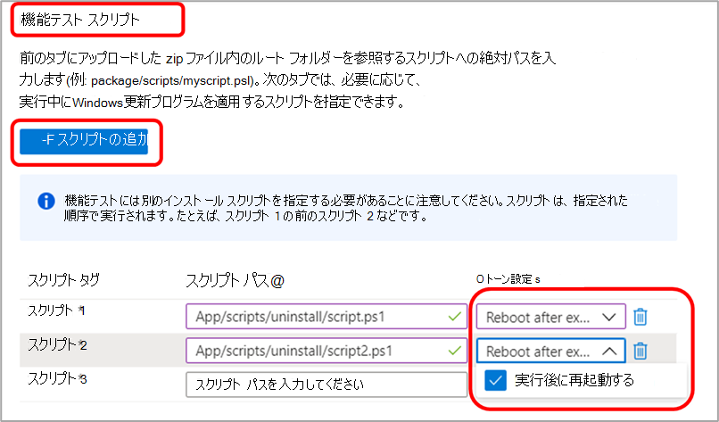

# テスト ベースに関する FAQ

**Q: パッケージをテストベース チームに提出する方法**

**A:** セルフサービス ポータルを使用して、パッケージを Test Base 環境に直接送信します。

アプリケーション パッケージを提出するには [、Azure Portal](https://www.aka.ms/testbaseportal "テストベースのホームページ") に移動し、セルフサービスのテスト ベース ポータル ダッシュボードを介して、アプリケーションのバイナリ、依存関係、およびテスト スクリプトを含む zip 形式のフォルダーをアップロードします。 

詳細については、オンボーディング ユーザー ガイドを参照するか、サポートと詳細については、弊社の <testbasepreview@microsoft.com> チームにお問い合わせください。

**Q: アウトオブボックス (OOB) テストとは**

**A:** 標準 (OOB) テストは標準化され、既定のテストは、アプリケーション パッケージがインストールされ、起動され、30 回閉じ、アンインストールされる場所で実行されます。 

Test Base 用に作成されたパッケージには、インストール、起動、閉じる、必要に応じてアンインストール スクリプトのテスト スクリプトが含まれます。 

アウトオブボックス (OOB) テストでは、アプリケーション上で標準化されたテレメトリを提供し、さまざまなビルドWindowsできます。

**Q: アウトオブボックス テスト (インストール、起動、閉じる、テスト スクリプトのアンインストール) の外部でテストを提出できますか?**

**A:** はい、ユーザーはセルフサービス ポータル ダッシュボードを介して **機能** テスト用のアプリケーション パッケージをアップロードすることもできます。
**機能テストは** 、ユーザーがスクリプトを実行してアプリケーションでカスタム機能を実行できるテストです。

## テスト

**Q: 機能テストをサポートしていますか?**

**A:** はい、Test Base は機能テストをサポートしています。 機能テストは、お客様がスクリプトを実行してアプリケーションでカスタム機能を実行できるテストです。 

機能テスト用にアプリケーション パッケージを提出するには、セルフサービス ポータル ダッシュボードを介して、アプリケーションのバイナリ、依存関係、およびテスト スクリプトを含む zip フォルダーをアップロードします。 

詳細については、オンボーディング ユーザー ガイドを参照するか、サポートと詳細については、弊社の <testbasepreview@microsoft.com> チームにお問い合わせください。

**Q: Test Base はテスト データを処理する方法を示します。**

**A:** Test Base は、Azure 環境上のテスト データを安全に収集および管理します。 

**Q: テスト ベースは自動テストをサポートできますか?**

**A:** はい、Test Base は自動テストをサポートしますが、サービス機能のため、現時点では手動テストはサポートされていません。

**Q: 自動テストの言語とフレームワークは何をサポートしていますか?**

**A:** すべての言語とフレームワークをサポートしています。 PowerShell を使用してすべてのスクリプトを呼び出します。 

また、必要なフレームワークの依存バイナリを提供 (アップロード) する必要があります。

**Q: テスト ベースでテスト結果が提供される時間はどのくらいですか?**

**A:** プレリリース ビルドに対して実行するテストごとに [、Azure Portal](https://www.aka.ms/testbaseportal "テストベースのホームページ") ダッシュボードで 48 時間以内に結果を提供します。

**Q: インストール後に再起動できますか?**

**A:** はい、インストール後の再起動をサポートしています。 オンボーディング ポータルでタスクを設定する場合は、必ず [オプション設定] ドロップ リストから **このオプションを** 選択してください。

アウトオブボックス (OOB) テストでは、Install スクリプトに再起動が必要かどうかを _指定できます。_

機能テストの場合は、追加するスクリプトごとに再起動が必要かどうかを指定できます。

**Q: サポートWindowsバージョンは何ですか?**

**A:** 現在、Windows 10 クライアント、Windows Server 2016、Windows Server 2016 Core バージョン、Windows Server 2019、Windows Server 2019 Core バージョンをサポートしています。

**Q: セキュリティ更新プログラムのテストと機能更新プログラムのテストの違いは何ですか?**

**A:** セキュリティ更新プログラムのテストでは、ユーザーが **<ins></ins>** 常に安全で保護された状態を保つことに重点を置Windowsの月次プレリリース セキュリティ更新プログラムに対してテストします。 機能更新プログラムのテストでは、2 **<ins></ins>** 年に 1 回のリリース前の機能更新プログラムに対してテストを行い、この更新プログラムで新しい機能と機能を導入Windows。

## デバッグ オプション

**Q: 障害が発生した場合に仮想マシン (VM) にアクセスできますか?テストベースは何を共有しますか?**

**A:** サービスに準拠し、リリース前の更新プログラムをセキュリティで保護するには、Microsoft だけが VM にアクセスできます。 ただし、テスト結果とその他のテスト 指標は、クラッシュおよびハング信号、信頼性メトリック、メモリ、CPU 使用率など、ポータル ダッシュボードで表示できます。また、ダッシュボードでテスト実行のログを生成して提供し、ダウンロードと分析を行います。 

必要に応じてクラッシュ デバッグ用のメモリ ダンプも提供できます。

**Q: テスト中に問題が見つかった場合、これらの問題を解決するための次の手順は何ですか?**

**A:** テスト ベース チームは、最初のトリアージ プロセスを実行してエラーの根本原因を特定し、その結果に応じて、デバッグのために Microsoft 内の顧客または内部チームにルーティングします。 

お客様と常に密接に取り組み、問題を解決するために共同修復を行います。 

**Q: 問題が解決するまで、Microsoft はセキュリティ 更新プログラムのリリースを保持していますか?使用可能な代替解像度は何ですか?**

**A:** Test Base の目標は、共同エンド のお客様が問題に直面しなかからなかろうという点です。 ソフトウェア ベンダーと一緒に、リリース前に問題に対処しますが、修正が不可能な場合は、シムやブロックなどの他の解決策があります。

## その他

**Q: サービスはプレムサーバーでどのように動作しますか?**

**A:** 現在、オンプレム サーバーのサポートは提供されていません。 ただし、サーバーが HTTP エンドポイントを公開している場合は、インターネットを使用して接続できます。

**Q: Who VM をホストしますか。**

**A:** Microsoft は、このサービスの VM をプロビジョニングし、その負荷を顧客から受け取っています。

**Q: このサービスは Web、モバイル、またはデスクトップ アプリケーションをサポートしていますか?**

**A:** 現時点では、デスクトップ アプリケーションに焦点を当てしていますが、今後 Web アプリケーションをオンボードする予定がありますが、現時点ではモバイル アプリケーションはサポートされていません。

**Q: テスト ベースと SUVP の違いは何ですか?**

**A:** テストベースとSUVPの最大の違いは、検証のためにアプリケーションをテストベース Azure 環境にオンボードするパートナーが、テスト自体を実行する代わりにプレリリース更新プログラムに対して実行される点です。 

プレリリースのセキュリティ更新プログラムのテストに加えて、プラットフォームでのプレリリース機能更新プログラムのテストもサポートしています。 ロードマップには、他にも多くの種類の更新プログラムと OS テストがあります。

**Q: サービスに関連付けられているコストはありますか。**

**A:** Test Base サービスは、一般提供 (GA) までユーザーに無料で提供されます。 その時点で、すべての顧客に対して有効になるコスト構造を発表します。 

**Q: テスト ベースに関するフィードバックを提供する方法**

**A:** テスト ベースに関するフィードバックを共有するには、ポータルの左下にある [フィードバック] アイコンを選択します。 Microsoft がフィードバックをよりよく理解するために、申請にスクリーンショットを含める。 

また、製品の提案を提出し、他のアイデアをアップヴォテすることができます <testbasepreview@microsoft.com> 。
