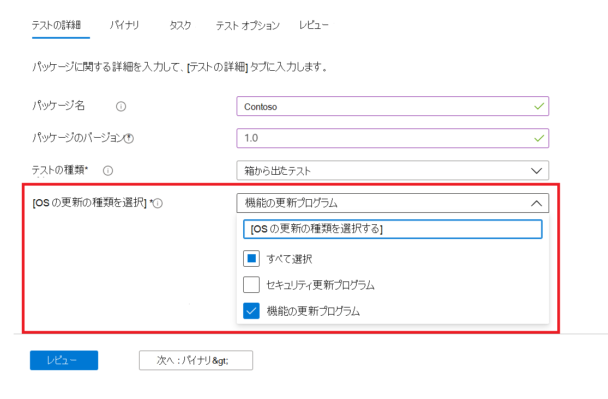
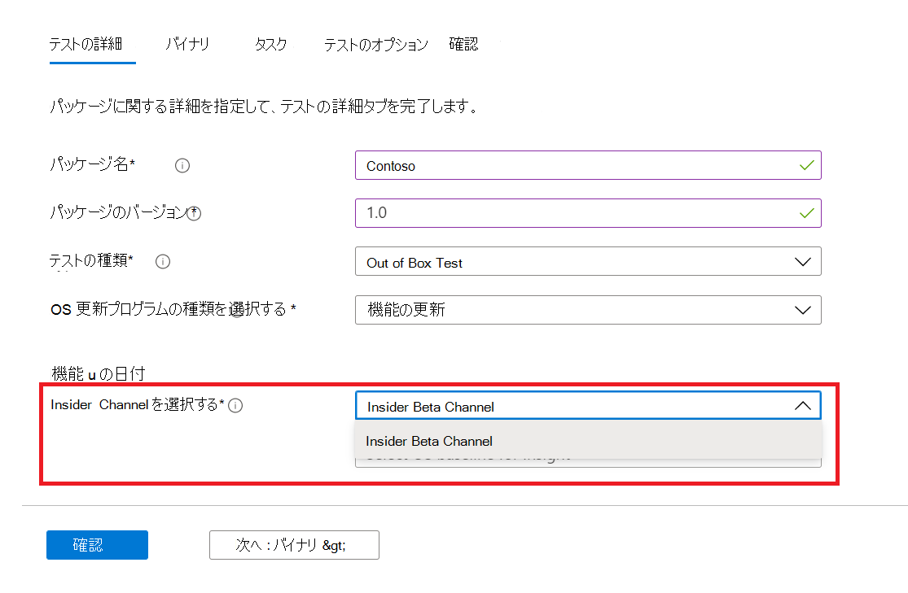
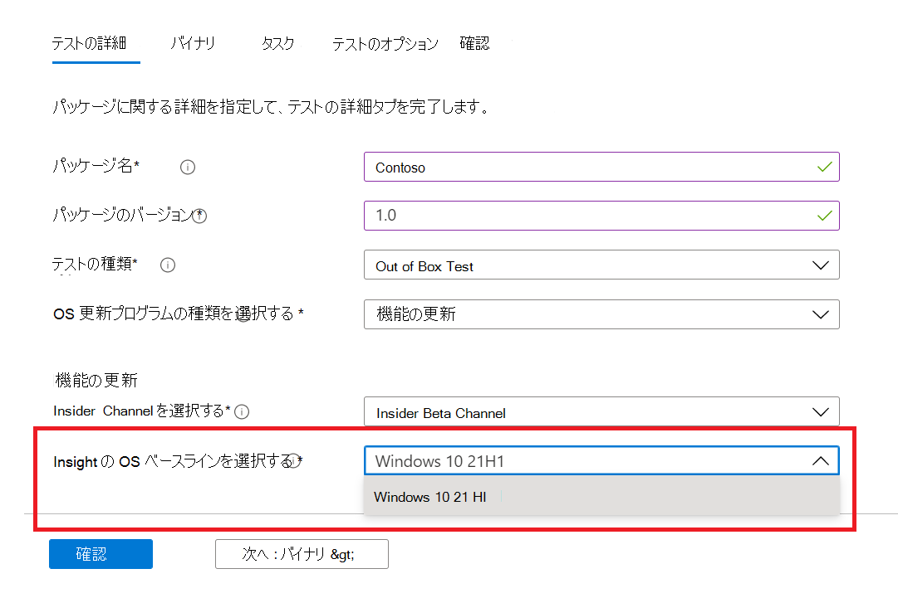

# <a name="windows-feature-update-validation"></a>Windows機能更新プログラムの検証

Windows 10 または Windows 11 の次のリリースでアプリケーションがどのように実行されるのか、新しい機能を検証するための環境を維持せずに、Windows 必要ですか? 

Azure 環境で Insider Program Windowsに対して検証テストを実行しますか?

 M365 のテスト ベースの機能更新プログラムの検証は、これらすべての機能を実現するのに役立ちます。

以下の手順の概要を参照して、M365 サービスの Test Base でこの新しい機能にアクセスする方法について説明します。

M365 のテスト ベースで始めるには、セルフサービス オンボーディング ポータルを使用してアプリケーション (および関連ファイル ```Feature update validation``` ) をアップロードします。 

以下に、テストの詳細を入力する手順を **示します**。

1. OS **更新プログラムの種類として** [機能更新プログラム] を選択します。



2. アプリケーションをWindowsする Insider チャネルを選択します。  



3. テストのベースラインとして Windows 10 または Windows 11 の市場リリースを選択し (結果として得られる分析情報!)、パッケージの正常なオンボードに必要なその他の詳細を提供します。



4. 事前にリリースされた機能更新プログラムに対するアプリケーションの検証の結果を表示するには、Windows 10を参照してください ```Feature Updates Test Results``` 。


## <a name="next-steps"></a>次の手順

次の記事に進み、メモリ回帰分析について説明します。
> [!div class="nextstepaction"]
> [次の手順](memory.md)

<!---
Add button for next page
-->
