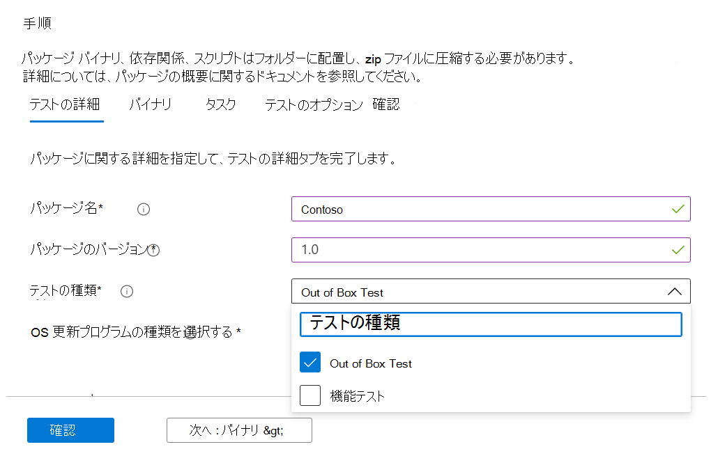
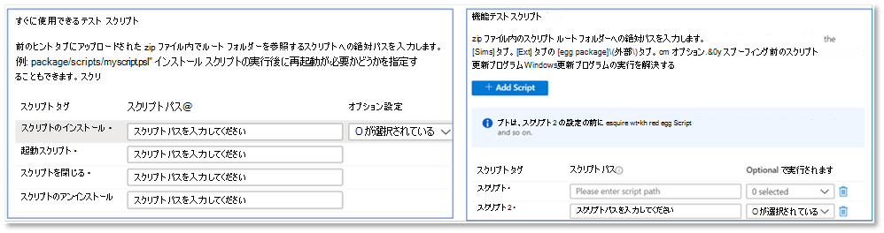
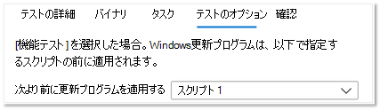

# <a name="functional-testing"></a>機能テスト

ソフトウェア ベンダーとして、セルフサービスの M365 ポータルのテスト ベースを使用して、任意のテスト フレームワークを使用してカスタム機能テストを実行できるようになりました。 

最初にサービスを開始したとき、標準化されたスクリプトによって駆動される定義済みの一連のテストである、既定のテストが提供されました。 ただし、これは多くの独立系ソフトウェア ベンダー (ISV) の完全なテスト カバレッジを達成できませんでした。 

そのため、お客様からのフィードバックに応じて、自動機能テストをアップロードする機能を ISV に提供しています。

この機能を使用するには、次の手順に従います。

1. ファイル (バイナリ、依存関係、スクリプト) を単一の.zip パッケージとしてアップロードします。
2. テスト Virtual Machines (VM) をさまざまな実行ポイントで再起動するかどうかを選択します。
3. スクリプトで使用可能なオプションを管理します。
4. 実行中に VM にWindows更新プログラムを適用するタイミングを選択します。

上記の手順の詳細な説明を次に示します。

**機能テスト パッケージをアップロードする**

開始するには、アップロード ページに移動し、Azure の [Test Base for M365 portal] の左側のナビゲーション メニューにある [アプリケーション カタログ] で新しいアプリケーションアップロード選択します。 そこから：

タブ 1 - 基本情報を入力します。 アプリケーションの名前とバージョンを指定します。 [テストの種類] オプションで、 を選択します ```Functional tests```。 

*既定では、Out-Of-Box (OOB) オプションが必要であることに注意してください。*




タブ 2 - テスト全体 (バイナリ、依存関係、スクリプトなど) を含む zip ファイルをアップロードして、パッケージのコンポーネントをアップロードします。 

詳細については、「aka.ms/usl-package-outline」を参照してください。 (注: Out-of-Box テスト スクリプトと機能テストの内容の両方を同じ zip ファイルに配置する必要があります)。 現在、ファイル サイズは 2 GB に制限されています。

タブ 3 - 既定のテスト タスクと機能テスト タスクを構成します。 ここでは、アプリケーションのインストール、起動、終了、アンインストールを行う PowerShell スクリプトへのパスと、機能テストを実行するすべてのカスタム スクリプトへのパスを選択します。 **(注: アプリケーションをアンインストールするスクリプトは省略可能です)。**

現在、機能テスト用に 1 ~ 8 個のスクリプトをアップロードできます。 (さらにスクリプトが必要な場合は、この投稿にコメントしてください)。



(省略可能)インストール後に再起動を構成します。 一部のアプリケーションでは、インストール後に再起動が必要です。 

スクリプトの実行後に再起動を実行する場合は、[タスク] タブで特定のスクリプトを選択 ```Reboot After Execution``` します。

タブ 4 - Windows更新プログラムがインストールされるタイミングを選択します。Windows Updateパッチのアプリケーションは、任意のスクリプトの前に実行されます。 実際のアプリケーションの使用シナリオを厳密に模倣するために、アプリケーションのインストール後にWindows更新プログラムをインストールすることをお勧めします。



タブ 5 - パッケージを確認して作成します。 上記の手順を完了したら、選択 ```Create``` してアップロード プロセスを完了します。

パッケージが作成されたら、パッケージの検証状態を確認できます。

初期テストを実行して、アプリケーションのインストール、起動、終了、アンインストールを行います。 これにより、パッケージがエラーフリーのサービスにインストールできることを確認できます。

確認プロセスには最大 24 時間かかる場合があります。 確認が完了すると、メニューに状態が ```Manage packages``` 表示されます。これは、次の 2 つのエントリのいずれかになります。

1. 検証が成功しました。パッケージは、選択した OS ビルドのプレリリースWindows更新プログラムに対して自動的にテストされます。
または
2. 検証が失敗する: 失敗の理由を調査し、問題を解決し、パッケージを再アップロードする必要があります。

また、Azure portalの通知アイコンを使用して、どちらの結果も通知されます。
