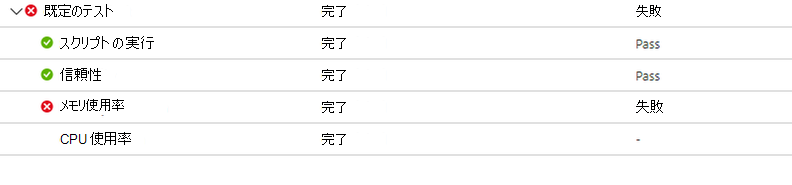
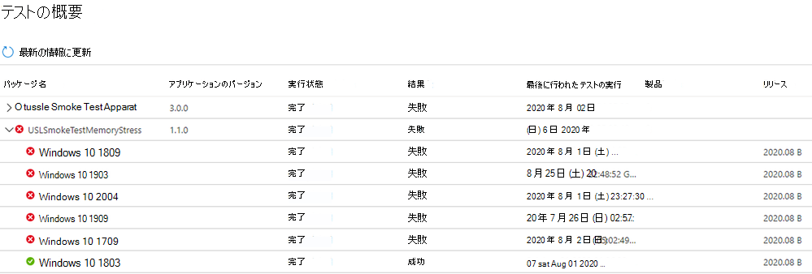
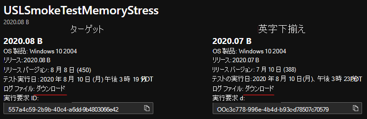

# <a name="memory-regression-analysis"></a>メモリ回帰分析

Test Base を使用すると、アプリを実行しているテスト VM のメモリ使用量が大幅に増加しているのを明確に確認できます。 メモリ使用量などのパフォーマンス指標は、アプリケーション全体の正常性を示す可能性があります。この追加は、アプリのパフォーマンスを最適に維持するのに大いに役立つと考えます。

詳しくは、このビデオをご覧ください。最新の改善点を簡単に確認してください。 

回帰分析に役立つ M365 の Test Base の詳細については、「プロセスの信頼性に基づく回帰結果」を参照してください。

<b>メモリ回帰を詳しく見る</b>

M365 のテスト ベース ダッシュボードは、新しいリリース済みの Windows 更新プログラムでアプリケーションが消費したメモリを表示し、前回リリースされた Windows 更新プログラムで使用されたメモリと比較します。 

今月の機能強化により、メモリ回帰分析は、お気に入りのプロセスで取り上がっています。 アプリケーションには複数のプロセスを含め、信頼性タブを使用して、お気に入りのプロセスを手動で選択できます。次に、これらのお気に入りのプロセスのメモリ回帰を特定し、さまざまな更新プログラム リリースでテストの実行Windowsします。 回帰が検出された場合は、回帰に関する詳細を簡単に利用できます。

次に、この機能について詳しく説明し、パフォーマンス アナライザーを使用してメモリ回帰をトラブルシューティングするWindowsします。

メモリ回帰によって発生する障害信号は、[メモリ使用率] の [テスト結果] ページの [M365 のテスト ベース] ダッシュボードに表示されます。




メモリ消費量が多いアプリケーションのエラーは、[テストの概要] ページ ```Fail``` にも表示されます。



これらの障害信号を前もって提供することで、アプリケーションのエンド ユーザー エクスペリエンスを中断し、影響を与える可能性のある問題に明確にフラグを設定します。 

その後、ログ ファイルをダウンロードし、パフォーマンス アナライザーまたはWindowsツールキットを使用して、詳細を調査できます。 また、M365 のテスト ベース チームと共同で問題の修復に取り組み、エンド ユーザーに影響を与える問題を防ぐのに役立ちます。

メモリ信号は、すべてのテスト実行の M365 サービスのテスト ベースの [メモリ使用率] タブにキャプチャされます。 次の例は、2020 年 8 月のプレリリースセキュリティ更新プログラムに対するオンボード アプリケーション "Smoke Test Memory Stress" を使用した最近のテスト実行を示しています。 (このアプリケーションは、メモリ回帰を説明するためにチームによって作成されています)。


この例では、お気に入りのプロセス "USLTestMemoryStress.exe" プロセスは、リリース前の 8 月の更新プログラムで、リリース済みの 7 月の更新プログラムと比較して平均約 100 MB を消費するため、M365 のテスト ベースで回帰が特定されました。 

"USLTestMemoryStress_Aux1.exe" と "USLTestMemoryStress_Aux2.exe" と示す他のプロセスも同じアプリケーションに属しますが、2 つのリリースでほぼ同じ量のメモリを消費し、"渡された" ので正常と見なされました。

メイン プロセスの回帰は"統計的に有意" と判断されたので、サービスはユーザーにこの違いを伝え、強調しました。 比較が統計的に有意ではない場合、強調表示されません。 メモリ使用率はノイズが大きいので、統計的モデルを使用して、ビルドとリリース間で重要な違いを区別します。 

真の差 (誤検知) がない場合、比較にフラグが設定されることはほとんどありませんが、これは回帰 (または正の値) を正しく識別する可能性を向上させるために必要なトレードオフです。

次の手順では、メモリ回帰の原因を理解します。 以下に示すように、[ログ ファイルのダウンロード] オプションから両方の実行の zip ファイルをダウンロードできます。 

これらの zip ファイルには、ETL ファイルに含まれるスクリプトの結果、メモリ、CPU パフォーマンス データなど、テスト実行の結果が含まれます。



2 つのテスト実行のログをダウンロードして解凍し、各フォルダー内の ETL ファイルを見つけて、それらを target.etl (プレリリース更新プログラムのテスト実行の場合) と baseline.etl (前回リリースされた更新プログラムのテスト実行用) に名前を変更して、探索とナビゲーションを簡略化できます。
 
## <a name="next-steps"></a>次の手順

次の記事に進み、インテリジェントな CPU 回帰分析について説明します。
> [!div class="nextstepaction"]
> [次の手順](cpu.md)

<!---
Add button for next page
-->
