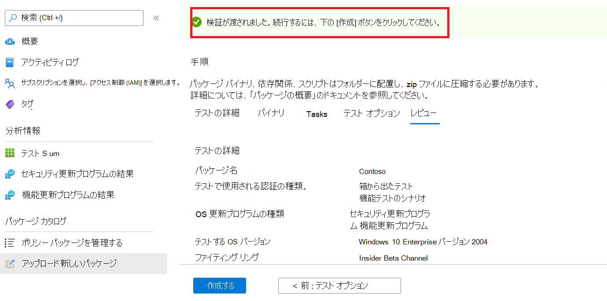
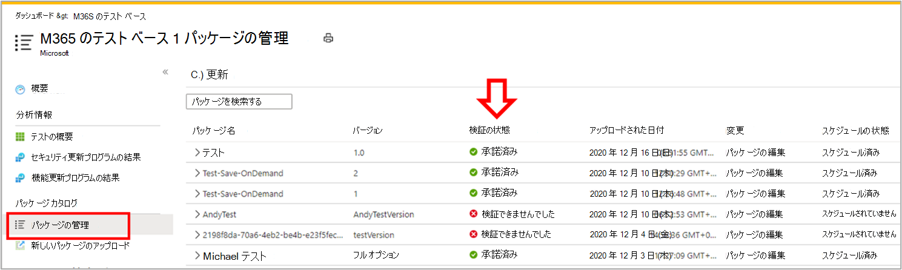

# <a name="step-6-review-your-selections-to-create-your-package"></a>手順 6: 選択内容を確認してパッケージを作成します。

1.  このタブでは、サービスはテストの詳細を表示し、クイック完了チェックを実行します。 

    メッセージ ```Validation passed``` は ```Validation failed``` 、次の手順に進めるかどうかを示します。

2.  テストの詳細を確認し、満たされた場合は、ボタンをクリック ```Create``` します。 



3.  これにより、パッケージが Test Base 環境にオンボードされます。 パッケージが正常に作成されると、Azure でパッケージを正常に実行できるかどうかを確認する自動テストがトリガーされます。


> [!Note]
> Azure portal から通知を受け取り、パッケージ検証の成功または失敗を通知します。 
>
> このプロセスには最大 24 時間かかる場合があるため、アクティブではない場合は Web ページがタイムアウトする可能性があるため、このオンデマンド実行が完了したという通知は通知されません。 

  - Peradventure この問題が発生すると、タブでパッケージの状態を表示 ```Manage packages``` できます。



  - テストの結果は、アップロード後数日後にスケジュールされた間隔で 、およびページを介して ```Test Summary``` ```Security Updates Results``` ```Feature Updates Results``` 確認できます。
  
  - テストに失敗した場合は、新しいパッケージをアップロードする必要があります。 
  
    詳細な分析については ```test logs``` 、'とページから ```Security update results``` ダウンロード ```Feature updates results``` できます。

  - テストエラーが繰り返し発生する場合は、エラーの testbasepreview@microsoft.com を確認してください。 

## <a name="next-steps"></a>次の手順

以下のリンクからコンテンツ ガイドラインをご覧ください。
> [!div class="nextstepaction"]
> [次の手順](contentguideline.md)
