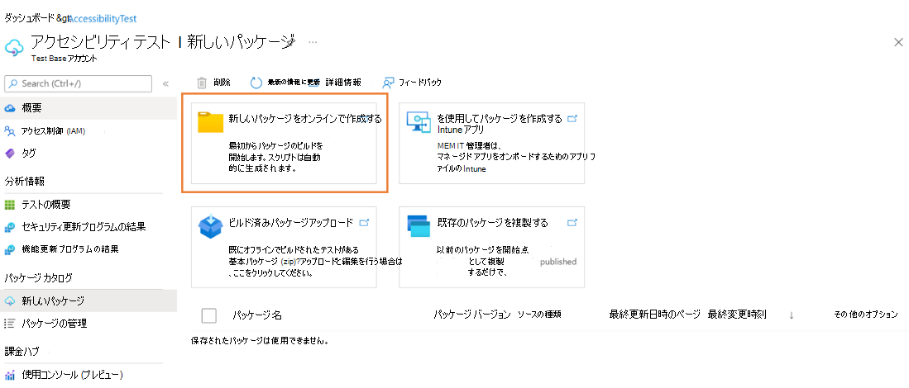
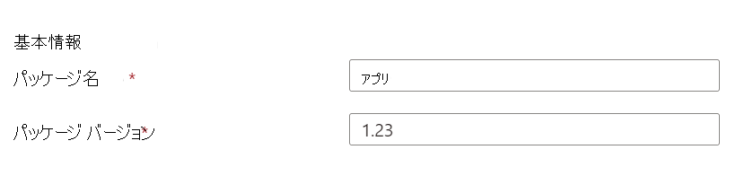
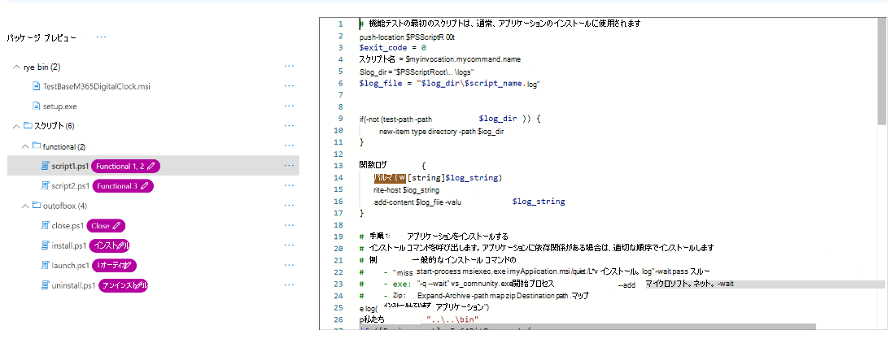
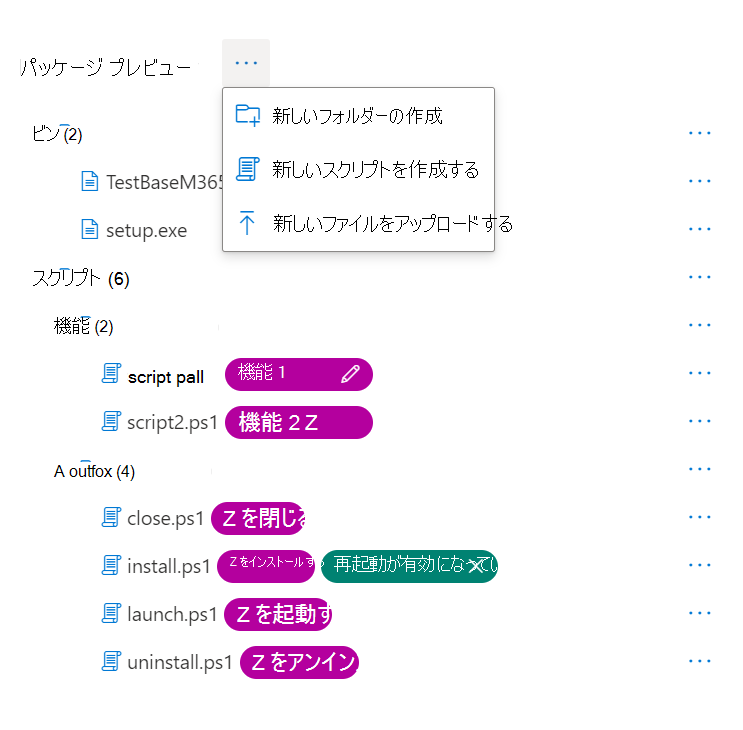
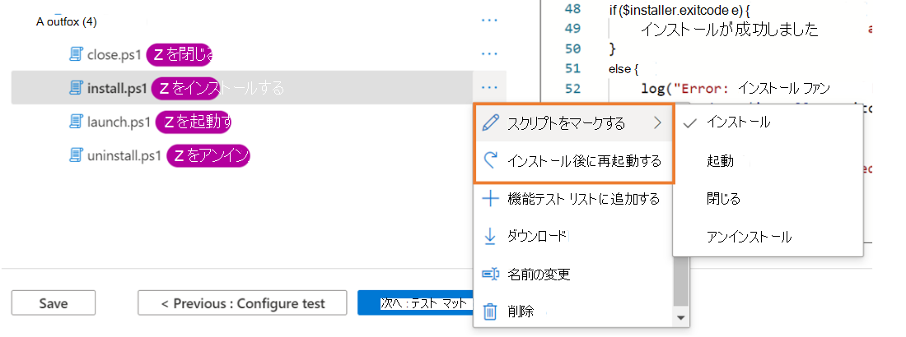
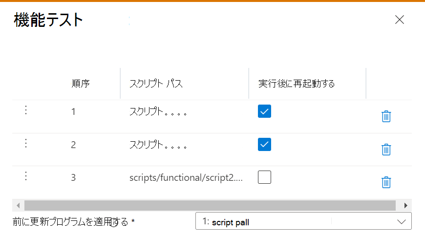
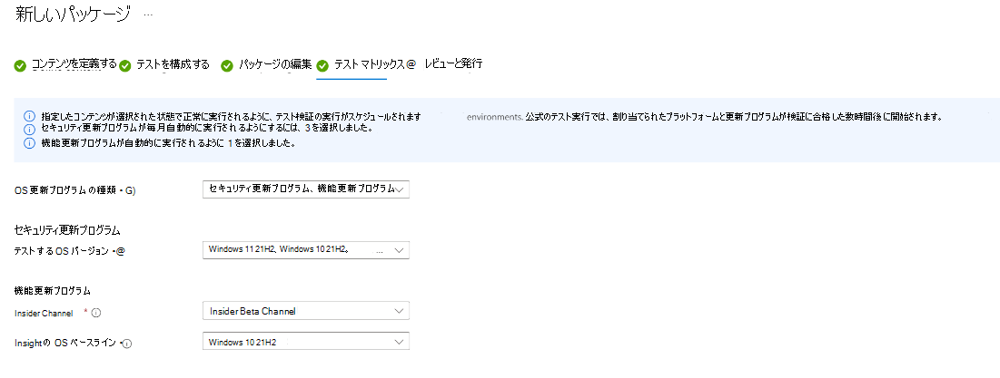
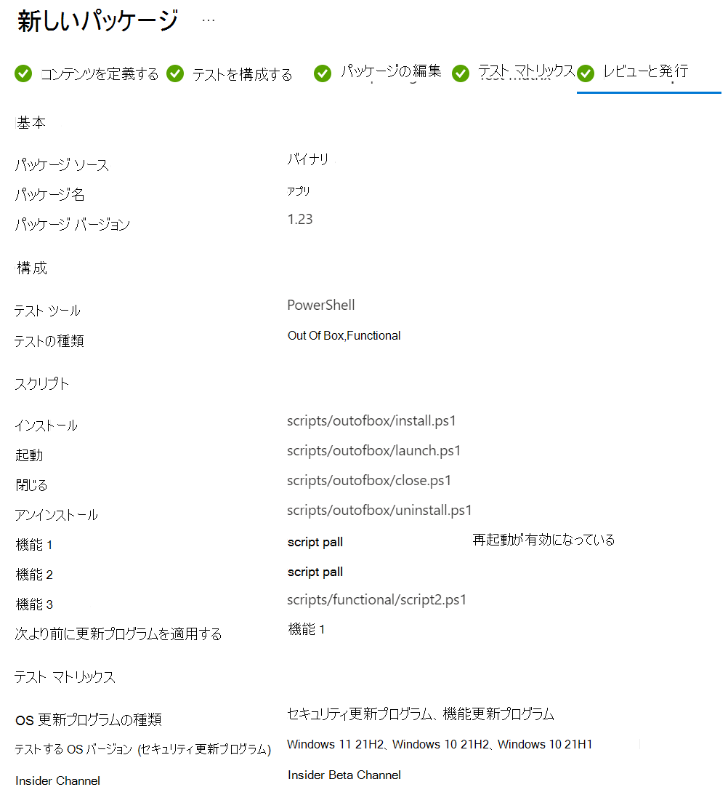
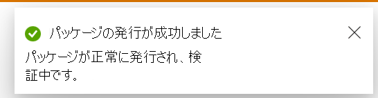
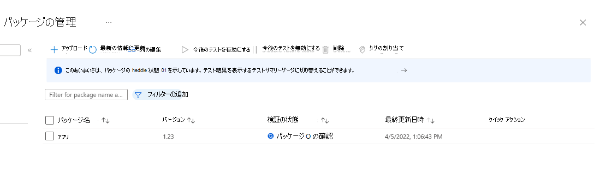

# テスト ベースでのテスト バイナリ パッケージ

> [!NOTE]
> このガイドでは、新しいテスト ベース パッケージを最初から作成する方法について説明します。 テスト ベース パッケージ (.zip) が既にある場合は、従来のアップロード エクスペリエンス[をテスト ベース パッケージ (Zip) アップロード](uploadApplication.md)使用するように切り替えることができます。

## 前提条件

Test Base アカウント。 お持ちでない場合は、 [Test Base アカウントを作成します](createAccount.md)。

## 新しいパッケージを作成する

[Azure portal](https://portal.azure.com/)で、パッケージをアップロードする Test Base アカウントに移動します。 左側のメニューの [ **パッケージ カタログ**] で、[ **新しいパッケージ**] を選択します。 次に、最初のカード **[新しいパッケージの作成] を** クリックして、5 つの手順でパッケージをビルドします。

> [!div class="mx-imgBorder"]
> 

### 手順 1. コンテンツを定義する

1. [ **パッケージ ソース]** セクションで、パッケージ ソースを選択します。 Intunewin アプリがある場合は、Intunewin を選択し、他のユーザー (例: exe や msi) で [バイナリ] を選択します。

   > [!div class="mx-imgBorder"]
   > 

2. 次に、[ファイルの選択] ボタンをクリックするか、チェック ボックスをオンにして、ファイルの準備がまだできていない場合は、Test Base サンプル テンプレートを開始点として使用します。

   > [!div class="mx-imgBorder"]
   > 

3. [ **基本情報** ] セクションにパッケージの名前とバージョンを入力します。

   > [!NOTE]
   > パッケージ名とバージョンの組み合わせは、Test Base アカウント内で一意である必要があります。

   > [!div class="mx-imgBorder"]
   > 

4. 必要なすべての情報が入力されたら、下部にある [次へ] ボタンをクリックして手順 2 に進むことができます。

   > [!div class="mx-imgBorder"]
   > 

### 手順 2. テストを構成する

1. テストの **種類** を選択します。 サポートされているテストの種類は 2 つあります。
   - **Out of Box (OOB) テスト** では、パッケージのインストール、起動、閉じ、アンインストールが実行されます。 インストール後、1 回のアンインストールが実行される前に、起動終了ルーチンが 30 回繰り返されます。 OOB テストでは、パッケージで標準化されたテレメトリを提供し、Windows ビルド間で比較できます。
   - **機能テスト** では、アップロードしたテスト スクリプトがパッケージに対して実行されます。 スクリプトは指定した順序で実行され、特定のスクリプトでエラーが発生すると、後続のスクリプトの実行が停止されます。

   > [!div class="mx-imgBorder"]
   > 

2. 必要なすべての情報が入力されたら、下部にある [次へ] ボタンをクリックして手順 3 に進むことができます。 テスト スクリプトが正常に生成されると、通知がポップアップ表示されます。

   > [!div class="mx-imgBorder"]
   > 

### 手順 3. パッケージを編集する

1. [パッケージの編集] タブで、次の操作を行うことができます。
   - パッケージ プレビューでパッケージ フォルダーとファイル構造を確認 **します**。
   - **PowerShell コード エディター** を使用してスクリプトをオンラインで編集します。

   > [!div class="mx-imgBorder"]
   > 

2. **パッケージ プレビュー** では、必要に応じて、次の操作を実行できます。
   - 新しいフォルダーを作成します。
   - 新しいスクリプトを作成します。
   - 新しいファイルをアップロードします。

   > [!div class="mx-imgBorder"]
   > 

3. **スクリプト フォルダー** の下に、サンプル スクリプトとスクリプト タグが自動的に作成されています。 すべてのスクリプト タグは編集可能です。スクリプト パスを参照するように再割り当てできます。
   - 手順 2 で **Out Of Box テスト** が選択されている場合は、スクリプト フォルダーの下に **outofbox** フォルダーが表示されます。 また、インストール スクリプトの **[インストール後に再起動]** タグを追加することもできます。

   > [!div class="mx-imgBorder"]
   > 

   > [!NOTE]
   > OOB テストの種類には、インストール、起動、および終了スクリプト タグが必須です。

   - 手順 2 で **機能テスト** が選択されている場合は、スクリプト フォルダーの下に **機能** フォルダーが表示されます。 追加の機能テスト スクリプトは **、[機能テスト リストに追加] ボタンを使用して追加** できます。 少なくとも 1 つの (1) スクリプトが必要であり、最大 8 個の機能テスト スクリプトを追加できます。

   > [!div class="mx-imgBorder"]
   > 

   > [!NOTE]
   > 機能テストの種類には、少なくとも 1 つの機能スクリプト タグが必須です。

   **[機能テストリストに追加]** をクリックすると、アクション パネルがポップアップ表示され、次のことができます。
   - 左の省略記号ボタンを使用してドラッグして、スクリプト パスの順序を変更します。 機能スクリプトは、一覧に示されている順序で実行されます。 特定のスクリプトでエラーが発生すると、後続のスクリプトの実行が停止されます。
   - 複数のスクリプトに対して [実行後に再起動] を設定します。
   - 特定のスクリプト パスの前に更新プログラムを適用します。 これは、機能テスト スクリプトを実行する順序でWindows Updateパッチを適用するタイミングを示す機能テストを実行するユーザー向けです。

   > [!div class="mx-imgBorder"]
   > 

4. 必要なすべての情報が入力されたら、下部にある [次へ] ボタンをクリックして手順 4 に進むことができます。

### 手順 4. テスト マトリックス

1. [テスト マトリックス] タブで、 **OS 更新** プログラムの種類を選択します。 サポートされている OS 更新プログラムの種類は 2 つあります。
   - **セキュリティ更新プログラム** を使用すると、パッケージを、Windowsプレリリースの毎月のセキュリティ更新プログラムの増分チャーンに対してテストできます。
   - **機能更新プログラム** を使用すると、Windows Insider Program からリリース前の 2 年間の機能更新プログラムビルドWindowsパッケージをテストできます。

2. セキュリティ更新プログラムテストの OS バージョンを選択します。

   OS 更新プログラムの種類で **セキュリティ更新プログラム** が選択されている場合は、パッケージがテストされるWindowsの OS バージョンを選択する必要があります。

   > [!NOTE]
   > サーバーとクライアントの両方の OS に対してパッケージをテストすることを選択した場合は、パッケージが互換性があり、両方の OS で実行できることを確認してください。

3. 機能更新テストのオプションを選択します。
   - OS **更新プログラムの** 種類で機能更新プログラムが選択されている場合は、次のオプションを完了する必要があります。
   - **Insider Channel** の場合は、パッケージをテストするビルドとしてWindows Insider Program Channel を選択します。 現在、 **Insider Beta Channel** でフライティングされたビルドを使用しています。
   - **Insight の OS ベースライン** の場合は、テスト結果を比較する際にベースラインとして使用する OS バージョンWindowsを選択します。

   > [!div class="mx-imgBorder"]
   > 

4. 必要な情報がすべて入力されたら、下部にある [次へ] ボタンをクリックして、手順 5 (最後の手順) に移動できます。

### 手順 5.  レビューと発行

1. 下書きパッケージのすべての情報を確認でき、必要に応じて変更を加える早期の手順に戻ることができます。

   > [!div class="mx-imgBorder"]
   > 

2. また、検証実行完了通知のパッケージの電子メール通知を受け取るには、通知ボックスをオンにすることもできます。

   > [!div class="mx-imgBorder"]
   > 

3. すべての情報が正しいことを確認したら、[ **発行]** ボタンをクリックしてパッケージをテスト ベースにアップロードできます。 パッケージが正常に発行されると、通知がポップアップ表示されます。

   > [!div class="mx-imgBorder"]
   > 

4. [ **パッケージの管理** ] ページにリダイレクトされ、新しくアップロードされたパッケージの進行状況が確認されます。

   > [!div class="mx-imgBorder"]
   > 

### パッケージの作成を続行する

[ **新しいパッケージ** ] ページには、以前に保存したすべての下書きパッケージの一覧が表示されます。 [編集] アイコンをクリックすると、最後に一時停止した手順に直接編集を続行できます。

> [!NOTE]
> ダッシュボードには、作業中のパッケージのみが表示されます。 発行されたパッケージについては、[パッケージの管理] ページを確認できます。

> [!div class="mx-imgBorder"]
> ![[パッケージの管理] ページ](Media/testapplication19.png)

### Zip アップロード (従来のアップロード エクスペリエンス)

Zip ファイルが既にある場合は、従来のパッケージアップロード エクスペリエンス (zip アップロード) に切り替えることができます。 パッケージ |アップロード Zip アップロードの詳細を確認[するMicrosoft Docs](uploadApplication.md)。

> [!div class="mx-imgBorder"]
> 

> [!div class="mx-imgBorder"]
> 

### Intunewin アップロード Flow

商用ロードマップの一環として、テスト ベースは、標準のオンボード パッケージ形式としてIntune内でアプリのアプリを管理する IT 担当者向けの intunewin 形式をサポートし始めました。 intunewin アップロード フローは、IT 担当者が intunewin 形式のパッケージを再利用するためのエクスペリエンスを提供します。これには、MEM/Intune を介してエンド デバイスにデプロイしたアプリが含まれ、アプリとテスト構成をテスト ベースに迅速にオンボードできます。

[テスト ベースでIntune アプリをテストします。](testintuneapplication.md)
