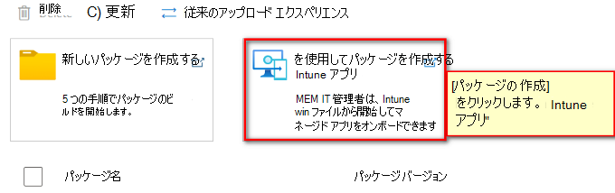
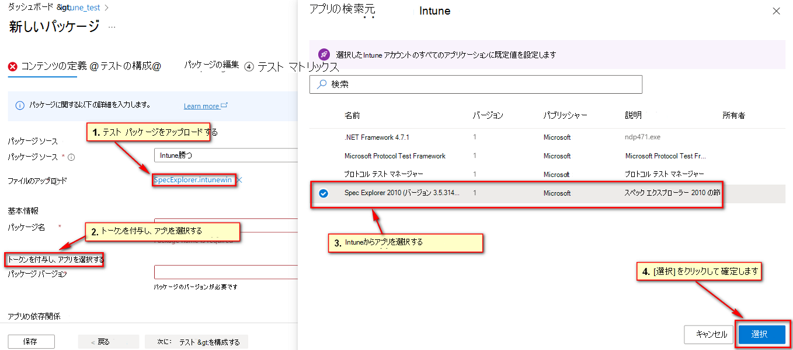
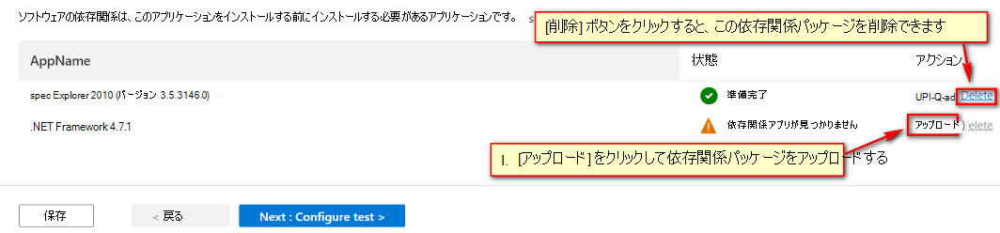
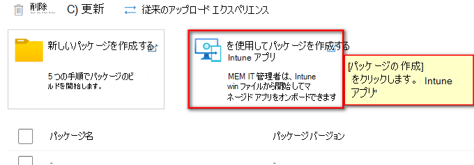

# Test Base でIntune アプリケーションをテストする 
  > [!Note] 
  > このガイドでは、intunewin 形式パッケージを Test Base にアップロードする方法について説明します。 一般的な Test Base パッケージのアップロード手順については、この [ドキュメント](https://microsoft.sharepoint.com/:w:/t/AzureSUVPCoreTeam/EeHQIT3qA0FKqBDWI5TzmzgBiH2Syz39o5VbY2kdugMn4A?e=Rk1KD9)を参照してください。

## Intunewin アップロード Flow
商用利用をさらに有効にする取り組みとして、テスト ベースは、標準のオンボード パッケージ形式としてIntune内でアプリのアプリを管理する IT 担当者向けの intunewin 形式のサポートを開始しました。 intunewin アップロード フローは、IT 担当者が intunewin 形式のパッケージを再利用するためのエクスペリエンスを提供します。これには、MEM/Intune を介してエンド デバイスにデプロイしたアプリが含まれ、アプリとテスト構成をテスト ベースに迅速にオンボードできます。 

**前提条件**
  - 現在、テスト ベースでは、Intune アカウントと Test Base アカウントの間の同じサブスクリプションを使用した同期がサポートされています (intunewin パッケージをアップロードするためにIntune アカウントを持つ必要はありませんが、intunewin ファイルの対応するアプリのIntune構成をIntuneから同期する場合は、Intuneを確認する必要があります アカウントは、Test Base アカウントと同じサブスクリプションで作成されます)。
  - アップロードする Intunewin パッケージ。 

**Intunwin ファイル アップロード Flow (Intune アカウントと同期)**  
Intune パッケージを既にIntune ポータルにオンボードしているIntune顧客。 お客様は、Intunewin パッケージ (Intuneで管理されているプレインストール アプリの依存関係の有無にかかわらずアプリを含む) を Test Base サービスにオンボードできます。 (Intuneアプリ情報を同期するための適切なアクセス許可を持つアカウントIntune経由)。

**準備手順**
1. Test Base アカウントでログインします。
2. intunewin パッケージを準備します。
3. アップロードを開始するには、次のように [Intune アプリを使用したパッケージの作成] リンクをクリックします。
    
    > [!div class="mx-imgBorder"] 
    >  

**手順 1: コンテンツを定義する**
1. 選択した intunewin パッケージをアップロードします。
2. 下のリンク 「Grant token and select app」をクリックしてトークンを付与します。
3. Intune アカウントと自動同期すると、アプリケーションがIntune アカウントの下に表示されます。 アップロードした intunewin パッケージに対応するアプリを選択し、[選択] をクリックします。
    
    > [!div class="mx-imgBorder"] 
    >  

5. [手順 1] ページの [依存関係] セクションに依存関係が表示されます。依存関係のインストール ファイルをアップロードするか、この手順から削除するかを選択できます (手順 3 で依存関係を管理する場合は、関連するバイナリを自己提供します)。 このセクションで選択した依存関係は、Intune経由でインストールされるのと同じ方法で事前にインストールされます。
    
    > [!div class="mx-imgBorder"] 
    >  

**手順 2: テストを構成する**
1. powershell を選択します。
2. [既定] を選択します。

**手順 3: パッケージを編集する**
1. 自動生成されたスクリプトが正しくタグ付けされていることを確認します。
2. Intuneから構成を正常に同期した場合は、テスト アプリのインストール/アンインストール コマンドがインストール/アンインストール スクリプトに追加されていることがわかります。**アップロードされた** 依存関係のコマンドもパッケージ エクスプローラー ツリーに挿入して確認する必要があります。
3. テスト アプリのバイナリが **bin** フォルダーの下に移動されていることを確認します。
4. **guid** フォルダーの下に **アップロードされた** 依存関係バイナリを確認します。
5. 必要に応じてスクリプトを編集して保存できます。
    > [!Note] 
    > 依存関係パッケージがアップロードされていない場合、Test Base はインストール/アンインストール コマンドを生成しません。

**手順 4: テスト マトリックス**
1. OS の一覧に表示されている既定の選択項目で、対応するテストの種類を確認します。
    - テスト ベースでは **、1909 Windows 10 2004 を除く複数の Windows 10 Windows** 累積的な更新プログラムの選択がサポートされています。ただし、Intune Win アプリには、**Windows 10 1607** 以上のバージョンが割り当てられます。
    - OS の一覧には、テスト ベースでサポートされているすべての OS が既定で含まれます。これは、Intune Win アプリに指定された最小 OS より高くなります。
2. ユーザーは必要に応じて OS の選択を変更できます。

**手順 5: 確認と発行**  
パッケージを発行できる構成を確認します。  

**Intunwin ファイル アップロード Flow (Intune アカウントと同期できません)**  
スタンドアロンの intunewin パッケージを持つテスト ベースのお客様。 お客様は、intunewin パッケージ (Intuneで管理されているプレインストール アプリの依存関係の有無にかかわらずアプリを含む) をオンボードできます。オンボード プロセスを完了するためにIntune アカウントに対して権限を付与する必要はありません。

**準備手順**
1. Test Base アカウントでログインします。
2. intunewin パッケージを準備します。
3. アップロードを開始するには、次のように [Intune アプリを使用したパッケージの作成] リンクをクリックします。
    
    > [!div class="mx-imgBorder"] 
    >  

**手順 1: コンテンツを定義する**
1. intunewin パッケージをアップロードします。
2. 設定に従ってすべての情報を指定します。

**手順 2: テストを構成する**
1. powershell を選択します。
2. [既定] を選択します。

**手順 3: パッケージを編集する**
1. スクリプトが正しくタグ付けされていることを確認します。
2. 対応するIntune アカウントからインストール/アンインストール コマンドが同期されないので、すべてのスクリプト (インストール/アンインストール/起動/終了) を自分で指定する必要があります。
3. テスト アプリのバイナリが bin フォルダーの下に移動されていることを確認します。
4. 必要に応じてスクリプトを編集して保存できます。

**手順 4: テスト マトリックス**
1. 既定の OS バージョンは事前に選択されません。
2. ユーザーは、スケジュールされる OS で独自の選択を行うことができます。

**手順 5: 確認と発行**  
パッケージを発行できる構成を確認します。

