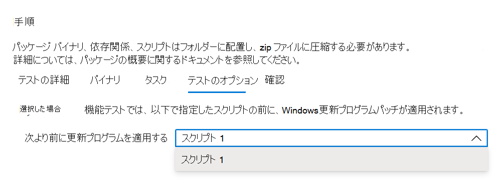

# <a name="step-5-choose-your-test-options"></a>手順 5: テスト オプションを選択します。 

この```Test Options```タブは、機能テスト スクリプトを実行する順序でWindows Updateパッチを適用するタイミングを示す機能テストを実行するユーザー向けです。



[ _**確認**_ ] を選択して次のタブに移動し、選択したテスト オプションを確認します。

## <a name="next-steps"></a>次の手順

入れ子ステップの詳細については、次の記事のリンクを参照してください。
> [!div class="nextstepaction"]
> [次の手順](review.md)
