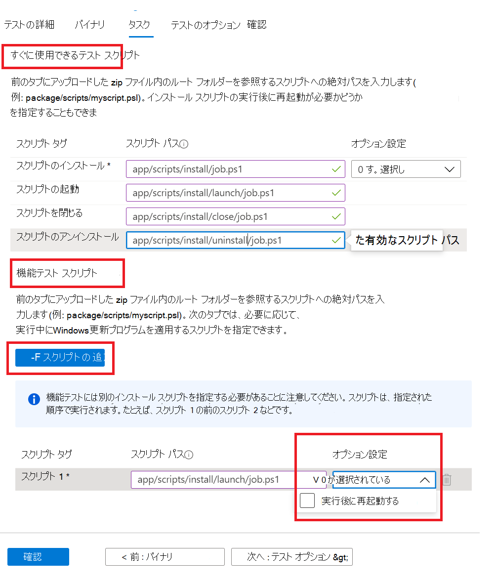

# <a name="step-4-the-tasks-tab"></a>手順 4: [タスク] タブ

[タスク] タブで、[バイナリ] タブでアップロードした zip フォルダーにあるテスト スクリプトへのパスを指定する必要があります。

  - **アウト オブ ボックスのテスト スクリプト:** インストール、起動、閉じる、アンインストールするスクリプトへの相対パスを入力します。 インストール スクリプトの追加設定を選択することもできます。
  - **機能テスト スクリプト:** アップロードされた各機能テスト スクリプトへの相対パスを入力します。 ボタンを使用して、追加の機能テスト スクリプトを追加 ```Add Script``` できます。 少なくとも 1 つのスクリプトが必要で、最大 8 つの機能テスト スクリプトを追加できます。 
  
    スクリプトはアップロード シーケンスで実行され、特定のスクリプトでエラーが発生すると、後続のスクリプトの実行が停止します。
    また、各スクリプトに対して追加の設定を選択することもできます。

## <a name="set-script-path"></a>スクリプト パスの設定



フォルダー構造に相対パスを指定する方法のサンプルは次のとおりです。

_**Zip_file_uploaded**_
~~~
├── file1.exe

├── ScriptX.ps1

├── folder1

│   ├── file3.exe

│   ├── script.ps1
~~~
  - **ScriptX.ps1** 必要があります。 _ScriptX.ps1_ パスとして指定します。
  - **Script.ps1** フォルダー _1/script.ps1パス_ として指定します。


## <a name="next-steps"></a>次の手順

次の記事の [テスト オプション] タブの詳細を表示する 
> [!div class="nextstepaction"]
> [次の手順](testoptions.md)
