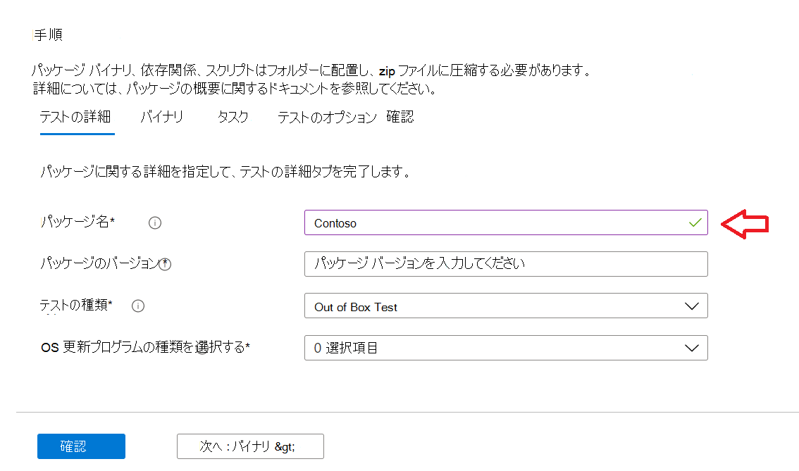
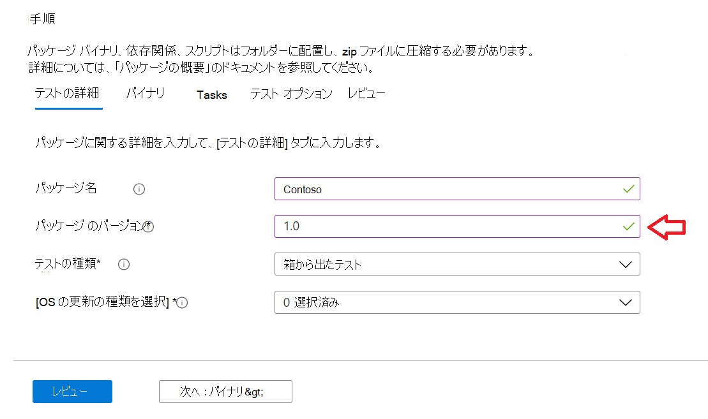
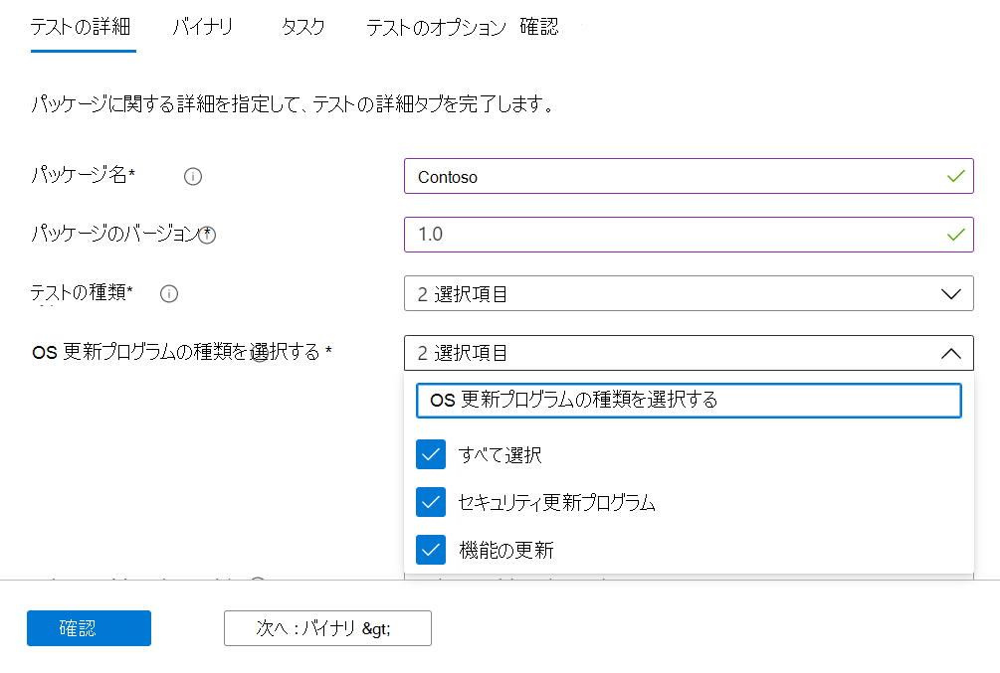
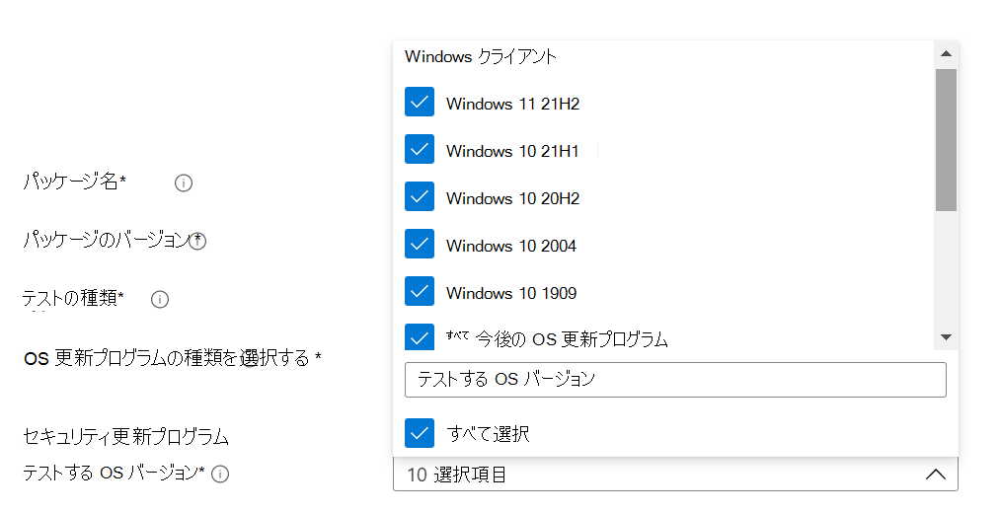
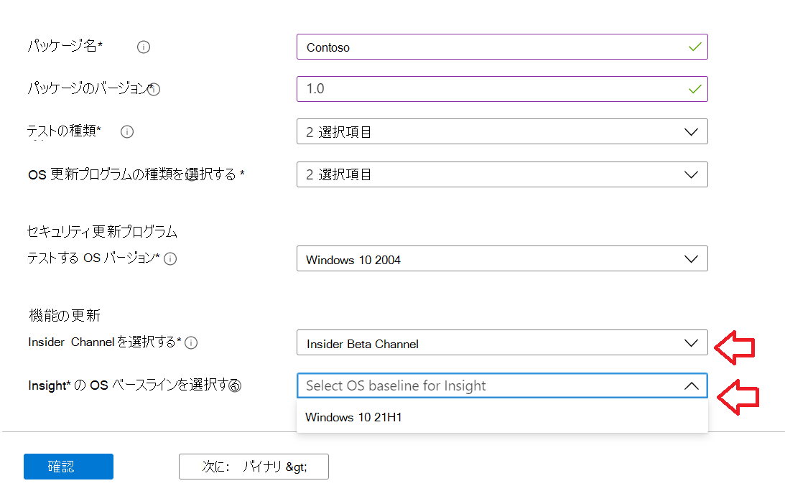
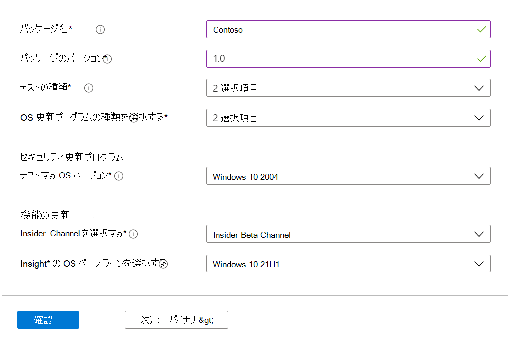

# <a name="step-2-uploading-a-package"></a><span data-ttu-id="7d856-103">手順 2: パッケージのアップロード</span><span class="sxs-lookup"><span data-stu-id="7d856-103">Step 2: Uploading a Package</span></span>

<span data-ttu-id="7d856-104">[Test Base portal] ページで、左側のナビゲーション バーの [アップロード 新しいパッケージ] オプションに移動します。次に示すように、新しいパッケージアップロード </span><span class="sxs-lookup"><span data-stu-id="7d856-104">On the Test Base portal page, navigate to the ‘Upload new package option on the left navigation bar as shown below: </span></span>

<span data-ttu-id="7d856-105">その後、以下の手順に従って新しいパッケージをアップロードします。</span><span class="sxs-lookup"><span data-stu-id="7d856-105">Once there, follow the steps below to upload a new package.</span></span>

## <a name="enter-details-for-your-package"></a><span data-ttu-id="7d856-106">パッケージの詳細を入力する</span><span class="sxs-lookup"><span data-stu-id="7d856-106">Enter details for your package</span></span>

<span data-ttu-id="7d856-107">[テストの詳細] タブで、要求に応じてパッケージの名前、バージョン、その他の詳細を入力します。</span><span class="sxs-lookup"><span data-stu-id="7d856-107">On the Test details tab, type in your package's name, version and other details as requested.</span></span> 

<span data-ttu-id="7d856-108">**アウトオブボックステストと\*\*\*\*機能テストは**、このダッシュボードを使用して実行できます。</span><span class="sxs-lookup"><span data-stu-id="7d856-108">**Out-of-Box** and **Functional testing** can be done via this dashboard.</span></span>

<span data-ttu-id="7d856-109">以下の手順では、パッケージの詳細を入力する方法のガイドを示します。</span><span class="sxs-lookup"><span data-stu-id="7d856-109">The steps below provides a guide on how to fill out your package details:</span></span>

1.  <span data-ttu-id="7d856-110">**フィールドにパッケージを指定する名前を入力 ```“Package name``` します。**</span><span class="sxs-lookup"><span data-stu-id="7d856-110">**Enter the name to be given your package in the ```“Package name``` field.**</span></span>

> [!Note]  
> <span data-ttu-id="7d856-111">入力したパッケージ名とバージョンの組み合わせは、組織内で一意である必要があります。</span><span class="sxs-lookup"><span data-stu-id="7d856-111">The package name and version combination entered must be unique within your organization.</span></span> <span data-ttu-id="7d856-112">これは、次に示すようにチェックマークによって検証されます。</span><span class="sxs-lookup"><span data-stu-id="7d856-112">This is validated by the checkmark as shown below.</span></span>
  
  - <span data-ttu-id="7d856-113">パッケージの名前を再使用する場合、バージョン番号は一意である必要があります (つまり、その特定の名前を持つパッケージでは使用されません)。</span><span class="sxs-lookup"><span data-stu-id="7d856-113">If you choose to re-use an package's name, then the version number must be unique (i.e. never been used with an package bearing that particular name).</span></span>
  - <span data-ttu-id="7d856-114">パッケージ名 + バージョンの組み合わせが一意性チェックに合格しない場合は、「このパッケージバージョンのパッケージが既に存在する」というエラー メッセージ *が表示されます*。</span><span class="sxs-lookup"><span data-stu-id="7d856-114">If the combination of the package name + version does not pass the uniqueness check, you will see an error message which reads, *“Package with this package version already exists”*.</span></span> 



2. <span data-ttu-id="7d856-116">**[パッケージ のバージョン] フィールドにバージョンを入力します。**</span><span class="sxs-lookup"><span data-stu-id="7d856-116">**Enter a version in the “Package version” field.**</span></span>



3.  <span data-ttu-id="7d856-118">**このパッケージで実行するテストの種類を選択する**</span><span class="sxs-lookup"><span data-stu-id="7d856-118">**Select the type of test you want to run on this package**</span></span>

    <span data-ttu-id="7d856-119">アウト **オブボックス (OOB)** テストでは、パッケージのインストール、*起動*、*閉じる*、*アンインストール* を実行します。</span><span class="sxs-lookup"><span data-stu-id="7d856-119">An **Out-of-Box (OOB)** test performs an *install*, *launch*, *close* and *uninstall* of your package.</span></span> <span data-ttu-id="7d856-120">インストール後、1 回のアンインストールが実行される前に、起動終了ルーチンが 30 回繰り返されます。</span><span class="sxs-lookup"><span data-stu-id="7d856-120">After the install, the launch-close routine is repeated 30 times before a single uninstall is run.</span></span> 
    
    <span data-ttu-id="7d856-121">この OOB テストでは、パッケージ上で標準化されたテレメトリを提供し、さまざまなビルドWindowsします。</span><span class="sxs-lookup"><span data-stu-id="7d856-121">This OOB test provides you with standardized telemetry on your package to compare across Windows builds.</span></span>

    <span data-ttu-id="7d856-122">機能 **テストでは、** パッケージにアップロードされたテスト スクリプトが実行されます。</span><span class="sxs-lookup"><span data-stu-id="7d856-122">A **Functional test** would execute your uploaded test script(s) on your package.</span></span> <span data-ttu-id="7d856-123">スクリプトはアップロード シーケンスで実行され、特定のスクリプトでエラーが発生すると、後続のスクリプトの実行が停止します。</span><span class="sxs-lookup"><span data-stu-id="7d856-123">The scripts are run in upload sequence and a failure in a particular script will stop subsequent scripts from executing.</span></span>

> [!Note]
> <span data-ttu-id="7d856-124">**すべての** スクリプトは最大で 80 分間実行されます。</span><span class="sxs-lookup"><span data-stu-id="7d856-124">**All** scripts run for 80 minutes at the most.</span></span> 
    
4.  <span data-ttu-id="7d856-125">**OS の更新の種類を選択する**</span><span class="sxs-lookup"><span data-stu-id="7d856-125">**Select the OS update type**</span></span>

   - <span data-ttu-id="7d856-126">'セキュリティ更新プログラム' を使用すると、パッケージをリリース前の月次セキュリティ更新プログラムWindows増分チャーンに対してテストできます。</span><span class="sxs-lookup"><span data-stu-id="7d856-126">The ‘Security updates’ enables your package to be tested against incremental churns of Windows pre-release monthly security updates.</span></span> 
   - <span data-ttu-id="7d856-127">'フィーチャー更新プログラム' を使用すると、パッケージを、Windows Insider Program からビルドされた 2 年のプレリリース機能更新プログラムに対してWindowsできます。</span><span class="sxs-lookup"><span data-stu-id="7d856-127">The ‘Feature updates’ enables your package to be tested against Windows pre-release bi-annual feature updates builds from the Windows Insider Program.</span></span>
<!---
Change to the correct picture
-->


5.  <span data-ttu-id="7d856-129">**セキュリティ更新プログラムテストの OS バージョンを選択します。**</span><span class="sxs-lookup"><span data-stu-id="7d856-129">**Select the OS version(s) for Security update tests.**</span></span>

<span data-ttu-id="7d856-130">[複数選択] ドロップダウンで、パッケージがインストールWindowsの OS バージョンを選択します。</span><span class="sxs-lookup"><span data-stu-id="7d856-130">In the multi-select dropdown, select the OS version(s) of Windows your package will be installed on.</span></span> 

  - <span data-ttu-id="7d856-131">パッケージをクライアント OSes Windowsテストするには、メニュー リストから該当する Windows 11 OS バージョンを選択します。</span><span class="sxs-lookup"><span data-stu-id="7d856-131">To test your package against Windows Client OSes only, select the applicable Windows 11 OS versions from the menu list.</span></span>
  - <span data-ttu-id="7d856-132">パッケージをサーバー OSes Windowsテストするには、メニュー リストから該当するサーバー OS Windowsを選択します。</span><span class="sxs-lookup"><span data-stu-id="7d856-132">To test your package against Windows Server OSes only, select the applicable Windows Server OS versions from the menu list.</span></span>
  - <span data-ttu-id="7d856-133">パッケージをクライアントおよびサーバー Windowsに対してテストするには、メニューリストから該当する OS を選択します。</span><span class="sxs-lookup"><span data-stu-id="7d856-133">To test your package against Windows Client and Server OSes, select all applicable OSes from the menu list.</span></span> 

> [!Note]
> <span data-ttu-id="7d856-134">サーバーとクライアントの両方の OSes に対してパッケージをテストする場合は、パッケージが互換性があり、両方の OSes で実行可能である必要があります。</span><span class="sxs-lookup"><span data-stu-id="7d856-134">If you select to test your package against both Server and Client OSes, please make sure that the package is compatible and can run on both OSes</span></span>



<!---
Change to the correct picture
-->
6.  <span data-ttu-id="7d856-136">**機能更新プログラムのテストのオプションを選択します。**</span><span class="sxs-lookup"><span data-stu-id="7d856-136">**Select options for Feature update tests:**</span></span>

  - <span data-ttu-id="7d856-137">[Insider チャネルの選択] オプションで、パッケージをテストするビルド ```Windows Insider Program Channel``` として選択します。</span><span class="sxs-lookup"><span data-stu-id="7d856-137">On the option to “Select Insider Channel”, select the ```Windows Insider Program Channel``` as the build which your packages should be tested against.</span></span>
  
    <span data-ttu-id="7d856-138">現在、Insider ベータ チャネルで提供されているビルドを使用しています。</span><span class="sxs-lookup"><span data-stu-id="7d856-138">We currently use builds flighted in the Insider Beta Channel.</span></span>

  - <span data-ttu-id="7d856-139">[分析情報の OS ベースラインを選択する] オプションで、テストWindows比較の基準として使用する OS バージョンを選択します。</span><span class="sxs-lookup"><span data-stu-id="7d856-139">On the option to “Select OS baseline for Insight”, select the Windows OS version to be used as a baseline in comparing your test results.</span></span> 

> [!Note]
> <span data-ttu-id="7d856-140">現時点では、サーバー OSes の機能更新テストはサポートされていません</span><span class="sxs-lookup"><span data-stu-id="7d856-140">We DO NOT support Feature update testing for Server OSes at this time</span></span>
<!---
Note to actual note format for markdown
-->
<!---
Change to the correct picture
-->


7.  <span data-ttu-id="7d856-142">完了したテストの詳細ページは次のように表示されます。</span><span class="sxs-lookup"><span data-stu-id="7d856-142">A completed Test details page should look like this:</span></span> 


## <a name="next-steps"></a><span data-ttu-id="7d856-144">次の手順</span><span class="sxs-lookup"><span data-stu-id="7d856-144">Next steps</span></span>

<span data-ttu-id="7d856-145">次の記事では、バイナリをセリブセにアップロードする方法について説明します。</span><span class="sxs-lookup"><span data-stu-id="7d856-145">Our next article covers Uploading your Binaries to our serivce.</span></span>
> [!div class="nextstepaction"]
> [<span data-ttu-id="7d856-146">次の手順</span><span class="sxs-lookup"><span data-stu-id="7d856-146">Next step</span></span>](binaries.md)

<!---
Add button for next page
-->

