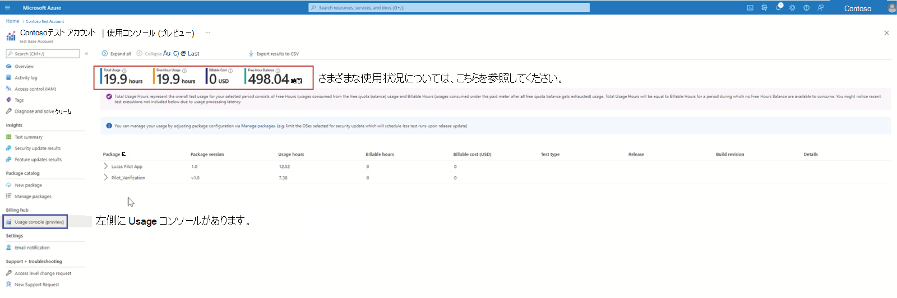
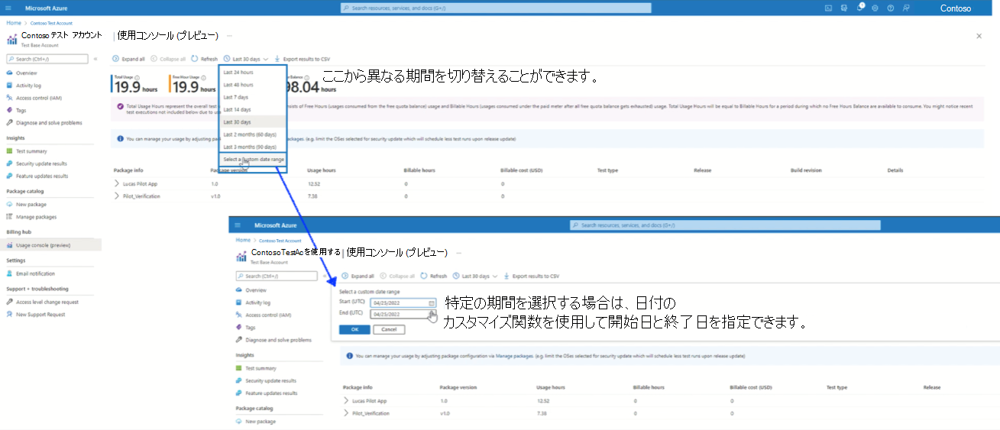
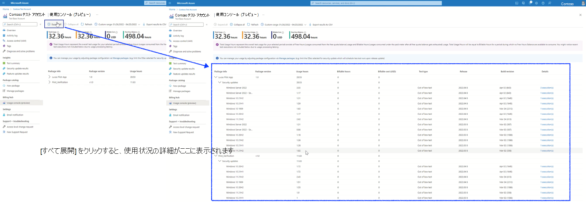
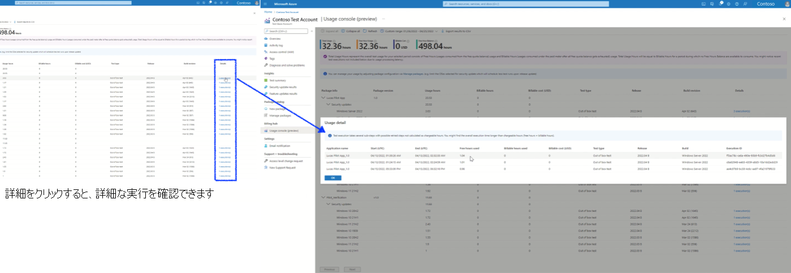
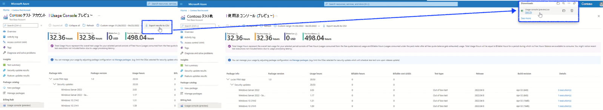

# 使用コストを把握する

> [!NOTE]
> Test Base では、ユーザーがテストの使用状況とコストを理解するのに役立つ課金ハブ機能が提供されるようになりました。

## 課金ハブの下の使用状況コンソール

ポータルの [課金ハブ] セクションの新しい "利用状況コンソール" にアクセスすると、ユーザーは、選択した期間の合計使用量、Free Hour Balance、使用量に基づく課金対象コストを確認できます。

**準備手順**

1. Test Base アカウントでログインします。
2. 左側のナビゲーション バーで、[Billing Hub] の [利用状況コンソール] をクリックします。

> [!div class="mx-imgBorder"]
> 

ユーザーは、異なる期間を切り替えたり、現在の日付から 3 か月までのカスタマイズされた開始日を指定したりできます。

> [!div class="mx-imgBorder"]
> 

[すべて展開] をクリックすると、パッケージとテストの種類別の使用状況の詳細を下のセクションで確認できます。 通常、ターゲット プラットフォーム上の特定のテストの種類に対してスケジュールされた特定のパッケージに対して 1 つ以上のテスト実行が行われます。

> [!div class="mx-imgBorder"]
> 

[詳細] 列をクリックすると、実行 ID、使用時間の内訳 (無料時間部分別)、有料時間部分など、すべての実行の詳細な実行レコードがポップアップ表示されます。

> [!div class="mx-imgBorder"]
> 

その他の場合、Export 関数は、独自の分析またはレポートの目的で詳細な使用状況レポートをダウンロードするために提供されます。

> [!div class="mx-imgBorder"]
> [関数をエクスポートする ](Media/usagecost05-export-function.png#lightbox)

> [!NOTE]
> 使用状況コンソールには、現在、サブスクリプション レベルのすべてのテスト使用状況レコードが表示されます。 サブスクリプションの下に複数の Test Base アカウントが再作成されている場合は、他のテスト アカウントからのテスト アクティビティに気付く場合があります。
