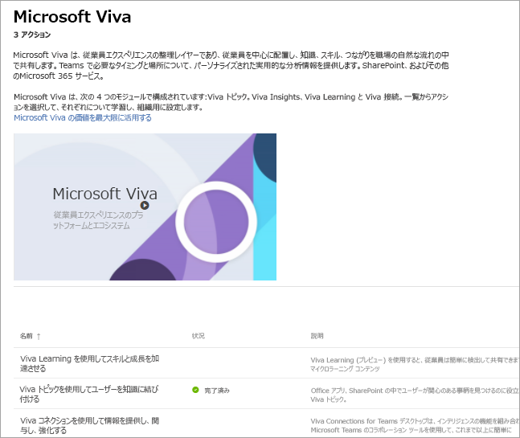

# Microsoft Viva のセットアップ
Microsoft Viva は、従業員エクスペリエンスの整理レイヤーであり、従業員を中心に配置し、知識、スキル、つながりを職場の自然な流れの中で共有します。 Teams、SharePoint、その他の Microsoft 365 サービスで必要なタイミングと場所についてカスタマイズされた実用的な分析情報を提供します。 

Microsoft Viva には、Viva インサイト、Viva トピック、Viva ラーニング、Viva コネクションの 4 つのモジュールが用意されています。 スイート全体を設定するには、各モジュールを個別に設定します。
 
### セットアップを開始する

ただちにセットアップを開始するには、Microsoft の管理者になり、アカウントにサインインする必要があります。 

[Microsoft Viva 管理ページに直接移動](https://admin.microsoft.com/Adminportal/Home?source=applauncher#/featureexplorer/collections/VivaExperiences)

ページの下部で、設定するモジュールを選択します。
モジュール ページで、[**セットアップ ガイドに移動]** ボタンを選択します。Viva トピックの場合は、[**概要**] ボタンを選択してセットアップ ウィザードに移動します。これは、プロセスの中を案内します。

または、後で設定する場合は、次の手順に従うことができます。
1.  Microsoft 365 管理センターに移動する
2.  左側のナビゲーションで、[**セットアップ**] を選択します
3.  **Microsoft Viva** タイルを選択します
4.  ページの下部で、設定するモジュールを選択します。
5.  [**セットアップ ガイドに移動]** ボタンを選択します。Viva トピックの場合は、[**概要**] ボタンを選択してセットアップ ウィザードに移動します。これは、プロセスの中を案内します。

### 詳細
各モジュールの詳細と、それらを最初に設定する方法については、次のリソースを参照してください。

**Viva ラーニング** 

スキルと成長を加速する – 従業員は、トレーニング コースからマイクロラーニング コンテンツまで、すべてを簡単に見つけて共有できます。

[概要](/microsoft-365/learning)

[セットアップ方法についての詳細情報](/microsoft-365/learning/set-up-teams-admin-center)

**Viva インサイト**

生産性とウェルビーイングの間のバランス – データドリブンでプライバシー保護された分析情報と実用的な推奨事項を提供し、組織内のすべてのユーザーがよりスマートに作業し、バランスを取るのに役立ちます。

[概要](/viva/insights/introduction)

[セットアップ方法についての詳細情報](/viva/insights/setup/setup-intro)

**Viva トピック**

ユーザーを知識に結び付ける– ユーザーは、Office アプリ、SharePoint、検索結果内で関心のあるトピックを簡単に見つけることができます。

[概要](/microsoft-365/knowledge/)

[セットアップ方法についての詳細情報](/microsoft-365/knowledge/set-up-topic-experiences)

**Viva コネクション**

情報提供、エンゲージメント、強化 -- Microsoft Viva コネクションは、すべてのユーザーのエンゲージメントと情報提供を維持するために設計された最新のエンゲージメント エクスペリエンスへのゲートウェイです。

[概要](/sharepoint/viva-connections-overview)

[セットアップ方法についての詳細情報](/sharepoint/guide-to-setting-up-viva-connections)

**詳細情報**

[Microsoft Viva に関するその他のドキュメントと学習方法の取得](/microsoft-365/viva)
